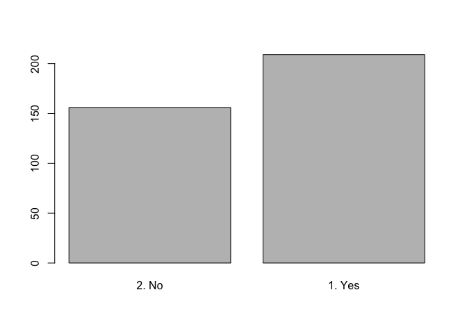
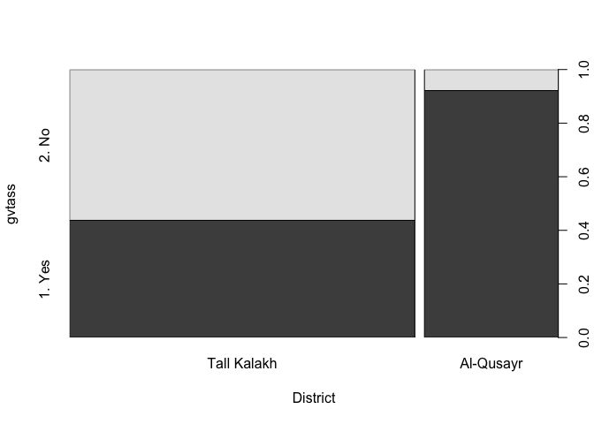
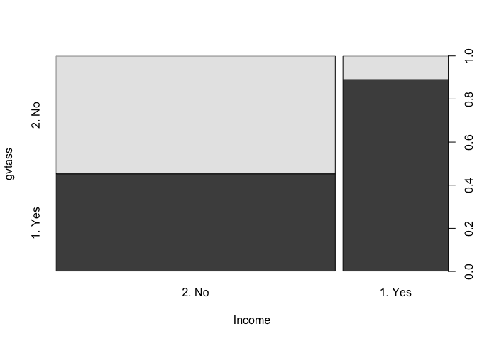
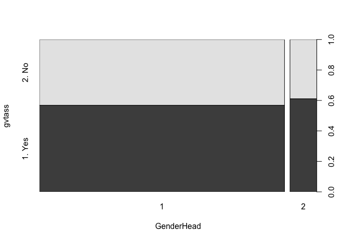
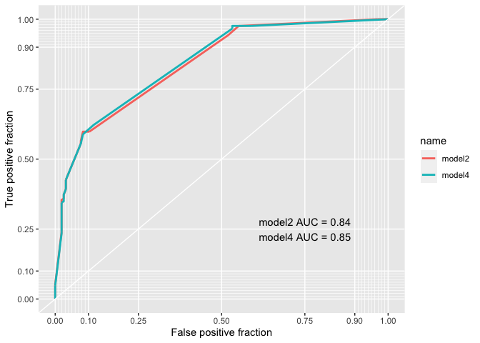
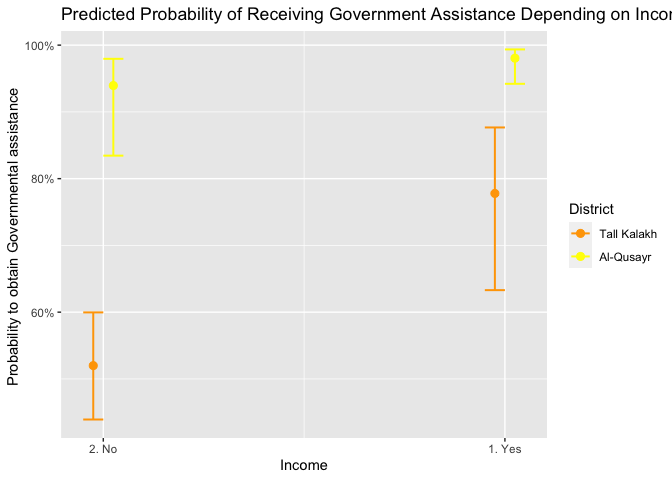

-   [1. Introduction](#introduction)
-   [2. Data](#data)
-   [3. Methods](#methods)
-   [4. Results](#results)
-   [5. Conclusion](#conclusion)
-   [References:](#references)

The data in the file “returnees” comprises the following variables: -
gvtass: government or local authorities assistance. 1 = yes, 2 = no. -
district: Tall Kalakh or Al-Qusayr - returnassgvt: assistance from
government authorities to return. 1 = yes 2 = no - income: does the
monthly income is enough to meet the HH needs. 1 = yes 2 = no - relass:
assistance from relatives/direct family members in Syria 1 = yes 2 = no
- remabroad: remittances sent to the Houshold by family relatives abroad
1 = yes, 2 = no - genderhead: gender of the household head. 1 = male, 2
= female

    library(sjmisc)
    library(dplyr)

    ## 
    ## Attaching package: 'dplyr'

    ## The following objects are masked from 'package:stats':
    ## 
    ##     filter, lag

    ## The following objects are masked from 'package:base':
    ## 
    ##     intersect, setdiff, setequal, union

    library(nnet)
    library(pscl)

    ## Classes and Methods for R developed in the
    ## Political Science Computational Laboratory
    ## Department of Political Science
    ## Stanford University
    ## Simon Jackman
    ## hurdle and zeroinfl functions by Achim Zeileis

    library(stargazer)

    ## 
    ## Please cite as:

    ##  Hlavac, Marek (2018). stargazer: Well-Formatted Regression and Summary Statistics Tables.

    ##  R package version 5.2.2. https://CRAN.R-project.org/package=stargazer

    library(sjPlot)

    ## Learn more about sjPlot with 'browseVignettes("sjPlot")'.

    library(sandwich)
    library(lmtest)

    ## Loading required package: zoo

    ## 
    ## Attaching package: 'zoo'

    ## The following objects are masked from 'package:base':
    ## 
    ##     as.Date, as.Date.numeric

    library(readxl)
    returnees<-read_xlsx("Returnees Survey-Jan2019.xlsx")

    ## Warning in read_fun(path = enc2native(normalizePath(path)), sheet_i = sheet, :
    ## Expecting numeric in B303 / R303C2: got a date

    ## Warning in read_fun(path = enc2native(normalizePath(path)), sheet_i = sheet, :
    ## Expecting numeric in B305 / R305C2: got a date

    ## Warning in read_fun(path = enc2native(normalizePath(path)), sheet_i = sheet, :
    ## Expecting numeric in B306 / R306C2: got a date

    ## Warning in read_fun(path = enc2native(normalizePath(path)), sheet_i = sheet, :
    ## Expecting numeric in B310 / R310C2: got a date

    ## Warning in read_fun(path = enc2native(normalizePath(path)), sheet_i = sheet, :
    ## Expecting numeric in B312 / R312C2: got a date

    ## Warning in read_fun(path = enc2native(normalizePath(path)), sheet_i = sheet, :
    ## Expecting numeric in B313 / R313C2: got a date

    ## Warning in read_fun(path = enc2native(normalizePath(path)), sheet_i = sheet, :
    ## Expecting numeric in B314 / R314C2: got a date

    ## Warning in read_fun(path = enc2native(normalizePath(path)), sheet_i = sheet, :
    ## Expecting numeric in B315 / R315C2: got a date

    ## Warning in read_fun(path = enc2native(normalizePath(path)), sheet_i = sheet, :
    ## Expecting numeric in B316 / R316C2: got a date

    ## Warning in read_fun(path = enc2native(normalizePath(path)), sheet_i = sheet, :
    ## Expecting numeric in B317 / R317C2: got a date

    ## Warning in read_fun(path = enc2native(normalizePath(path)), sheet_i = sheet, :
    ## Expecting numeric in B318 / R318C2: got a date

    ## Warning in read_fun(path = enc2native(normalizePath(path)), sheet_i = sheet, :
    ## Expecting numeric in B319 / R319C2: got a date

    ## Warning in read_fun(path = enc2native(normalizePath(path)), sheet_i = sheet, :
    ## Expecting numeric in B320 / R320C2: got a date

    ## Warning in read_fun(path = enc2native(normalizePath(path)), sheet_i = sheet, :
    ## Expecting numeric in B321 / R321C2: got a date

    ## Warning in read_fun(path = enc2native(normalizePath(path)), sheet_i = sheet, :
    ## Expecting numeric in B322 / R322C2: got a date

    ## Warning in read_fun(path = enc2native(normalizePath(path)), sheet_i = sheet, :
    ## Expecting numeric in B323 / R323C2: got a date

    ## Warning in read_fun(path = enc2native(normalizePath(path)), sheet_i = sheet, :
    ## Expecting numeric in B324 / R324C2: got a date

    ## Warning in read_fun(path = enc2native(normalizePath(path)), sheet_i = sheet, :
    ## Expecting numeric in B325 / R325C2: got a date

    ## Warning in read_fun(path = enc2native(normalizePath(path)), sheet_i = sheet, :
    ## Expecting numeric in B326 / R326C2: got a date

    ## Warning in read_fun(path = enc2native(normalizePath(path)), sheet_i = sheet, :
    ## Expecting numeric in B327 / R327C2: got a date

    ## New names:
    ## * `If yes, with how many families?` -> `If yes, with how many families?...15`
    ## * `If yes, with how many families?` -> `If yes, with how many families?...67`

    library(dplyr)
    library(tidyverse)

    ## ── Attaching packages ──────────────────────────────────────────────────────────────────────────────────────────────────── tidyverse 1.3.0 ──

    ## ✓ ggplot2 3.3.0     ✓ purrr   0.3.4
    ## ✓ tibble  3.0.1     ✓ stringr 1.4.0
    ## ✓ tidyr   1.0.2     ✓ forcats 0.5.0
    ## ✓ readr   1.3.1

    ## ── Conflicts ─────────────────────────────────────────────────────────────────────────────────────────────────────── tidyverse_conflicts() ──
    ## x tibble::add_case()  masks sjmisc::add_case()
    ## x dplyr::filter()     masks stats::filter()
    ## x purrr::is_empty()   masks sjmisc::is_empty()
    ## x dplyr::lag()        masks stats::lag()
    ## x tidyr::replace_na() masks sjmisc::replace_na()

    returnees$gvtass=as_factor(returnees$gvtass)
    returnees$District=as_factor(returnees$District)
    returnees$returnassgvt=as_factor(returnees$returnassgvt)
    returnees$Income=as_factor(returnees$Income)
    returnees$arrest=as_factor(returnees$arrest)
    returnees$relass=as_factor(returnees$relass)
    returnees$remabroad=as_factor(returnees$remabroad)
    returnees$GenderHead=as_factor(returnees$GenderHead)
    returnees$workhead=as_factor(returnees$workhead)
    returnees$ownprop=as_factor(returnees$ownprop)

## 1. Introduction {#introduction}

Qusayr district, located in Homs governorate and close the Lebanese
border, remains quite empty. Among the 60,000 inhabitants who lived
there before the war, a huge part fled during the conflict and has been
prevented from returning by the Syrian authorities (Gonzalez, 2019). The
civil war has been very bloody and violent between pro-government and
pro-opposition forces in the area, from 2011 until 2013. Since then, the
area has been under the control of the Syrian army and its ally, the
Shia Iranian-backed militia Hezbollah. Civilians actively participated
in the armed conflict, in pro-opposition groups, pro-regime militias and
with Hezbollah, making any durable social cohesion hard to reach again.

Literature shows that post-return government assistance is an important
factor to social cohesion and trust in government institutions. Ruerd
and Al. (2009) argue that it has a significant positive effect on the
social networks embeddedness of the returnees, meaning that they have
better “possibilities (…) to become part of local social networks and to
establish meaningful social contacts in the home country” (p.928).
Working on Iraq, Davis and Al. (2018) claim that government assistance
for returnees is essential to regain their confidence in the local,
regional and national institutions, but also to increase trust between
communities whose national polity has been fragmented by war.

Kaun (2008) defines “reintegration” as a ‘return to normal’ of the
economic and social situation that has been shaken by the conflict, and
the psychological perceptions of ‘home’. These two elements are measured
through a set of institutional and individual factors that need to be
gathered for reintegration to happen. Sustainable return “implies a
situation where - ideally - returnees’ physical and material security
are assured, and when a constructive relationship between returnees,
civil society and the state is consolidated” (UNHCR, Introduction
section, 1998).

It seems therefore essential for returnees to get some assistance from
government to reintegrate and to reach a sustainable return where
individuals will have a consolidated relationship both between them and
with the government. Recent literature on Syria has shown that in some
parts of Syria - in the South and in Eastern Ghouta for instance -
government assistance has been reported to be unequal from one community
to the other (IRC 2019, Al-Ra’i 2019). Our study aims at exploring which
factors can explain this unequal access to government aid.

We are therefore asking when do returnees in Tall Kalakh and Qusayr get
assistance from the Syrian government and/or local authorities? We hope
this research can give us some interesting thought on the area’s ability
to achieve a sustainable return with stable economic conditions but also
social cohesion.

We therefore formulate three hypothese:

1.  Being a returnee household in Qusayr decreases the odds of receiving
    assistance from the government or local authorities compared to
    returnees who went back to Tall Kalakh.

2.  Being a Qusayr or Tal Kalakh household returnee that has a
    sufficient monthly income to meet the household’s needs decreases
    the odds of receiving assistance from government or local
    authorities compared to household returnees that have not this
    sufficient monthly income (We would expect local authorities to
    assist in priority household returnees that are in need).

3.  Having a woman at the head of the household for returnee households
    of Tall Kalah and Qusayr increases the odds of receiving assistance
    from government or local authorities (women are at the head of the
    househdold when their husband is absent because he passed away,
    disappeared, is in jail or outside Syria. We would expect household
    returnees with a woman at their top to have more government
    assistance, as incomes are usually lower for women than men and
    women tend to work less as they often have to look after their
    children).

<!-- -->

## 2. Data {#data}

<!-- -->

1.  Dataset and variables of interest

We will compare the government post-return assistance between two
districts, Qusayr and Tall Kalakh, Qusayr neighbouring district in Homs
governorate. For this, we use the dataset of the Humanitarian Needs
Assessment Program (HNAP) organization, which conducted a “Household
Survey” with the household returnees of Tall Kalakh and Qusayr in
January 2019. HNAP defines returnees as individuals who, after being
forced to flee their place of origin, were displaced for a minimum of
one month, only to return and remain in their place of origin for at
least one month. Assistance from government and local authorities
gathers financial aid (either cash or vouchers), basic services (water,
electricity) and in-kind support (such as food, hygiene kits, mattresses
and other house appliances, etc). The “Household Survey” gathers
questions about the conditions and reasons of returns, as well as living
conditions in the location of return and the intentions of the household
(to stay or leave again).

Our dependent variable therefore “government and/or local authorities
assistance” (gvtass). We test three main independent variables: the
District (Tal Kalakh or Qusayr), the Income (is the household’s monthly
income suffucient to meet its members’ needs) and the gender of the
household (male or female).

The dataset gathers 365 observations. It is made of cross-sectional data
(observations on different individuals or groups at a single point in
time). The variable “head of household” has been created by selecting
the heads of household from the initial “member type” variable which
gather information about each member of each household. The aim was to
create a variable showing the household head’s gender. This variable,
which was in a separate Excel sheet of the dataset, was then merged into
the main sheet.

1.  Data visualisation

<!-- -->

    plot(returnees$gvtass) 

We see that in there are more Tall Kalakh and Qusayr returnee households
that receive government assistance (more than 200) than who do not
(about 150).

    plot(gvtass~District, data=returnees)

From this graph, we see that about 90% of the Qusayr returnee househdols
and about 45% of Tal Kalakh returnee households who receive government
assistance.

    plot(gvtass~Income, data=returnees)

About half of the returnee households who do not have a sufficient
monthly income to meet their needs receive government assistance, while
about 90% of the returnee households who have a sufficient monthly
income receive government assistance. It is quite a suprising finding.

    plot(gvtass~GenderHead, data=returnees)

It seems that returnee households having a woman at the head of the
household receive a bit more help than the ones having a man at the top
of the household.

## 3. Methods {#methods}

We use a binominal logistic regression. Indeed, our dependent variable
is categorical and binary (1,2). We don’t use fixed and marginal effects
as there is no overlapping between our responses (the same household has
not answered twice to the same question in the dataset). The unit of
analysis is the household.

## 4. Results {#results}

<!-- -->

1.  Comparing four different models

We run a first model with our three main variables.

    model1<-glm(gvtass~District+Income+GenderHead,data=returnees,family=binomial(link="logit"))
    tab_model(model1,dv.labels = "Model 1")

<table style="border-collapse:collapse; border:none;">
<tr>
<th style="border-top: double; text-align:center; font-style:normal; font-weight:bold; padding:0.2cm;  text-align:left; ">
 
</th>
<th colspan="3" style="border-top: double; text-align:center; font-style:normal; font-weight:bold; padding:0.2cm; ">
Model 1
</th>
</tr>
<tr>
<td style=" text-align:center; border-bottom:1px solid; font-style:italic; font-weight:normal;  text-align:left; ">
Predictors
</td>
<td style=" text-align:center; border-bottom:1px solid; font-style:italic; font-weight:normal;  ">
Odds Ratios
</td>
<td style=" text-align:center; border-bottom:1px solid; font-style:italic; font-weight:normal;  ">
CI
</td>
<td style=" text-align:center; border-bottom:1px solid; font-style:italic; font-weight:normal;  ">
p
</td>
</tr>
<tr>
<td style=" padding:0.2cm; text-align:left; vertical-align:top; text-align:left; ">
(Intercept)
</td>
<td style=" padding:0.2cm; text-align:left; vertical-align:top; text-align:center;  ">
0.63
</td>
<td style=" padding:0.2cm; text-align:left; vertical-align:top; text-align:center;  ">
0.48 – 0.83
</td>
<td style=" padding:0.2cm; text-align:left; vertical-align:top; text-align:center;  ">
<strong>0.001</strong>
</td>
</tr>
<tr>
<td style=" padding:0.2cm; text-align:left; vertical-align:top; text-align:left; ">
District \[Al-Qusayr\]
</td>
<td style=" padding:0.2cm; text-align:left; vertical-align:top; text-align:center;  ">
9.58
</td>
<td style=" padding:0.2cm; text-align:left; vertical-align:top; text-align:center;  ">
4.51 – 23.00
</td>
<td style=" padding:0.2cm; text-align:left; vertical-align:top; text-align:center;  ">
<strong>&lt;0.001
</td>
</tr>
<tr>
<td style=" padding:0.2cm; text-align:left; vertical-align:top; text-align:left; ">
Income \[1. Yes\]
</td>
<td style=" padding:0.2cm; text-align:left; vertical-align:top; text-align:center;  ">
5.17
</td>
<td style=" padding:0.2cm; text-align:left; vertical-align:top; text-align:center;  ">
2.60 – 11.06
</td>
<td style=" padding:0.2cm; text-align:left; vertical-align:top; text-align:center;  ">
<strong>&lt;0.001
</td>
</tr>
<tr>
<td style=" padding:0.2cm; text-align:left; vertical-align:top; text-align:left; ">
GenderHead \[2\]
</td>
<td style=" padding:0.2cm; text-align:left; vertical-align:top; text-align:center;  ">
0.78
</td>
<td style=" padding:0.2cm; text-align:left; vertical-align:top; text-align:center;  ">
0.32 – 1.84
</td>
<td style=" padding:0.2cm; text-align:left; vertical-align:top; text-align:center;  ">
0.570
</td>
</tr>
<tr>
<td style=" padding:0.2cm; text-align:left; vertical-align:top; text-align:left; padding-top:0.1cm; padding-bottom:0.1cm; border-top:1px solid;">
Observations
</td>
<td style=" padding:0.2cm; text-align:left; vertical-align:top; padding-top:0.1cm; padding-bottom:0.1cm; text-align:left; border-top:1px solid;" colspan="3">
365
</td>
</tr>
<tr>
<td style=" padding:0.2cm; text-align:left; vertical-align:top; text-align:left; padding-top:0.1cm; padding-bottom:0.1cm;">
R2 Tjur
</td>
<td style=" padding:0.2cm; text-align:left; vertical-align:top; padding-top:0.1cm; padding-bottom:0.1cm; text-align:left;" colspan="3">
0.253
</td>
</tr>
</table>
    levels(returnees$gvtass)

    ## [1] "2. No"  "1. Yes"

    library(lmtest)

We see that the Qusayr district and income variables have both a
significant effect (&lt;0.001) The Odd Ratios of Qusayr district is
9.58. It is positive. It means that returning to Qusayr district
increases the odds of receiving government assistance by 9.58 compared
to Tall Kalakh. The Odd Ratios for Income is 5.17 (positive). It means
that having an income which is enough to meet the household’s basic
needs increases the odd of receiving government assistance by 5.17.

Being a woman at the head of the household (rather than a male) does not
seem to have a significant effect on the dependent variable (p-value =
0.570)

Based on model 1, we then build a second model in adding some control
variables, to see if the variables that interest us and that we test
keep their effects. We choose the variable “returnassgvt”, meaning
whether or not the returnee household received government assistance to
return to its location of origin. The second control variable is
“remabroad”, which is whether or not the returnee household receives
some remittances from abroad.

    model2<-glm(gvtass~District+Income+GenderHead+returnassgvt+remabroad,data = returnees,family = binomial(link = "logit"))
    tab_model(model2,dv.labels = "Model 2")

<table style="border-collapse:collapse; border:none;">
<tr>
<th style="border-top: double; text-align:center; font-style:normal; font-weight:bold; padding:0.2cm;  text-align:left; ">
 
</th>
<th colspan="3" style="border-top: double; text-align:center; font-style:normal; font-weight:bold; padding:0.2cm; ">
Model 2
</th>
</tr>
<tr>
<td style=" text-align:center; border-bottom:1px solid; font-style:italic; font-weight:normal;  text-align:left; ">
Predictors
</td>
<td style=" text-align:center; border-bottom:1px solid; font-style:italic; font-weight:normal;  ">
Odds Ratios
</td>
<td style=" text-align:center; border-bottom:1px solid; font-style:italic; font-weight:normal;  ">
CI
</td>
<td style=" text-align:center; border-bottom:1px solid; font-style:italic; font-weight:normal;  ">
p
</td>
</tr>
<tr>
<td style=" padding:0.2cm; text-align:left; vertical-align:top; text-align:left; ">
(Intercept)
</td>
<td style=" padding:0.2cm; text-align:left; vertical-align:top; text-align:center;  ">
1.08
</td>
<td style=" padding:0.2cm; text-align:left; vertical-align:top; text-align:center;  ">
0.78 – 1.50
</td>
<td style=" padding:0.2cm; text-align:left; vertical-align:top; text-align:center;  ">
0.629
</td>
</tr>
<tr>
<td style=" padding:0.2cm; text-align:left; vertical-align:top; text-align:left; ">
District \[Al-Qusayr\]
</td>
<td style=" padding:0.2cm; text-align:left; vertical-align:top; text-align:center;  ">
14.33
</td>
<td style=" padding:0.2cm; text-align:left; vertical-align:top; text-align:center;  ">
5.24 – 44.63
</td>
<td style=" padding:0.2cm; text-align:left; vertical-align:top; text-align:center;  ">
<strong>&lt;0.001
</td>
</tr>
<tr>
<td style=" padding:0.2cm; text-align:left; vertical-align:top; text-align:left; ">
Income \[1. Yes\]
</td>
<td style=" padding:0.2cm; text-align:left; vertical-align:top; text-align:center;  ">
3.23
</td>
<td style=" padding:0.2cm; text-align:left; vertical-align:top; text-align:center;  ">
1.56 – 7.17
</td>
<td style=" padding:0.2cm; text-align:left; vertical-align:top; text-align:center;  ">
<strong>0.002</strong>
</td>
</tr>
<tr>
<td style=" padding:0.2cm; text-align:left; vertical-align:top; text-align:left; ">
GenderHead \[2\]
</td>
<td style=" padding:0.2cm; text-align:left; vertical-align:top; text-align:center;  ">
0.77
</td>
<td style=" padding:0.2cm; text-align:left; vertical-align:top; text-align:center;  ">
0.31 – 1.94
</td>
<td style=" padding:0.2cm; text-align:left; vertical-align:top; text-align:center;  ">
0.579
</td>
</tr>
<tr>
<td style=" padding:0.2cm; text-align:left; vertical-align:top; text-align:left; ">
returnassgvt \[1\]
</td>
<td style=" padding:0.2cm; text-align:left; vertical-align:top; text-align:center;  ">
15.66
</td>
<td style=" padding:0.2cm; text-align:left; vertical-align:top; text-align:center;  ">
2.62 – 303.40
</td>
<td style=" padding:0.2cm; text-align:left; vertical-align:top; text-align:center;  ">
<strong>0.012</strong>
</td>
</tr>
<tr>
<td style=" padding:0.2cm; text-align:left; vertical-align:top; text-align:left; ">
remabroad \[1. Yes\]
</td>
<td style=" padding:0.2cm; text-align:left; vertical-align:top; text-align:center;  ">
0.10
</td>
<td style=" padding:0.2cm; text-align:left; vertical-align:top; text-align:center;  ">
0.05 – 0.21
</td>
<td style=" padding:0.2cm; text-align:left; vertical-align:top; text-align:center;  ">
<strong>&lt;0.001
</td>
</tr>
<tr>
<td style=" padding:0.2cm; text-align:left; vertical-align:top; text-align:left; padding-top:0.1cm; padding-bottom:0.1cm; border-top:1px solid;">
Observations
</td>
<td style=" padding:0.2cm; text-align:left; vertical-align:top; padding-top:0.1cm; padding-bottom:0.1cm; text-align:left; border-top:1px solid;" colspan="3">
365
</td>
</tr>
<tr>
<td style=" padding:0.2cm; text-align:left; vertical-align:top; text-align:left; padding-top:0.1cm; padding-bottom:0.1cm;">
R2 Tjur
</td>
<td style=" padding:0.2cm; text-align:left; vertical-align:top; padding-top:0.1cm; padding-bottom:0.1cm; text-align:left;" colspan="3">
0.377
</td>
</tr>
</table>
We see that the two variables whose effect was significant in the model1
remain significant in model 2, all other variables kept constant. Being
a returnee household to Qusayr increases the odds of receiving
government assistance by 14.33 (p-value inf. to 0.001) compared to a
returnee household to Tall Kalakh. Having a sufficient income to meet
the household’s needs increases the odds of receiving government
assistance by 3.23 (p-value of 0.002). The two variables of control have
also a significant effect. The genderhead variable remains
non-significant (p-value = 0.579) The R square of model 2 is 0.377,
which is higher than model 1 (0.253).

We then decide to create a third model based on model1, meaning with our
three main variables, to which we add the association between the
district and the two other variables (income and gender of the household
head). We want to see if the effect of these two variables changes
depending on the district.

    model3<-glm(gvtass~District+Income*District+Income+GenderHead*District+GenderHead,data = returnees,family = binomial(link = "logit"))
    tab_model(model3,dv.labels = "Model 3")

<table style="border-collapse:collapse; border:none;">
<tr>
<th style="border-top: double; text-align:center; font-style:normal; font-weight:bold; padding:0.2cm;  text-align:left; ">
 
</th>
<th colspan="3" style="border-top: double; text-align:center; font-style:normal; font-weight:bold; padding:0.2cm; ">
Model 3
</th>
</tr>
<tr>
<td style=" text-align:center; border-bottom:1px solid; font-style:italic; font-weight:normal;  text-align:left; ">
Predictors
</td>
<td style=" text-align:center; border-bottom:1px solid; font-style:italic; font-weight:normal;  ">
Odds Ratios
</td>
<td style=" text-align:center; border-bottom:1px solid; font-style:italic; font-weight:normal;  ">
CI
</td>
<td style=" text-align:center; border-bottom:1px solid; font-style:italic; font-weight:normal;  ">
p
</td>
</tr>
<tr>
<td style=" padding:0.2cm; text-align:left; vertical-align:top; text-align:left; ">
(Intercept)
</td>
<td style=" padding:0.2cm; text-align:left; vertical-align:top; text-align:center;  ">
0.60
</td>
<td style=" padding:0.2cm; text-align:left; vertical-align:top; text-align:center;  ">
0.45 – 0.79
</td>
<td style=" padding:0.2cm; text-align:left; vertical-align:top; text-align:center;  ">
<strong>&lt;0.001
</td>
</tr>
<tr>
<td style=" padding:0.2cm; text-align:left; vertical-align:top; text-align:left; ">
District \[Al-Qusayr\]
</td>
<td style=" padding:0.2cm; text-align:left; vertical-align:top; text-align:center;  ">
22.13
</td>
<td style=" padding:0.2cm; text-align:left; vertical-align:top; text-align:center;  ">
7.07 – 97.05
</td>
<td style=" padding:0.2cm; text-align:left; vertical-align:top; text-align:center;  ">
<strong>&lt;0.001
</td>
</tr>
<tr>
<td style=" padding:0.2cm; text-align:left; vertical-align:top; text-align:left; ">
Income \[1. Yes\]
</td>
<td style=" padding:0.2cm; text-align:left; vertical-align:top; text-align:center;  ">
6.22
</td>
<td style=" padding:0.2cm; text-align:left; vertical-align:top; text-align:center;  ">
2.84 – 15.14
</td>
<td style=" padding:0.2cm; text-align:left; vertical-align:top; text-align:center;  ">
<strong>&lt;0.001
</td>
</tr>
<tr>
<td style=" padding:0.2cm; text-align:left; vertical-align:top; text-align:left; ">
GenderHead \[2\]
</td>
<td style=" padding:0.2cm; text-align:left; vertical-align:top; text-align:center;  ">
1.28
</td>
<td style=" padding:0.2cm; text-align:left; vertical-align:top; text-align:center;  ">
0.48 – 3.37
</td>
<td style=" padding:0.2cm; text-align:left; vertical-align:top; text-align:center;  ">
0.618
</td>
</tr>
<tr>
<td style=" padding:0.2cm; text-align:left; vertical-align:top; text-align:left; ">
District \[Al-Qusayr\] \* Income \[1. Yes\]
</td>
<td style=" padding:0.2cm; text-align:left; vertical-align:top; text-align:center;  ">
0.34
</td>
<td style=" padding:0.2cm; text-align:left; vertical-align:top; text-align:center;  ">
0.06 – 2.18
</td>
<td style=" padding:0.2cm; text-align:left; vertical-align:top; text-align:center;  ">
0.235
</td>
</tr>
<tr>
<td style=" padding:0.2cm; text-align:left; vertical-align:top; text-align:left; ">
District \[Al-Qusayr\] \* GenderHead \[2\]
</td>
<td style=" padding:0.2cm; text-align:left; vertical-align:top; text-align:center;  ">
0.15
</td>
<td style=" padding:0.2cm; text-align:left; vertical-align:top; text-align:center;  ">
0.02 – 0.93
</td>
<td style=" padding:0.2cm; text-align:left; vertical-align:top; text-align:center;  ">
<strong>0.038</strong>
</td>
</tr>
<tr>
<td style=" padding:0.2cm; text-align:left; vertical-align:top; text-align:left; padding-top:0.1cm; padding-bottom:0.1cm; border-top:1px solid;">
Observations
</td>
<td style=" padding:0.2cm; text-align:left; vertical-align:top; padding-top:0.1cm; padding-bottom:0.1cm; text-align:left; border-top:1px solid;" colspan="3">
365
</td>
</tr>
<tr>
<td style=" padding:0.2cm; text-align:left; vertical-align:top; text-align:left; padding-top:0.1cm; padding-bottom:0.1cm;">
R2 Tjur
</td>
<td style=" padding:0.2cm; text-align:left; vertical-align:top; padding-top:0.1cm; padding-bottom:0.1cm; text-align:left;" colspan="3">
0.263
</td>
</tr>
</table>
We see that the district and income variables are still significant
(p-value inf. to 0.001). In adding the association between the district
and the income and genderhead variables, we see that the odd ratios of
the district variable increase. Therefore, being a returnee household
who returned to Qusayr increases the odds of receiving government
assistance by 22.13 compared to a household who reurned to Tal Kalakh.
Having a monthly income which is enough to meet the household’s need
increases the odds of receiving government assistance by 6.22. The
interaction between Qusayr district and the female household head is
significant (p-value of 0.038). Being a female household head given than
the household returned to Qusayr decreases the odds of receiving
government assistance by 0.15. Therefore, it seems that having a woman
at the head of a returnee household in Qusayr decrases the access to
government assistance. It is surprising as we would have thought that
government would prioritize households whose head is not a male. Indeed,
having a woman at the head of the household means that the male spouse
is absent, meaning that he can not work and bring money for the family
(on the contrary, it is harder for a woman to work as it is very likely
that she has to take care of her children. Also, work is less
remunerated for women).

For Model 4, we keep our three main variables, to which we add also the
interaction between the district and the income and genderhead
variables. we also add our two variables of control remabroad and
returnassgvt as they added some significance to model 2:

    model4<-glm(gvtass~District+Income*District+Income+GenderHead*District+GenderHead+returnassgvt+remabroad,data = returnees,family = binomial(link = "logit"))
    tab_model(model4,dv.labels = "Model 4")

<table style="border-collapse:collapse; border:none;">
<tr>
<th style="border-top: double; text-align:center; font-style:normal; font-weight:bold; padding:0.2cm;  text-align:left; ">
 
</th>
<th colspan="3" style="border-top: double; text-align:center; font-style:normal; font-weight:bold; padding:0.2cm; ">
Model 4
</th>
</tr>
<tr>
<td style=" text-align:center; border-bottom:1px solid; font-style:italic; font-weight:normal;  text-align:left; ">
Predictors
</td>
<td style=" text-align:center; border-bottom:1px solid; font-style:italic; font-weight:normal;  ">
Odds Ratios
</td>
<td style=" text-align:center; border-bottom:1px solid; font-style:italic; font-weight:normal;  ">
CI
</td>
<td style=" text-align:center; border-bottom:1px solid; font-style:italic; font-weight:normal;  ">
p
</td>
</tr>
<tr>
<td style=" padding:0.2cm; text-align:left; vertical-align:top; text-align:left; ">
(Intercept)
</td>
<td style=" padding:0.2cm; text-align:left; vertical-align:top; text-align:center;  ">
1.03
</td>
<td style=" padding:0.2cm; text-align:left; vertical-align:top; text-align:center;  ">
0.74 – 1.43
</td>
<td style=" padding:0.2cm; text-align:left; vertical-align:top; text-align:center;  ">
0.861
</td>
</tr>
<tr>
<td style=" padding:0.2cm; text-align:left; vertical-align:top; text-align:left; ">
District \[Al-Qusayr\]
</td>
<td style=" padding:0.2cm; text-align:left; vertical-align:top; text-align:center;  ">
35.33
</td>
<td style=" padding:0.2cm; text-align:left; vertical-align:top; text-align:center;  ">
8.56 – 188.17
</td>
<td style=" padding:0.2cm; text-align:left; vertical-align:top; text-align:center;  ">
<strong>&lt;0.001
</td>
</tr>
<tr>
<td style=" padding:0.2cm; text-align:left; vertical-align:top; text-align:left; ">
Income \[1. Yes\]
</td>
<td style=" padding:0.2cm; text-align:left; vertical-align:top; text-align:center;  ">
3.80
</td>
<td style=" padding:0.2cm; text-align:left; vertical-align:top; text-align:center;  ">
1.68 – 9.54
</td>
<td style=" padding:0.2cm; text-align:left; vertical-align:top; text-align:center;  ">
<strong>0.002</strong>
</td>
</tr>
<tr>
<td style=" padding:0.2cm; text-align:left; vertical-align:top; text-align:left; ">
GenderHead \[2\]
</td>
<td style=" padding:0.2cm; text-align:left; vertical-align:top; text-align:center;  ">
1.26
</td>
<td style=" padding:0.2cm; text-align:left; vertical-align:top; text-align:center;  ">
0.44 – 3.69
</td>
<td style=" padding:0.2cm; text-align:left; vertical-align:top; text-align:center;  ">
0.669
</td>
</tr>
<tr>
<td style=" padding:0.2cm; text-align:left; vertical-align:top; text-align:left; ">
returnassgvt \[1\]
</td>
<td style=" padding:0.2cm; text-align:left; vertical-align:top; text-align:center;  ">
10.53
</td>
<td style=" padding:0.2cm; text-align:left; vertical-align:top; text-align:center;  ">
1.65 – 209.56
</td>
<td style=" padding:0.2cm; text-align:left; vertical-align:top; text-align:center;  ">
<strong>0.037</strong>
</td>
</tr>
<tr>
<td style=" padding:0.2cm; text-align:left; vertical-align:top; text-align:left; ">
remabroad \[1. Yes\]
</td>
<td style=" padding:0.2cm; text-align:left; vertical-align:top; text-align:center;  ">
0.10
</td>
<td style=" padding:0.2cm; text-align:left; vertical-align:top; text-align:center;  ">
0.04 – 0.20
</td>
<td style=" padding:0.2cm; text-align:left; vertical-align:top; text-align:center;  ">
<strong>&lt;0.001
</td>
</tr>
<tr>
<td style=" padding:0.2cm; text-align:left; vertical-align:top; text-align:left; ">
District \[Al-Qusayr\] \* Income \[1. Yes\]
</td>
<td style=" padding:0.2cm; text-align:left; vertical-align:top; text-align:center;  ">
0.37
</td>
<td style=" padding:0.2cm; text-align:left; vertical-align:top; text-align:center;  ">
0.05 – 2.75
</td>
<td style=" padding:0.2cm; text-align:left; vertical-align:top; text-align:center;  ">
0.315
</td>
</tr>
<tr>
<td style=" padding:0.2cm; text-align:left; vertical-align:top; text-align:left; ">
District \[Al-Qusayr\] \* GenderHead \[2\]
</td>
<td style=" padding:0.2cm; text-align:left; vertical-align:top; text-align:center;  ">
0.15
</td>
<td style=" padding:0.2cm; text-align:left; vertical-align:top; text-align:center;  ">
0.02 – 1.12
</td>
<td style=" padding:0.2cm; text-align:left; vertical-align:top; text-align:center;  ">
0.062
</td>
</tr>
<tr>
<td style=" padding:0.2cm; text-align:left; vertical-align:top; text-align:left; padding-top:0.1cm; padding-bottom:0.1cm; border-top:1px solid;">
Observations
</td>
<td style=" padding:0.2cm; text-align:left; vertical-align:top; padding-top:0.1cm; padding-bottom:0.1cm; text-align:left; border-top:1px solid;" colspan="3">
365
</td>
</tr>
<tr>
<td style=" padding:0.2cm; text-align:left; vertical-align:top; text-align:left; padding-top:0.1cm; padding-bottom:0.1cm;">
R2 Tjur
</td>
<td style=" padding:0.2cm; text-align:left; vertical-align:top; padding-top:0.1cm; padding-bottom:0.1cm; text-align:left;" colspan="3">
0.386
</td>
</tr>
</table>
We see that this model has the highest R square (0.386). The District
and Income variable are still signifcant. Being a household returnee
given that the household came back to Qusayr increases the odd ratios of
receing government assistance by 35.33. Having a sufficient income given
that the household returned increases the odds of receiving government
assistance by 3.80. Receiving some remittances from abroad given the
household returned to Qusayr has a significant effect on the model
(p-value inf. 0.001). It decreases the odds of receiving government
assistance by 0.37. Having received some government assistance to return
also has a very strong effect, as it increases the odds of receiving
government assistance by 10.53 (p-value 0.037). However, the variables
Income and District, when interected with Qusayr District, do not have a
significant effect. The genderhead variable as well as its interaction
gendeherhead/Qusayr district have still a non-significant effect on the
model (p-value &gt; 0.005)

1.  Choosing the best model

<!-- -->

    tab_model(model1,model2, model3, model4,dv.labels = c("Model 1","Model 2","Model 3","Model 4"))

<table style="border-collapse:collapse; border:none;">
<tr>
<th style="border-top: double; text-align:center; font-style:normal; font-weight:bold; padding:0.2cm;  text-align:left; ">
 
</th>
<th colspan="3" style="border-top: double; text-align:center; font-style:normal; font-weight:bold; padding:0.2cm; ">
Model 1
</th>
<th colspan="3" style="border-top: double; text-align:center; font-style:normal; font-weight:bold; padding:0.2cm; ">
Model 2
</th>
<th colspan="3" style="border-top: double; text-align:center; font-style:normal; font-weight:bold; padding:0.2cm; ">
Model 3
</th>
<th colspan="3" style="border-top: double; text-align:center; font-style:normal; font-weight:bold; padding:0.2cm; ">
Model 4
</th>
</tr>
<tr>
<td style=" text-align:center; border-bottom:1px solid; font-style:italic; font-weight:normal;  text-align:left; ">
Predictors
</td>
<td style=" text-align:center; border-bottom:1px solid; font-style:italic; font-weight:normal;  ">
Odds Ratios
</td>
<td style=" text-align:center; border-bottom:1px solid; font-style:italic; font-weight:normal;  ">
CI
</td>
<td style=" text-align:center; border-bottom:1px solid; font-style:italic; font-weight:normal;  ">
p
</td>
<td style=" text-align:center; border-bottom:1px solid; font-style:italic; font-weight:normal;  ">
Odds Ratios
</td>
<td style=" text-align:center; border-bottom:1px solid; font-style:italic; font-weight:normal;  ">
CI
</td>
<td style=" text-align:center; border-bottom:1px solid; font-style:italic; font-weight:normal;  col7">
p
</td>
<td style=" text-align:center; border-bottom:1px solid; font-style:italic; font-weight:normal;  col8">
Odds Ratios
</td>
<td style=" text-align:center; border-bottom:1px solid; font-style:italic; font-weight:normal;  col9">
CI
</td>
<td style=" text-align:center; border-bottom:1px solid; font-style:italic; font-weight:normal;  0">
p
</td>
<td style=" text-align:center; border-bottom:1px solid; font-style:italic; font-weight:normal;  1">
Odds Ratios
</td>
<td style=" text-align:center; border-bottom:1px solid; font-style:italic; font-weight:normal;  2">
CI
</td>
<td style=" text-align:center; border-bottom:1px solid; font-style:italic; font-weight:normal;  3">
p
</td>
</tr>
<tr>
<td style=" padding:0.2cm; text-align:left; vertical-align:top; text-align:left; ">
(Intercept)
</td>
<td style=" padding:0.2cm; text-align:left; vertical-align:top; text-align:center;  ">
0.63
</td>
<td style=" padding:0.2cm; text-align:left; vertical-align:top; text-align:center;  ">
0.48 – 0.83
</td>
<td style=" padding:0.2cm; text-align:left; vertical-align:top; text-align:center;  ">
<strong>0.001</strong>
</td>
<td style=" padding:0.2cm; text-align:left; vertical-align:top; text-align:center;  ">
1.08
</td>
<td style=" padding:0.2cm; text-align:left; vertical-align:top; text-align:center;  ">
0.78 – 1.50
</td>
<td style=" padding:0.2cm; text-align:left; vertical-align:top; text-align:center;  col7">
0.629
</td>
<td style=" padding:0.2cm; text-align:left; vertical-align:top; text-align:center;  col8">
0.60
</td>
<td style=" padding:0.2cm; text-align:left; vertical-align:top; text-align:center;  col9">
0.45 – 0.79
</td>
<td style=" padding:0.2cm; text-align:left; vertical-align:top; text-align:center;  0">
<strong>&lt;0.001
</td>
<td style=" padding:0.2cm; text-align:left; vertical-align:top; text-align:center;  1">
1.03
</td>
<td style=" padding:0.2cm; text-align:left; vertical-align:top; text-align:center;  2">
0.74 – 1.43
</td>
<td style=" padding:0.2cm; text-align:left; vertical-align:top; text-align:center;  3">
0.861
</td>
</tr>
<tr>
<td style=" padding:0.2cm; text-align:left; vertical-align:top; text-align:left; ">
District \[Al-Qusayr\]
</td>
<td style=" padding:0.2cm; text-align:left; vertical-align:top; text-align:center;  ">
9.58
</td>
<td style=" padding:0.2cm; text-align:left; vertical-align:top; text-align:center;  ">
4.51 – 23.00
</td>
<td style=" padding:0.2cm; text-align:left; vertical-align:top; text-align:center;  ">
<strong>&lt;0.001
</td>
<td style=" padding:0.2cm; text-align:left; vertical-align:top; text-align:center;  ">
14.33
</td>
<td style=" padding:0.2cm; text-align:left; vertical-align:top; text-align:center;  ">
5.24 – 44.63
</td>
<td style=" padding:0.2cm; text-align:left; vertical-align:top; text-align:center;  col7">
<strong>&lt;0.001
</td>
<td style=" padding:0.2cm; text-align:left; vertical-align:top; text-align:center;  col8">
22.13
</td>
<td style=" padding:0.2cm; text-align:left; vertical-align:top; text-align:center;  col9">
7.07 – 97.05
</td>
<td style=" padding:0.2cm; text-align:left; vertical-align:top; text-align:center;  0">
<strong>&lt;0.001
</td>
<td style=" padding:0.2cm; text-align:left; vertical-align:top; text-align:center;  1">
35.33
</td>
<td style=" padding:0.2cm; text-align:left; vertical-align:top; text-align:center;  2">
8.56 – 188.17
</td>
<td style=" padding:0.2cm; text-align:left; vertical-align:top; text-align:center;  3">
<strong>&lt;0.001
</td>
</tr>
<tr>
<td style=" padding:0.2cm; text-align:left; vertical-align:top; text-align:left; ">
Income \[1. Yes\]
</td>
<td style=" padding:0.2cm; text-align:left; vertical-align:top; text-align:center;  ">
5.17
</td>
<td style=" padding:0.2cm; text-align:left; vertical-align:top; text-align:center;  ">
2.60 – 11.06
</td>
<td style=" padding:0.2cm; text-align:left; vertical-align:top; text-align:center;  ">
<strong>&lt;0.001
</td>
<td style=" padding:0.2cm; text-align:left; vertical-align:top; text-align:center;  ">
3.23
</td>
<td style=" padding:0.2cm; text-align:left; vertical-align:top; text-align:center;  ">
1.56 – 7.17
</td>
<td style=" padding:0.2cm; text-align:left; vertical-align:top; text-align:center;  col7">
<strong>0.002</strong>
</td>
<td style=" padding:0.2cm; text-align:left; vertical-align:top; text-align:center;  col8">
6.22
</td>
<td style=" padding:0.2cm; text-align:left; vertical-align:top; text-align:center;  col9">
2.84 – 15.14
</td>
<td style=" padding:0.2cm; text-align:left; vertical-align:top; text-align:center;  0">
<strong>&lt;0.001
</td>
<td style=" padding:0.2cm; text-align:left; vertical-align:top; text-align:center;  1">
3.80
</td>
<td style=" padding:0.2cm; text-align:left; vertical-align:top; text-align:center;  2">
1.68 – 9.54
</td>
<td style=" padding:0.2cm; text-align:left; vertical-align:top; text-align:center;  3">
<strong>0.002</strong>
</td>
</tr>
<tr>
<td style=" padding:0.2cm; text-align:left; vertical-align:top; text-align:left; ">
GenderHead \[2\]
</td>
<td style=" padding:0.2cm; text-align:left; vertical-align:top; text-align:center;  ">
0.78
</td>
<td style=" padding:0.2cm; text-align:left; vertical-align:top; text-align:center;  ">
0.32 – 1.84
</td>
<td style=" padding:0.2cm; text-align:left; vertical-align:top; text-align:center;  ">
0.570
</td>
<td style=" padding:0.2cm; text-align:left; vertical-align:top; text-align:center;  ">
0.77
</td>
<td style=" padding:0.2cm; text-align:left; vertical-align:top; text-align:center;  ">
0.31 – 1.94
</td>
<td style=" padding:0.2cm; text-align:left; vertical-align:top; text-align:center;  col7">
0.579
</td>
<td style=" padding:0.2cm; text-align:left; vertical-align:top; text-align:center;  col8">
1.28
</td>
<td style=" padding:0.2cm; text-align:left; vertical-align:top; text-align:center;  col9">
0.48 – 3.37
</td>
<td style=" padding:0.2cm; text-align:left; vertical-align:top; text-align:center;  0">
0.618
</td>
<td style=" padding:0.2cm; text-align:left; vertical-align:top; text-align:center;  1">
1.26
</td>
<td style=" padding:0.2cm; text-align:left; vertical-align:top; text-align:center;  2">
0.44 – 3.69
</td>
<td style=" padding:0.2cm; text-align:left; vertical-align:top; text-align:center;  3">
0.669
</td>
</tr>
<tr>
<td style=" padding:0.2cm; text-align:left; vertical-align:top; text-align:left; ">
returnassgvt \[1\]
</td>
<td style=" padding:0.2cm; text-align:left; vertical-align:top; text-align:center;  ">
</td>
<td style=" padding:0.2cm; text-align:left; vertical-align:top; text-align:center;  ">
</td>
<td style=" padding:0.2cm; text-align:left; vertical-align:top; text-align:center;  ">
</td>
<td style=" padding:0.2cm; text-align:left; vertical-align:top; text-align:center;  ">
15.66
</td>
<td style=" padding:0.2cm; text-align:left; vertical-align:top; text-align:center;  ">
2.62 – 303.40
</td>
<td style=" padding:0.2cm; text-align:left; vertical-align:top; text-align:center;  col7">
<strong>0.012</strong>
</td>
<td style=" padding:0.2cm; text-align:left; vertical-align:top; text-align:center;  col8">
</td>
<td style=" padding:0.2cm; text-align:left; vertical-align:top; text-align:center;  col9">
</td>
<td style=" padding:0.2cm; text-align:left; vertical-align:top; text-align:center;  0">
</td>
<td style=" padding:0.2cm; text-align:left; vertical-align:top; text-align:center;  1">
10.53
</td>
<td style=" padding:0.2cm; text-align:left; vertical-align:top; text-align:center;  2">
1.65 – 209.56
</td>
<td style=" padding:0.2cm; text-align:left; vertical-align:top; text-align:center;  3">
<strong>0.037</strong>
</td>
</tr>
<tr>
<td style=" padding:0.2cm; text-align:left; vertical-align:top; text-align:left; ">
remabroad \[1. Yes\]
</td>
<td style=" padding:0.2cm; text-align:left; vertical-align:top; text-align:center;  ">
</td>
<td style=" padding:0.2cm; text-align:left; vertical-align:top; text-align:center;  ">
</td>
<td style=" padding:0.2cm; text-align:left; vertical-align:top; text-align:center;  ">
</td>
<td style=" padding:0.2cm; text-align:left; vertical-align:top; text-align:center;  ">
0.10
</td>
<td style=" padding:0.2cm; text-align:left; vertical-align:top; text-align:center;  ">
0.05 – 0.21
</td>
<td style=" padding:0.2cm; text-align:left; vertical-align:top; text-align:center;  col7">
<strong>&lt;0.001
</td>
<td style=" padding:0.2cm; text-align:left; vertical-align:top; text-align:center;  col8">
</td>
<td style=" padding:0.2cm; text-align:left; vertical-align:top; text-align:center;  col9">
</td>
<td style=" padding:0.2cm; text-align:left; vertical-align:top; text-align:center;  0">
</td>
<td style=" padding:0.2cm; text-align:left; vertical-align:top; text-align:center;  1">
0.10
</td>
<td style=" padding:0.2cm; text-align:left; vertical-align:top; text-align:center;  2">
0.04 – 0.20
</td>
<td style=" padding:0.2cm; text-align:left; vertical-align:top; text-align:center;  3">
<strong>&lt;0.001
</td>
</tr>
<tr>
<td style=" padding:0.2cm; text-align:left; vertical-align:top; text-align:left; ">
District \[Al-Qusayr\] \* Income \[1. Yes\]
</td>
<td style=" padding:0.2cm; text-align:left; vertical-align:top; text-align:center;  ">
</td>
<td style=" padding:0.2cm; text-align:left; vertical-align:top; text-align:center;  ">
</td>
<td style=" padding:0.2cm; text-align:left; vertical-align:top; text-align:center;  ">
</td>
<td style=" padding:0.2cm; text-align:left; vertical-align:top; text-align:center;  ">
</td>
<td style=" padding:0.2cm; text-align:left; vertical-align:top; text-align:center;  ">
</td>
<td style=" padding:0.2cm; text-align:left; vertical-align:top; text-align:center;  col7">
</td>
<td style=" padding:0.2cm; text-align:left; vertical-align:top; text-align:center;  col8">
0.34
</td>
<td style=" padding:0.2cm; text-align:left; vertical-align:top; text-align:center;  col9">
0.06 – 2.18
</td>
<td style=" padding:0.2cm; text-align:left; vertical-align:top; text-align:center;  0">
0.235
</td>
<td style=" padding:0.2cm; text-align:left; vertical-align:top; text-align:center;  1">
0.37
</td>
<td style=" padding:0.2cm; text-align:left; vertical-align:top; text-align:center;  2">
0.05 – 2.75
</td>
<td style=" padding:0.2cm; text-align:left; vertical-align:top; text-align:center;  3">
0.315
</td>
</tr>
<tr>
<td style=" padding:0.2cm; text-align:left; vertical-align:top; text-align:left; ">
District \[Al-Qusayr\] \* GenderHead \[2\]
</td>
<td style=" padding:0.2cm; text-align:left; vertical-align:top; text-align:center;  ">
</td>
<td style=" padding:0.2cm; text-align:left; vertical-align:top; text-align:center;  ">
</td>
<td style=" padding:0.2cm; text-align:left; vertical-align:top; text-align:center;  ">
</td>
<td style=" padding:0.2cm; text-align:left; vertical-align:top; text-align:center;  ">
</td>
<td style=" padding:0.2cm; text-align:left; vertical-align:top; text-align:center;  ">
</td>
<td style=" padding:0.2cm; text-align:left; vertical-align:top; text-align:center;  col7">
</td>
<td style=" padding:0.2cm; text-align:left; vertical-align:top; text-align:center;  col8">
0.15
</td>
<td style=" padding:0.2cm; text-align:left; vertical-align:top; text-align:center;  col9">
0.02 – 0.93
</td>
<td style=" padding:0.2cm; text-align:left; vertical-align:top; text-align:center;  0">
<strong>0.038</strong>
</td>
<td style=" padding:0.2cm; text-align:left; vertical-align:top; text-align:center;  1">
0.15
</td>
<td style=" padding:0.2cm; text-align:left; vertical-align:top; text-align:center;  2">
0.02 – 1.12
</td>
<td style=" padding:0.2cm; text-align:left; vertical-align:top; text-align:center;  3">
0.062
</td>
</tr>
<tr>
<td style=" padding:0.2cm; text-align:left; vertical-align:top; text-align:left; padding-top:0.1cm; padding-bottom:0.1cm; border-top:1px solid;">
Observations
</td>
<td style=" padding:0.2cm; text-align:left; vertical-align:top; padding-top:0.1cm; padding-bottom:0.1cm; text-align:left; border-top:1px solid;" colspan="3">
365
</td>
<td style=" padding:0.2cm; text-align:left; vertical-align:top; padding-top:0.1cm; padding-bottom:0.1cm; text-align:left; border-top:1px solid;" colspan="3">
365
</td>
<td style=" padding:0.2cm; text-align:left; vertical-align:top; padding-top:0.1cm; padding-bottom:0.1cm; text-align:left; border-top:1px solid;" colspan="3">
365
</td>
<td style=" padding:0.2cm; text-align:left; vertical-align:top; padding-top:0.1cm; padding-bottom:0.1cm; text-align:left; border-top:1px solid;" colspan="3">
365
</td>
</tr>
<tr>
<td style=" padding:0.2cm; text-align:left; vertical-align:top; text-align:left; padding-top:0.1cm; padding-bottom:0.1cm;">
R2 Tjur
</td>
<td style=" padding:0.2cm; text-align:left; vertical-align:top; padding-top:0.1cm; padding-bottom:0.1cm; text-align:left;" colspan="3">
0.253
</td>
<td style=" padding:0.2cm; text-align:left; vertical-align:top; padding-top:0.1cm; padding-bottom:0.1cm; text-align:left;" colspan="3">
0.377
</td>
<td style=" padding:0.2cm; text-align:left; vertical-align:top; padding-top:0.1cm; padding-bottom:0.1cm; text-align:left;" colspan="3">
0.263
</td>
<td style=" padding:0.2cm; text-align:left; vertical-align:top; padding-top:0.1cm; padding-bottom:0.1cm; text-align:left;" colspan="3">
0.386
</td>
</tr>
</table>
We see that the two models which have the highest R square are model 4
(0.386) and model 2 (0.377). We can use other tests to make sure that
model 4 is the best fit for our study.

Let’s check the pseudo R-square, which is more appropriate for assessing
the Rsquare of binominal regression models:

    library(pscl)
    pR2(model2) 

    ## fitting null model for pseudo-r2

    ##          llh      llhNull           G2     McFadden         r2ML         r2CU 
    ## -167.9298610 -249.1371383  162.4145546    0.3259541    0.3591574    0.4823146

    library(pscl)
    pR2(model4) 

    ## fitting null model for pseudo-r2

    ##          llh      llhNull           G2     McFadden         r2ML         r2CU 
    ## -165.8749265 -249.1371383  166.5244236    0.3342023    0.3663327    0.4919504

We See that the pseudo-R square is higher for model 4 than model 2.

We then run an AIC test:

    tab_model(model2, model4, show.loglik = T, show.aic = T, show.r2 = F)

<table style="border-collapse:collapse; border:none;">
<tr>
<th style="border-top: double; text-align:center; font-style:normal; font-weight:bold; padding:0.2cm;  text-align:left; ">
 
</th>
<th colspan="3" style="border-top: double; text-align:center; font-style:normal; font-weight:bold; padding:0.2cm; ">
gvtass
</th>
<th colspan="3" style="border-top: double; text-align:center; font-style:normal; font-weight:bold; padding:0.2cm; ">
gvtass
</th>
</tr>
<tr>
<td style=" text-align:center; border-bottom:1px solid; font-style:italic; font-weight:normal;  text-align:left; ">
Predictors
</td>
<td style=" text-align:center; border-bottom:1px solid; font-style:italic; font-weight:normal;  ">
Odds Ratios
</td>
<td style=" text-align:center; border-bottom:1px solid; font-style:italic; font-weight:normal;  ">
CI
</td>
<td style=" text-align:center; border-bottom:1px solid; font-style:italic; font-weight:normal;  ">
p
</td>
<td style=" text-align:center; border-bottom:1px solid; font-style:italic; font-weight:normal;  ">
Odds Ratios
</td>
<td style=" text-align:center; border-bottom:1px solid; font-style:italic; font-weight:normal;  ">
CI
</td>
<td style=" text-align:center; border-bottom:1px solid; font-style:italic; font-weight:normal;  col7">
p
</td>
</tr>
<tr>
<td style=" padding:0.2cm; text-align:left; vertical-align:top; text-align:left; ">
(Intercept)
</td>
<td style=" padding:0.2cm; text-align:left; vertical-align:top; text-align:center;  ">
1.08
</td>
<td style=" padding:0.2cm; text-align:left; vertical-align:top; text-align:center;  ">
0.78 – 1.50
</td>
<td style=" padding:0.2cm; text-align:left; vertical-align:top; text-align:center;  ">
0.629
</td>
<td style=" padding:0.2cm; text-align:left; vertical-align:top; text-align:center;  ">
1.03
</td>
<td style=" padding:0.2cm; text-align:left; vertical-align:top; text-align:center;  ">
0.74 – 1.43
</td>
<td style=" padding:0.2cm; text-align:left; vertical-align:top; text-align:center;  col7">
0.861
</td>
</tr>
<tr>
<td style=" padding:0.2cm; text-align:left; vertical-align:top; text-align:left; ">
District \[Al-Qusayr\]
</td>
<td style=" padding:0.2cm; text-align:left; vertical-align:top; text-align:center;  ">
14.33
</td>
<td style=" padding:0.2cm; text-align:left; vertical-align:top; text-align:center;  ">
5.24 – 44.63
</td>
<td style=" padding:0.2cm; text-align:left; vertical-align:top; text-align:center;  ">
<strong>&lt;0.001
</td>
<td style=" padding:0.2cm; text-align:left; vertical-align:top; text-align:center;  ">
35.33
</td>
<td style=" padding:0.2cm; text-align:left; vertical-align:top; text-align:center;  ">
8.56 – 188.17
</td>
<td style=" padding:0.2cm; text-align:left; vertical-align:top; text-align:center;  col7">
<strong>&lt;0.001
</td>
</tr>
<tr>
<td style=" padding:0.2cm; text-align:left; vertical-align:top; text-align:left; ">
Income \[1. Yes\]
</td>
<td style=" padding:0.2cm; text-align:left; vertical-align:top; text-align:center;  ">
3.23
</td>
<td style=" padding:0.2cm; text-align:left; vertical-align:top; text-align:center;  ">
1.56 – 7.17
</td>
<td style=" padding:0.2cm; text-align:left; vertical-align:top; text-align:center;  ">
<strong>0.002</strong>
</td>
<td style=" padding:0.2cm; text-align:left; vertical-align:top; text-align:center;  ">
3.80
</td>
<td style=" padding:0.2cm; text-align:left; vertical-align:top; text-align:center;  ">
1.68 – 9.54
</td>
<td style=" padding:0.2cm; text-align:left; vertical-align:top; text-align:center;  col7">
<strong>0.002</strong>
</td>
</tr>
<tr>
<td style=" padding:0.2cm; text-align:left; vertical-align:top; text-align:left; ">
GenderHead \[2\]
</td>
<td style=" padding:0.2cm; text-align:left; vertical-align:top; text-align:center;  ">
0.77
</td>
<td style=" padding:0.2cm; text-align:left; vertical-align:top; text-align:center;  ">
0.31 – 1.94
</td>
<td style=" padding:0.2cm; text-align:left; vertical-align:top; text-align:center;  ">
0.579
</td>
<td style=" padding:0.2cm; text-align:left; vertical-align:top; text-align:center;  ">
1.26
</td>
<td style=" padding:0.2cm; text-align:left; vertical-align:top; text-align:center;  ">
0.44 – 3.69
</td>
<td style=" padding:0.2cm; text-align:left; vertical-align:top; text-align:center;  col7">
0.669
</td>
</tr>
<tr>
<td style=" padding:0.2cm; text-align:left; vertical-align:top; text-align:left; ">
returnassgvt \[1\]
</td>
<td style=" padding:0.2cm; text-align:left; vertical-align:top; text-align:center;  ">
15.66
</td>
<td style=" padding:0.2cm; text-align:left; vertical-align:top; text-align:center;  ">
2.62 – 303.40
</td>
<td style=" padding:0.2cm; text-align:left; vertical-align:top; text-align:center;  ">
<strong>0.012</strong>
</td>
<td style=" padding:0.2cm; text-align:left; vertical-align:top; text-align:center;  ">
10.53
</td>
<td style=" padding:0.2cm; text-align:left; vertical-align:top; text-align:center;  ">
1.65 – 209.56
</td>
<td style=" padding:0.2cm; text-align:left; vertical-align:top; text-align:center;  col7">
<strong>0.037</strong>
</td>
</tr>
<tr>
<td style=" padding:0.2cm; text-align:left; vertical-align:top; text-align:left; ">
remabroad \[1. Yes\]
</td>
<td style=" padding:0.2cm; text-align:left; vertical-align:top; text-align:center;  ">
0.10
</td>
<td style=" padding:0.2cm; text-align:left; vertical-align:top; text-align:center;  ">
0.05 – 0.21
</td>
<td style=" padding:0.2cm; text-align:left; vertical-align:top; text-align:center;  ">
<strong>&lt;0.001
</td>
<td style=" padding:0.2cm; text-align:left; vertical-align:top; text-align:center;  ">
0.10
</td>
<td style=" padding:0.2cm; text-align:left; vertical-align:top; text-align:center;  ">
0.04 – 0.20
</td>
<td style=" padding:0.2cm; text-align:left; vertical-align:top; text-align:center;  col7">
<strong>&lt;0.001
</td>
</tr>
<tr>
<td style=" padding:0.2cm; text-align:left; vertical-align:top; text-align:left; ">
District \[Al-Qusayr\] \* Income \[1. Yes\]
</td>
<td style=" padding:0.2cm; text-align:left; vertical-align:top; text-align:center;  ">
</td>
<td style=" padding:0.2cm; text-align:left; vertical-align:top; text-align:center;  ">
</td>
<td style=" padding:0.2cm; text-align:left; vertical-align:top; text-align:center;  ">
</td>
<td style=" padding:0.2cm; text-align:left; vertical-align:top; text-align:center;  ">
0.37
</td>
<td style=" padding:0.2cm; text-align:left; vertical-align:top; text-align:center;  ">
0.05 – 2.75
</td>
<td style=" padding:0.2cm; text-align:left; vertical-align:top; text-align:center;  col7">
0.315
</td>
</tr>
<tr>
<td style=" padding:0.2cm; text-align:left; vertical-align:top; text-align:left; ">
District \[Al-Qusayr\] \* GenderHead \[2\]
</td>
<td style=" padding:0.2cm; text-align:left; vertical-align:top; text-align:center;  ">
</td>
<td style=" padding:0.2cm; text-align:left; vertical-align:top; text-align:center;  ">
</td>
<td style=" padding:0.2cm; text-align:left; vertical-align:top; text-align:center;  ">
</td>
<td style=" padding:0.2cm; text-align:left; vertical-align:top; text-align:center;  ">
0.15
</td>
<td style=" padding:0.2cm; text-align:left; vertical-align:top; text-align:center;  ">
0.02 – 1.12
</td>
<td style=" padding:0.2cm; text-align:left; vertical-align:top; text-align:center;  col7">
0.062
</td>
</tr>
<tr>
<td style=" padding:0.2cm; text-align:left; vertical-align:top; text-align:left; padding-top:0.1cm; padding-bottom:0.1cm; border-top:1px solid;">
Observations
</td>
<td style=" padding:0.2cm; text-align:left; vertical-align:top; padding-top:0.1cm; padding-bottom:0.1cm; text-align:left; border-top:1px solid;" colspan="3">
365
</td>
<td style=" padding:0.2cm; text-align:left; vertical-align:top; padding-top:0.1cm; padding-bottom:0.1cm; text-align:left; border-top:1px solid;" colspan="3">
365
</td>
</tr>
<tr>
<td style=" padding:0.2cm; text-align:left; vertical-align:top; text-align:left; padding-top:0.1cm; padding-bottom:0.1cm;">
AIC
</td>
<td style=" padding:0.2cm; text-align:left; vertical-align:top; padding-top:0.1cm; padding-bottom:0.1cm; text-align:left;" colspan="3">
347.860
</td>
<td style=" padding:0.2cm; text-align:left; vertical-align:top; padding-top:0.1cm; padding-bottom:0.1cm; text-align:left;" colspan="3">
347.750
</td>
</tr>
<tr>
<td style=" padding:0.2cm; text-align:left; vertical-align:top; text-align:left; padding-top:0.1cm; padding-bottom:0.1cm;">
log-Likelihood
</td>
<td style=" padding:0.2cm; text-align:left; vertical-align:top; padding-top:0.1cm; padding-bottom:0.1cm; text-align:left;" colspan="3">
-167.930
</td>
<td style=" padding:0.2cm; text-align:left; vertical-align:top; padding-top:0.1cm; padding-bottom:0.1cm; text-align:left;" colspan="3">
-165.875
</td>
</tr>
</table>
We see that the AIC is slightly higher for model 2 (347.860) than model
4 (347.750).

We then run a likelihood ratio test:

library(lmtest)

    anova(model2, model4, test ="Chisq")

    ## Analysis of Deviance Table
    ## 
    ## Model 1: gvtass ~ District + Income + GenderHead + returnassgvt + remabroad
    ## Model 2: gvtass ~ District + Income * District + Income + GenderHead * 
    ##     District + GenderHead + returnassgvt + remabroad
    ##   Resid. Df Resid. Dev Df Deviance Pr(>Chi)
    ## 1       359     335.86                     
    ## 2       357     331.75  2   4.1099   0.1281

    lrtest(model2, model4)

    ## Likelihood ratio test
    ## 
    ## Model 1: gvtass ~ District + Income + GenderHead + returnassgvt + remabroad
    ## Model 2: gvtass ~ District + Income * District + Income + GenderHead * 
    ##     District + GenderHead + returnassgvt + remabroad
    ##   #Df  LogLik Df  Chisq Pr(>Chisq)
    ## 1   6 -167.93                     
    ## 2   8 -165.88  2 4.1099     0.1281

The result is here interesting. Between model 2 and model 4, the best
one seems to be model 2. Indeed, H0 = true model is the simplest model
(here, model 2). The P-value of the overall model fit statistic is
0.1281 (superior to 0.05), therefore we can not reject than the true
model is the simplest model. We therefore priviledge model 2 over model
4.

To double check this finding, we compare the ROC tests of the two
models:

    library(plotROC)
    test <- data.frame(resp = c(returnees$gvtass), 
                        model2 = predict(model2, returnees, type="response"),
                        model4 = predict(model4, returnees, type="response"))
    test <- melt_roc(test,"resp", c("model2","model4"))
    out <- ggplot(test, aes(d = D, m = M, colour = name)) +
       geom_roc(n.cuts = 0) + style_roc(theme = theme_grey)
    out + annotate("text", x = .75, y = .25, label = paste(paste(unique(test$name), "AUC =", round(calc_auc(out)$AUC, 2)), collapse = "\n"))

    ## Warning in verify_d(data$d): D not labeled 0/1, assuming 1 = 0 and 2 = 1!

    ## Warning in verify_d(data$d): D not labeled 0/1, assuming 1 = 0 and 2 = 1!

We can see also that there is almost no difference in the prediction of
the two models, the two ROC curves are almost identical (ROC of model 2
= 0.84, ROC of model 4 is 0.85). We can not choose on of the two models
based on the areas under the curves.

=&gt; As ROC test can’t help us priviledge one model over the other, we
rely on both the AIC and likelihood ratio test to choose the best
models. We consider that pseudo R square is slightly higher for model 4
because it gathers more variables. We therefore choose model 2.

\#\#1.  Interpretation of results.

As explained below, model 2 shows that our two first variables (District
and Income) remain significant when we add the two control variables
“returnassgvt” (whether or not the household received government
assistance to return) and “remabroad” (whether or not the household
receives some remittances from abroad). Being a returnee household to
Qusayr increases the odds of receiving government assistance by 14.33
(p-value inf. to 0.001) compared to a returnee household to Tall Kalakh.
Having a sufficient income to meet the household’s needs increases the
odds of receiving government assistance by 3.23 (p-value of 0.002). The
two variables of control have also a significant effect. Given that you
returned to Qusayr or Tall Kalakh, having received assistance to return
increases the household’s odds of receiving government assistance by
15.66, which is an interesting finding. The genderhead variable remains
non-significant (p-value = 0.579)

Based on model 2, the marginal effects enables us to measure the
probability to receive government assistance:

    library(margins)
    summary(margins(model2))

    ##             factor     AME     SE       z      p   lower   upper
    ##  DistrictAl-Qusayr  0.3801 0.0582  6.5327 0.0000  0.2661  0.4941
    ##        GenderHead2 -0.0399 0.0719 -0.5554 0.5786 -0.1808  0.1010
    ##       Income1. Yes  0.1843 0.0588  3.1336 0.0017  0.0690  0.2996
    ##    remabroad1. Yes -0.3503 0.0450 -7.7919 0.0000 -0.4385 -0.2622
    ##      returnassgvt1  0.3468 0.0886  3.9151 0.0001  0.1732  0.5205

Being a returnee household who returned to Qusayr increases the
probability to receive government assistance by 38 percentage points
(p-value 0.OO).Having a sufficient monthly income given that the
household returned to Tall Kalakh and Qusayr districts increases the
probability to receive government assistance by 18.43 percentage points.
We see that our third main variable (genderhead) does ot have a
significant effect. Our two control variables have significant effect,
which is interesting. Having received government assistance to return
given that the household returned to Tall Kalakh or Qusayr districts
increases the probability of receiving government assistance by 34.68
percentage points. Receiving remittances from abroad given that the
household returned to Tall Kalakh or Qusayr decreases the proability to
receive government assistance by 35 percentage points.

We can also compare government assistance for returnee household in
Qusayr and Tall Kalakh thanks to a plot:

    plot_model(model2,type = "pred", terms = c("Income","District"),title="Predicted Probability of Receiving Government Assistance Depending on Income", axis.title =c("Income","Probability to obtain Governmental assistance "),colors=c("orange","yellow"))

We see that, whether the returnee household has a sufficient income or
not, it has a higher probability to receive government assistance if he
returned to Qusayr than in Tall Kalakh. Also, the probability to receive
government assistance is higher if you have a sufficient monthly income,
whether the household returned to Qusayr or Tall Talakh.

To go futher, some descriptive statistics

    TK<-returnees[returnees$District=="Tall Kalakh",]
    tabletk<-table(TK$`Village-Neighbourhood`)
    prop.table(tabletk)

    ## 
    ##        Hisn Tall Kalakh 
    ##    0.539924    0.460076

    AQ<-returnees[returnees$District=="Al-Qusayr",]
    tableaq<-table(AQ$`Village-Neighbourhood`)
    prop.table(tableaq)

    ## 
    ##                   Abu Juri                      Arjun 
    ##                0.039215686                0.019607843 
    ##                     Debbin          Ein Elsafa - Akum 
    ##                0.029411765                0.009803922 
    ##                  Fadeliyeh          Hamam (Al-Qusayr) 
    ##                0.029411765                0.039215686 
    ##          Hamra (Al-Qusayr)               Hawi - Hawik 
    ##                0.019607843                0.058823529 
    ##           Hosh Elsayed Ali                        Hoz 
    ##                0.107843137                0.039215686 
    ##        Jobaniyeh - Ram Tut             Josiyet Elemar 
    ##                0.019607843                0.029411765 
    ##            Kokran - Seidat                   Masriyeh 
    ##                0.019607843                0.019607843 
    ##                        Moh                   Mseitbeh 
    ##                0.088235294                0.009803922 
    ##                      Mudan                       Naem 
    ##                0.009803922                0.009803922 
    ##                  Nizariyeh             Old Um Hartein 
    ##                0.029411765                0.029411765 
    ##                     Rableh     Saqraja - Ein Eltannur 
    ##                0.068627451                0.127450980 
    ##                   Sawadiya                   Shayahat 
    ##                0.009803922                0.009803922 
    ## Western Buwayda - Aqrabiya           Western Smaqiyat 
    ##                0.058823529                0.039215686 
    ##              Western Zeita 
    ##                0.029411765

## 5. Conclusion {#conclusion}

-   We can reject our hypothesis 1: Being a household that returned to
    Qusayr actually increases and not decreases the odds of receiving
    government assistance. This is an interesting finding. One of the
    explanation could be the very specific context of Qusayr, where a
    very few households have been allowed to return. It seems that Shia,
    Alawite and Christian households who have passed a security
    screening by Hezbollah and Syrian authorities have been allowed to
    return, while the Sunni households (considered by the regime as
    pro-opposition) have been in their great majority prevented to
    return (Gonzalez, 2019). A quick look at descriptive statistics here
    shows indeed than in Qusayr, households returned in majority in Hosh
    Sayyd Ali (Shia village) and Rableh (Christian village), whose
    inhabitants constituted strong bases of support for Hezbollah (in
    Hosh Sayyid Ali) and a local militia armed by the regime (in
    Rableh). This sectarian dimension, which is not so important in some
    other areas in Syria, seems to be an essential factor to explain why
    the households have been allowed to return to Qusayr. It can explain
    our findings. Indeed, that could be an explanation of why the odds
    of receiving aid is higher for returnees to Qusayr: they are
    essentially households considered by the regime as its allies,
    therefore the regime may be more willing to support them. The very
    strong presence of Hezbollah in Qusayr district can also be a second
    reason why these returnees receive more assistance. The district has
    a very strategic importance for Hezbollah (whose stronghold Hermel
    is located right in front of Qusayr district on the other side of
    the Syro-Lebanese border), therefore the fact Hezbollah indirectly
    boosts the Syrian government assistance in Qusayr to strengthen its
    popular basis and control over the area could be also an
    explanation. However, these assumptions should be checked by further
    studies. First, by a statistical study at the Qusayr district scale,
    measuring the effect of the village location (as independent
    variable) on the probability to receive government assistance. It
    should be compared with a similar study on Tall Kalakh district.
    Indeed, in Tall Kalah, returnees came back to Tall Kalakh city and
    Hisn, whose sectarian and political profiles are less easy to
    identify than in Qusayr: these locations are mixed between Sunnis
    and Alawis, and we should find out who was allowed to return. The
    assumption about Hezbollah’s potential indirect support should be
    also triangulated by further qualitative research/fieldwork.

-   We can not validate our hypothesis 2: it seems that having a
    sufficient monthly income to meet the household’s needs actually
    increases and not decreases the odds of receiving government
    assistance. It can seem very surprising to have more government
    assistance if the monthly income is better as a returnee household.
    One explanation would be the corruption/impotance of connections in
    Syria. Having a better income can mean that in the first place, the
    household has better connections to some local leaders’ networks
    which provide it with job opportunities/income resources. These same
    networks within local governance bodies/authorities also give the
    household a better access to government assistance (a phenomenon
    already observed in Hama countryside during the conflict, for
    government agricultural support, Madi 2019) This new assumption
    should also be checked by a new study based on a new survey.
    However, the sensibility of the questions may make this survey hard
    to conduct on the field for ethical reasons, as it could be risky
    for respondents.

-   We can reject our hypothesis 3. When taking into account the two
    districts, being a woman at the head of the household is not a
    significant variable to explain variation in access to government
    assistance.

These results are however interesting, as they show that there is a
significant difference in government assistance access between returnees
household in Qusayr and Tal Kalakh. It also shows that being in greater
financial needs does not give more access to aid on the contrary. These
two elements are important, as they can not give a good trust in local
authorities as well as between communities. A sustainable return will be
hard to achieve in such conditions. However, to have valid results, we
should conduct a new study by enlarging the dataset beyond results of
January 2019. HNAP cpnducted another survery in September 2010 that
should be taken into consideration too. Also, this conclusion about
returnees’ perceptions of local authorities and various communities
should be assessed into more details and subtelty with some qualitative
research.

To go further, we should compare the access to government assistance
between returnee households and households who never left. This is the
only way to have an exhaustive understanding of government assistance
access and the possible impact it can have on sustainable return.

Finally, it is important to consider that this dataset only take into
account households who were allowed to return to Qusayr and Tall Kalakh.
A similar study should be conducted with households who are from Qusayr
and Tall Kalakh, but who have been displaced in other areas of Syria and
have not been allowed to return. It could be interesting to compare
their odds to receive government assistance in the place they currently
live - especially that they constitute the major parts of displaced from
Qusayr. However, these figures do not exist until today.

## References: {#references}

Alexandra, Kaun. 2008. “When the displaced return: challenges to
‘reintegration’ in Angola”. Research Paper n.152, UNHCR. Washington, DC:
Office of Refugee and Asylum/USCIS.

B.S., Chimni. 2002. “Refugees, Return and Reconstruction of
‘Post-Conflict’ Societies: A Critical Perspective.” International
Peacekeeping 9 (2): 163–80.

Davis, Rochelle, Grace Benton, Dana Al Dairani, Michaela Gallien, and
Salma Al-Shami. 2018. “Home after Isis: A Study of Return as A Durable
Solution in Iraq.” Journal of Peacebuilding & Development 13 (2): 1–15.

Javier, Gonzalez. 2019. “Land, housing occupation and destruction in a
strategic area: The case of al-Qusayr in Syria” in Ed. Hannes Baumann,
Reclaiming Home. The struggle for socially just housing, land and
property rights in Syria,Iraq and Libya, Friedrich Ebert Stiftung.

International Crisis Group (IRC). February 2009. “Lessons from the
Syrian State’s Return to the South. Middle East Report N°196. Brussels:
IRC.

Nazier, Madi. 2019. “Cultivating a crisis : the political decline of
agriculture in Syria”, Technical Report, European University Institute,
Middle East Directions (MED), Wartime and Post-Conflict in Syria (WPCS),
2019/17.

Ninar al-Ra’i. 2019. “Facets of Syrian regime authority in Eastern
Ghouta”, Technical Report, European University Institute, Middle East
Directions (MED), Wartime and Post-Conflict in Syria (WPCS).

Ruben, Ruerd, Marieke van Houte, and Tine Davids. 2009. “What Determines
the Embeddedness of Forced-Return Migrants? Rethinking the Role of Pre-
and Post-Return Assistance.” International Migration Review 43 (4):
908–37.

UNHCR.1998. EC/48/SC/CRP.15, Oversight Issues: Reintegration
