-   [1. Introduction](#introduction)
-   [2. Data](#data)
-   [3. Methods](#methods)
-   [4. Results](#results)
-   [5. Conclusion](#conclusion)
-   [References:](#references)

## 1. Introduction {#introduction}

The question that my research aims at
asking is whether having a national ID (coded by the variable fin48) has
an impact on the possibility for people to be part of the workforce in
Jordan. The interest in the issue came from the fact that Jordan hosts
one of the largest population of forced displaced people in the world,
the majority of them without official documentations. (ODI, 2019;
Fallah, Krafft, Wahba, 2019). The research question that this analysis
seeks to answer is therefore the following: “Does having a national ID
has an impact on the possibility to be part of the workforce in Jordan?”

## 2. Data {#data}

We work with a World Bank Dataset called “Global
Findex”, which reports data about the level of access to formal and
informal ways of savings, as well as employment. Our dependent variable
will be “emp\_in”, indicating the possibility for the respondent to be
part of the workforce. Crucially, this variable captures both employment
in the formal and in the informal labour market.For this purpose, in our
first model we will use the variable that indicates if the respondent
has a national ID as a main explanatory, controlling for gender (female)
and age. In our second model, to test an alternative hypothesis, we will
use as explanatory variable the level of education, and we will control
for the other variables listed above (including fin48). In the third
model we will add control variables for the possibility to save to start
a business (fin15) and possibility to save for old age (fin16). Fin15
and Fin16 are interesting variables to build up my theory, as they
provide additional information regarding the conditions and preferences
of the labour forced in the Jordanian labour market. With the exception
of the variable for age, all the others are categorical variables with
binomial responses.

—PREPARING THE DATASET AND VISUALISE THE DISTRIBUTION OF THE
VARIABLES———-

\#Import the dataset

    library(haven)
     micro_world <- read_dta("micro_world.dta")
    View(micro_world)

\#\#We see that in this dataset there are 154923 observations and 105
variables. This high number is explained by the fact that the dataset
collects observations from countries all over the world. We will limit
our study to the country of Jordan.

\#Modify the dataset in order to have data only about Jordan

    library(tidyverse)

    ## ── Attaching packages ────────────────────────────────────────────────────────────────────────────────────────────────── tidyverse 1.3.0 ──

    ## ✓ ggplot2 3.3.0     ✓ purrr   0.3.4
    ## ✓ tibble  3.0.1     ✓ dplyr   0.8.5
    ## ✓ tidyr   1.0.2     ✓ stringr 1.4.0
    ## ✓ readr   1.3.1     ✓ forcats 0.5.0

    ## ── Conflicts ───────────────────────────────────────────────────────────────────────────────────────────────────── tidyverse_conflicts() ──
    ## x dplyr::filter() masks stats::filter()
    ## x dplyr::lag()    masks stats::lag()

    newdata <- filter (micro_world, economy == "Jordan")
    View(newdata)
    summary(newdata)

    ##    economy          economycode          regionwb           pop_adult      
    ##  Length:1012        Length:1012        Length:1012        Min.   :6072449  
    ##  Class :character   Class :character   Class :character   1st Qu.:6072449  
    ##  Mode  :character   Mode  :character   Mode  :character   Median :6072449  
    ##                                                           Mean   :6072449  
    ##                                                           3rd Qu.:6072449  
    ##                                                           Max.   :6072449  
    ##                                                                            
    ##   wpid_random             wgt             female           age       
    ##  Min.   :111128048   Min.   :0.2918   Min.   :1.000   Min.   :15.00  
    ##  1st Qu.:133968623   1st Qu.:0.5788   1st Qu.:1.000   1st Qu.:24.00  
    ##  Median :160477715   Median :0.8683   Median :2.000   Median :34.00  
    ##  Mean   :160313166   Mean   :1.0000   Mean   :1.597   Mean   :37.07  
    ##  3rd Qu.:184710130   3rd Qu.:1.3156   3rd Qu.:2.000   3rd Qu.:47.00  
    ##  Max.   :210982185   Max.   :2.6549   Max.   :2.000   Max.   :99.00  
    ##                                                                      
    ##       educ           inc_q           emp_in            fin2     
    ##  Min.   :1.000   Min.   :1.000   Min.   :0.0000   Min.   :1.00  
    ##  1st Qu.:1.000   1st Qu.:2.000   1st Qu.:0.0000   1st Qu.:1.00  
    ##  Median :2.000   Median :3.000   Median :0.0000   Median :2.00  
    ##  Mean   :1.886   Mean   :3.154   Mean   :0.3864   Mean   :1.71  
    ##  3rd Qu.:2.000   3rd Qu.:4.000   3rd Qu.:1.0000   3rd Qu.:2.00  
    ##  Max.   :4.000   Max.   :5.000   Max.   :1.0000   Max.   :3.00  
    ##                                                                 
    ##       fin3            fin4           fin5            fin6            fin7      
    ##  Min.   :1.000   Min.   :1.00   Min.   :1.000   Min.   :1.000   Min.   :1.000  
    ##  1st Qu.:1.000   1st Qu.:1.00   1st Qu.:2.000   1st Qu.:1.000   1st Qu.:2.000  
    ##  Median :1.000   Median :2.00   Median :2.000   Median :2.000   Median :2.000  
    ##  Mean   :1.033   Mean   :1.73   Mean   :1.901   Mean   :1.734   Mean   :1.986  
    ##  3rd Qu.:1.000   3rd Qu.:2.00   3rd Qu.:2.000   3rd Qu.:2.000   3rd Qu.:2.000  
    ##  Max.   :2.000   Max.   :2.00   Max.   :2.000   Max.   :2.000   Max.   :3.000  
    ##  NA's   :710     NA's   :720    NA's   :647     NA's   :647                    
    ##       fin8            fin9           fin10           fin11a     
    ##  Min.   :1.000   Min.   :1.000   Min.   :1.000   Min.   :1.000  
    ##  1st Qu.:1.000   1st Qu.:1.000   1st Qu.:1.000   1st Qu.:2.000  
    ##  Median :1.000   Median :1.000   Median :1.000   Median :2.000  
    ##  Mean   :1.308   Mean   :1.219   Mean   :1.192   Mean   :1.966  
    ##  3rd Qu.:2.000   3rd Qu.:1.000   3rd Qu.:1.000   3rd Qu.:2.000  
    ##  Max.   :2.000   Max.   :2.000   Max.   :2.000   Max.   :3.000  
    ##  NA's   :986     NA's   :642     NA's   :642     NA's   :370    
    ##      fin11b          fin11c          fin11d          fin11e     
    ##  Min.   :1.000   Min.   :1.000   Min.   :1.000   Min.   :1.000  
    ##  1st Qu.:1.000   1st Qu.:2.000   1st Qu.:2.000   1st Qu.:2.000  
    ##  Median :2.000   Median :2.000   Median :2.000   Median :2.000  
    ##  Mean   :1.681   Mean   :1.905   Mean   :1.885   Mean   :1.849  
    ##  3rd Qu.:2.000   3rd Qu.:2.000   3rd Qu.:2.000   3rd Qu.:2.000  
    ##  Max.   :3.000   Max.   :3.000   Max.   :3.000   Max.   :3.000  
    ##  NA's   :370     NA's   :370     NA's   :370     NA's   :370    
    ##      fin11f          fin11g          fin11h          fin14a         fin14b     
    ##  Min.   :1.000   Min.   :1.000   Min.   :1.000   Min.   :1.00   Min.   :1.000  
    ##  1st Qu.:1.000   1st Qu.:1.000   1st Qu.:1.000   1st Qu.:2.00   1st Qu.:2.000  
    ##  Median :1.000   Median :2.000   Median :2.000   Median :2.00   Median :2.000  
    ##  Mean   :1.249   Mean   :1.737   Mean   :1.586   Mean   :1.99   Mean   :1.939  
    ##  3rd Qu.:1.000   3rd Qu.:2.000   3rd Qu.:2.000   3rd Qu.:2.00   3rd Qu.:2.000  
    ##  Max.   :3.000   Max.   :3.000   Max.   :3.000   Max.   :3.00   Max.   :3.000  
    ##  NA's   :370     NA's   :370     NA's   :370                                   
    ##      fin14c          fin15           fin16           fin17a     
    ##  Min.   :1.000   Min.   :1.000   Min.   :1.000   Min.   :1.000  
    ##  1st Qu.:1.000   1st Qu.:2.000   1st Qu.:2.000   1st Qu.:2.000  
    ##  Median :2.000   Median :2.000   Median :2.000   Median :2.000  
    ##  Mean   :1.712   Mean   :1.939   Mean   :1.898   Mean   :1.909  
    ##  3rd Qu.:2.000   3rd Qu.:2.000   3rd Qu.:2.000   3rd Qu.:2.000  
    ##  Max.   :2.000   Max.   :3.000   Max.   :3.000   Max.   :3.000  
    ##  NA's   :939                                                    
    ##      fin17b          fin19           fin20           fin21      
    ##  Min.   :1.000   Min.   :1.000   Min.   :1.000   Min.   :1.000  
    ##  1st Qu.:2.000   1st Qu.:2.000   1st Qu.:2.000   1st Qu.:2.000  
    ##  Median :2.000   Median :2.000   Median :2.000   Median :2.000  
    ##  Mean   :1.807   Mean   :1.874   Mean   :1.903   Mean   :1.973  
    ##  3rd Qu.:2.000   3rd Qu.:2.000   3rd Qu.:2.000   3rd Qu.:2.000  
    ##  Max.   :3.000   Max.   :3.000   Max.   :3.000   Max.   :3.000  
    ##                                                                 
    ##      fin22a          fin22b          fin22c          fin24           fin25     
    ##  Min.   :1.000   Min.   :1.000   Min.   :1.000   Min.   :1.000   Min.   :1.00  
    ##  1st Qu.:2.000   1st Qu.:1.000   1st Qu.:1.000   1st Qu.:1.000   1st Qu.:2.00  
    ##  Median :2.000   Median :2.000   Median :2.000   Median :1.000   Median :2.00  
    ##  Mean   :1.844   Mean   :1.696   Mean   :1.693   Mean   :1.375   Mean   :2.12  
    ##  3rd Qu.:2.000   3rd Qu.:2.000   3rd Qu.:2.000   3rd Qu.:2.000   3rd Qu.:2.00  
    ##  Max.   :3.000   Max.   :3.000   Max.   :4.000   Max.   :3.000   Max.   :6.00  
    ##                                  NA's   :807                     NA's   :362   
    ##      fin26           fin27a          fin27b       fin27c1         fin27c2     
    ##  Min.   :1.000   Min.   :1.000   Min.   :1     Min.   :1.000   Min.   :1.000  
    ##  1st Qu.:2.000   1st Qu.:2.000   1st Qu.:2     1st Qu.:1.000   1st Qu.:2.000  
    ##  Median :2.000   Median :2.000   Median :2     Median :1.000   Median :2.000  
    ##  Mean   :1.878   Mean   :1.828   Mean   :2     Mean   :1.136   Mean   :1.873  
    ##  3rd Qu.:2.000   3rd Qu.:2.000   3rd Qu.:2     3rd Qu.:1.000   3rd Qu.:2.000  
    ##  Max.   :3.000   Max.   :3.000   Max.   :3     Max.   :2.000   Max.   :2.000  
    ##                  NA's   :878     NA's   :878   NA's   :902     NA's   :902    
    ##      fin28           fin29a          fin29b         fin29c1     
    ##  Min.   :1.000   Min.   :1.000   Min.   :2.000   Min.   :1.000  
    ##  1st Qu.:2.000   1st Qu.:2.000   1st Qu.:2.000   1st Qu.:1.000  
    ##  Median :2.000   Median :2.000   Median :2.000   Median :1.000  
    ##  Mean   :1.835   Mean   :1.888   Mean   :2.006   Mean   :1.108  
    ##  3rd Qu.:2.000   3rd Qu.:2.000   3rd Qu.:2.000   3rd Qu.:1.000  
    ##  Max.   :3.000   Max.   :3.000   Max.   :3.000   Max.   :2.000  
    ##                  NA's   :833     NA's   :833     NA's   :854    
    ##     fin29c2          fin30          fin31a          fin31b          fin31c     
    ##  Min.   :1.000   Min.   :1.00   Min.   :1.000   Min.   :1.000   Min.   :1.000  
    ##  1st Qu.:2.000   1st Qu.:1.00   1st Qu.:2.000   1st Qu.:2.000   1st Qu.:1.000  
    ##  Median :2.000   Median :2.00   Median :2.000   Median :2.000   Median :1.000  
    ##  Mean   :1.918   Mean   :1.61   Mean   :1.909   Mean   :1.993   Mean   :1.022  
    ##  3rd Qu.:2.000   3rd Qu.:2.00   3rd Qu.:2.000   3rd Qu.:2.000   3rd Qu.:1.000  
    ##  Max.   :3.000   Max.   :3.00   Max.   :2.000   Max.   :2.000   Max.   :3.000  
    ##  NA's   :854                    NA's   :605     NA's   :605     NA's   :644    
    ##      fin32           fin33           fin34a          fin34b         fin34c1    
    ##  Min.   :1.000   Min.   :1.000   Min.   :1.000   Min.   :1.000   Min.   :1.00  
    ##  1st Qu.:2.000   1st Qu.:1.000   1st Qu.:1.000   1st Qu.:2.000   1st Qu.:1.00  
    ##  Median :2.000   Median :2.000   Median :2.000   Median :2.000   Median :1.00  
    ##  Mean   :1.796   Mean   :1.688   Mean   :1.512   Mean   :1.991   Mean   :1.11  
    ##  3rd Qu.:2.000   3rd Qu.:2.000   3rd Qu.:2.000   3rd Qu.:2.000   3rd Qu.:1.00  
    ##  Max.   :3.000   Max.   :3.000   Max.   :2.000   Max.   :2.000   Max.   :2.00  
    ##                  NA's   :797     NA's   :797     NA's   :797     NA's   :903   
    ##     fin34c2        fin35           fin36           fin37           fin38     
    ##  Min.   :2     Min.   :1.000   Min.   :1.000   Min.   :1.000   Min.   :1.00  
    ##  1st Qu.:2     1st Qu.:1.000   1st Qu.:1.000   1st Qu.:2.000   1st Qu.:2.00  
    ##  Median :2     Median :1.000   Median :1.000   Median :2.000   Median :2.00  
    ##  Mean   :2     Mean   :1.425   Mean   :1.066   Mean   :1.922   Mean   :1.88  
    ##  3rd Qu.:2     3rd Qu.:2.000   3rd Qu.:1.000   3rd Qu.:2.000   3rd Qu.:2.00  
    ##  Max.   :2     Max.   :2.000   Max.   :2.000   Max.   :3.000   Max.   :3.00  
    ##  NA's   :903   NA's   :906     NA's   :951                                   
    ##      fin39a         fin39b       fin39c1        fin39c2          fin40      
    ##  Min.   :1.00   Min.   :2     Min.   :1.00   Min.   :1.000   Min.   :1.000  
    ##  1st Qu.:1.00   1st Qu.:2     1st Qu.:1.00   1st Qu.:2.000   1st Qu.:1.000  
    ##  Median :1.00   Median :2     Median :2.00   Median :2.000   Median :1.000  
    ##  Mean   :1.21   Mean   :2     Mean   :1.61   Mean   :1.878   Mean   :1.273  
    ##  3rd Qu.:1.00   3rd Qu.:2     3rd Qu.:2.00   3rd Qu.:2.000   3rd Qu.:1.750  
    ##  Max.   :2.00   Max.   :2     Max.   :2.00   Max.   :2.000   Max.   :2.000  
    ##  NA's   :817    NA's   :817   NA's   :971    NA's   :971     NA's   :990    
    ##      fin41           fin42           fin43a          fin43b       fin43c1   
    ##  Min.   :1.000   Min.   :1.000   Min.   :1.000   Min.   :2     Min.   :1.0  
    ##  1st Qu.:1.000   1st Qu.:2.000   1st Qu.:2.000   1st Qu.:2     1st Qu.:1.0  
    ##  Median :1.000   Median :2.000   Median :2.000   Median :2     Median :1.0  
    ##  Mean   :1.062   Mean   :1.988   Mean   :1.909   Mean   :2     Mean   :1.1  
    ##  3rd Qu.:1.000   3rd Qu.:2.000   3rd Qu.:2.000   3rd Qu.:2     3rd Qu.:1.0  
    ##  Max.   :2.000   Max.   :3.000   Max.   :2.000   Max.   :2     Max.   :2.0  
    ##  NA's   :996                     NA's   :990     NA's   :990   NA's   :992  
    ##     fin43c2        fin44          fin45          fin46          fin47a     
    ##  Min.   :2     Min.   :2      Min.   : NA    Min.   :1.00   Min.   :1.000  
    ##  1st Qu.:2     1st Qu.:2      1st Qu.: NA    1st Qu.:2.00   1st Qu.:2.000  
    ##  Median :2     Median :2      Median : NA    Median :2.00   Median :2.000  
    ##  Mean   :2     Mean   :2      Mean   :NaN    Mean   :1.91   Mean   :1.875  
    ##  3rd Qu.:2     3rd Qu.:2      3rd Qu.: NA    3rd Qu.:2.00   3rd Qu.:2.000  
    ##  Max.   :2     Max.   :2      Max.   : NA    Max.   :3.00   Max.   :2.000  
    ##  NA's   :992   NA's   :1010   NA's   :1012   NA's   :232    NA's   :932    
    ##      fin47b         fin47c1         fin47c2       fin47c3         fin47c4   
    ##  Min.   :1.000   Min.   :1.000   Min.   :2     Min.   :1.000   Min.   :2    
    ##  1st Qu.:2.000   1st Qu.:1.000   1st Qu.:2     1st Qu.:2.000   1st Qu.:2    
    ##  Median :2.000   Median :1.000   Median :2     Median :2.000   Median :2    
    ##  Mean   :1.988   Mean   :1.014   Mean   :2     Mean   :1.978   Mean   :2    
    ##  3rd Qu.:2.000   3rd Qu.:1.000   3rd Qu.:2     3rd Qu.:2.000   3rd Qu.:2    
    ##  Max.   :2.000   Max.   :2.000   Max.   :2     Max.   :2.000   Max.   :2    
    ##  NA's   :932     NA's   :943     NA's   :943   NA's   :966     NA's   :966  
    ##     fin47c5       mobileowner        fin48        account_fin    
    ##  Min.   :1.000   Min.   :1.000   Min.   :1.000   Min.   :0.0000  
    ##  1st Qu.:2.000   1st Qu.:1.000   1st Qu.:1.000   1st Qu.:0.0000  
    ##  Median :2.000   Median :1.000   Median :1.000   Median :0.0000  
    ##  Mean   :1.978   Mean   :1.091   Mean   :1.103   Mean   :0.4101  
    ##  3rd Qu.:2.000   3rd Qu.:1.000   3rd Qu.:1.000   3rd Qu.:1.0000  
    ##  Max.   :2.000   Max.   :2.000   Max.   :3.000   Max.   :1.0000  
    ##  NA's   :966                                                     
    ##   account_mob          account          saved           borrowed     
    ##  Min.   :0.000000   Min.   :0.000   Min.   :0.0000   Min.   :0.0000  
    ##  1st Qu.:0.000000   1st Qu.:0.000   1st Qu.:0.0000   1st Qu.:0.0000  
    ##  Median :0.000000   Median :0.000   Median :0.0000   Median :0.0000  
    ##  Mean   :0.009881   Mean   :0.413   Mean   :0.4397   Mean   :0.4783  
    ##  3rd Qu.:0.000000   3rd Qu.:1.000   3rd Qu.:1.0000   3rd Qu.:1.0000  
    ##  Max.   :1.000000   Max.   :1.000   Max.   :1.0000   Max.   :1.0000  
    ##                                                                      
    ##  receive_wages   receive_transfers receive_pension receive_agriculture
    ##  Min.   :1.000   Min.   :1.000     Min.   :1.000   Min.   :1.000      
    ##  1st Qu.:4.000   1st Qu.:4.000     1st Qu.:4.000   1st Qu.:4.000      
    ##  Median :4.000   Median :4.000     Median :4.000   Median :4.000      
    ##  Mean   :3.491   Mean   :3.788     Mean   :3.642   Mean   :3.966      
    ##  3rd Qu.:4.000   3rd Qu.:4.000     3rd Qu.:4.000   3rd Qu.:4.000      
    ##  Max.   :5.000   Max.   :5.000     Max.   :5.000   Max.   :5.000      
    ##                                                                       
    ##  pay_utilities    remittances      pay_onlne       pay_onlne_mobintbuy
    ##  Min.   :1.000   Min.   :1.000   Min.   :0.00000   Min.   :0.0000     
    ##  1st Qu.:2.000   1st Qu.:3.000   1st Qu.:0.00000   1st Qu.:0.0000     
    ##  Median :4.000   Median :5.000   Median :0.00000   Median :0.0000     
    ##  Mean   :3.176   Mean   :4.413   Mean   :0.02075   Mean   :0.2877     
    ##  3rd Qu.:4.000   3rd Qu.:5.000   3rd Qu.:0.00000   3rd Qu.:1.0000     
    ##  Max.   :5.000   Max.   :6.000   Max.   :1.00000   Max.   :1.0000     
    ##                                                    NA's   :939        
    ##     pay_cash       pay_cash_mobintbuy
    ##  Min.   :0.00000   Min.   :0.0000    
    ##  1st Qu.:0.00000   1st Qu.:0.0000    
    ##  Median :0.00000   Median :1.0000    
    ##  Mean   :0.05138   Mean   :0.7123    
    ##  3rd Qu.:0.00000   3rd Qu.:1.0000    
    ##  Max.   :1.00000   Max.   :1.0000    
    ##                    NA's   :939

\#\#The new dataset that we obtain has 1012 observations, and still 105
variables. However, this total number of observations will be reduced by
the time that we treat missing data and the variables that report “don’t
know” as a response. More detail will become clearer in the next steps
of the analysis.

\#\#We now check for the presence of missing data in the variables that
we are going to take into account in our models

    newdata2 <- newdata  
    newdata2[sample(1:nrow(newdata2), 4), "emp_in"] <- NA
    newdata2[sample(1:nrow(newdata2), 4), "educ"] <- NA
    newdata2[sample(1:nrow(newdata2), 4), "female"] <- NA
    newdata2[sample(1:nrow(newdata2), 4), "fin15"] <- NA
    newdata2[sample(1:nrow(newdata2), 4), "fin16"] <- NA
    newdata2[sample(1:nrow(newdata2), 4), "fin48"] <- NA
    newdata2[sample(1:nrow(newdata2), 4), "age"] <- NA
    library(Amelia)

    ## Loading required package: Rcpp

    ## ## 
    ## ## Amelia II: Multiple Imputation
    ## ## (Version 1.7.6, built: 2019-11-24)
    ## ## Copyright (C) 2005-2020 James Honaker, Gary King and Matthew Blackwell
    ## ## Refer to http://gking.harvard.edu/amelia/ for more information
    ## ##

    missmap(newdata2)

    ## Warning: Unknown or uninitialised column: `arguments`.

    ## Warning: Unknown or uninitialised column: `arguments`.

    ## Warning: Unknown or uninitialised column: `imputations`.

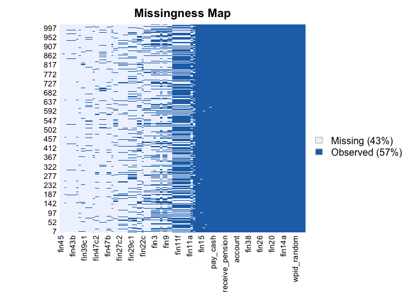
\#\#Usig the package “Amelia” we see that there is a high number of
missing data (43%). Luckily, the fact the we are using a very large
dataset means that even if we reduce 43% of the size of the data, we
don’t completely reduce the statistical power of the model. Given that
nature of the data and the World Bank Description about how they were
gathered, we assume that this data are “MACR”, Missing Completely At
Random.

\#\#We now want to check if the missing data are in our variables of
interests and in which percentage, and we do so by building a plot that
will also help us to see the distribution of our variables of interest

    library(naniar)
    gg_miss_case(newdata2, emp_in, order_cases = TRUE, show_pct = FALSE)

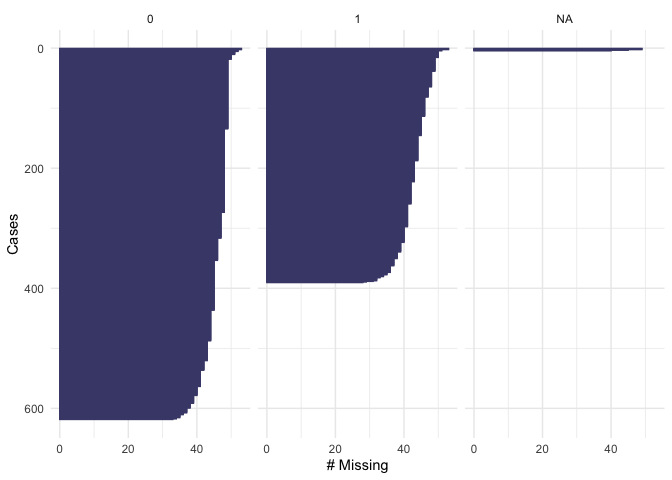

    gg_miss_case(newdata2, educ, order_cases = TRUE, show_pct = FALSE)

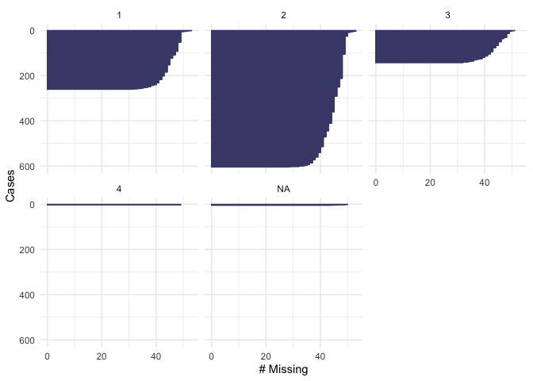

    gg_miss_case(newdata2, female, order_cases = TRUE, show_pct = FALSE)

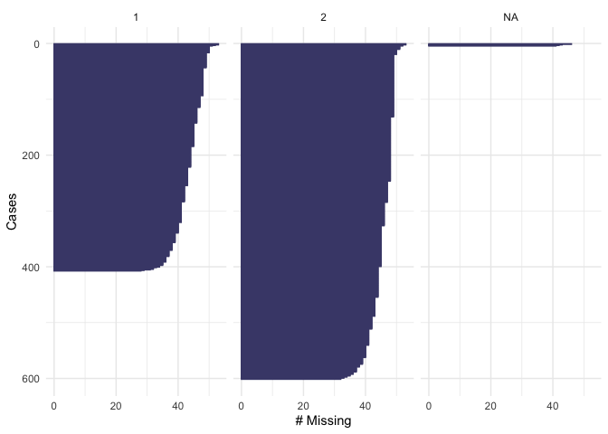

    gg_miss_case(newdata2, age, order_cases = TRUE, show_pct = FALSE)

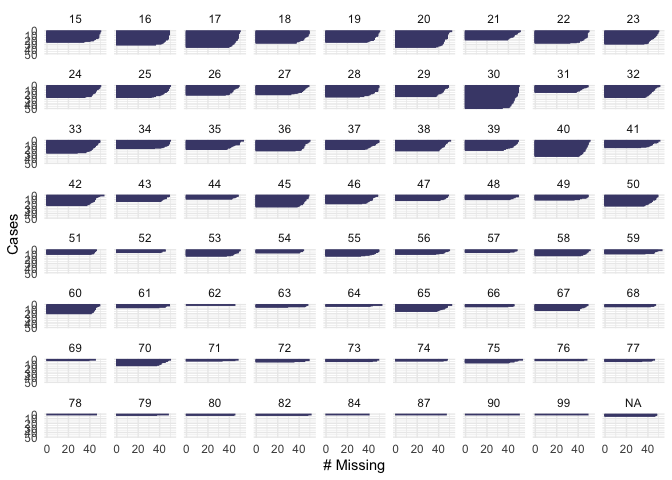

    gg_miss_case(newdata2, fin15, order_cases = TRUE, show_pct = FALSE)

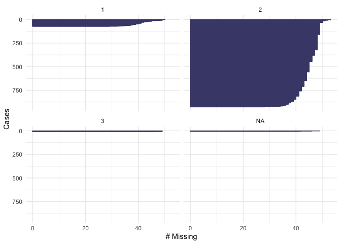

    gg_miss_case(newdata2, fin16, order_cases = TRUE, show_pct = FALSE)

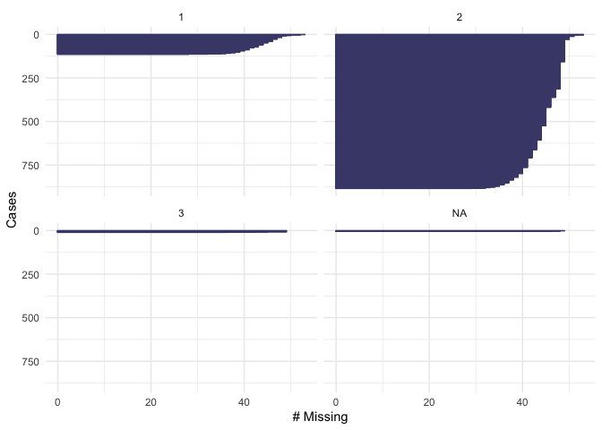

    fct_explicit_na("fin48", na_level = "(Missing)")

    ## [1] fin48
    ## Levels: fin48

    gg_miss_case(newdata2, fin48, order_cases = TRUE, show_pct = FALSE)

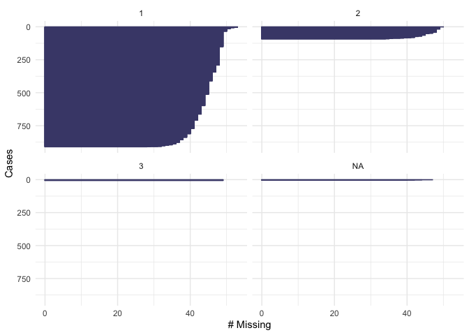

\#\#From the plot we see that our dependent variable, being part of the
workforce, doesn’t have missing values. We also note that 600
respondents are out of the workforce and 400 are in the workforce.
Looking at education, we see that there are not missing values. About
200 respondents have “level 1” of education, 600 have “level 2” and 150
have “level 3”. None of the respondents have “level 4”. In the variable
“female”, there are not missing values. 400 of the respondents were men
and 600 were female. For the variable of “age” we see that there are not
missing values and that the majority of the respondents were below age
50. In the variable fin15 (having saved to start a business) there is a
small number of missing data (&gt;50). More than 800 respondents
reported not to have saved, and about 100 reported to have saved to
start a business. In the variable fin16 (having saved for old age),
there is a small number of missing data (&gt;50). More than 800
respondents reported not to have saved, and only about 150 reported to
have saved. In the case of fin48 (having a national ID), there is a
small number of missing data (&gt;50). More than 850 respondents
reported to have a national ID, and only about 100 respondents reported
not to have a national ID. Because these numbers are low compared to the
total number of observations that we have in the dataset, we will omit
them when running our model

\#We now look at our categorical variables. We use table()function to
find the distribution of categorical variables and pay attention to the
“don’t know” values

    library(table1)

    ## 
    ## Attaching package: 'table1'

    ## The following objects are masked from 'package:base':
    ## 
    ##     units, units<-

    table(newdata2$fin15)

    ## 
    ##   1   2   3 
    ##  72 926  10

    table(newdata2$fin48)

    ## 
    ##   1   2   3 
    ## 910  92   6

    table(newdata2$female)

    ## 
    ##   1   2 
    ## 407 601

    table(newdata2$fin16)

    ## 
    ##   1   2   3 
    ## 114 884  10

    table(newdata2$emp_in)

    ## 
    ##   0   1 
    ## 618 390

\#\#We see that the variables fin15(saved for business purpose), fin48
(having a national ID) and fin16 (saved for old age) have a small number
of “dk” responses

\#We find the percentage distribution of these “dk” values to see how
much they matter in the overall dataset

    table(newdata2$fin15)/nrow(newdata2)

    ## 
    ##           1           2           3 
    ## 0.071146245 0.915019763 0.009881423

    table(newdata2$fin48)/nrow(newdata2)

    ## 
    ##           1           2           3 
    ## 0.899209486 0.090909091 0.005928854

    table(newdata2$fin16)/nrow(newdata2)

    ## 
    ##           1           2           3 
    ## 0.112648221 0.873517787 0.009881423

\#\#It is confirmed that the “dk” answers are in a very limited number
and we can therefore treat them as missing values. This means that the
total number of observations that will be used in the model is less than
the total number presented in the dataset

\#We now treat as “factors” the categorical variables and then treat the
“dk” as NA

    library(pscl)

    ## Classes and Methods for R developed in the
    ## Political Science Computational Laboratory
    ## Department of Political Science
    ## Stanford University
    ## Simon Jackman
    ## hurdle and zeroinfl functions by Achim Zeileis

    library(tidyverse)
    library(pscl)
    newdata2 <- newdata2 %>%
    mutate(female = as_factor(female), fin15 = as_factor(fin15), fin48 = as_factor(fin48), fin16 = as_factor(fin16) , emp_in = as_factor(emp_in))
    library(forcats)
    anyNA(fct_drop(newdata2$fin48, only = "(dk)"))

    ## [1] TRUE

    newdata2$fin48[newdata2$fin48=="(dk)"]<-NA
    sum(is.na(newdata2$fin48)*1)

    ## [1] 10

    anyNA(fct_drop(newdata2$fin16, only = "(dk)"))

    ## [1] TRUE

    newdata2$fin16[newdata2$fin16=="(dk)"]<-NA
    sum(is.na(newdata2$fin16)*1)

    ## [1] 14

    anyNA(fct_drop(newdata2$fin15, only = "(dk)"))

    ## [1] TRUE

    newdata2$fin15[newdata2$fin15=="(dk)"]<-NA
    sum(is.na(newdata2$fin15)*1)

    ## [1] 14

\#\#Now our dataset is ready to be analysed.

## 3. Methods {#methods}

Given that we are working with categorical
variables, and that our dependent variable has a binomial response
(yes/no), we run a logistic regression for binomial models (gml)
————MODELLING——————– \#MOD1: As explained in the introduction, Mod1 has
per DV if the respondent is in the workforce, and the main explanatory
variable is fin48 (having or not a national ID). Control for gender and
age

    mod1 <- glm(emp_in ~ fin48 + female + age, 
                data=newdata2, 
                family=binomial(link="logit"))
    library(sjPlot)
    tab_model(mod1)

<table style="border-collapse:collapse; border:none;">
<tr>
<th style="border-top: double; text-align:center; font-style:normal; font-weight:bold; padding:0.2cm;  text-align:left; ">
 
</th>
<th colspan="3" style="border-top: double; text-align:center; font-style:normal; font-weight:bold; padding:0.2cm; ">
Respondent is in the workforce
</th>
</tr>
<tr>
<td style=" text-align:center; border-bottom:1px solid; font-style:italic; font-weight:normal;  text-align:left; ">
Predictors
</td>
<td style=" text-align:center; border-bottom:1px solid; font-style:italic; font-weight:normal;  ">
Odds Ratios
</td>
<td style=" text-align:center; border-bottom:1px solid; font-style:italic; font-weight:normal;  ">
CI
</td>
<td style=" text-align:center; border-bottom:1px solid; font-style:italic; font-weight:normal;  ">
p
</td>
</tr>
<tr>
<td style=" padding:0.2cm; text-align:left; vertical-align:top; text-align:left; ">
(Intercept)
</td>
<td style=" padding:0.2cm; text-align:left; vertical-align:top; text-align:center;  ">
5.07
</td>
<td style=" padding:0.2cm; text-align:left; vertical-align:top; text-align:center;  ">
3.28 – 7.97
</td>
<td style=" padding:0.2cm; text-align:left; vertical-align:top; text-align:center;  ">
<strong>&lt;0.001
</td>
</tr>
<tr>
<td style=" padding:0.2cm; text-align:left; vertical-align:top; text-align:left; ">
fin48: no
</td>
<td style=" padding:0.2cm; text-align:left; vertical-align:top; text-align:center;  ">
0.39
</td>
<td style=" padding:0.2cm; text-align:left; vertical-align:top; text-align:center;  ">
0.22 – 0.67
</td>
<td style=" padding:0.2cm; text-align:left; vertical-align:top; text-align:center;  ">
<strong>0.001</strong>
</td>
</tr>
<tr>
<td style=" padding:0.2cm; text-align:left; vertical-align:top; text-align:left; ">
Respondent is female: Female
</td>
<td style=" padding:0.2cm; text-align:left; vertical-align:top; text-align:center;  ">
0.11
</td>
<td style=" padding:0.2cm; text-align:left; vertical-align:top; text-align:center;  ">
0.08 – 0.15
</td>
<td style=" padding:0.2cm; text-align:left; vertical-align:top; text-align:center;  ">
<strong>&lt;0.001
</td>
</tr>
<tr>
<td style=" padding:0.2cm; text-align:left; vertical-align:top; text-align:left; ">
Respondent age
</td>
<td style=" padding:0.2cm; text-align:left; vertical-align:top; text-align:center;  ">
0.98
</td>
<td style=" padding:0.2cm; text-align:left; vertical-align:top; text-align:center;  ">
0.97 – 0.99
</td>
<td style=" padding:0.2cm; text-align:left; vertical-align:top; text-align:center;  ">
<strong>&lt;0.001
</td>
</tr>
<tr>
<td style=" padding:0.2cm; text-align:left; vertical-align:top; text-align:left; padding-top:0.1cm; padding-bottom:0.1cm; border-top:1px solid;">
Observations
</td>
<td style=" padding:0.2cm; text-align:left; vertical-align:top; padding-top:0.1cm; padding-bottom:0.1cm; text-align:left; border-top:1px solid;" colspan="3">
990
</td>
</tr>
<tr>
<td style=" padding:0.2cm; text-align:left; vertical-align:top; text-align:left; padding-top:0.1cm; padding-bottom:0.1cm;">
R2 Tjur
</td>
<td style=" padding:0.2cm; text-align:left; vertical-align:top; padding-top:0.1cm; padding-bottom:0.1cm; text-align:left;" colspan="3">
0.254
</td>
</tr>
</table>
\#\#Interpretation: We build a table that allows us to look at the odds
ratio. This means that coefficents with values above 1 increase the
odds, while values below 1 decrease the odds of being in the work force.
Remarkably, all the p values in the table are less than 0.005. National
ID has a coefficient of 0.39 and p value of 0.001, which means that it
decreases the odds of being in the workforce. The variable for gender
has a very small p value, &lt;0.001 with coefficient of 0.12. This means
that being a woman decreases the odds of being in the workforce. Age has
a p value of &lt;0.001 and coefficient 0.98, meaning that it decreases
the odds of being in the workforce.

————CHECKS MOD1——————– \#\#First, we check for multicollinearity

    library(car)

    ## Loading required package: carData

    ## Registered S3 methods overwritten by 'car':
    ##   method                          from
    ##   influence.merMod                lme4
    ##   cooks.distance.influence.merMod lme4
    ##   dfbeta.influence.merMod         lme4
    ##   dfbetas.influence.merMod        lme4

    ## 
    ## Attaching package: 'car'

    ## The following object is masked from 'package:dplyr':
    ## 
    ##     recode

    ## The following object is masked from 'package:purrr':
    ## 
    ##     some

    t(t(vif(mod1)))

    ##            [,1]
    ## fin48  1.099499
    ## female 1.024280
    ## age    1.093507

\#\#It’s assumed that there is collinearity among the variables if the
coefficient is &gt; 4. Luckily, we don’t find collinearity in the model

\#\#We can also check visually

    library(performance)
    plot(check_collinearity(mod1))

\#\#we confirm that there is not multicollinearity

\#\#We now look at the residuals

    mod1 <- glm(emp_in ~ fin48 + female +age, 
                data=newdata2, family = "binomial")
    binned_residuals(mod1)

    ## Warning: Probably bad model fit. Only about 61% of the residuals are inside the error bounds.

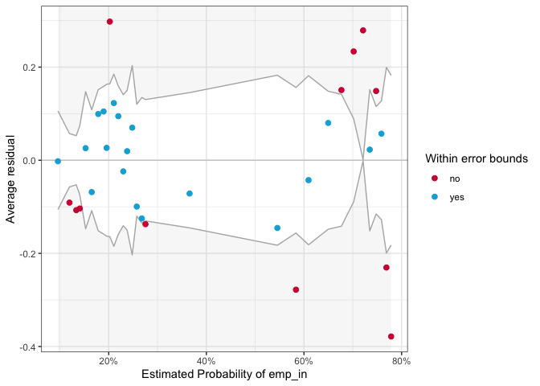
\#\#It seems that the majority of the residuals fell outside the “error
bound”, which indicates that there is a problem in our model

\#\#We now test for heteroskedasticity. We run Breush-Pagan test, where
the null hypothesis is that there is not heteroskedasticity.

    library(lmtest)

    ## Loading required package: zoo

    ## 
    ## Attaching package: 'zoo'

    ## The following objects are masked from 'package:base':
    ## 
    ##     as.Date, as.Date.numeric

    bptest(mod1, data = newdata2, studentize = TRUE)

    ## 
    ##  studentized Breusch-Pagan test
    ## 
    ## data:  mod1
    ## BP = 19.496, df = 3, p-value = 0.0002158

\#\#P value is &gt;0.05. Hence, we fail to reject the null hypothesis of
homogeneity and we accept that there is heteroskedasticity in the model

\#\#We treat heteroskedasticity by clustering by the variable age

    library(sandwich)
    tab_model(mod1, vcov.fun = "CL", vcov.args = ~ age, show.obs = F, show.r2 = F, show.se = T, show.stat = T)

<table style="border-collapse:collapse; border:none;">
<tr>
<th style="border-top: double; text-align:center; font-style:normal; font-weight:bold; padding:0.2cm;  text-align:left; ">
 
</th>
<th colspan="5" style="border-top: double; text-align:center; font-style:normal; font-weight:bold; padding:0.2cm; ">
Respondent is in the workforce
</th>
</tr>
<tr>
<td style=" text-align:center; border-bottom:1px solid; font-style:italic; font-weight:normal;  text-align:left; ">
Predictors
</td>
<td style=" text-align:center; border-bottom:1px solid; font-style:italic; font-weight:normal;  ">
Odds Ratios
</td>
<td style=" text-align:center; border-bottom:1px solid; font-style:italic; font-weight:normal;  ">
std. Error
</td>
<td style=" text-align:center; border-bottom:1px solid; font-style:italic; font-weight:normal;  ">
CI
</td>
<td style=" text-align:center; border-bottom:1px solid; font-style:italic; font-weight:normal;  ">
Statistic
</td>
<td style=" text-align:center; border-bottom:1px solid; font-style:italic; font-weight:normal;  ">
p
</td>
</tr>
<tr>
<td style=" padding:0.2cm; text-align:left; vertical-align:top; text-align:left; ">
(Intercept)
</td>
<td style=" padding:0.2cm; text-align:left; vertical-align:top; text-align:center;  ">
5.07
</td>
<td style=" padding:0.2cm; text-align:left; vertical-align:top; text-align:center;  ">
0.43
</td>
<td style=" padding:0.2cm; text-align:left; vertical-align:top; text-align:center;  ">
2.17 – 11.87
</td>
<td style=" padding:0.2cm; text-align:left; vertical-align:top; text-align:center;  ">
3.75
</td>
<td style=" padding:0.2cm; text-align:left; vertical-align:top; text-align:center;  ">
<strong>&lt;0.001
</td>
</tr>
<tr>
<td style=" padding:0.2cm; text-align:left; vertical-align:top; text-align:left; ">
fin48: no
</td>
<td style=" padding:0.2cm; text-align:left; vertical-align:top; text-align:center;  ">
0.39
</td>
<td style=" padding:0.2cm; text-align:left; vertical-align:top; text-align:center;  ">
0.61
</td>
<td style=" padding:0.2cm; text-align:left; vertical-align:top; text-align:center;  ">
0.12 – 1.27
</td>
<td style=" padding:0.2cm; text-align:left; vertical-align:top; text-align:center;  ">
-1.57
</td>
<td style=" padding:0.2cm; text-align:left; vertical-align:top; text-align:center;  ">
0.117
</td>
</tr>
<tr>
<td style=" padding:0.2cm; text-align:left; vertical-align:top; text-align:left; ">
Respondent is female: Female
</td>
<td style=" padding:0.2cm; text-align:left; vertical-align:top; text-align:center;  ">
0.11
</td>
<td style=" padding:0.2cm; text-align:left; vertical-align:top; text-align:center;  ">
0.16
</td>
<td style=" padding:0.2cm; text-align:left; vertical-align:top; text-align:center;  ">
0.08 – 0.15
</td>
<td style=" padding:0.2cm; text-align:left; vertical-align:top; text-align:center;  ">
-14.13
</td>
<td style=" padding:0.2cm; text-align:left; vertical-align:top; text-align:center;  ">
<strong>&lt;0.001
</td>
</tr>
<tr>
<td style=" padding:0.2cm; text-align:left; vertical-align:top; text-align:left; ">
Respondent age
</td>
<td style=" padding:0.2cm; text-align:left; vertical-align:top; text-align:center;  ">
0.98
</td>
<td style=" padding:0.2cm; text-align:left; vertical-align:top; text-align:center;  ">
0.01
</td>
<td style=" padding:0.2cm; text-align:left; vertical-align:top; text-align:center;  ">
0.96 – 1.00
</td>
<td style=" padding:0.2cm; text-align:left; vertical-align:top; text-align:center;  ">
-2.36
</td>
<td style=" padding:0.2cm; text-align:left; vertical-align:top; text-align:center;  ">
<strong>0.019</strong>
</td>
</tr>
</table>
\#\#Interpretation: Once we cluster mod1 by age, we see that fin48 is
not statistically significant anymore. However, being a woman still
decreases the odds of being in the workforce, with a p value of
&lt;0.001. Age has a p value of 0.009 and decreases the odds of being in
the workforce.

——MODEL 2———- \#\#In Model 2 we add the variable education (educ), and
we keep all the other variables of mod1, including fin48 (even if it was
revealed to be not statistically significant, because it maintains
theoretical importance for this research)

    mod2 <- glm(emp_in ~ educ + female + fin48 +age,
                data=newdata2, 
                family=binomial(link="logit"))
    library(sjPlot)
    tab_model(mod2)

<table style="border-collapse:collapse; border:none;">
<tr>
<th style="border-top: double; text-align:center; font-style:normal; font-weight:bold; padding:0.2cm;  text-align:left; ">
 
</th>
<th colspan="3" style="border-top: double; text-align:center; font-style:normal; font-weight:bold; padding:0.2cm; ">
Respondent is in the workforce
</th>
</tr>
<tr>
<td style=" text-align:center; border-bottom:1px solid; font-style:italic; font-weight:normal;  text-align:left; ">
Predictors
</td>
<td style=" text-align:center; border-bottom:1px solid; font-style:italic; font-weight:normal;  ">
Odds Ratios
</td>
<td style=" text-align:center; border-bottom:1px solid; font-style:italic; font-weight:normal;  ">
CI
</td>
<td style=" text-align:center; border-bottom:1px solid; font-style:italic; font-weight:normal;  ">
p
</td>
</tr>
<tr>
<td style=" padding:0.2cm; text-align:left; vertical-align:top; text-align:left; ">
(Intercept)
</td>
<td style=" padding:0.2cm; text-align:left; vertical-align:top; text-align:center;  ">
0.71
</td>
<td style=" padding:0.2cm; text-align:left; vertical-align:top; text-align:center;  ">
0.35 – 1.46
</td>
<td style=" padding:0.2cm; text-align:left; vertical-align:top; text-align:center;  ">
0.358
</td>
</tr>
<tr>
<td style=" padding:0.2cm; text-align:left; vertical-align:top; text-align:left; ">
Respondent education level
</td>
<td style=" padding:0.2cm; text-align:left; vertical-align:top; text-align:center;  ">
2.46
</td>
<td style=" padding:0.2cm; text-align:left; vertical-align:top; text-align:center;  ">
1.89 – 3.21
</td>
<td style=" padding:0.2cm; text-align:left; vertical-align:top; text-align:center;  ">
<strong>&lt;0.001
</td>
</tr>
<tr>
<td style=" padding:0.2cm; text-align:left; vertical-align:top; text-align:left; ">
Respondent is female: Female
</td>
<td style=" padding:0.2cm; text-align:left; vertical-align:top; text-align:center;  ">
0.11
</td>
<td style=" padding:0.2cm; text-align:left; vertical-align:top; text-align:center;  ">
0.08 – 0.15
</td>
<td style=" padding:0.2cm; text-align:left; vertical-align:top; text-align:center;  ">
<strong>&lt;0.001
</td>
</tr>
<tr>
<td style=" padding:0.2cm; text-align:left; vertical-align:top; text-align:left; ">
fin48: no
</td>
<td style=" padding:0.2cm; text-align:left; vertical-align:top; text-align:center;  ">
0.53
</td>
<td style=" padding:0.2cm; text-align:left; vertical-align:top; text-align:center;  ">
0.30 – 0.92
</td>
<td style=" padding:0.2cm; text-align:left; vertical-align:top; text-align:center;  ">
<strong>0.027</strong>
</td>
</tr>
<tr>
<td style=" padding:0.2cm; text-align:left; vertical-align:top; text-align:left; ">
Respondent age
</td>
<td style=" padding:0.2cm; text-align:left; vertical-align:top; text-align:center;  ">
0.98
</td>
<td style=" padding:0.2cm; text-align:left; vertical-align:top; text-align:center;  ">
0.97 – 1.00
</td>
<td style=" padding:0.2cm; text-align:left; vertical-align:top; text-align:center;  ">
<strong>0.004</strong>
</td>
</tr>
<tr>
<td style=" padding:0.2cm; text-align:left; vertical-align:top; text-align:left; padding-top:0.1cm; padding-bottom:0.1cm; border-top:1px solid;">
Observations
</td>
<td style=" padding:0.2cm; text-align:left; vertical-align:top; padding-top:0.1cm; padding-bottom:0.1cm; text-align:left; border-top:1px solid;" colspan="3">
986
</td>
</tr>
<tr>
<td style=" padding:0.2cm; text-align:left; vertical-align:top; text-align:left; padding-top:0.1cm; padding-bottom:0.1cm;">
R2 Tjur
</td>
<td style=" padding:0.2cm; text-align:left; vertical-align:top; padding-top:0.1cm; padding-bottom:0.1cm; text-align:left;" colspan="3">
0.290
</td>
</tr>
</table>
\#\#Interpretation: As it also happened in mod1 before that we treated
heteroskedasticity, we have very small p values for each of our
variables. I will therefore interpret this model after having carried
out the necessary checks.

———–CHECKS MOD2————————

\#\#Multicollinearity. This test is very important be cause it could be
claimed that having a national ID is correlated to the variable
indicating the level of education.

    library(car)
    t(t(vif(mod2)))

    ##            [,1]
    ## educ   1.055412
    ## female 1.045636
    ## fin48  1.113010
    ## age    1.108781

\#\#The coefficients range between 1.04 and 1.05. We can therefore
deduce that we don’t have an issue of multicollinearity.

\#\#We can also check visually by constructing a plot:

    library(performance)
    plot(check_collinearity(mod2))

\#\#We conclude that there is not collinearity among the variables

\#\#We check the residuals.

    library(performance)
    library(lme4)

    ## Loading required package: Matrix

    ## 
    ## Attaching package: 'Matrix'

    ## The following objects are masked from 'package:tidyr':
    ## 
    ##     expand, pack, unpack

    library(see)
    mod2 <- glm(emp_in ~ educ + female + fin48 +age, 
                data=newdata2, family = "binomial")
    binned_residuals(mod2)

    ## Warning: Probably bad model fit. Only about 65% of the residuals are inside the error bounds.

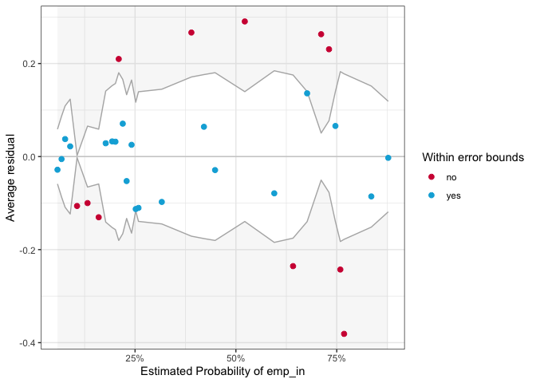
\#\#Only 68% of the residuals are within the error bound, which (as
happend in mod1) tells us that there is a problem in the model

\#\#We also check for heteroskedasticity with the Breush-Pagan test

    mod2 <- glm(emp_in ~ educ + female + fin15 + age, 
                data=newdata2, family = "binomial")
    library(lmtest)
    bptest(mod2, data = newdata2, studentize = TRUE)

    ## 
    ##  studentized Breusch-Pagan test
    ## 
    ## data:  mod2
    ## BP = 52.811, df = 4, p-value = 9.332e-11

\#\#Our p value is &lt; than 0.05. We have reject the null, and accept
the fact that in our mod2 there is heteroskedasticity

\#\#We have to treat heteroskedascity and we cluster for the variable
age

    library(sandwich)
    tab_model(mod2, vcov.fun = "CL", vcov.args = ~ age, show.obs = F, show.r2 = F, show.se = T, show.stat = T)

<table style="border-collapse:collapse; border:none;">
<tr>
<th style="border-top: double; text-align:center; font-style:normal; font-weight:bold; padding:0.2cm;  text-align:left; ">
 
</th>
<th colspan="5" style="border-top: double; text-align:center; font-style:normal; font-weight:bold; padding:0.2cm; ">
Respondent is in the workforce
</th>
</tr>
<tr>
<td style=" text-align:center; border-bottom:1px solid; font-style:italic; font-weight:normal;  text-align:left; ">
Predictors
</td>
<td style=" text-align:center; border-bottom:1px solid; font-style:italic; font-weight:normal;  ">
Odds Ratios
</td>
<td style=" text-align:center; border-bottom:1px solid; font-style:italic; font-weight:normal;  ">
std. Error
</td>
<td style=" text-align:center; border-bottom:1px solid; font-style:italic; font-weight:normal;  ">
CI
</td>
<td style=" text-align:center; border-bottom:1px solid; font-style:italic; font-weight:normal;  ">
Statistic
</td>
<td style=" text-align:center; border-bottom:1px solid; font-style:italic; font-weight:normal;  ">
p
</td>
</tr>
<tr>
<td style=" padding:0.2cm; text-align:left; vertical-align:top; text-align:left; ">
(Intercept)
</td>
<td style=" padding:0.2cm; text-align:left; vertical-align:top; text-align:center;  ">
1.72
</td>
<td style=" padding:0.2cm; text-align:left; vertical-align:top; text-align:center;  ">
0.64
</td>
<td style=" padding:0.2cm; text-align:left; vertical-align:top; text-align:center;  ">
0.49 – 6.05
</td>
<td style=" padding:0.2cm; text-align:left; vertical-align:top; text-align:center;  ">
0.85
</td>
<td style=" padding:0.2cm; text-align:left; vertical-align:top; text-align:center;  ">
0.397
</td>
</tr>
<tr>
<td style=" padding:0.2cm; text-align:left; vertical-align:top; text-align:left; ">
Respondent education level
</td>
<td style=" padding:0.2cm; text-align:left; vertical-align:top; text-align:center;  ">
2.41
</td>
<td style=" padding:0.2cm; text-align:left; vertical-align:top; text-align:center;  ">
0.15
</td>
<td style=" padding:0.2cm; text-align:left; vertical-align:top; text-align:center;  ">
1.80 – 3.21
</td>
<td style=" padding:0.2cm; text-align:left; vertical-align:top; text-align:center;  ">
5.95
</td>
<td style=" padding:0.2cm; text-align:left; vertical-align:top; text-align:center;  ">
<strong>&lt;0.001
</td>
</tr>
<tr>
<td style=" padding:0.2cm; text-align:left; vertical-align:top; text-align:left; ">
Respondent is female: Female
</td>
<td style=" padding:0.2cm; text-align:left; vertical-align:top; text-align:center;  ">
0.12
</td>
<td style=" padding:0.2cm; text-align:left; vertical-align:top; text-align:center;  ">
0.17
</td>
<td style=" padding:0.2cm; text-align:left; vertical-align:top; text-align:center;  ">
0.08 – 0.16
</td>
<td style=" padding:0.2cm; text-align:left; vertical-align:top; text-align:center;  ">
-12.71
</td>
<td style=" padding:0.2cm; text-align:left; vertical-align:top; text-align:center;  ">
<strong>&lt;0.001
</td>
</tr>
<tr>
<td style=" padding:0.2cm; text-align:left; vertical-align:top; text-align:left; ">
fin15: no
</td>
<td style=" padding:0.2cm; text-align:left; vertical-align:top; text-align:center;  ">
0.33
</td>
<td style=" padding:0.2cm; text-align:left; vertical-align:top; text-align:center;  ">
0.35
</td>
<td style=" padding:0.2cm; text-align:left; vertical-align:top; text-align:center;  ">
0.16 – 0.65
</td>
<td style=" padding:0.2cm; text-align:left; vertical-align:top; text-align:center;  ">
-3.20
</td>
<td style=" padding:0.2cm; text-align:left; vertical-align:top; text-align:center;  ">
<strong>0.001</strong>
</td>
</tr>
<tr>
<td style=" padding:0.2cm; text-align:left; vertical-align:top; text-align:left; ">
Respondent age
</td>
<td style=" padding:0.2cm; text-align:left; vertical-align:top; text-align:center;  ">
0.99
</td>
<td style=" padding:0.2cm; text-align:left; vertical-align:top; text-align:center;  ">
0.01
</td>
<td style=" padding:0.2cm; text-align:left; vertical-align:top; text-align:center;  ">
0.97 – 1.01
</td>
<td style=" padding:0.2cm; text-align:left; vertical-align:top; text-align:center;  ">
-1.28
</td>
<td style=" padding:0.2cm; text-align:left; vertical-align:top; text-align:center;  ">
0.200
</td>
</tr>
</table>
\#\#As it happened in mod1, when we cluster by age the variable fin48
loses statistical significance. However, education keeps a very low p
value, &lt;0.001, and a coefficient of 2.44, meaning that the level of
education increases the odds of being in the workforce. Being a woman
also keeps a low p value, &lt;0.001, with coefficient 0.12. Age in this
case has a p value of 0.175, so it loses it statistical significance.

———————–MOD3———————————- \#\#In Model 3 we add the control variable
“fin15” and “fin16”, which give us information about the conditions of
the Jordanian labour market, and we keep all the other variables of mod1
and mod 2.

    mod3 <- glm(emp_in ~ educ + female + fin15 + fin16 + fin48 + age ,
                data=newdata2, 
                family=binomial(link="logit"))
    library(sjPlot)
    tab_model(mod3)

<table style="border-collapse:collapse; border:none;">
<tr>
<th style="border-top: double; text-align:center; font-style:normal; font-weight:bold; padding:0.2cm;  text-align:left; ">
 
</th>
<th colspan="3" style="border-top: double; text-align:center; font-style:normal; font-weight:bold; padding:0.2cm; ">
Respondent is in the workforce
</th>
</tr>
<tr>
<td style=" text-align:center; border-bottom:1px solid; font-style:italic; font-weight:normal;  text-align:left; ">
Predictors
</td>
<td style=" text-align:center; border-bottom:1px solid; font-style:italic; font-weight:normal;  ">
Odds Ratios
</td>
<td style=" text-align:center; border-bottom:1px solid; font-style:italic; font-weight:normal;  ">
CI
</td>
<td style=" text-align:center; border-bottom:1px solid; font-style:italic; font-weight:normal;  ">
p
</td>
</tr>
<tr>
<td style=" padding:0.2cm; text-align:left; vertical-align:top; text-align:left; ">
(Intercept)
</td>
<td style=" padding:0.2cm; text-align:left; vertical-align:top; text-align:center;  ">
4.40
</td>
<td style=" padding:0.2cm; text-align:left; vertical-align:top; text-align:center;  ">
1.49 – 13.39
</td>
<td style=" padding:0.2cm; text-align:left; vertical-align:top; text-align:center;  ">
<strong>0.008</strong>
</td>
</tr>
<tr>
<td style=" padding:0.2cm; text-align:left; vertical-align:top; text-align:left; ">
Respondent education level
</td>
<td style=" padding:0.2cm; text-align:left; vertical-align:top; text-align:center;  ">
2.23
</td>
<td style=" padding:0.2cm; text-align:left; vertical-align:top; text-align:center;  ">
1.70 – 2.93
</td>
<td style=" padding:0.2cm; text-align:left; vertical-align:top; text-align:center;  ">
<strong>&lt;0.001
</td>
</tr>
<tr>
<td style=" padding:0.2cm; text-align:left; vertical-align:top; text-align:left; ">
Respondent is female: Female
</td>
<td style=" padding:0.2cm; text-align:left; vertical-align:top; text-align:center;  ">
0.12
</td>
<td style=" padding:0.2cm; text-align:left; vertical-align:top; text-align:center;  ">
0.08 – 0.16
</td>
<td style=" padding:0.2cm; text-align:left; vertical-align:top; text-align:center;  ">
<strong>&lt;0.001
</td>
</tr>
<tr>
<td style=" padding:0.2cm; text-align:left; vertical-align:top; text-align:left; ">
fin15: no
</td>
<td style=" padding:0.2cm; text-align:left; vertical-align:top; text-align:center;  ">
0.38
</td>
<td style=" padding:0.2cm; text-align:left; vertical-align:top; text-align:center;  ">
0.20 – 0.71
</td>
<td style=" padding:0.2cm; text-align:left; vertical-align:top; text-align:center;  ">
<strong>0.003</strong>
</td>
</tr>
<tr>
<td style=" padding:0.2cm; text-align:left; vertical-align:top; text-align:left; ">
fin16: no
</td>
<td style=" padding:0.2cm; text-align:left; vertical-align:top; text-align:center;  ">
0.48
</td>
<td style=" padding:0.2cm; text-align:left; vertical-align:top; text-align:center;  ">
0.29 – 0.79
</td>
<td style=" padding:0.2cm; text-align:left; vertical-align:top; text-align:center;  ">
<strong>0.004</strong>
</td>
</tr>
<tr>
<td style=" padding:0.2cm; text-align:left; vertical-align:top; text-align:left; ">
fin48: no
</td>
<td style=" padding:0.2cm; text-align:left; vertical-align:top; text-align:center;  ">
0.54
</td>
<td style=" padding:0.2cm; text-align:left; vertical-align:top; text-align:center;  ">
0.31 – 0.95
</td>
<td style=" padding:0.2cm; text-align:left; vertical-align:top; text-align:center;  ">
<strong>0.036</strong>
</td>
</tr>
<tr>
<td style=" padding:0.2cm; text-align:left; vertical-align:top; text-align:left; ">
Respondent age
</td>
<td style=" padding:0.2cm; text-align:left; vertical-align:top; text-align:center;  ">
0.98
</td>
<td style=" padding:0.2cm; text-align:left; vertical-align:top; text-align:center;  ">
0.97 – 0.99
</td>
<td style=" padding:0.2cm; text-align:left; vertical-align:top; text-align:center;  ">
<strong>0.001</strong>
</td>
</tr>
<tr>
<td style=" padding:0.2cm; text-align:left; vertical-align:top; text-align:left; padding-top:0.1cm; padding-bottom:0.1cm; border-top:1px solid;">
Observations
</td>
<td style=" padding:0.2cm; text-align:left; vertical-align:top; padding-top:0.1cm; padding-bottom:0.1cm; text-align:left; border-top:1px solid;" colspan="3">
975
</td>
</tr>
<tr>
<td style=" padding:0.2cm; text-align:left; vertical-align:top; text-align:left; padding-top:0.1cm; padding-bottom:0.1cm;">
R2 Tjur
</td>
<td style=" padding:0.2cm; text-align:left; vertical-align:top; padding-top:0.1cm; padding-bottom:0.1cm; text-align:left;" colspan="3">
0.305
</td>
</tr>
</table>
\#\#Interpretation: We see that all the variables have very small p
values, but we suspect that there is heteroskedasticity in the model
(given its similarity with mod 1 and mod2). We therefore run the test
for multicollinearity and heteroskedasticity before interpreting the
results.

—————-CHECKS MOD3————————————————– \#\#We can check for
multicollinearity by constructing a plot:

    library(performance)
    plot(check_collinearity(mod3))

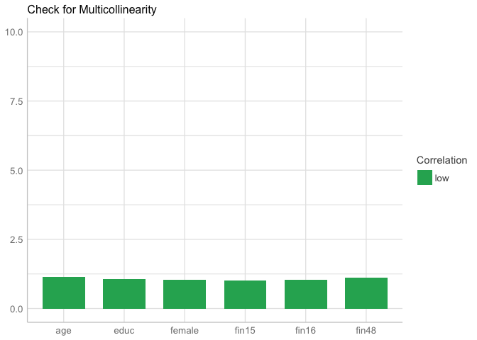
\#\#we note that there is not collinerarity among the varibles \#\#We
also check for heteroskedasticity with the Breush-Pagan test

    mod3 <- glm(emp_in ~ educ + female + fin15 + fin16 + fin48 + age, 
                data=newdata2, family = "binomial")
    library(lmtest)
    bptest(mod3, data = newdata2, studentize = TRUE)

    ## 
    ##  studentized Breusch-Pagan test
    ## 
    ## data:  mod3
    ## BP = 50.364, df = 6, p-value = 3.974e-09

\#\#Our p value is &lt; than 0.05. We have reject the null, and accept
the fact that in our mod2 there is heteroskedasticity

\#\#We treat heteroskedascity as we did in the previous models, and we
cluster for the variable age

    library(sandwich)
    tab_model(mod3, vcov.fun = "CL", vcov.args = ~ age, show.obs = F, show.r2 = F, show.se = T, show.stat = T)

<table style="border-collapse:collapse; border:none;">
<tr>
<th style="border-top: double; text-align:center; font-style:normal; font-weight:bold; padding:0.2cm;  text-align:left; ">
 
</th>
<th colspan="5" style="border-top: double; text-align:center; font-style:normal; font-weight:bold; padding:0.2cm; ">
Respondent is in the workforce
</th>
</tr>
<tr>
<td style=" text-align:center; border-bottom:1px solid; font-style:italic; font-weight:normal;  text-align:left; ">
Predictors
</td>
<td style=" text-align:center; border-bottom:1px solid; font-style:italic; font-weight:normal;  ">
Odds Ratios
</td>
<td style=" text-align:center; border-bottom:1px solid; font-style:italic; font-weight:normal;  ">
std. Error
</td>
<td style=" text-align:center; border-bottom:1px solid; font-style:italic; font-weight:normal;  ">
CI
</td>
<td style=" text-align:center; border-bottom:1px solid; font-style:italic; font-weight:normal;  ">
Statistic
</td>
<td style=" text-align:center; border-bottom:1px solid; font-style:italic; font-weight:normal;  ">
p
</td>
</tr>
<tr>
<td style=" padding:0.2cm; text-align:left; vertical-align:top; text-align:left; ">
(Intercept)
</td>
<td style=" padding:0.2cm; text-align:left; vertical-align:top; text-align:center;  ">
4.40
</td>
<td style=" padding:0.2cm; text-align:left; vertical-align:top; text-align:center;  ">
0.59
</td>
<td style=" padding:0.2cm; text-align:left; vertical-align:top; text-align:center;  ">
1.39 – 13.97
</td>
<td style=" padding:0.2cm; text-align:left; vertical-align:top; text-align:center;  ">
2.52
</td>
<td style=" padding:0.2cm; text-align:left; vertical-align:top; text-align:center;  ">
<strong>0.012</strong>
</td>
</tr>
<tr>
<td style=" padding:0.2cm; text-align:left; vertical-align:top; text-align:left; ">
Respondent education level
</td>
<td style=" padding:0.2cm; text-align:left; vertical-align:top; text-align:center;  ">
2.23
</td>
<td style=" padding:0.2cm; text-align:left; vertical-align:top; text-align:center;  ">
0.14
</td>
<td style=" padding:0.2cm; text-align:left; vertical-align:top; text-align:center;  ">
1.68 – 2.95
</td>
<td style=" padding:0.2cm; text-align:left; vertical-align:top; text-align:center;  ">
5.57
</td>
<td style=" padding:0.2cm; text-align:left; vertical-align:top; text-align:center;  ">
<strong>&lt;0.001
</td>
</tr>
<tr>
<td style=" padding:0.2cm; text-align:left; vertical-align:top; text-align:left; ">
Respondent is female: Female
</td>
<td style=" padding:0.2cm; text-align:left; vertical-align:top; text-align:center;  ">
0.12
</td>
<td style=" padding:0.2cm; text-align:left; vertical-align:top; text-align:center;  ">
0.17
</td>
<td style=" padding:0.2cm; text-align:left; vertical-align:top; text-align:center;  ">
0.08 – 0.16
</td>
<td style=" padding:0.2cm; text-align:left; vertical-align:top; text-align:center;  ">
-13.06
</td>
<td style=" padding:0.2cm; text-align:left; vertical-align:top; text-align:center;  ">
<strong>&lt;0.001
</td>
</tr>
<tr>
<td style=" padding:0.2cm; text-align:left; vertical-align:top; text-align:left; ">
fin15: no
</td>
<td style=" padding:0.2cm; text-align:left; vertical-align:top; text-align:center;  ">
0.38
</td>
<td style=" padding:0.2cm; text-align:left; vertical-align:top; text-align:center;  ">
0.36
</td>
<td style=" padding:0.2cm; text-align:left; vertical-align:top; text-align:center;  ">
0.19 – 0.77
</td>
<td style=" padding:0.2cm; text-align:left; vertical-align:top; text-align:center;  ">
-2.70
</td>
<td style=" padding:0.2cm; text-align:left; vertical-align:top; text-align:center;  ">
<strong>0.007</strong>
</td>
</tr>
<tr>
<td style=" padding:0.2cm; text-align:left; vertical-align:top; text-align:left; ">
fin16: no
</td>
<td style=" padding:0.2cm; text-align:left; vertical-align:top; text-align:center;  ">
0.48
</td>
<td style=" padding:0.2cm; text-align:left; vertical-align:top; text-align:center;  ">
0.26
</td>
<td style=" padding:0.2cm; text-align:left; vertical-align:top; text-align:center;  ">
0.28 – 0.79
</td>
<td style=" padding:0.2cm; text-align:left; vertical-align:top; text-align:center;  ">
-2.85
</td>
<td style=" padding:0.2cm; text-align:left; vertical-align:top; text-align:center;  ">
<strong>0.004</strong>
</td>
</tr>
<tr>
<td style=" padding:0.2cm; text-align:left; vertical-align:top; text-align:left; ">
fin48: no
</td>
<td style=" padding:0.2cm; text-align:left; vertical-align:top; text-align:center;  ">
0.54
</td>
<td style=" padding:0.2cm; text-align:left; vertical-align:top; text-align:center;  ">
0.57
</td>
<td style=" padding:0.2cm; text-align:left; vertical-align:top; text-align:center;  ">
0.18 – 1.66
</td>
<td style=" padding:0.2cm; text-align:left; vertical-align:top; text-align:center;  ">
-1.07
</td>
<td style=" padding:0.2cm; text-align:left; vertical-align:top; text-align:center;  ">
0.285
</td>
</tr>
<tr>
<td style=" padding:0.2cm; text-align:left; vertical-align:top; text-align:left; ">
Respondent age
</td>
<td style=" padding:0.2cm; text-align:left; vertical-align:top; text-align:center;  ">
0.98
</td>
<td style=" padding:0.2cm; text-align:left; vertical-align:top; text-align:center;  ">
0.01
</td>
<td style=" padding:0.2cm; text-align:left; vertical-align:top; text-align:center;  ">
0.97 – 1.00
</td>
<td style=" padding:0.2cm; text-align:left; vertical-align:top; text-align:center;  ">
-2.10
</td>
<td style=" padding:0.2cm; text-align:left; vertical-align:top; text-align:center;  ">
<strong>0.036</strong>
</td>
</tr>
</table>
\#\#As it happened in mod1, when we cluster by age the variable fin48
loses statistical significance.Education keeps a very low p value,
&lt;0.001, and a coefficient of 2.20, meaning that the level of
education increases the odds of being in the workforce. Being a woman
also keeps a low p value, &lt;0.001, with coefficient 0.12. Fin15 and
fin16 both have low p values, 0.008 and 0.001 respectively, and they
both indicate that not saving (either to start a business of for old
age) decreases the odds of being in the workforce. Notably, in mod3 age
has a p value of 0.014, and its coefficient indicates that the
respondent’s age decreases the odds of being part of the workforce.

## 4. Results {#results}

——————–COMPARISON TO FIND THE BEST MODEL—————————-
\#\#We now compare the performance of the models to see what is our best
fit, by looking at their AIC. Given that we treated all models for
heteroskedasticity in the same way, we can still compare their
statistical power before the treatment

    tab_model(mod3, mod2, mod1, show.loglik = T, show.aic = T, show.r2 = F)

<table style="border-collapse:collapse; border:none;">
<tr>
<th style="border-top: double; text-align:center; font-style:normal; font-weight:bold; padding:0.2cm;  text-align:left; ">
 
</th>
<th colspan="3" style="border-top: double; text-align:center; font-style:normal; font-weight:bold; padding:0.2cm; ">
Respondent is in the workforce
</th>
<th colspan="3" style="border-top: double; text-align:center; font-style:normal; font-weight:bold; padding:0.2cm; ">
Respondent is in the workforce
</th>
<th colspan="3" style="border-top: double; text-align:center; font-style:normal; font-weight:bold; padding:0.2cm; ">
Respondent is in the workforce
</th>
</tr>
<tr>
<td style=" text-align:center; border-bottom:1px solid; font-style:italic; font-weight:normal;  text-align:left; ">
Predictors
</td>
<td style=" text-align:center; border-bottom:1px solid; font-style:italic; font-weight:normal;  ">
Odds Ratios
</td>
<td style=" text-align:center; border-bottom:1px solid; font-style:italic; font-weight:normal;  ">
CI
</td>
<td style=" text-align:center; border-bottom:1px solid; font-style:italic; font-weight:normal;  ">
p
</td>
<td style=" text-align:center; border-bottom:1px solid; font-style:italic; font-weight:normal;  ">
Odds Ratios
</td>
<td style=" text-align:center; border-bottom:1px solid; font-style:italic; font-weight:normal;  ">
CI
</td>
<td style=" text-align:center; border-bottom:1px solid; font-style:italic; font-weight:normal;  col7">
p
</td>
<td style=" text-align:center; border-bottom:1px solid; font-style:italic; font-weight:normal;  col8">
Odds Ratios
</td>
<td style=" text-align:center; border-bottom:1px solid; font-style:italic; font-weight:normal;  col9">
CI
</td>
<td style=" text-align:center; border-bottom:1px solid; font-style:italic; font-weight:normal;  0">
p
</td>
</tr>
<tr>
<td style=" padding:0.2cm; text-align:left; vertical-align:top; text-align:left; ">
(Intercept)
</td>
<td style=" padding:0.2cm; text-align:left; vertical-align:top; text-align:center;  ">
4.40
</td>
<td style=" padding:0.2cm; text-align:left; vertical-align:top; text-align:center;  ">
1.49 – 13.39
</td>
<td style=" padding:0.2cm; text-align:left; vertical-align:top; text-align:center;  ">
<strong>0.008</strong>
</td>
<td style=" padding:0.2cm; text-align:left; vertical-align:top; text-align:center;  ">
1.72
</td>
<td style=" padding:0.2cm; text-align:left; vertical-align:top; text-align:center;  ">
0.69 – 4.41
</td>
<td style=" padding:0.2cm; text-align:left; vertical-align:top; text-align:center;  col7">
0.251
</td>
<td style=" padding:0.2cm; text-align:left; vertical-align:top; text-align:center;  col8">
5.07
</td>
<td style=" padding:0.2cm; text-align:left; vertical-align:top; text-align:center;  col9">
3.28 – 7.97
</td>
<td style=" padding:0.2cm; text-align:left; vertical-align:top; text-align:center;  0">
<strong>&lt;0.001
</td>
</tr>
<tr>
<td style=" padding:0.2cm; text-align:left; vertical-align:top; text-align:left; ">
Respondent education level
</td>
<td style=" padding:0.2cm; text-align:left; vertical-align:top; text-align:center;  ">
2.23
</td>
<td style=" padding:0.2cm; text-align:left; vertical-align:top; text-align:center;  ">
1.70 – 2.93
</td>
<td style=" padding:0.2cm; text-align:left; vertical-align:top; text-align:center;  ">
<strong>&lt;0.001
</td>
<td style=" padding:0.2cm; text-align:left; vertical-align:top; text-align:center;  ">
2.41
</td>
<td style=" padding:0.2cm; text-align:left; vertical-align:top; text-align:center;  ">
1.85 – 3.14
</td>
<td style=" padding:0.2cm; text-align:left; vertical-align:top; text-align:center;  col7">
<strong>&lt;0.001
</td>
<td style=" padding:0.2cm; text-align:left; vertical-align:top; text-align:center;  col8">
</td>
<td style=" padding:0.2cm; text-align:left; vertical-align:top; text-align:center;  col9">
</td>
<td style=" padding:0.2cm; text-align:left; vertical-align:top; text-align:center;  0">
</td>
</tr>
<tr>
<td style=" padding:0.2cm; text-align:left; vertical-align:top; text-align:left; ">
Respondent is female: Female
</td>
<td style=" padding:0.2cm; text-align:left; vertical-align:top; text-align:center;  ">
0.12
</td>
<td style=" padding:0.2cm; text-align:left; vertical-align:top; text-align:center;  ">
0.08 – 0.16
</td>
<td style=" padding:0.2cm; text-align:left; vertical-align:top; text-align:center;  ">
<strong>&lt;0.001
</td>
<td style=" padding:0.2cm; text-align:left; vertical-align:top; text-align:center;  ">
0.12
</td>
<td style=" padding:0.2cm; text-align:left; vertical-align:top; text-align:center;  ">
0.08 – 0.16
</td>
<td style=" padding:0.2cm; text-align:left; vertical-align:top; text-align:center;  col7">
<strong>&lt;0.001
</td>
<td style=" padding:0.2cm; text-align:left; vertical-align:top; text-align:center;  col8">
0.11
</td>
<td style=" padding:0.2cm; text-align:left; vertical-align:top; text-align:center;  col9">
0.08 – 0.15
</td>
<td style=" padding:0.2cm; text-align:left; vertical-align:top; text-align:center;  0">
<strong>&lt;0.001
</td>
</tr>
<tr>
<td style=" padding:0.2cm; text-align:left; vertical-align:top; text-align:left; ">
fin15: no
</td>
<td style=" padding:0.2cm; text-align:left; vertical-align:top; text-align:center;  ">
0.38
</td>
<td style=" padding:0.2cm; text-align:left; vertical-align:top; text-align:center;  ">
0.20 – 0.71
</td>
<td style=" padding:0.2cm; text-align:left; vertical-align:top; text-align:center;  ">
<strong>0.003</strong>
</td>
<td style=" padding:0.2cm; text-align:left; vertical-align:top; text-align:center;  ">
0.33
</td>
<td style=" padding:0.2cm; text-align:left; vertical-align:top; text-align:center;  ">
0.17 – 0.60
</td>
<td style=" padding:0.2cm; text-align:left; vertical-align:top; text-align:center;  col7">
<strong>&lt;0.001
</td>
<td style=" padding:0.2cm; text-align:left; vertical-align:top; text-align:center;  col8">
</td>
<td style=" padding:0.2cm; text-align:left; vertical-align:top; text-align:center;  col9">
</td>
<td style=" padding:0.2cm; text-align:left; vertical-align:top; text-align:center;  0">
</td>
</tr>
<tr>
<td style=" padding:0.2cm; text-align:left; vertical-align:top; text-align:left; ">
fin16: no
</td>
<td style=" padding:0.2cm; text-align:left; vertical-align:top; text-align:center;  ">
0.48
</td>
<td style=" padding:0.2cm; text-align:left; vertical-align:top; text-align:center;  ">
0.29 – 0.79
</td>
<td style=" padding:0.2cm; text-align:left; vertical-align:top; text-align:center;  ">
<strong>0.004</strong>
</td>
<td style=" padding:0.2cm; text-align:left; vertical-align:top; text-align:center;  ">
</td>
<td style=" padding:0.2cm; text-align:left; vertical-align:top; text-align:center;  ">
</td>
<td style=" padding:0.2cm; text-align:left; vertical-align:top; text-align:center;  col7">
</td>
<td style=" padding:0.2cm; text-align:left; vertical-align:top; text-align:center;  col8">
</td>
<td style=" padding:0.2cm; text-align:left; vertical-align:top; text-align:center;  col9">
</td>
<td style=" padding:0.2cm; text-align:left; vertical-align:top; text-align:center;  0">
</td>
</tr>
<tr>
<td style=" padding:0.2cm; text-align:left; vertical-align:top; text-align:left; ">
fin48: no
</td>
<td style=" padding:0.2cm; text-align:left; vertical-align:top; text-align:center;  ">
0.54
</td>
<td style=" padding:0.2cm; text-align:left; vertical-align:top; text-align:center;  ">
0.31 – 0.95
</td>
<td style=" padding:0.2cm; text-align:left; vertical-align:top; text-align:center;  ">
<strong>0.036</strong>
</td>
<td style=" padding:0.2cm; text-align:left; vertical-align:top; text-align:center;  ">
</td>
<td style=" padding:0.2cm; text-align:left; vertical-align:top; text-align:center;  ">
</td>
<td style=" padding:0.2cm; text-align:left; vertical-align:top; text-align:center;  col7">
</td>
<td style=" padding:0.2cm; text-align:left; vertical-align:top; text-align:center;  col8">
0.39
</td>
<td style=" padding:0.2cm; text-align:left; vertical-align:top; text-align:center;  col9">
0.22 – 0.67
</td>
<td style=" padding:0.2cm; text-align:left; vertical-align:top; text-align:center;  0">
<strong>0.001</strong>
</td>
</tr>
<tr>
<td style=" padding:0.2cm; text-align:left; vertical-align:top; text-align:left; ">
Respondent age
</td>
<td style=" padding:0.2cm; text-align:left; vertical-align:top; text-align:center;  ">
0.98
</td>
<td style=" padding:0.2cm; text-align:left; vertical-align:top; text-align:center;  ">
0.97 – 0.99
</td>
<td style=" padding:0.2cm; text-align:left; vertical-align:top; text-align:center;  ">
<strong>0.001</strong>
</td>
<td style=" padding:0.2cm; text-align:left; vertical-align:top; text-align:center;  ">
0.99
</td>
<td style=" padding:0.2cm; text-align:left; vertical-align:top; text-align:center;  ">
0.98 – 1.00
</td>
<td style=" padding:0.2cm; text-align:left; vertical-align:top; text-align:center;  col7">
<strong>0.014</strong>
</td>
<td style=" padding:0.2cm; text-align:left; vertical-align:top; text-align:center;  col8">
0.98
</td>
<td style=" padding:0.2cm; text-align:left; vertical-align:top; text-align:center;  col9">
0.97 – 0.99
</td>
<td style=" padding:0.2cm; text-align:left; vertical-align:top; text-align:center;  0">
<strong>&lt;0.001
</td>
</tr>
<tr>
<td style=" padding:0.2cm; text-align:left; vertical-align:top; text-align:left; padding-top:0.1cm; padding-bottom:0.1cm; border-top:1px solid;">
Observations
</td>
<td style=" padding:0.2cm; text-align:left; vertical-align:top; padding-top:0.1cm; padding-bottom:0.1cm; text-align:left; border-top:1px solid;" colspan="3">
975
</td>
<td style=" padding:0.2cm; text-align:left; vertical-align:top; padding-top:0.1cm; padding-bottom:0.1cm; text-align:left; border-top:1px solid;" colspan="3">
983
</td>
<td style=" padding:0.2cm; text-align:left; vertical-align:top; padding-top:0.1cm; padding-bottom:0.1cm; text-align:left; border-top:1px solid;" colspan="3">
990
</td>
</tr>
<tr>
<td style=" padding:0.2cm; text-align:left; vertical-align:top; text-align:left; padding-top:0.1cm; padding-bottom:0.1cm;">
AIC
</td>
<td style=" padding:0.2cm; text-align:left; vertical-align:top; padding-top:0.1cm; padding-bottom:0.1cm; text-align:left;" colspan="3">
995.955
</td>
<td style=" padding:0.2cm; text-align:left; vertical-align:top; padding-top:0.1cm; padding-bottom:0.1cm; text-align:left;" colspan="3">
1014.454
</td>
<td style=" padding:0.2cm; text-align:left; vertical-align:top; padding-top:0.1cm; padding-bottom:0.1cm; text-align:left;" colspan="3">
1070.948
</td>
</tr>
<tr>
<td style=" padding:0.2cm; text-align:left; vertical-align:top; text-align:left; padding-top:0.1cm; padding-bottom:0.1cm;">
log-Likelihood
</td>
<td style=" padding:0.2cm; text-align:left; vertical-align:top; padding-top:0.1cm; padding-bottom:0.1cm; text-align:left;" colspan="3">
-490.977
</td>
<td style=" padding:0.2cm; text-align:left; vertical-align:top; padding-top:0.1cm; padding-bottom:0.1cm; text-align:left;" colspan="3">
-502.227
</td>
<td style=" padding:0.2cm; text-align:left; vertical-align:top; padding-top:0.1cm; padding-bottom:0.1cm; text-align:left;" colspan="3">
-531.474
</td>
</tr>
</table>
\#\#Mod3 has AIC of 994,951, Mod2 has a AIC of 1017.475 and mod1 has a
AIC of 1075.186. Mod3 is therefore the best fit

\#\#We can also check using the Rock curve which is the best model
betweem mod3 and mod2 (given that there isn’t a big difference between
thier AIC)

    library(plotROC)
    test <- data.frame(resp = c(newdata2$emp_in), 
                        mod2 = predict(mod1, newdata2, type="response"),
                        mod3 = predict(mod2, newdata2, type="response"))
    test <- melt_roc(test, "resp", c("mod2", "mod3"))
    out <- ggplot(test, aes(d = D, m = M, colour = name)) +
       geom_roc(n.cuts = 0) + style_roc(theme = theme_grey)
    out + annotate("text", x = .75, y = .25, label = paste(paste(unique(test$name), "AUC =", round(calc_auc(out)$AUC, 2)), collapse = "\n"))

    ## Warning in verify_d(data$d): D not labeled 0/1, assuming 1 = 0 and 2 = 1!

    ## Warning in verify_d(data$d): D not labeled 0/1, assuming 1 = 0 and 2 = 1!

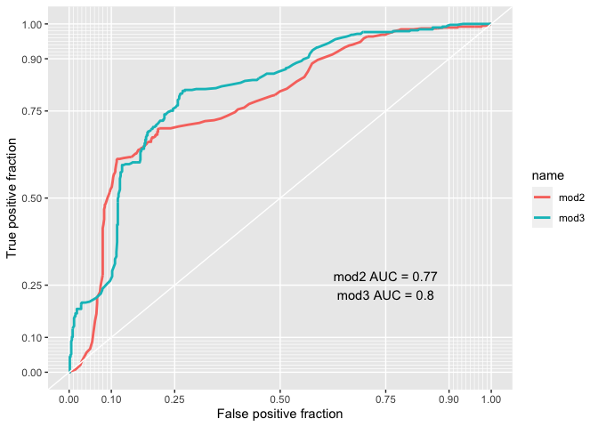

\#\#Mod3 has a bigger AUC (0.80) and it is therefore confirmed to be
better.

## 5. Conclusion {#conclusion}

What is
the final interpretation that we can give to mod3, after having taken
into consideration the heteroskedasticity issue?

    library(sandwich)
    tab_model(mod3, vcov.fun = "CL", vcov.args = ~ age, show.obs = F, show.r2 = F, show.se = T, show.stat = T)

<table style="border-collapse:collapse; border:none;">
<tr>
<th style="border-top: double; text-align:center; font-style:normal; font-weight:bold; padding:0.2cm;  text-align:left; ">
 
</th>
<th colspan="5" style="border-top: double; text-align:center; font-style:normal; font-weight:bold; padding:0.2cm; ">
Respondent is in the workforce
</th>
</tr>
<tr>
<td style=" text-align:center; border-bottom:1px solid; font-style:italic; font-weight:normal;  text-align:left; ">
Predictors
</td>
<td style=" text-align:center; border-bottom:1px solid; font-style:italic; font-weight:normal;  ">
Odds Ratios
</td>
<td style=" text-align:center; border-bottom:1px solid; font-style:italic; font-weight:normal;  ">
std. Error
</td>
<td style=" text-align:center; border-bottom:1px solid; font-style:italic; font-weight:normal;  ">
CI
</td>
<td style=" text-align:center; border-bottom:1px solid; font-style:italic; font-weight:normal;  ">
Statistic
</td>
<td style=" text-align:center; border-bottom:1px solid; font-style:italic; font-weight:normal;  ">
p
</td>
</tr>
<tr>
<td style=" padding:0.2cm; text-align:left; vertical-align:top; text-align:left; ">
(Intercept)
</td>
<td style=" padding:0.2cm; text-align:left; vertical-align:top; text-align:center;  ">
4.40
</td>
<td style=" padding:0.2cm; text-align:left; vertical-align:top; text-align:center;  ">
0.59
</td>
<td style=" padding:0.2cm; text-align:left; vertical-align:top; text-align:center;  ">
1.39 – 13.97
</td>
<td style=" padding:0.2cm; text-align:left; vertical-align:top; text-align:center;  ">
2.52
</td>
<td style=" padding:0.2cm; text-align:left; vertical-align:top; text-align:center;  ">
<strong>0.012</strong>
</td>
</tr>
<tr>
<td style=" padding:0.2cm; text-align:left; vertical-align:top; text-align:left; ">
Respondent education level
</td>
<td style=" padding:0.2cm; text-align:left; vertical-align:top; text-align:center;  ">
2.23
</td>
<td style=" padding:0.2cm; text-align:left; vertical-align:top; text-align:center;  ">
0.14
</td>
<td style=" padding:0.2cm; text-align:left; vertical-align:top; text-align:center;  ">
1.68 – 2.95
</td>
<td style=" padding:0.2cm; text-align:left; vertical-align:top; text-align:center;  ">
5.57
</td>
<td style=" padding:0.2cm; text-align:left; vertical-align:top; text-align:center;  ">
<strong>&lt;0.001
</td>
</tr>
<tr>
<td style=" padding:0.2cm; text-align:left; vertical-align:top; text-align:left; ">
Respondent is female: Female
</td>
<td style=" padding:0.2cm; text-align:left; vertical-align:top; text-align:center;  ">
0.12
</td>
<td style=" padding:0.2cm; text-align:left; vertical-align:top; text-align:center;  ">
0.17
</td>
<td style=" padding:0.2cm; text-align:left; vertical-align:top; text-align:center;  ">
0.08 – 0.16
</td>
<td style=" padding:0.2cm; text-align:left; vertical-align:top; text-align:center;  ">
-13.06
</td>
<td style=" padding:0.2cm; text-align:left; vertical-align:top; text-align:center;  ">
<strong>&lt;0.001
</td>
</tr>
<tr>
<td style=" padding:0.2cm; text-align:left; vertical-align:top; text-align:left; ">
fin15: no
</td>
<td style=" padding:0.2cm; text-align:left; vertical-align:top; text-align:center;  ">
0.38
</td>
<td style=" padding:0.2cm; text-align:left; vertical-align:top; text-align:center;  ">
0.36
</td>
<td style=" padding:0.2cm; text-align:left; vertical-align:top; text-align:center;  ">
0.19 – 0.77
</td>
<td style=" padding:0.2cm; text-align:left; vertical-align:top; text-align:center;  ">
-2.70
</td>
<td style=" padding:0.2cm; text-align:left; vertical-align:top; text-align:center;  ">
<strong>0.007</strong>
</td>
</tr>
<tr>
<td style=" padding:0.2cm; text-align:left; vertical-align:top; text-align:left; ">
fin16: no
</td>
<td style=" padding:0.2cm; text-align:left; vertical-align:top; text-align:center;  ">
0.48
</td>
<td style=" padding:0.2cm; text-align:left; vertical-align:top; text-align:center;  ">
0.26
</td>
<td style=" padding:0.2cm; text-align:left; vertical-align:top; text-align:center;  ">
0.28 – 0.79
</td>
<td style=" padding:0.2cm; text-align:left; vertical-align:top; text-align:center;  ">
-2.85
</td>
<td style=" padding:0.2cm; text-align:left; vertical-align:top; text-align:center;  ">
<strong>0.004</strong>
</td>
</tr>
<tr>
<td style=" padding:0.2cm; text-align:left; vertical-align:top; text-align:left; ">
fin48: no
</td>
<td style=" padding:0.2cm; text-align:left; vertical-align:top; text-align:center;  ">
0.54
</td>
<td style=" padding:0.2cm; text-align:left; vertical-align:top; text-align:center;  ">
0.57
</td>
<td style=" padding:0.2cm; text-align:left; vertical-align:top; text-align:center;  ">
0.18 – 1.66
</td>
<td style=" padding:0.2cm; text-align:left; vertical-align:top; text-align:center;  ">
-1.07
</td>
<td style=" padding:0.2cm; text-align:left; vertical-align:top; text-align:center;  ">
0.285
</td>
</tr>
<tr>
<td style=" padding:0.2cm; text-align:left; vertical-align:top; text-align:left; ">
Respondent age
</td>
<td style=" padding:0.2cm; text-align:left; vertical-align:top; text-align:center;  ">
0.98
</td>
<td style=" padding:0.2cm; text-align:left; vertical-align:top; text-align:center;  ">
0.01
</td>
<td style=" padding:0.2cm; text-align:left; vertical-align:top; text-align:center;  ">
0.97 – 1.00
</td>
<td style=" padding:0.2cm; text-align:left; vertical-align:top; text-align:center;  ">
-2.10
</td>
<td style=" padding:0.2cm; text-align:left; vertical-align:top; text-align:center;  ">
<strong>0.036</strong>
</td>
</tr>
</table>
\#\#Final interpretation: We can conclude that, overall, it seems that
our data doesn’t allow us to reject or accept the hypothesis that having
a national ID increases or decreases the odds for individuals to be part
of the workforce. In the context of the Jordanian labour market, the
fact that it seems that this variable is not statistically significant,
and therefore might be irrelevant in the “real world”, may be explained
by the presence of a well-developed informal sector in the Jordanian
labour market, where people can work with or without a national ID. This
could be taken as evidence of the fact that individuals without a
national ID should not be considered as “more advantaged” competitors to
find employment in the informal market, against the allegation that
undocumented forced migrants are “stealing” jobs from the Jordanians in
the informal market. However, further research and better data are
needed to explore in more detail this phenomenon. From our model 3 we
can conclude that level of education is key to increase the odds of
being in the workforce, and the checks for multicollinearity show that
education level is not correlated with having a national ID. Being a
woman is confirmed to be an obstacle in increasing one’s person odds of
being in the workforce, with a very small coefficient (0.12). Age also
appears negatively affecting the odds of being in the workforce, but by
a higher coefficient (0.98). The variables indicating the possibility of
the respondent to save to start a business (fin15) and for old age
(fin16), help shading light on some characteristics of the labour-force
of the Jordanian job market. From this analysis, we can deduce that
individuals who do not have the possibility to save, either to start a
business or for old age, have increased odds of being part of the
workforce. If one considers the act of saving as a manifestation of a
privileged economic status, it seems that the majority of the
respondents that are part of the workforce in Jordan do not belong to
this privileged group.

## References: {#references}

Barbelet, Hagen-Zanker and Mansour-Ille, 2018, “the
Jordan Compact: Lessons Learnt and implications for future refugee
compacts”, ODI working paper \#\#Fallah, Kraff, Wahba, 2019, “The impact
of refugees on employment and wages in Jordan”, Journal of Development
Economics, 139
