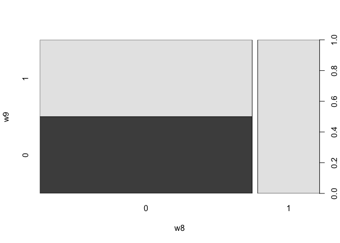
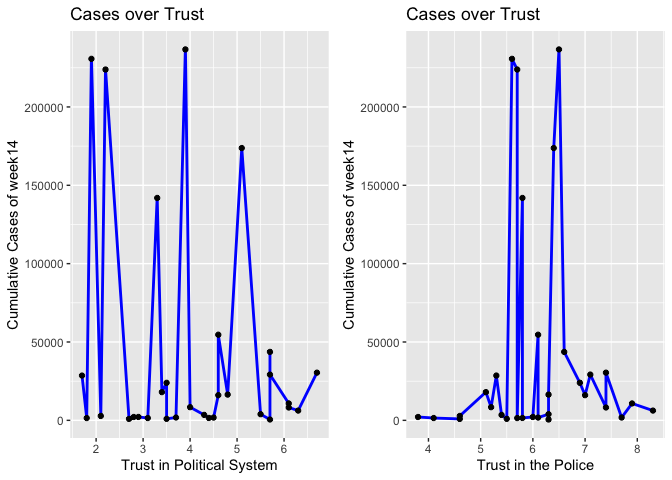
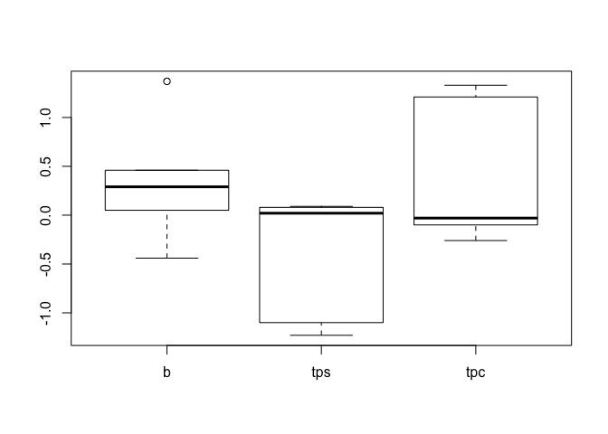
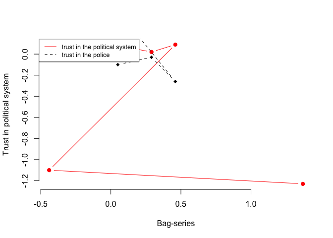

   
-   [1. Introduction](#introduction)
-   [2. Data](#data)
-   [3. Methods](#methods)
-   [4. Results](#results)
-   [5. Conclusion](#conclusion)
-   [References:](#references)

   
   
    cta1<- readRDS("cta1.RDS")

    install.packages("countreg", repos="http://R-Forge.R-project.org")

    ## installing the source package 'countreg'

    library(readxl)
    library(haven)
    library(sjPlot)
    library(table1)

    ## 
    ## Attaching package: 'table1'

    ## The following objects are masked from 'package:base':
    ## 
    ##     units, units<-

    library(dplyr)

    ## 
    ## Attaching package: 'dplyr'

    ## The following objects are masked from 'package:stats':
    ## 
    ##     filter, lag

    ## The following objects are masked from 'package:base':
    ## 
    ##     intersect, setdiff, setequal, union

    library(tidyr)
    library(tibble)
    library(tidyverse)

    ## ── Attaching packages ───────────────────────────────────────────────── tidyverse 1.3.0 ──

    ## ✓ ggplot2 3.3.0     ✓ stringr 1.4.0
    ## ✓ readr   1.3.1     ✓ forcats 0.5.0
    ## ✓ purrr   0.3.4

    ## ── Conflicts ──────────────────────────────────────────────────── tidyverse_conflicts() ──
    ## x dplyr::filter() masks stats::filter()
    ## x dplyr::lag()    masks stats::lag()

    library(MASS)

    ## 
    ## Attaching package: 'MASS'

    ## The following object is masked from 'package:dplyr':
    ## 
    ##     select

    library(ggplot2)
    library(ggpubr)

    ## Registered S3 methods overwritten by 'car':
    ##   method                          from
    ##   influence.merMod                lme4
    ##   cooks.distance.influence.merMod lme4
    ##   dfbeta.influence.merMod         lme4
    ##   dfbetas.influence.merMod        lme4

    library(sjlabelled)

    ## 
    ## Attaching package: 'sjlabelled'

    ## The following object is masked from 'package:forcats':
    ## 
    ##     as_factor

    ## The following object is masked from 'package:dplyr':
    ## 
    ##     as_label

    ## The following objects are masked from 'package:haven':
    ## 
    ##     as_factor, read_sas, read_spss, read_stata, write_sas, zap_labels

    library(gridExtra)

    ## 
    ## Attaching package: 'gridExtra'

    ## The following object is masked from 'package:dplyr':
    ## 
    ##     combine

    library(pscl)

    ## Classes and Methods for R developed in the
    ## Political Science Computational Laboratory
    ## Department of Political Science
    ## Stanford University
    ## Simon Jackman
    ## hurdle and zeroinfl functions by Achim Zeileis

    library(olsrr)

    ## 
    ## Attaching package: 'olsrr'

    ## The following object is masked from 'package:MASS':
    ## 
    ##     cement

    ## The following object is masked from 'package:datasets':
    ## 
    ##     rivers

    library(ggfortify)
    library(lmtest)

    ## Loading required package: zoo

    ## 
    ## Attaching package: 'zoo'

    ## The following objects are masked from 'package:base':
    ## 
    ##     as.Date, as.Date.numeric

    library(texreg)

    ## Version:  1.36.23
    ## Date:     2017-03-03
    ## Author:   Philip Leifeld (University of Glasgow)
    ## 
    ## Please cite the JSS article in your publications -- see citation("texreg").

    ## 
    ## Attaching package: 'texreg'

    ## The following object is masked from 'package:tidyr':
    ## 
    ##     extract

## 1. Introduction {#introduction}

The spread of COVID-2019 evolves to be a global event, great concern has
been drawn on flatening the curves, meanwhile, COVID-2019's transmission
shows large variation across countries, how can the same intervention
generate different outcoms becomes an academic topic. Under what
conditions will social distancing policy exert mitigating impact? By
selecting country as contextual unit and using macro-level variables,
this study aims to dim this topic.

What constrains the spread of COVID-2019? COVID-2019 distinguishes from
traditional infectious disease, its transmission is of invisibility,
which makes every person be a potential infection. With this background,
there are three approaches to be reviewed. Classical mathematical models
helps to view the whole picture, but fails to expose changes at
different stages in multiple epidemic waves(Kermack and McKendrick
1927). Traditional epidemiological study is limited to particular
disciplinary framework with seeking a causal link at individual level,
in fact, it faces general dilemma when the disease appears the character
of group transmission by social network and in community or household,
what's more, most literature are motivated by exploring the drivers of
infectious disease, while few mentions the comparative dynamics of
different factors in the process of disease diffusion. Social
epidemiological methods emphasize on the contextual explanation with
social variables, including socioeconomic status, social support and
social network(Link and Phelan 1995, Diez-Roux 1998, Braveman 2011, Read
et al.2008). However, this method lacks sufficient application in the
existing literature(Noppert et al.2017) and discusssion in countries
that have large variation and verying trends(Kaplan 2004). Based on the
previous research, this work is not for casual analysis, but for
observing the dynamics through comparing the sign of variables verying
from time point and interval.

As a communicable disease, COVID-2019 has been found transmitting
through close distance contacts.To decrease such a transmissable access
calls for social distancing policy, which mainly contains public space
closure, gathering ban, travel ban and border control. Government social
constraint policy is a group-based intervention. Among traditional
measures in tackling with COVID-2019 (Wilder-Smith et al.2020), social
distancing has a broad coverage, it deserves academic attention on
qualifying, relevant work has touched on this aspect with the finding
that the degree of social distancing has its optimality before
eliminating the epidemic(Caley et al.2008). Though new research claims
the positive impact of containment on the progression of COVID-2019 by
measuring daily hospitalization (Gregori etal 2020), it lakes of
generality at the national level.

Combining the situation and reseach, the study investigates under what
conditions will social distancing exert mitigating effect. To specify
the question, I use social gathering ban as a quantifying measurement.
Based on political knowledge, institution is the essece of contemporary
nation state, how will political system affect the making of policy
triggers the hypothesis that political institution affects the effect of
social gathering ban from the perspective of policy-making. Apart from
the internal institution, due to the sample located in European region,
whether making the Schgen agreement affects border control, it becomes a
regional existence of institution by the national decision, so I take it
as an external institution. As for the other hypothesis, previous study
argues that lack of trust in government may affect the implementation
and sustainment of national pandemic response(Baum et al. 2009),
therfore, the assumption is public trust affects the implementation of
social gathering ban.

Research question: What constrains the impact of gathering-ban in the
spread of COVID-2019?

Test hypothesis:

1.  Public trust affects the mitigation of social gathering ban.

2.  Political institution affects the mitigation of social gathering
    ban.

## 2. Data {#data}

This whole dataset is a collection of information on 31 European
countries based on available data. For the principle analysis, it is
cross-sectional at fiexed time point, for seeking the answer within a
longer period, I transform it into a panel dataset while retaining
cross-sectional.

Dependent Variables
-------------------

The main dependent variables are cumulative cases that are officially
recorded in a specific time period, one week or weeks, it is labelled as
wk10-wk20 and measured by numbers. The data is obtained from European
Centre for Disease Prevention and Control, in this study, I restrict the
time into the first twenty weeks of 2020, from January 1st to May 17th,
2020.

Apart from the first part of analysis, necessary adjustments has been
made according to the need of robustness check, I gather cases from the
fourteenth week to the twentieth week, labeled as "cas" in the subset
dataset. Additionally, to test the correlation between variables of
interest, the binary dependent variable is presented as "wek8" or
"wek9", it represents whether a country has the confirmed case(s) or not
within the eighth week or ninth week, the presence is denoted as 1 and
the absence is 0.

Independent variables
---------------------

There are five independent variables and two control variables.
Independent variables include the identity of schgen area (schg), the
type of political system (sys), trust in political system (tru\_ps),
trust in police (tru\_pc) and the specific policy of gathering ban
(bag0-bag4).

schg: the identity of schgen country, it is a binary variable measured
by two levels: 1 represents the present belonging of one country to
schgen area, o means that the country is not a schgen country so far. I
code this variable based on European Union official announcements.

sys: the political system implemented in the sample countries, the data
is taken from ADB Database of Political Institutions(2015), it has three
levels: o represents the Presidential, 1 refers to Assembly-elected
President, 2 stands for Parliamentary.

tru\_ps and tru\_pc: trust in the political system and trust in the
police. Public trust data are from Eurostat survey of 2013, the
measurement uses the rating from 0 to 10, o represents the least while
10 represents the most, so both trust in the political system and the
police are ordinal categorical variables.

bag0-bag4: specific gathering ban before or at a certain time point,
rather than general informing, the ban contains specific number of
gathing people with the enforcement by police. I code this ban series at
five time points: March 1st, March 8th, March 15th, March 22th and March
29th, they are respectively the end of week9, week10, week11, week12 and
week13. Coding as bag0, bag1, bag2, bag3 and bag4, the 1 represents the
presence of specific ban and the absence is signalized by 0. For
example, switzerland has announced the ban of 1000 people on Febaray
28th, then in bag0, switzerland is 1. To analyze the short impact of
gathering ban within the next week sequentially, the pairs are bag0 and
wk10, bag1 and wk11, bag2 and wk12, bag3 and wk13, bag4 and wk14.

Control Variables:
------------------

Partly following the practice of Professor Hollway in the course, in
this study, control variables are GDP per capita(gdp\_pc) and Population
density(pop\_dt).

gdp.pc: GDP per capita (constant LCU) of 2018 in the unit of constant
local currency. It is gross domestic product devided by midyear
population, I use it in models by dividing with 1000. The data acts as
the world development indicator in the World Bank database.

pop.dt: Population density, it refers to people per square kilometres of
land area in 2018, it is divided by 10 for transformation in models.
This variable is also from the World Bank database, its computation
equals midyear population divided by land area in square kilometers.

Data summary
------------

    cta <- readRDS("cta.RDS")
    cta1 <- readRDS("cta1.RDS")

    glimpse(cta)

    ## Rows: 31
    ## Columns: 26
    ## $ geo    <fct> Austria, Belgium, Bulgaria, Croatia, Cyprus, Czechia, Denmark,…
    ## $ iso    <fct> AUT, BEL, BGR, HRV, CYP, CZE, DNK, EST, FIN, FRA, DEU, GRC, HU…
    ## $ bag0   <dbl> 0, 0, 0, 0, 0, 0, 0, 0, 0, 1, 0, 0, 0, 0, 0, 0, 0, 0, 0, 0, 0,…
    ## $ bag1   <dbl> 0, 0, 0, 0, 0, 0, 1, 0, 0, 1, 0, 0, 0, 0, 0, 0, 0, 0, 0, 0, 0,…
    ## $ bag2   <dbl> 1, 1, 0, 0, 1, 1, 1, 0, 1, 1, 1, 0, 1, 0, 0, 0, 1, 0, 1, 0, 0,…
    ## $ bag3   <dbl> 1, 1, 0, 0, 1, 1, 1, 0, 1, 1, 1, 1, 1, 1, 1, 0, 1, 0, 1, 0, 0,…
    ## $ bag4   <dbl> 1, 1, 0, 0, 1, 1, 1, 1, 1, 1, 1, 1, 1, 1, 1, 0, 1, 0, 1, 0, 0,…
    ## $ wek8   <dbl> 0, 1, 0, 0, 0, 0, 0, 0, 1, 1, 1, 0, 0, 0, 0, 1, 0, 0, 0, 0, 0,…
    ## $ wek9   <dbl> 1, 1, 0, 1, 0, 0, 1, 1, 1, 1, 1, 1, 0, 1, 0, 1, 0, 1, 0, 0, 1,…
    ## $ wk10   <int> 74, 109, 0, 11, 0, 19, 23, 10, 19, 613, 684, 45, 4, 43, 18, 46…
    ## $ wk11   <int> 504, 559, 31, 31, 14, 150, 804, 79, 183, 3661, 3062, 190, 25, …
    ## $ wk12   <int> 2649, 2257, 127, 126, 67, 904, 1255, 283, 450, 12612, 18187, 4…
    ## $ wk13   <int> 7697, 7284, 293, 586, 162, 2279, 2046, 575, 1025, 32964, 48582…
    ## $ wk14   <int> 11525, 16770, 485, 1079, 396, 4190, 3757, 961, 1615, 64338, 85…
    ## $ wk15   <int> 13560, 26667, 635, 1495, 595, 5732, 5819, 1258, 2769, 90676, 1…
    ## $ wk16   <int> 14603, 36138, 846, 1814, 735, 6549, 7073, 1459, 3489, 109252, …
    ## $ wk17   <int> 15068, 44293, 1188, 2009, 804, 7273, 8210, 1605, 4395, 122577,…
    ## $ wk18   <int> 15458, 49032, 1588, 2085, 857, 7737, 9311, 1694, 5051, 130185,…
    ## $ wk19   <int> 15735, 52011, 1911, 2146, 891, 8077, 10218, 1725, 5738, 138421…
    ## $ wk20   <int> 16068, 54644, 2138, 2158, 910, 8406, 10791, 1766, 6228, 141919…
    ## $ schg   <dbl> 1, 1, 0, 0, 0, 1, 1, 1, 1, 1, 1, 1, 1, 1, 0, 1, 1, 1, 1, 1, 1,…
    ## $ sys    <dbl> 2, 2, 2, 2, 0, 2, 2, 1, 2, 2, 2, 2, 2, 2, 2, 2, 2, 0, 2, 2, 2,…
    ## $ tru_ps <dbl> 4.6, 4.6, 2.8, 2.9, 2.7, 4.0, 6.1, 4.5, 6.3, 3.3, 5.1, 2.1, 4.…
    ## $ tru_pc <dbl> 7.0, 6.1, 3.8, 6.0, 4.6, 5.2, 7.9, 6.1, 8.3, 5.8, 6.4, 4.6, 5.…
    ## $ gdp_pc <dbl> 41723.42, 38274.04, 12779.63, 91026.73, 23766.47, 475889.29, 3…
    ## $ pop_dt <dbl> 107.127967, 64.711100, 377.584412, 73.049375, 128.708333, 137.…

The dataset contains 31 obervations and 26 variables.

    cta0 <- remove_all_labels(cta)

    b0 <- as_factor(cta0$bag0)
    b1 <- as_factor(cta0$bag1)
    b2 <- as_factor(cta0$bag2)
    b3 <- as_factor(cta0$bag3)
    b4 <- as_factor(cta0$bag4)

    table1 <- table1::table1( ~ b0 + b1 + b2 + b3 + b4)

    table1

    ## [1] "<table class=\"Rtable1\">\n<thead>\n<tr>\n<th class='rowlabel firstrow lastrow'></th>\n<th class='firstrow lastrow'>Overall (N=31)</th>\n</tr>\n</thead>\n<tbody>\n<tr>\n<td class='rowlabel firstrow'>b0</td>\n<td class='firstrow'></td>\n</tr>\n<tr>\n<td class='rowlabel'>0</td>\n<td>29 (93.5%)</td>\n</tr>\n<tr>\n<td class='rowlabel lastrow'>1</td>\n<td class='lastrow'>2 (6.5%)</td>\n</tr>\n<tr>\n<td class='rowlabel firstrow'>b1</td>\n<td class='firstrow'></td>\n</tr>\n<tr>\n<td class='rowlabel'>0</td>\n<td>26 (83.9%)</td>\n</tr>\n<tr>\n<td class='rowlabel lastrow'>1</td>\n<td class='lastrow'>5 (16.1%)</td>\n</tr>\n<tr>\n<td class='rowlabel firstrow'>b2</td>\n<td class='firstrow'></td>\n</tr>\n<tr>\n<td class='rowlabel'>0</td>\n<td>13 (41.9%)</td>\n</tr>\n<tr>\n<td class='rowlabel lastrow'>1</td>\n<td class='lastrow'>18 (58.1%)</td>\n</tr>\n<tr>\n<td class='rowlabel firstrow'>b3</td>\n<td class='firstrow'></td>\n</tr>\n<tr>\n<td class='rowlabel'>0</td>\n<td>10 (32.3%)</td>\n</tr>\n<tr>\n<td class='rowlabel lastrow'>1</td>\n<td class='lastrow'>21 (67.7%)</td>\n</tr>\n<tr>\n<td class='rowlabel firstrow'>b4</td>\n<td class='firstrow'></td>\n</tr>\n<tr>\n<td class='rowlabel'>0</td>\n<td>9 (29.0%)</td>\n</tr>\n<tr>\n<td class='rowlabel lastrow'>1</td>\n<td class='lastrow'>22 (71.0%)</td>\n</tr>\n</tbody>\n</table>\n"

As is displayed in table1, only two countries announce ban on gatherings
by week10, five countries have gathering-ban by week11, the number of
countries of taking such measure grows to be eighteen and twenty-one by
week12 and week13 respectively, finnaly, by week14, there are twenty-two
governments in the sample that ban on gatherings. To see the
distribution of presence and absence of ban on gatherings over time,
next is the plot.

    d.bag <- data.frame(x = c(0, 1, 2, 3, 4), 
                        y0 = c(29, 26, 13, 10, 9), 
                        y1 = c(2, 5, 18, 21, 22))
    ggplot(d.bag, aes(x)) +
      geom_line(aes(y = y0, colour = "y0")) +
      geom_line(aes(y = y1, colour = "y1"))

In the plot, countries without social banning decrease while countries
with specific bans increase, two lines consist of lying hourglass shape.

    table2 <- table1::table1(~ wk10 + wk11 + wk12 + wk13 + wk14 + wk15 + wk16 + wk17 + wk18 + wk19 + wk20, cta)

    table2

    ## [1] "<table class=\"Rtable1\">\n<thead>\n<tr>\n<th class='rowlabel firstrow lastrow'></th>\n<th class='firstrow lastrow'>Overall (N=31)</th>\n</tr>\n</thead>\n<tbody>\n<tr>\n<td class='rowlabel firstrow'>cumulative cases by week 10</td>\n<td class='firstrow'></td>\n</tr>\n<tr>\n<td class='rowlabel'>Mean (SD)</td>\n<td>259 (838)</td>\n</tr>\n<tr>\n<td class='rowlabel lastrow'>Median [Min, Max]</td>\n<td class='lastrow'>19.0 [0, 4640]</td>\n</tr>\n<tr>\n<td class='rowlabel firstrow'>cumulative cases by week 11</td>\n<td class='firstrow'></td>\n</tr>\n<tr>\n<td class='rowlabel'>Mean (SD)</td>\n<td>1270 (3410)</td>\n</tr>\n<tr>\n<td class='rowlabel lastrow'>Median [Min, Max]</td>\n<td class='lastrow'>141 [6.00, 17700]</td>\n</tr>\n<tr>\n<td class='rowlabel firstrow'>cumulative cases by week 12</td>\n<td class='firstrow'></td>\n</tr>\n<tr>\n<td class='rowlabel'>Mean (SD)</td>\n<td>4440 (10300)</td>\n</tr>\n<tr>\n<td class='rowlabel lastrow'>Median [Min, Max]</td>\n<td class='lastrow'>495 [67.0, 47000]</td>\n</tr>\n<tr>\n<td class='rowlabel firstrow'>cumulative cases by week 13</td>\n<td class='firstrow'></td>\n</tr>\n<tr>\n<td class='rowlabel'>Mean (SD)</td>\n<td>10700 (22400)</td>\n</tr>\n<tr>\n<td class='rowlabel lastrow'>Median [Min, Max]</td>\n<td class='lastrow'>1610 [149, 86500]</td>\n</tr>\n<tr>\n<td class='rowlabel firstrow'>cumulative cases by week 14</td>\n<td class='firstrow'></td>\n</tr>\n<tr>\n<td class='rowlabel'>Mean (SD)</td>\n<td>18000 (34800)</td>\n</tr>\n<tr>\n<td class='rowlabel lastrow'>Median [Min, Max]</td>\n<td class='lastrow'>3380 [206, 133000]</td>\n</tr>\n<tr>\n<td class='rowlabel firstrow'>cumulative cases by week 15</td>\n<td class='firstrow'></td>\n</tr>\n<tr>\n<td class='rowlabel'>Mean (SD)</td>\n<td>24600 (45000)</td>\n</tr>\n<tr>\n<td class='rowlabel lastrow'>Median [Min, Max]</td>\n<td class='lastrow'>5730 [360, 168000]</td>\n</tr>\n<tr>\n<td class='rowlabel firstrow'>cumulative cases by week 16</td>\n<td class='firstrow'></td>\n</tr>\n<tr>\n<td class='rowlabel'>Mean (SD)</td>\n<td>30200 (53500)</td>\n</tr>\n<tr>\n<td class='rowlabel lastrow'>Median [Min, Max]</td>\n<td class='lastrow'>6790 [422, 194000]</td>\n</tr>\n<tr>\n<td class='rowlabel firstrow'>cumulative cases by week 17</td>\n<td class='firstrow'></td>\n</tr>\n<tr>\n<td class='rowlabel'>Mean (SD)</td>\n<td>34600 (60100)</td>\n</tr>\n<tr>\n<td class='rowlabel lastrow'>Median [Min, Max]</td>\n<td class='lastrow'>7410 [447, 208000]</td>\n</tr>\n<tr>\n<td class='rowlabel firstrow'>cumulative cases by week 18</td>\n<td class='firstrow'></td>\n</tr>\n<tr>\n<td class='rowlabel'>Mean (SD)</td>\n<td>37900 (65300)</td>\n</tr>\n<tr>\n<td class='rowlabel lastrow'>Median [Min, Max]</td>\n<td class='lastrow'>7760 [467, 218000]</td>\n</tr>\n<tr>\n<td class='rowlabel firstrow'>cumulative cases by week 19</td>\n<td class='firstrow'></td>\n</tr>\n<tr>\n<td class='rowlabel'>Mean (SD)</td>\n<td>40700 (69900)</td>\n</tr>\n<tr>\n<td class='rowlabel lastrow'>Median [Min, Max]</td>\n<td class='lastrow'>8080 [489, 224000]</td>\n</tr>\n<tr>\n<td class='rowlabel firstrow'>cumulative cases by week 20</td>\n<td class='firstrow'></td>\n</tr>\n<tr>\n<td class='rowlabel'>Mean (SD)</td>\n<td>42800 (73500)</td>\n</tr>\n<tr>\n<td class='rowlabel lastrow'>Median [Min, Max]</td>\n<td class='lastrow'>8410 [532, 237000]</td>\n</tr>\n</tbody>\n</table>\n"

    wk.mn <- c(mean(cta$wk10), mean(cta$wk11), mean(cta$wk12), mean(cta$wk13), mean(cta$wk14), mean(cta$wk15), mean(cta$wk16), mean(cta$wk17), mean(cta$wk18), mean(cta$wk19), mean(cta$wk20))
    t <- c(0,1,2,3,4,5,6,7,8,9,10)

    wk.mnt <- data.frame(wk.mn, t)

    pmt <- ggplot(data=na.omit(wk.mnt), aes(x=t, y=wk.mn)) + geom_line(color="black") + xlab("Time") + ylab("Mean of Cumulative Cases") +
      ggtitle("Mean of Cumulative Cases over Time")

    pmt

    wk.md <- c(median(cta$wk10), median(cta$wk11), median(cta$wk12), median(cta$wk13), median(cta$wk14), median(cta$wk15), median(cta$wk16), median(cta$wk17), median(cta$wk18), median(cta$wk19), median(cta$wk20))
    t <- c(0,1,2,3,4,5,6,7,8,9,10)

    wk.mdt <- as.data.frame(wk.md, t)

    ## Warning in as.data.frame.integer(wk.md, t): 'row.names' is not a character
    ## vector of length 11 -- omitting it. Will be an error!

    pmd <- ggplot(data=na.omit(wk.mdt), aes(x=t, y=wk.md)) + geom_line(color="red") + xlab("Time") +ylab("Median of Cumulative Cases") +
      ggtitle("Median of Cumulative Cases over Time")

    pmd 

    grid.arrange(pmt, pmd, ncol=1)

The mean and median of cumulative cases by weeks distribute as an
exponential shape.

    cta01 <- cta0 %>%
      pivot_longer(wk10:wk20, names_to = "wks", values_to = "cas") %>%
      group_by(wks) %>%
      mutate(iso = as_factor(cta$iso))

    ggplot(data = cta01, aes(cas,iso)) +
      geom_line(color = "blue", size = 1) +
      geom_point(color = "black") +
      labs(title = "Cumulative Cases of Countries over Weeks",
           y = "Countries", x = "Cases")

From the plot, we find five influential observations, they are Germany,
Spain, France, United Kingdom and Italy.

    table3 <- table1::table1( ~ tru_ps + tru_pc + gdp_pc + pop_dt, cta)

    table3

    ## [1] "<table class=\"Rtable1\">\n<thead>\n<tr>\n<th class='rowlabel firstrow lastrow'></th>\n<th class='firstrow lastrow'>Overall (N=31)</th>\n</tr>\n</thead>\n<tbody>\n<tr>\n<td class='rowlabel firstrow'>trust in the political system</td>\n<td class='firstrow'></td>\n</tr>\n<tr>\n<td class='rowlabel'>Mean (SD)</td>\n<td>4.08 (1.45)</td>\n</tr>\n<tr>\n<td class='rowlabel lastrow'>Median [Min, Max]</td>\n<td class='lastrow'>4.00 [1.70, 6.70]</td>\n</tr>\n<tr>\n<td class='rowlabel firstrow'>trust in the police</td>\n<td class='firstrow'></td>\n</tr>\n<tr>\n<td class='rowlabel'>Mean (SD)</td>\n<td>6.08 (1.08)</td>\n</tr>\n<tr>\n<td class='rowlabel lastrow'>Median [Min, Max]</td>\n<td class='lastrow'>6.10 [3.80, 8.30]</td>\n</tr>\n<tr>\n<td class='rowlabel firstrow'>GDP per capita</td>\n<td class='firstrow'></td>\n</tr>\n<tr>\n<td class='rowlabel'>Mean (SD)</td>\n<td>465000 (1510000)</td>\n</tr>\n<tr>\n<td class='rowlabel lastrow'>Median [Min, Max]</td>\n<td class='lastrow'>38300 [12800, 7620000]</td>\n</tr>\n<tr>\n<td class='rowlabel firstrow'>population density</td>\n<td class='firstrow'></td>\n</tr>\n<tr>\n<td class='rowlabel'>Mean (SD)</td>\n<td>175 (272)</td>\n</tr>\n<tr>\n<td class='rowlabel lastrow'>Median [Min, Max]</td>\n<td class='lastrow'>108 [3.52, 1510]</td>\n</tr>\n</tbody>\n</table>\n"

The table presents that the mean of trust in the political system is
rating as 4.08, and for that of trust in the police, the value is 6.08.
Given their appoximate mean and median, distributions are predicted to
be normal.

    plot(cta$gdp_pc, type="l", main = 'Distribution of GDP per capita')

    plot(cta$pop_dt, type = 'b', main = 'Distribution of Population')

Through plotting the two control variables, we know there exists
substantive variation and "outliers".

    w8 <- as_factor(cta0$wek8)
    w9 <- as_factor(cta0$wek9)
    w89 <- data.frame(w8,w9)
    plot(w89)

We see the number of infected countries verying from week8 and week9.

    plot(cta$schg, type = 'p', main = 'Distribution of the Identity of Schgen Country')

There are 25 Schgen countries while the rest are not belonging to the
Schgen Area.

    plot(cta$sys, type = 'l', main = 'Distribution of Political System by Type')

As for political system, 26 countries adopt parliamentary system, 3
countries have presidential institution, 2 countries elect president by
assembly.

    cta0 %>%
      mutate(tru_ps = cta0$tru_ps,
             tru_pc = cta0$tru_pc,
             wk20 = cta0$wk20)

    ##    geo iso bag0 bag1 bag2 bag3 bag4 wek8 wek9 wk10  wk11  wk12  wk13   wk14
    ## 1    1   1    0    0    1    1    1    0    1   74   504  2649  7697  11525
    ## 2    2   2    0    0    1    1    1    1    1  109   559  2257  7284  16770
    ## 3    3   3    0    0    0    0    0    0    0    0    31   127   293    485
    ## 4    4  15    0    0    0    0    0    0    1   11    31   126   586   1079
    ## 5    5   5    0    0    1    1    1    0    0    0    14    67   162    396
    ## 6    6   6    0    0    1    1    1    0    0   19   150   904  2279   4190
    ## 7    7   8    0    1    1    1    1    0    1   23   804  1255  2046   3757
    ## 8    8  10    0    0    0    0    1    0    1   10    79   283   575    961
    ## 9    9  11    0    0    1    1    1    1    1   19   183   450  1025   1615
    ## 10  10  12    1    1    1    1    1    1    1  613  3661 12612 32964  64338
    ## 11  11   7    0    0    1    1    1    1    1  684  3062 18187 48582  85778
    ## 12  12  14    0    0    0    1    1    0    1   45   190   495   966   1613
    ## 13  13  16    0    0    1    1    1    0    0    4    25   103   343    678
    ## 14  14  18    0    0    0    1    1    0    1   43   117   409   890   1364
    ## 15  15  17    0    0    0    1    1    0    0   18    91   683  2121   4273
    ## 16  16  19    0    0    0    0    0    1    1 4636 17660 47021 86498 119827
    ## 17  17  22    0    0    1    1    1    0    0    1    19   111   280    493
    ## 18  18  20    0    0    0    0    0    0    1    1     6    69   358    771
    ## 19  19  21    0    0    1    1    1    0    0    3    38   484  1605   2612
    ## 20  20  23    0    0    0    0    0    0    0    1    18    73   149    206
    ## 21  21  24    0    0    0    0    0    0    1  128   804  2994  8603  15723
    ## 22  22  25    0    0    0    0    0    0    1  113   621  1742  3581   5208
    ## 23  23  26    0    0    1    1    1    0    0    5    68   425  1389   3383
    ## 24  24  27    0    0    1    1    1    0    0   13   112  1020  4268   9886
    ## 25  25  28    0    1    1    1    1    0    1    7    89   308  1292   3183
    ## 26  26  29    0    0    0    0    0    0    0    1    30   137   295    450
    ## 27  27  30    0    1    1    1    1    0    0    9   141   341   632    934
    ## 28  28   9    0    0    1    1    1    1    1  764  7641 31750 83885 133198
    ## 29  29  31    0    0    1    1    1    0    1  137   775  1623  3046   6078
    ## 30  30   4    1    1    1    1    1    0    1  372  1284  5003 12267  19227
    ## 31  31  13    0    0    0    0    0    1    1  163   707  3983 14543  38168
    ##      wk15   wk16   wk17   wk18   wk19   wk20 schg sys tru_ps tru_pc     gdp_pc
    ## 1   13560  14603  15068  15458  15735  16068    1   2    4.6    7.0   41723.42
    ## 2   26667  36138  44293  49032  52011  54644    1   2    4.6    6.1   38274.04
    ## 3     635    846   1188   1588   1911   2138    0   2    2.8    3.8   12779.63
    ## 4    1495   1814   2009   2085   2146   2158    0   2    2.9    6.0   91026.73
    ## 5     595    735    804    857    891    910    0   0    2.7    4.6   23766.47
    ## 6    5732   6549   7273   7737   8077   8406    1   2    4.0    5.2  475889.29
    ## 7    5819   7073   8210   9311  10218  10791    1   2    6.1    7.9  379134.16
    ## 8    1258   1459   1605   1694   1725   1766    1   1    4.5    6.1   17874.12
    ## 9    2769   3489   4395   5051   5738   6228    1   2    6.3    8.3   41235.82
    ## 10  90676 109252 122577 130185 138421 141919    1   2    3.3    5.8   34518.52
    ## 11 117658 137439 152438 161703 168551 173772    1   2    5.1    6.4   38869.18
    ## 12   2011   2207   2490   2591   2691   2810    1   2    2.1    4.6   17057.51
    ## 13   1310   1834   2443   2942   3213   3473    1   2    4.3    5.4 3987133.96
    ## 14   1675   1754   1789   1798   1801   1802    1   2    3.7    7.7 7620144.80
    ## 15   8089  13980  18184  20833  22541  23956    0   2    3.5    6.9   65492.48
    ## 16 147577 172434 192994 207428 217185 223885    1   2    2.2    5.7   28441.99
    ## 17    612    682    784    870    928    970    1   2    3.5    5.5   14006.48
    ## 18    999   1239   1410   1399   1436   1523    1   0    4.4    5.8   14761.81
    ## 19   3223   3480   3695   3802   3871   3923    1   2    5.5    6.3   94008.71
    ## 20    360    422    447    467    489    532    1   2    5.7    6.3   21519.72
    ## 21  23097  30449  36535  39791  42093  43681    1   2    5.7    6.6   43205.75
    ## 22   6244   6791   7408   7759   8034   8197    1   2    6.1    7.4  613536.25
    ## 23   5955   8379  10892  13105  15366  18016    1   0    3.4    5.1   50237.91
    ## 24  15472  19022  23271  25351  27268  28583    1   2    1.7    5.3   18903.85
    ## 25   5467   8067  10417  12567  14811  16437    0   1    4.8    6.3   22890.10
    ## 26    715   1049   1360   1403   1455   1480    1   2    3.1    4.1   16030.41
    ## 27   1160   1304   1373   1434   1450   1465    1   2    1.8    5.7   21086.79
    ## 28 168022 193965 208269 217804 223961 230698    1   2    1.9    5.6   24985.14
    ## 29   9685  13216  17567  21520  25265  29207    1   2    5.7    7.1  447637.37
    ## 30  24228  26997  28595  29622  30124  30431    1   2    6.7    7.4   81771.52
    ## 31  70272 108692 143464 177454 211364 236711    0   2    3.9    6.5   30367.18
    ##         pop_dt
    ## 1   107.127967
    ## 2    64.711100
    ## 3   377.584412
    ## 4    73.049375
    ## 5   128.708333
    ## 6   137.657705
    ## 7   137.976566
    ## 8    30.411249
    ## 9    18.148547
    ## 10  122.319883
    ## 11  237.307597
    ## 12   83.256214
    ## 13  107.981487
    ## 14    3.518414
    ## 15   70.653346
    ## 16  205.418372
    ## 17   30.993471
    ## 18   44.723076
    ## 19  250.185185
    ## 20 1514.468750
    ## 21  511.475928
    ## 22   14.548292
    ## 23  124.023482
    ## 24  112.261941
    ## 25   84.605985
    ## 26  102.963661
    ## 27  113.285586
    ## 28   93.674767
    ## 29   24.981498
    ## 30  215.437463
    ## 31  274.708982

    p1 <- ggplot(data = cta0, aes(tru_ps,wk20)) +
      geom_line(color = "blue", size = 1) +
      geom_point(color = "black") +
      labs(title = "Cases over Trust", y = "Cumulative Cases of week14", x = "Trust in Political System")
    p2 <- ggplot(data = cta0, aes(tru_pc,wk20)) +
      geom_line(color = "blue", size = 1) +
      geom_point(color = "black") +
      labs(title = "Cases over Trust",
           y = "Cumulative Cases of week14", x = "Trust in the Police")

    grid.arrange(p1, p2, ncol=2)

Apparently, the relationship between cumulative cases and public trust
is of nonlinearity.

    cta %>%
      mutate(schg = as_factor(cta$schg),
             sys = as_factor(cta$sys),
             wk20 = cta$wk20)

    ##               geo iso bag0 bag1 bag2 bag3 bag4 wek8 wek9 wk10  wk11  wk12  wk13
    ## 1         Austria AUT    0    0    1    1    1    0    1   74   504  2649  7697
    ## 2         Belgium BEL    0    0    1    1    1    1    1  109   559  2257  7284
    ## 3        Bulgaria BGR    0    0    0    0    0    0    0    0    31   127   293
    ## 4         Croatia HRV    0    0    0    0    0    0    1   11    31   126   586
    ## 5          Cyprus CYP    0    0    1    1    1    0    0    0    14    67   162
    ## 6         Czechia CZE    0    0    1    1    1    0    0   19   150   904  2279
    ## 7         Denmark DNK    0    1    1    1    1    0    1   23   804  1255  2046
    ## 8         Estonia EST    0    0    0    0    1    0    1   10    79   283   575
    ## 9         Finland FIN    0    0    1    1    1    1    1   19   183   450  1025
    ## 10         France FRA    1    1    1    1    1    1    1  613  3661 12612 32964
    ## 11        Germany DEU    0    0    1    1    1    1    1  684  3062 18187 48582
    ## 12         Greece GRC    0    0    0    1    1    0    1   45   190   495   966
    ## 13        Hungary HUN    0    0    1    1    1    0    0    4    25   103   343
    ## 14        Iceland ISL    0    0    0    1    1    0    1   43   117   409   890
    ## 15        Ireland IRL    0    0    0    1    1    0    0   18    91   683  2121
    ## 16          Italy ITA    0    0    0    0    0    1    1 4636 17660 47021 86498
    ## 17         Latvia LVA    0    0    1    1    1    0    0    1    19   111   280
    ## 18      Lithuania LTU    0    0    0    0    0    0    1    1     6    69   358
    ## 19     Luxembourg LUX    0    0    1    1    1    0    0    3    38   484  1605
    ## 20          Malta MLT    0    0    0    0    0    0    0    1    18    73   149
    ## 21    Netherlands NLD    0    0    0    0    0    0    1  128   804  2994  8603
    ## 22         Norway NOR    0    0    0    0    0    0    1  113   621  1742  3581
    ## 23         Poland POL    0    0    1    1    1    0    0    5    68   425  1389
    ## 24       Portugal PRT    0    0    1    1    1    0    0   13   112  1020  4268
    ## 25        Romania ROU    0    1    1    1    1    0    1    7    89   308  1292
    ## 26       Slovakia SVK    0    0    0    0    0    0    0    1    30   137   295
    ## 27       Slovenia SVN    0    1    1    1    1    0    0    9   141   341   632
    ## 28          Spain ESP    0    0    1    1    1    1    1  764  7641 31750 83885
    ## 29         Sweden SWE    0    0    1    1    1    0    1  137   775  1623  3046
    ## 30    Switzerland CHE    1    1    1    1    1    0    1  372  1284  5003 12267
    ## 31 United Kingdom GBR    0    0    0    0    0    1    1  163   707  3983 14543
    ##      wk14   wk15   wk16   wk17   wk18   wk19   wk20 schg sys tru_ps tru_pc
    ## 1   11525  13560  14603  15068  15458  15735  16068    1   2    4.6    7.0
    ## 2   16770  26667  36138  44293  49032  52011  54644    1   2    4.6    6.1
    ## 3     485    635    846   1188   1588   1911   2138    0   2    2.8    3.8
    ## 4    1079   1495   1814   2009   2085   2146   2158    0   2    2.9    6.0
    ## 5     396    595    735    804    857    891    910    0   0    2.7    4.6
    ## 6    4190   5732   6549   7273   7737   8077   8406    1   2    4.0    5.2
    ## 7    3757   5819   7073   8210   9311  10218  10791    1   2    6.1    7.9
    ## 8     961   1258   1459   1605   1694   1725   1766    1   1    4.5    6.1
    ## 9    1615   2769   3489   4395   5051   5738   6228    1   2    6.3    8.3
    ## 10  64338  90676 109252 122577 130185 138421 141919    1   2    3.3    5.8
    ## 11  85778 117658 137439 152438 161703 168551 173772    1   2    5.1    6.4
    ## 12   1613   2011   2207   2490   2591   2691   2810    1   2    2.1    4.6
    ## 13    678   1310   1834   2443   2942   3213   3473    1   2    4.3    5.4
    ## 14   1364   1675   1754   1789   1798   1801   1802    1   2    3.7    7.7
    ## 15   4273   8089  13980  18184  20833  22541  23956    0   2    3.5    6.9
    ## 16 119827 147577 172434 192994 207428 217185 223885    1   2    2.2    5.7
    ## 17    493    612    682    784    870    928    970    1   2    3.5    5.5
    ## 18    771    999   1239   1410   1399   1436   1523    1   0    4.4    5.8
    ## 19   2612   3223   3480   3695   3802   3871   3923    1   2    5.5    6.3
    ## 20    206    360    422    447    467    489    532    1   2    5.7    6.3
    ## 21  15723  23097  30449  36535  39791  42093  43681    1   2    5.7    6.6
    ## 22   5208   6244   6791   7408   7759   8034   8197    1   2    6.1    7.4
    ## 23   3383   5955   8379  10892  13105  15366  18016    1   0    3.4    5.1
    ## 24   9886  15472  19022  23271  25351  27268  28583    1   2    1.7    5.3
    ## 25   3183   5467   8067  10417  12567  14811  16437    0   1    4.8    6.3
    ## 26    450    715   1049   1360   1403   1455   1480    1   2    3.1    4.1
    ## 27    934   1160   1304   1373   1434   1450   1465    1   2    1.8    5.7
    ## 28 133198 168022 193965 208269 217804 223961 230698    1   2    1.9    5.6
    ## 29   6078   9685  13216  17567  21520  25265  29207    1   2    5.7    7.1
    ## 30  19227  24228  26997  28595  29622  30124  30431    1   2    6.7    7.4
    ## 31  38168  70272 108692 143464 177454 211364 236711    0   2    3.9    6.5
    ##        gdp_pc      pop_dt
    ## 1    41723.42  107.127967
    ## 2    38274.04   64.711100
    ## 3    12779.63  377.584412
    ## 4    91026.73   73.049375
    ## 5    23766.47  128.708333
    ## 6   475889.29  137.657705
    ## 7   379134.16  137.976566
    ## 8    17874.12   30.411249
    ## 9    41235.82   18.148547
    ## 10   34518.52  122.319883
    ## 11   38869.18  237.307597
    ## 12   17057.51   83.256214
    ## 13 3987133.96  107.981487
    ## 14 7620144.80    3.518414
    ## 15   65492.48   70.653346
    ## 16   28441.99  205.418372
    ## 17   14006.48   30.993471
    ## 18   14761.81   44.723076
    ## 19   94008.71  250.185185
    ## 20   21519.72 1514.468750
    ## 21   43205.75  511.475928
    ## 22  613536.25   14.548292
    ## 23   50237.91  124.023482
    ## 24   18903.85  112.261941
    ## 25   22890.10   84.605985
    ## 26   16030.41  102.963661
    ## 27   21086.79  113.285586
    ## 28   24985.14   93.674767
    ## 29  447637.37   24.981498
    ## 30   81771.52  215.437463
    ## 31   30367.18  274.708982

    p3 <- ggplot(data = cta, aes(schg,wk20)) + 
      theme_bw() + geom_bar(stat = "identity") +
      labs(title = "Cases over Institution", y = "Cumulative Cases of week14", x = "Schgen Identity")
     
    p4 <- ggplot(data = cta, aes(schg,wk20)) +
      theme_bw() + geom_bar(stat = "identity") +
      labs(title = "Cases over Institution",
           y = "Cumulative Cases of week14", x = "Political System")

    grid.arrange(p3, p4, ncol=2)

    ## Don't know how to automatically pick scale for object of type haven_labelled. Defaulting to continuous.

    ## Don't know how to automatically pick scale for object of type labelled/integer. Defaulting to continuous.

    ## Don't know how to automatically pick scale for object of type haven_labelled. Defaulting to continuous.

    ## Don't know how to automatically pick scale for object of type labelled/integer. Defaulting to continuous.

Both two levels of explanatory variables distribute in an unbalanced way
identically.

## 3. Methods {#methods}

The main analysis applies poisson model. Two reasons for making such a
choice, first, cases can be seen as independent events and non-negative
integers, huge variance in some variabes, as depicted in summary
statistics, indicates of non-linearity. Furthermore, the dataset embeds
a cross-sectional structure with three categorical explanatory
variables. Both OLS and dynamic models are out of consideration in the
main analysis, but will be used for checks; second, less zero values
makes selecting negative binomial generalized linear model(NB model)
become unnecessary despite its more specification, additionally, for the
sake of research interest, comparing parameters over time is prefered
than getting a precise parameter. However, according to the nature of
particular dependent variables, OLS, binomial logit model,
zero-truncated poisson model, NB model and Random effects model would be
used for checks.

Additionally, in the estimation of poisson model, I add offsets in some
models to specify cases that arise after the ban on gatherings.For
example, to estimate the correlation between week13 and ban3, I offset
the cumulative cases within week12 in log, zeros lie in week10, I
replace the offset with the weights, but the results are not satisfied
by comparison.

## 4. Results {#results}

Hypothesis one: public trust and banning policy
-----------------------------------------------

    cta %>%
      mutate(bag0 <- as_factor(cta$bag0),
             bag1 <- as_factor(cta$bag1),
             bag2 <- as_factor(cta$bag2),
             bag3 <- as_factor(cta$bag3),
             bag4 <- as_factor(cta$bag4),
             gdp_pc <- cta0$gdp_pc/1000,
             pop_dt <- cta0$pop_dt/10)

    ##               geo iso bag0 bag1 bag2 bag3 bag4 wek8 wek9 wk10  wk11  wk12  wk13
    ## 1         Austria AUT    0    0    1    1    1    0    1   74   504  2649  7697
    ## 2         Belgium BEL    0    0    1    1    1    1    1  109   559  2257  7284
    ## 3        Bulgaria BGR    0    0    0    0    0    0    0    0    31   127   293
    ## 4         Croatia HRV    0    0    0    0    0    0    1   11    31   126   586
    ## 5          Cyprus CYP    0    0    1    1    1    0    0    0    14    67   162
    ## 6         Czechia CZE    0    0    1    1    1    0    0   19   150   904  2279
    ## 7         Denmark DNK    0    1    1    1    1    0    1   23   804  1255  2046
    ## 8         Estonia EST    0    0    0    0    1    0    1   10    79   283   575
    ## 9         Finland FIN    0    0    1    1    1    1    1   19   183   450  1025
    ## 10         France FRA    1    1    1    1    1    1    1  613  3661 12612 32964
    ## 11        Germany DEU    0    0    1    1    1    1    1  684  3062 18187 48582
    ## 12         Greece GRC    0    0    0    1    1    0    1   45   190   495   966
    ## 13        Hungary HUN    0    0    1    1    1    0    0    4    25   103   343
    ## 14        Iceland ISL    0    0    0    1    1    0    1   43   117   409   890
    ## 15        Ireland IRL    0    0    0    1    1    0    0   18    91   683  2121
    ## 16          Italy ITA    0    0    0    0    0    1    1 4636 17660 47021 86498
    ## 17         Latvia LVA    0    0    1    1    1    0    0    1    19   111   280
    ## 18      Lithuania LTU    0    0    0    0    0    0    1    1     6    69   358
    ## 19     Luxembourg LUX    0    0    1    1    1    0    0    3    38   484  1605
    ## 20          Malta MLT    0    0    0    0    0    0    0    1    18    73   149
    ## 21    Netherlands NLD    0    0    0    0    0    0    1  128   804  2994  8603
    ## 22         Norway NOR    0    0    0    0    0    0    1  113   621  1742  3581
    ## 23         Poland POL    0    0    1    1    1    0    0    5    68   425  1389
    ## 24       Portugal PRT    0    0    1    1    1    0    0   13   112  1020  4268
    ## 25        Romania ROU    0    1    1    1    1    0    1    7    89   308  1292
    ## 26       Slovakia SVK    0    0    0    0    0    0    0    1    30   137   295
    ## 27       Slovenia SVN    0    1    1    1    1    0    0    9   141   341   632
    ## 28          Spain ESP    0    0    1    1    1    1    1  764  7641 31750 83885
    ## 29         Sweden SWE    0    0    1    1    1    0    1  137   775  1623  3046
    ## 30    Switzerland CHE    1    1    1    1    1    0    1  372  1284  5003 12267
    ## 31 United Kingdom GBR    0    0    0    0    0    1    1  163   707  3983 14543
    ##      wk14   wk15   wk16   wk17   wk18   wk19   wk20 schg sys tru_ps tru_pc
    ## 1   11525  13560  14603  15068  15458  15735  16068    1   2    4.6    7.0
    ## 2   16770  26667  36138  44293  49032  52011  54644    1   2    4.6    6.1
    ## 3     485    635    846   1188   1588   1911   2138    0   2    2.8    3.8
    ## 4    1079   1495   1814   2009   2085   2146   2158    0   2    2.9    6.0
    ## 5     396    595    735    804    857    891    910    0   0    2.7    4.6
    ## 6    4190   5732   6549   7273   7737   8077   8406    1   2    4.0    5.2
    ## 7    3757   5819   7073   8210   9311  10218  10791    1   2    6.1    7.9
    ## 8     961   1258   1459   1605   1694   1725   1766    1   1    4.5    6.1
    ## 9    1615   2769   3489   4395   5051   5738   6228    1   2    6.3    8.3
    ## 10  64338  90676 109252 122577 130185 138421 141919    1   2    3.3    5.8
    ## 11  85778 117658 137439 152438 161703 168551 173772    1   2    5.1    6.4
    ## 12   1613   2011   2207   2490   2591   2691   2810    1   2    2.1    4.6
    ## 13    678   1310   1834   2443   2942   3213   3473    1   2    4.3    5.4
    ## 14   1364   1675   1754   1789   1798   1801   1802    1   2    3.7    7.7
    ## 15   4273   8089  13980  18184  20833  22541  23956    0   2    3.5    6.9
    ## 16 119827 147577 172434 192994 207428 217185 223885    1   2    2.2    5.7
    ## 17    493    612    682    784    870    928    970    1   2    3.5    5.5
    ## 18    771    999   1239   1410   1399   1436   1523    1   0    4.4    5.8
    ## 19   2612   3223   3480   3695   3802   3871   3923    1   2    5.5    6.3
    ## 20    206    360    422    447    467    489    532    1   2    5.7    6.3
    ## 21  15723  23097  30449  36535  39791  42093  43681    1   2    5.7    6.6
    ## 22   5208   6244   6791   7408   7759   8034   8197    1   2    6.1    7.4
    ## 23   3383   5955   8379  10892  13105  15366  18016    1   0    3.4    5.1
    ## 24   9886  15472  19022  23271  25351  27268  28583    1   2    1.7    5.3
    ## 25   3183   5467   8067  10417  12567  14811  16437    0   1    4.8    6.3
    ## 26    450    715   1049   1360   1403   1455   1480    1   2    3.1    4.1
    ## 27    934   1160   1304   1373   1434   1450   1465    1   2    1.8    5.7
    ## 28 133198 168022 193965 208269 217804 223961 230698    1   2    1.9    5.6
    ## 29   6078   9685  13216  17567  21520  25265  29207    1   2    5.7    7.1
    ## 30  19227  24228  26997  28595  29622  30124  30431    1   2    6.7    7.4
    ## 31  38168  70272 108692 143464 177454 211364 236711    0   2    3.9    6.5
    ##        gdp_pc      pop_dt bag0 <- as_factor(cta$bag0)
    ## 1    41723.42  107.127967                           0
    ## 2    38274.04   64.711100                           0
    ## 3    12779.63  377.584412                           0
    ## 4    91026.73   73.049375                           0
    ## 5    23766.47  128.708333                           0
    ## 6   475889.29  137.657705                           0
    ## 7   379134.16  137.976566                           0
    ## 8    17874.12   30.411249                           0
    ## 9    41235.82   18.148547                           0
    ## 10   34518.52  122.319883                           1
    ## 11   38869.18  237.307597                           0
    ## 12   17057.51   83.256214                           0
    ## 13 3987133.96  107.981487                           0
    ## 14 7620144.80    3.518414                           0
    ## 15   65492.48   70.653346                           0
    ## 16   28441.99  205.418372                           0
    ## 17   14006.48   30.993471                           0
    ## 18   14761.81   44.723076                           0
    ## 19   94008.71  250.185185                           0
    ## 20   21519.72 1514.468750                           0
    ## 21   43205.75  511.475928                           0
    ## 22  613536.25   14.548292                           0
    ## 23   50237.91  124.023482                           0
    ## 24   18903.85  112.261941                           0
    ## 25   22890.10   84.605985                           0
    ## 26   16030.41  102.963661                           0
    ## 27   21086.79  113.285586                           0
    ## 28   24985.14   93.674767                           0
    ## 29  447637.37   24.981498                           0
    ## 30   81771.52  215.437463                           1
    ## 31   30367.18  274.708982                           0
    ##    bag1 <- as_factor(cta$bag1) bag2 <- as_factor(cta$bag2)
    ## 1                            0                           1
    ## 2                            0                           1
    ## 3                            0                           0
    ## 4                            0                           0
    ## 5                            0                           1
    ## 6                            0                           1
    ## 7                            1                           1
    ## 8                            0                           0
    ## 9                            0                           1
    ## 10                           1                           1
    ## 11                           0                           1
    ## 12                           0                           0
    ## 13                           0                           1
    ## 14                           0                           0
    ## 15                           0                           0
    ## 16                           0                           0
    ## 17                           0                           1
    ## 18                           0                           0
    ## 19                           0                           1
    ## 20                           0                           0
    ## 21                           0                           0
    ## 22                           0                           0
    ## 23                           0                           1
    ## 24                           0                           1
    ## 25                           1                           1
    ## 26                           0                           0
    ## 27                           1                           1
    ## 28                           0                           1
    ## 29                           0                           1
    ## 30                           1                           1
    ## 31                           0                           0
    ##    bag3 <- as_factor(cta$bag3) bag4 <- as_factor(cta$bag4)
    ## 1                            1                           1
    ## 2                            1                           1
    ## 3                            0                           0
    ## 4                            0                           0
    ## 5                            1                           1
    ## 6                            1                           1
    ## 7                            1                           1
    ## 8                            0                           1
    ## 9                            1                           1
    ## 10                           1                           1
    ## 11                           1                           1
    ## 12                           1                           1
    ## 13                           1                           1
    ## 14                           1                           1
    ## 15                           1                           1
    ## 16                           0                           0
    ## 17                           1                           1
    ## 18                           0                           0
    ## 19                           1                           1
    ## 20                           0                           0
    ## 21                           0                           0
    ## 22                           0                           0
    ## 23                           1                           1
    ## 24                           1                           1
    ## 25                           1                           1
    ## 26                           0                           0
    ## 27                           1                           1
    ## 28                           1                           1
    ## 29                           1                           1
    ## 30                           1                           1
    ## 31                           0                           0
    ##    gdp_pc <- cta0$gdp_pc/1000 pop_dt <- cta0$pop_dt/10
    ## 1                    41.72342               10.7127967
    ## 2                    38.27404                6.4711100
    ## 3                    12.77963               37.7584412
    ## 4                    91.02673                7.3049375
    ## 5                    23.76647               12.8708333
    ## 6                   475.88929               13.7657705
    ## 7                   379.13416               13.7976566
    ## 8                    17.87412                3.0411249
    ## 9                    41.23582                1.8148547
    ## 10                   34.51852               12.2319883
    ## 11                   38.86918               23.7307597
    ## 12                   17.05751                8.3256214
    ## 13                 3987.13396               10.7981487
    ## 14                 7620.14480                0.3518414
    ## 15                   65.49248                7.0653346
    ## 16                   28.44199               20.5418372
    ## 17                   14.00648                3.0993471
    ## 18                   14.76181                4.4723076
    ## 19                   94.00871               25.0185185
    ## 20                   21.51972              151.4468750
    ## 21                   43.20575               51.1475928
    ## 22                  613.53625                1.4548292
    ## 23                   50.23791               12.4023482
    ## 24                   18.90385               11.2261941
    ## 25                   22.89010                8.4605985
    ## 26                   16.03041               10.2963660
    ## 27                   21.08679               11.3285586
    ## 28                   24.98514                9.3674767
    ## 29                  447.63737                2.4981498
    ## 30                   81.77152               21.5437463
    ## 31                   30.36718               27.4708982

    poi0 <- glm(wk10 ~ bag0 + tru_ps + tru_pc, data = cta, family = poisson)

    poi01 <- glm(wk10 ~ bag0 + tru_ps + tru_pc + gdp_pc + pop_dt, data = cta, family = poisson)

    nbm0 <- glm.nb(wk10 ~ bag0 + tru_ps + tru_pc, data = cta)

    ## Warning: glm.fit: algorithm did not converge

    nbm01 <- glm.nb(wk10 ~ bag0 + tru_ps + tru_pc + gdp_pc + pop_dt, data = cta)

    tab_model(poi0, poi01, nbm0, nbm01, show.aic = T, transform = NULL)

    ## Warning: glm.fit: algorithm did not converge

    ## Warning: glm.fit: algorithm did not converge

    ## Warning: glm.fit: algorithm did not converge

    ## Warning: glm.fit: algorithm did not converge

    ## Warning: glm.fit: algorithm did not converge

    ## Warning: glm.fit: algorithm did not converge

    ## Warning: glm.fit: algorithm did not converge

    ## Warning: glm.fit: algorithm did not converge

    ## Warning: glm.fit: algorithm did not converge

    ## Warning: glm.fit: algorithm did not converge

    ## Warning: glm.fit: algorithm did not converge

    ## Warning: glm.fit: algorithm did not converge

    ## Warning: glm.fit: algorithm did not converge

    ## Warning: glm.fit: algorithm did not converge

    ## Warning: glm.fit: algorithm did not converge

    ## Warning: glm.fit: algorithm did not converge

    ## Warning: glm.fit: algorithm did not converge

    ## Warning: glm.fit: algorithm did not converge

    ## Warning: glm.fit: algorithm did not converge

    ## Warning: glm.fit: algorithm did not converge

    ## Warning: glm.fit: algorithm did not converge

    ## Warning: glm.fit: algorithm did not converge

<table style="border-collapse:collapse; border:none;">
<tr>
<th style="border-top: double; text-align:center; font-style:normal; font-weight:bold; padding:0.2cm;  text-align:left; ">
 
</th>
<th colspan="3" style="border-top: double; text-align:center; font-style:normal; font-weight:bold; padding:0.2cm; ">
cumulative cases by week 10
</th>
<th colspan="3" style="border-top: double; text-align:center; font-style:normal; font-weight:bold; padding:0.2cm; ">
cumulative cases by week 10
</th>
<th colspan="3" style="border-top: double; text-align:center; font-style:normal; font-weight:bold; padding:0.2cm; ">
cumulative cases by week 10
</th>
<th colspan="3" style="border-top: double; text-align:center; font-style:normal; font-weight:bold; padding:0.2cm; ">
cumulative cases by week 10
</th>
</tr>
<tr>
<td style=" text-align:center; border-bottom:1px solid; font-style:italic; font-weight:normal;  text-align:left; ">
Predictors
</td>
<td style=" text-align:center; border-bottom:1px solid; font-style:italic; font-weight:normal;  ">
Log-Mean
</td>
<td style=" text-align:center; border-bottom:1px solid; font-style:italic; font-weight:normal;  ">
CI
</td>
<td style=" text-align:center; border-bottom:1px solid; font-style:italic; font-weight:normal;  ">
p
</td>
<td style=" text-align:center; border-bottom:1px solid; font-style:italic; font-weight:normal;  ">
Log-Mean
</td>
<td style=" text-align:center; border-bottom:1px solid; font-style:italic; font-weight:normal;  ">
CI
</td>
<td style=" text-align:center; border-bottom:1px solid; font-style:italic; font-weight:normal;  col7">
p
</td>
<td style=" text-align:center; border-bottom:1px solid; font-style:italic; font-weight:normal;  col8">
Log-Mean
</td>
<td style=" text-align:center; border-bottom:1px solid; font-style:italic; font-weight:normal;  col9">
CI
</td>
<td style=" text-align:center; border-bottom:1px solid; font-style:italic; font-weight:normal;  0">
p
</td>
<td style=" text-align:center; border-bottom:1px solid; font-style:italic; font-weight:normal;  1">
Log-Mean
</td>
<td style=" text-align:center; border-bottom:1px solid; font-style:italic; font-weight:normal;  2">
CI
</td>
<td style=" text-align:center; border-bottom:1px solid; font-style:italic; font-weight:normal;  3">
p
</td>
</tr>
<tr>
<td style=" padding:0.2cm; text-align:left; vertical-align:top; text-align:left; ">
(Intercept)
</td>
<td style=" padding:0.2cm; text-align:left; vertical-align:top; text-align:center;  ">
4.51
</td>
<td style=" padding:0.2cm; text-align:left; vertical-align:top; text-align:center;  ">
4.36 – 4.67
</td>
<td style=" padding:0.2cm; text-align:left; vertical-align:top; text-align:center;  ">
<strong>&lt;0.001
</td>
<td style=" padding:0.2cm; text-align:left; vertical-align:top; text-align:center;  ">
1.51
</td>
<td style=" padding:0.2cm; text-align:left; vertical-align:top; text-align:center;  ">
1.27 – 1.76
</td>
<td style=" padding:0.2cm; text-align:left; vertical-align:top; text-align:center;  col7">
<strong>&lt;0.001
</td>
<td style=" padding:0.2cm; text-align:left; vertical-align:top; text-align:center;  col8">
-4.87
</td>
<td style=" padding:0.2cm; text-align:left; vertical-align:top; text-align:center;  col9">
-11.40 – 3.96
</td>
<td style=" padding:0.2cm; text-align:left; vertical-align:top; text-align:center;  0">
<strong>0.010</strong>
</td>
<td style=" padding:0.2cm; text-align:left; vertical-align:top; text-align:center;  1">
-4.49
</td>
<td style=" padding:0.2cm; text-align:left; vertical-align:top; text-align:center;  2">
-10.15 – 2.07
</td>
<td style=" padding:0.2cm; text-align:left; vertical-align:top; text-align:center;  3">
<strong>0.019</strong>
</td>
</tr>
<tr>
<td style=" padding:0.2cm; text-align:left; vertical-align:top; text-align:left; ">
bag0
</td>
<td style=" padding:0.2cm; text-align:left; vertical-align:top; text-align:center;  ">
1.27
</td>
<td style=" padding:0.2cm; text-align:left; vertical-align:top; text-align:center;  ">
1.20 – 1.34
</td>
<td style=" padding:0.2cm; text-align:left; vertical-align:top; text-align:center;  ">
<strong>&lt;0.001
</td>
<td style=" padding:0.2cm; text-align:left; vertical-align:top; text-align:center;  ">
1.37
</td>
<td style=" padding:0.2cm; text-align:left; vertical-align:top; text-align:center;  ">
1.30 – 1.44
</td>
<td style=" padding:0.2cm; text-align:left; vertical-align:top; text-align:center;  col7">
<strong>&lt;0.001
</td>
<td style=" padding:0.2cm; text-align:left; vertical-align:top; text-align:center;  col8">
1.32
</td>
<td style=" padding:0.2cm; text-align:left; vertical-align:top; text-align:center;  col9">
-0.63 – 5.16
</td>
<td style=" padding:0.2cm; text-align:left; vertical-align:top; text-align:center;  0">
0.296
</td>
<td style=" padding:0.2cm; text-align:left; vertical-align:top; text-align:center;  1">
1.33
</td>
<td style=" padding:0.2cm; text-align:left; vertical-align:top; text-align:center;  2">
-0.57 – 4.90
</td>
<td style=" padding:0.2cm; text-align:left; vertical-align:top; text-align:center;  3">
0.272
</td>
</tr>
<tr>
<td style=" padding:0.2cm; text-align:left; vertical-align:top; text-align:left; ">
trust in the political system
</td>
<td style=" padding:0.2cm; text-align:left; vertical-align:top; text-align:center;  ">
-0.94
</td>
<td style=" padding:0.2cm; text-align:left; vertical-align:top; text-align:center;  ">
-0.96 – -0.92
</td>
<td style=" padding:0.2cm; text-align:left; vertical-align:top; text-align:center;  ">
<strong>&lt;0.001
</td>
<td style=" padding:0.2cm; text-align:left; vertical-align:top; text-align:center;  ">
-1.23
</td>
<td style=" padding:0.2cm; text-align:left; vertical-align:top; text-align:center;  ">
-1.26 – -1.20
</td>
<td style=" padding:0.2cm; text-align:left; vertical-align:top; text-align:center;  col7">
<strong>&lt;0.001
</td>
<td style=" padding:0.2cm; text-align:left; vertical-align:top; text-align:center;  col8">
-1.35
</td>
<td style=" padding:0.2cm; text-align:left; vertical-align:top; text-align:center;  col9">
-2.05 – -0.66
</td>
<td style=" padding:0.2cm; text-align:left; vertical-align:top; text-align:center;  0">
<strong>&lt;0.001
</td>
<td style=" padding:0.2cm; text-align:left; vertical-align:top; text-align:center;  1">
-1.32
</td>
<td style=" padding:0.2cm; text-align:left; vertical-align:top; text-align:center;  2">
-1.97 – -0.74
</td>
<td style=" padding:0.2cm; text-align:left; vertical-align:top; text-align:center;  3">
<strong>&lt;0.001
</td>
</tr>
<tr>
<td style=" padding:0.2cm; text-align:left; vertical-align:top; text-align:left; ">
trust in the police
</td>
<td style=" padding:0.2cm; text-align:left; vertical-align:top; text-align:center;  ">
0.71
</td>
<td style=" padding:0.2cm; text-align:left; vertical-align:top; text-align:center;  ">
0.67 – 0.74
</td>
<td style=" padding:0.2cm; text-align:left; vertical-align:top; text-align:center;  ">
<strong>&lt;0.001
</td>
<td style=" padding:0.2cm; text-align:left; vertical-align:top; text-align:center;  ">
1.33
</td>
<td style=" padding:0.2cm; text-align:left; vertical-align:top; text-align:center;  ">
1.28 – 1.38
</td>
<td style=" padding:0.2cm; text-align:left; vertical-align:top; text-align:center;  col7">
<strong>&lt;0.001
</td>
<td style=" padding:0.2cm; text-align:left; vertical-align:top; text-align:center;  col8">
2.49
</td>
<td style=" padding:0.2cm; text-align:left; vertical-align:top; text-align:center;  col9">
0.70 – 3.90
</td>
<td style=" padding:0.2cm; text-align:left; vertical-align:top; text-align:center;  0">
<strong>&lt;0.001
</td>
<td style=" padding:0.2cm; text-align:left; vertical-align:top; text-align:center;  1">
2.36
</td>
<td style=" padding:0.2cm; text-align:left; vertical-align:top; text-align:center;  2">
1.06 – 3.57
</td>
<td style=" padding:0.2cm; text-align:left; vertical-align:top; text-align:center;  3">
<strong>&lt;0.001
</td>
</tr>
<tr>
<td style=" padding:0.2cm; text-align:left; vertical-align:top; text-align:left; ">
GDP per capita
</td>
<td style=" padding:0.2cm; text-align:left; vertical-align:top; text-align:center;  ">
</td>
<td style=" padding:0.2cm; text-align:left; vertical-align:top; text-align:center;  ">
</td>
<td style=" padding:0.2cm; text-align:left; vertical-align:top; text-align:center;  ">
</td>
<td style=" padding:0.2cm; text-align:left; vertical-align:top; text-align:center;  ">
-0.00
</td>
<td style=" padding:0.2cm; text-align:left; vertical-align:top; text-align:center;  ">
-0.00 – -0.00
</td>
<td style=" padding:0.2cm; text-align:left; vertical-align:top; text-align:center;  col7">
<strong>&lt;0.001
</td>
<td style=" padding:0.2cm; text-align:left; vertical-align:top; text-align:center;  col8">
</td>
<td style=" padding:0.2cm; text-align:left; vertical-align:top; text-align:center;  col9">
</td>
<td style=" padding:0.2cm; text-align:left; vertical-align:top; text-align:center;  0">
</td>
<td style=" padding:0.2cm; text-align:left; vertical-align:top; text-align:center;  1">
-0.00
</td>
<td style=" padding:0.2cm; text-align:left; vertical-align:top; text-align:center;  2">
-0.00 – 0.00
</td>
<td style=" padding:0.2cm; text-align:left; vertical-align:top; text-align:center;  3">
<strong>0.009</strong>
</td>
</tr>
<tr>
<td style=" padding:0.2cm; text-align:left; vertical-align:top; text-align:left; ">
population density
</td>
<td style=" padding:0.2cm; text-align:left; vertical-align:top; text-align:center;  ">
</td>
<td style=" padding:0.2cm; text-align:left; vertical-align:top; text-align:center;  ">
</td>
<td style=" padding:0.2cm; text-align:left; vertical-align:top; text-align:center;  ">
</td>
<td style=" padding:0.2cm; text-align:left; vertical-align:top; text-align:center;  ">
0.00
</td>
<td style=" padding:0.2cm; text-align:left; vertical-align:top; text-align:center;  ">
0.00 – 0.00
</td>
<td style=" padding:0.2cm; text-align:left; vertical-align:top; text-align:center;  col7">
<strong>&lt;0.001
</td>
<td style=" padding:0.2cm; text-align:left; vertical-align:top; text-align:center;  col8">
</td>
<td style=" padding:0.2cm; text-align:left; vertical-align:top; text-align:center;  col9">
</td>
<td style=" padding:0.2cm; text-align:left; vertical-align:top; text-align:center;  0">
</td>
<td style=" padding:0.2cm; text-align:left; vertical-align:top; text-align:center;  1">
0.00
</td>
<td style=" padding:0.2cm; text-align:left; vertical-align:top; text-align:center;  2">
-0.00 – NA
</td>
<td style=" padding:0.2cm; text-align:left; vertical-align:top; text-align:center;  3">
0.061
</td>
</tr>
<tr>
<td style=" padding:0.2cm; text-align:left; vertical-align:top; text-align:left; padding-top:0.1cm; padding-bottom:0.1cm; border-top:1px solid;">
Observations
</td>
<td style=" padding:0.2cm; text-align:left; vertical-align:top; padding-top:0.1cm; padding-bottom:0.1cm; text-align:left; border-top:1px solid;" colspan="3">
31
</td>
<td style=" padding:0.2cm; text-align:left; vertical-align:top; padding-top:0.1cm; padding-bottom:0.1cm; text-align:left; border-top:1px solid;" colspan="3">
31
</td>
<td style=" padding:0.2cm; text-align:left; vertical-align:top; padding-top:0.1cm; padding-bottom:0.1cm; text-align:left; border-top:1px solid;" colspan="3">
31
</td>
<td style=" padding:0.2cm; text-align:left; vertical-align:top; padding-top:0.1cm; padding-bottom:0.1cm; text-align:left; border-top:1px solid;" colspan="3">
31
</td>
</tr>
<tr>
<td style=" padding:0.2cm; text-align:left; vertical-align:top; text-align:left; padding-top:0.1cm; padding-bottom:0.1cm;">
R2 Nagelkerke
</td>
<td style=" padding:0.2cm; text-align:left; vertical-align:top; padding-top:0.1cm; padding-bottom:0.1cm; text-align:left;" colspan="3">
1.000
</td>
<td style=" padding:0.2cm; text-align:left; vertical-align:top; padding-top:0.1cm; padding-bottom:0.1cm; text-align:left;" colspan="3">
1.000
</td>
<td style=" padding:0.2cm; text-align:left; vertical-align:top; padding-top:0.1cm; padding-bottom:0.1cm; text-align:left;" colspan="3">
0.454
</td>
<td style=" padding:0.2cm; text-align:left; vertical-align:top; padding-top:0.1cm; padding-bottom:0.1cm; text-align:left;" colspan="3">
0.561
</td>
</tr>
<tr>
<td style=" padding:0.2cm; text-align:left; vertical-align:top; text-align:left; padding-top:0.1cm; padding-bottom:0.1cm;">
AIC
</td>
<td style=" padding:0.2cm; text-align:left; vertical-align:top; padding-top:0.1cm; padding-bottom:0.1cm; text-align:left;" colspan="3">
21299.727
</td>
<td style=" padding:0.2cm; text-align:left; vertical-align:top; padding-top:0.1cm; padding-bottom:0.1cm; text-align:left;" colspan="3">
18601.917
</td>
<td style=" padding:0.2cm; text-align:left; vertical-align:top; padding-top:0.1cm; padding-bottom:0.1cm; text-align:left;" colspan="3">
342.587
</td>
<td style=" padding:0.2cm; text-align:left; vertical-align:top; padding-top:0.1cm; padding-bottom:0.1cm; text-align:left;" colspan="3">
342.610
</td>
</tr>
</table>
There are a few zero values in the cumulative cases of week 10, as
baseline, the four models compare the results of poisson model and NB
model under conditions with control variables and without variables. We
find that ban on gatherings lose the significance in NB model, trust in
the police experiences are at significant level in both models, its
influence increases in NB model. Adding control variables improves the
fitting of model with data through comparing AIC.

    poi01 <- glm(wk10 ~ bag0 + tru_ps + tru_pc + gdp_pc + pop_dt, data = cta, family = poisson)

    poi1 <- glm(wk11 ~ bag1 + tru_ps + tru_pc + gdp_pc + pop_dt, data = cta, family = poisson)

    poi2 <- glm(wk12 ~ bag2 + tru_ps + tru_pc + gdp_pc + pop_dt, offset = log(wk11), data = cta, family = poisson)

    poi3 <- glm(wk13 ~ bag3 + tru_ps + tru_pc + gdp_pc + pop_dt, offset = log(wk12), data = cta, family = poisson)

    poi4 <- glm(wk14 ~ bag4 + tru_ps + tru_pc + gdp_pc + pop_dt, offset = log(wk13), data = cta, family = poisson)

    tab_model(poi01, poi1, poi2, poi3, poi4, show.aic = T, show.loglik = T, transform = NULL)

<table style="border-collapse:collapse; border:none;">
<tr>
<th style="border-top: double; text-align:center; font-style:normal; font-weight:bold; padding:0.2cm;  text-align:left; ">
 
</th>
<th colspan="3" style="border-top: double; text-align:center; font-style:normal; font-weight:bold; padding:0.2cm; ">
cumulative cases by week 10
</th>
<th colspan="3" style="border-top: double; text-align:center; font-style:normal; font-weight:bold; padding:0.2cm; ">
cumulative cases by week 11
</th>
<th colspan="3" style="border-top: double; text-align:center; font-style:normal; font-weight:bold; padding:0.2cm; ">
cumulative cases by week 12
</th>
<th colspan="3" style="border-top: double; text-align:center; font-style:normal; font-weight:bold; padding:0.2cm; ">
cumulative cases by week 13
</th>
<th colspan="3" style="border-top: double; text-align:center; font-style:normal; font-weight:bold; padding:0.2cm; ">
cumulative cases by week 14
</th>
</tr>
<tr>
<td style=" text-align:center; border-bottom:1px solid; font-style:italic; font-weight:normal;  text-align:left; ">
Predictors
</td>
<td style=" text-align:center; border-bottom:1px solid; font-style:italic; font-weight:normal;  ">
Log-Mean
</td>
<td style=" text-align:center; border-bottom:1px solid; font-style:italic; font-weight:normal;  ">
CI
</td>
<td style=" text-align:center; border-bottom:1px solid; font-style:italic; font-weight:normal;  ">
p
</td>
<td style=" text-align:center; border-bottom:1px solid; font-style:italic; font-weight:normal;  ">
Log-Mean
</td>
<td style=" text-align:center; border-bottom:1px solid; font-style:italic; font-weight:normal;  ">
CI
</td>
<td style=" text-align:center; border-bottom:1px solid; font-style:italic; font-weight:normal;  col7">
p
</td>
<td style=" text-align:center; border-bottom:1px solid; font-style:italic; font-weight:normal;  col8">
Log-Mean
</td>
<td style=" text-align:center; border-bottom:1px solid; font-style:italic; font-weight:normal;  col9">
CI
</td>
<td style=" text-align:center; border-bottom:1px solid; font-style:italic; font-weight:normal;  0">
p
</td>
<td style=" text-align:center; border-bottom:1px solid; font-style:italic; font-weight:normal;  1">
Log-Mean
</td>
<td style=" text-align:center; border-bottom:1px solid; font-style:italic; font-weight:normal;  2">
CI
</td>
<td style=" text-align:center; border-bottom:1px solid; font-style:italic; font-weight:normal;  3">
p
</td>
<td style=" text-align:center; border-bottom:1px solid; font-style:italic; font-weight:normal;  4">
Log-Mean
</td>
<td style=" text-align:center; border-bottom:1px solid; font-style:italic; font-weight:normal;  5">
CI
</td>
<td style=" text-align:center; border-bottom:1px solid; font-style:italic; font-weight:normal;  6">
p
</td>
</tr>
<tr>
<td style=" padding:0.2cm; text-align:left; vertical-align:top; text-align:left; ">
(Intercept)
</td>
<td style=" padding:0.2cm; text-align:left; vertical-align:top; text-align:center;  ">
1.51
</td>
<td style=" padding:0.2cm; text-align:left; vertical-align:top; text-align:center;  ">
1.27 – 1.76
</td>
<td style=" padding:0.2cm; text-align:left; vertical-align:top; text-align:center;  ">
<strong>&lt;0.001
</td>
<td style=" padding:0.2cm; text-align:left; vertical-align:top; text-align:center;  ">
3.72
</td>
<td style=" padding:0.2cm; text-align:left; vertical-align:top; text-align:center;  ">
3.62 – 3.81
</td>
<td style=" padding:0.2cm; text-align:left; vertical-align:top; text-align:center;  col7">
<strong>&lt;0.001
</td>
<td style=" padding:0.2cm; text-align:left; vertical-align:top; text-align:center;  col8">
2.09
</td>
<td style=" padding:0.2cm; text-align:left; vertical-align:top; text-align:center;  col9">
1.98 – 2.19
</td>
<td style=" padding:0.2cm; text-align:left; vertical-align:top; text-align:center;  0">
<strong>&lt;0.001
</td>
<td style=" padding:0.2cm; text-align:left; vertical-align:top; text-align:center;  1">
0.73
</td>
<td style=" padding:0.2cm; text-align:left; vertical-align:top; text-align:center;  2">
0.66 – 0.81
</td>
<td style=" padding:0.2cm; text-align:left; vertical-align:top; text-align:center;  3">
<strong>&lt;0.001
</td>
<td style=" padding:0.2cm; text-align:left; vertical-align:top; text-align:center;  4">
0.87
</td>
<td style=" padding:0.2cm; text-align:left; vertical-align:top; text-align:center;  5">
0.82 – 0.92
</td>
<td style=" padding:0.2cm; text-align:left; vertical-align:top; text-align:center;  6">
<strong>&lt;0.001
</td>
</tr>
<tr>
<td style=" padding:0.2cm; text-align:left; vertical-align:top; text-align:left; ">
bag0
</td>
<td style=" padding:0.2cm; text-align:left; vertical-align:top; text-align:center;  ">
1.37
</td>
<td style=" padding:0.2cm; text-align:left; vertical-align:top; text-align:center;  ">
1.30 – 1.44
</td>
<td style=" padding:0.2cm; text-align:left; vertical-align:top; text-align:center;  ">
<strong>&lt;0.001
</td>
<td style=" padding:0.2cm; text-align:left; vertical-align:top; text-align:center;  ">
</td>
<td style=" padding:0.2cm; text-align:left; vertical-align:top; text-align:center;  ">
</td>
<td style=" padding:0.2cm; text-align:left; vertical-align:top; text-align:center;  col7">
</td>
<td style=" padding:0.2cm; text-align:left; vertical-align:top; text-align:center;  col8">
</td>
<td style=" padding:0.2cm; text-align:left; vertical-align:top; text-align:center;  col9">
</td>
<td style=" padding:0.2cm; text-align:left; vertical-align:top; text-align:center;  0">
</td>
<td style=" padding:0.2cm; text-align:left; vertical-align:top; text-align:center;  1">
</td>
<td style=" padding:0.2cm; text-align:left; vertical-align:top; text-align:center;  2">
</td>
<td style=" padding:0.2cm; text-align:left; vertical-align:top; text-align:center;  3">
</td>
<td style=" padding:0.2cm; text-align:left; vertical-align:top; text-align:center;  4">
</td>
<td style=" padding:0.2cm; text-align:left; vertical-align:top; text-align:center;  5">
</td>
<td style=" padding:0.2cm; text-align:left; vertical-align:top; text-align:center;  6">
</td>
</tr>
<tr>
<td style=" padding:0.2cm; text-align:left; vertical-align:top; text-align:left; ">
trust in the political system
</td>
<td style=" padding:0.2cm; text-align:left; vertical-align:top; text-align:center;  ">
-1.23
</td>
<td style=" padding:0.2cm; text-align:left; vertical-align:top; text-align:center;  ">
-1.26 – -1.20
</td>
<td style=" padding:0.2cm; text-align:left; vertical-align:top; text-align:center;  ">
<strong>&lt;0.001
</td>
<td style=" padding:0.2cm; text-align:left; vertical-align:top; text-align:center;  ">
-1.10
</td>
<td style=" padding:0.2cm; text-align:left; vertical-align:top; text-align:center;  ">
-1.11 – -1.09
</td>
<td style=" padding:0.2cm; text-align:left; vertical-align:top; text-align:center;  col7">
<strong>&lt;0.001
</td>
<td style=" padding:0.2cm; text-align:left; vertical-align:top; text-align:center;  col8">
0.09
</td>
<td style=" padding:0.2cm; text-align:left; vertical-align:top; text-align:center;  col9">
0.08 – 0.10
</td>
<td style=" padding:0.2cm; text-align:left; vertical-align:top; text-align:center;  0">
<strong>&lt;0.001
</td>
<td style=" padding:0.2cm; text-align:left; vertical-align:top; text-align:center;  1">
0.02
</td>
<td style=" padding:0.2cm; text-align:left; vertical-align:top; text-align:center;  2">
0.01 – 0.02
</td>
<td style=" padding:0.2cm; text-align:left; vertical-align:top; text-align:center;  3">
<strong>&lt;0.001
</td>
<td style=" padding:0.2cm; text-align:left; vertical-align:top; text-align:center;  4">
0.08
</td>
<td style=" padding:0.2cm; text-align:left; vertical-align:top; text-align:center;  5">
0.07 – 0.08
</td>
<td style=" padding:0.2cm; text-align:left; vertical-align:top; text-align:center;  6">
<strong>&lt;0.001
</td>
</tr>
<tr>
<td style=" padding:0.2cm; text-align:left; vertical-align:top; text-align:left; ">
trust in the police
</td>
<td style=" padding:0.2cm; text-align:left; vertical-align:top; text-align:center;  ">
1.33
</td>
<td style=" padding:0.2cm; text-align:left; vertical-align:top; text-align:center;  ">
1.28 – 1.38
</td>
<td style=" padding:0.2cm; text-align:left; vertical-align:top; text-align:center;  ">
<strong>&lt;0.001
</td>
<td style=" padding:0.2cm; text-align:left; vertical-align:top; text-align:center;  ">
1.21
</td>
<td style=" padding:0.2cm; text-align:left; vertical-align:top; text-align:center;  ">
1.19 – 1.23
</td>
<td style=" padding:0.2cm; text-align:left; vertical-align:top; text-align:center;  col7">
<strong>&lt;0.001
</td>
<td style=" padding:0.2cm; text-align:left; vertical-align:top; text-align:center;  col8">
-0.26
</td>
<td style=" padding:0.2cm; text-align:left; vertical-align:top; text-align:center;  col9">
-0.28 – -0.24
</td>
<td style=" padding:0.2cm; text-align:left; vertical-align:top; text-align:center;  0">
<strong>&lt;0.001
</td>
<td style=" padding:0.2cm; text-align:left; vertical-align:top; text-align:center;  1">
-0.03
</td>
<td style=" padding:0.2cm; text-align:left; vertical-align:top; text-align:center;  2">
-0.04 – -0.01
</td>
<td style=" padding:0.2cm; text-align:left; vertical-align:top; text-align:center;  3">
<strong>&lt;0.001
</td>
<td style=" padding:0.2cm; text-align:left; vertical-align:top; text-align:center;  4">
-0.10
</td>
<td style=" padding:0.2cm; text-align:left; vertical-align:top; text-align:center;  5">
-0.11 – -0.09
</td>
<td style=" padding:0.2cm; text-align:left; vertical-align:top; text-align:center;  6">
<strong>&lt;0.001
</td>
</tr>
<tr>
<td style=" padding:0.2cm; text-align:left; vertical-align:top; text-align:left; ">
GDP per capita
</td>
<td style=" padding:0.2cm; text-align:left; vertical-align:top; text-align:center;  ">
-0.00
</td>
<td style=" padding:0.2cm; text-align:left; vertical-align:top; text-align:center;  ">
-0.00 – -0.00
</td>
<td style=" padding:0.2cm; text-align:left; vertical-align:top; text-align:center;  ">
<strong>&lt;0.001
</td>
<td style=" padding:0.2cm; text-align:left; vertical-align:top; text-align:center;  ">
-0.00
</td>
<td style=" padding:0.2cm; text-align:left; vertical-align:top; text-align:center;  ">
-0.00 – -0.00
</td>
<td style=" padding:0.2cm; text-align:left; vertical-align:top; text-align:center;  col7">
<strong>&lt;0.001
</td>
<td style=" padding:0.2cm; text-align:left; vertical-align:top; text-align:center;  col8">
0.00
</td>
<td style=" padding:0.2cm; text-align:left; vertical-align:top; text-align:center;  col9">
0.00 – 0.00
</td>
<td style=" padding:0.2cm; text-align:left; vertical-align:top; text-align:center;  0">
<strong>&lt;0.001
</td>
<td style=" padding:0.2cm; text-align:left; vertical-align:top; text-align:center;  1">
-0.00
</td>
<td style=" padding:0.2cm; text-align:left; vertical-align:top; text-align:center;  2">
-0.00 – -0.00
</td>
<td style=" padding:0.2cm; text-align:left; vertical-align:top; text-align:center;  3">
<strong>&lt;0.001
</td>
<td style=" padding:0.2cm; text-align:left; vertical-align:top; text-align:center;  4">
-0.00
</td>
<td style=" padding:0.2cm; text-align:left; vertical-align:top; text-align:center;  5">
-0.00 – -0.00
</td>
<td style=" padding:0.2cm; text-align:left; vertical-align:top; text-align:center;  6">
<strong>0.042</strong>
</td>
</tr>
<tr>
<td style=" padding:0.2cm; text-align:left; vertical-align:top; text-align:left; ">
population density
</td>
<td style=" padding:0.2cm; text-align:left; vertical-align:top; text-align:center;  ">
0.00
</td>
<td style=" padding:0.2cm; text-align:left; vertical-align:top; text-align:center;  ">
0.00 – 0.00
</td>
<td style=" padding:0.2cm; text-align:left; vertical-align:top; text-align:center;  ">
<strong>&lt;0.001
</td>
<td style=" padding:0.2cm; text-align:left; vertical-align:top; text-align:center;  ">
0.00
</td>
<td style=" padding:0.2cm; text-align:left; vertical-align:top; text-align:center;  ">
0.00 – 0.00
</td>
<td style=" padding:0.2cm; text-align:left; vertical-align:top; text-align:center;  col7">
<strong>&lt;0.001
</td>
<td style=" padding:0.2cm; text-align:left; vertical-align:top; text-align:center;  col8">
0.00
</td>
<td style=" padding:0.2cm; text-align:left; vertical-align:top; text-align:center;  col9">
0.00 – 0.00
</td>
<td style=" padding:0.2cm; text-align:left; vertical-align:top; text-align:center;  0">
<strong>&lt;0.001
</td>
<td style=" padding:0.2cm; text-align:left; vertical-align:top; text-align:center;  1">
0.00
</td>
<td style=" padding:0.2cm; text-align:left; vertical-align:top; text-align:center;  2">
0.00 – 0.00
</td>
<td style=" padding:0.2cm; text-align:left; vertical-align:top; text-align:center;  3">
<strong>&lt;0.001
</td>
<td style=" padding:0.2cm; text-align:left; vertical-align:top; text-align:center;  4">
-0.00
</td>
<td style=" padding:0.2cm; text-align:left; vertical-align:top; text-align:center;  5">
-0.00 – -0.00
</td>
<td style=" padding:0.2cm; text-align:left; vertical-align:top; text-align:center;  6">
<strong>&lt;0.001
</td>
</tr>
<tr>
<td style=" padding:0.2cm; text-align:left; vertical-align:top; text-align:left; ">
bag1
</td>
<td style=" padding:0.2cm; text-align:left; vertical-align:top; text-align:center;  ">
</td>
<td style=" padding:0.2cm; text-align:left; vertical-align:top; text-align:center;  ">
</td>
<td style=" padding:0.2cm; text-align:left; vertical-align:top; text-align:center;  ">
</td>
<td style=" padding:0.2cm; text-align:left; vertical-align:top; text-align:center;  ">
-0.44
</td>
<td style=" padding:0.2cm; text-align:left; vertical-align:top; text-align:center;  ">
-0.47 – -0.41
</td>
<td style=" padding:0.2cm; text-align:left; vertical-align:top; text-align:center;  col7">
<strong>&lt;0.001
</td>
<td style=" padding:0.2cm; text-align:left; vertical-align:top; text-align:center;  col8">
</td>
<td style=" padding:0.2cm; text-align:left; vertical-align:top; text-align:center;  col9">
</td>
<td style=" padding:0.2cm; text-align:left; vertical-align:top; text-align:center;  0">
</td>
<td style=" padding:0.2cm; text-align:left; vertical-align:top; text-align:center;  1">
</td>
<td style=" padding:0.2cm; text-align:left; vertical-align:top; text-align:center;  2">
</td>
<td style=" padding:0.2cm; text-align:left; vertical-align:top; text-align:center;  3">
</td>
<td style=" padding:0.2cm; text-align:left; vertical-align:top; text-align:center;  4">
</td>
<td style=" padding:0.2cm; text-align:left; vertical-align:top; text-align:center;  5">
</td>
<td style=" padding:0.2cm; text-align:left; vertical-align:top; text-align:center;  6">
</td>
</tr>
<tr>
<td style=" padding:0.2cm; text-align:left; vertical-align:top; text-align:left; ">
bag2
</td>
<td style=" padding:0.2cm; text-align:left; vertical-align:top; text-align:center;  ">
</td>
<td style=" padding:0.2cm; text-align:left; vertical-align:top; text-align:center;  ">
</td>
<td style=" padding:0.2cm; text-align:left; vertical-align:top; text-align:center;  ">
</td>
<td style=" padding:0.2cm; text-align:left; vertical-align:top; text-align:center;  ">
</td>
<td style=" padding:0.2cm; text-align:left; vertical-align:top; text-align:center;  ">
</td>
<td style=" padding:0.2cm; text-align:left; vertical-align:top; text-align:center;  col7">
</td>
<td style=" padding:0.2cm; text-align:left; vertical-align:top; text-align:center;  col8">
0.46
</td>
<td style=" padding:0.2cm; text-align:left; vertical-align:top; text-align:center;  col9">
0.44 – 0.47
</td>
<td style=" padding:0.2cm; text-align:left; vertical-align:top; text-align:center;  0">
<strong>&lt;0.001
</td>
<td style=" padding:0.2cm; text-align:left; vertical-align:top; text-align:center;  1">
</td>
<td style=" padding:0.2cm; text-align:left; vertical-align:top; text-align:center;  2">
</td>
<td style=" padding:0.2cm; text-align:left; vertical-align:top; text-align:center;  3">
</td>
<td style=" padding:0.2cm; text-align:left; vertical-align:top; text-align:center;  4">
</td>
<td style=" padding:0.2cm; text-align:left; vertical-align:top; text-align:center;  5">
</td>
<td style=" padding:0.2cm; text-align:left; vertical-align:top; text-align:center;  6">
</td>
</tr>
<tr>
<td style=" padding:0.2cm; text-align:left; vertical-align:top; text-align:left; ">
bag3
</td>
<td style=" padding:0.2cm; text-align:left; vertical-align:top; text-align:center;  ">
</td>
<td style=" padding:0.2cm; text-align:left; vertical-align:top; text-align:center;  ">
</td>
<td style=" padding:0.2cm; text-align:left; vertical-align:top; text-align:center;  ">
</td>
<td style=" padding:0.2cm; text-align:left; vertical-align:top; text-align:center;  ">
</td>
<td style=" padding:0.2cm; text-align:left; vertical-align:top; text-align:center;  ">
</td>
<td style=" padding:0.2cm; text-align:left; vertical-align:top; text-align:center;  col7">
</td>
<td style=" padding:0.2cm; text-align:left; vertical-align:top; text-align:center;  col8">
</td>
<td style=" padding:0.2cm; text-align:left; vertical-align:top; text-align:center;  col9">
</td>
<td style=" padding:0.2cm; text-align:left; vertical-align:top; text-align:center;  0">
</td>
<td style=" padding:0.2cm; text-align:left; vertical-align:top; text-align:center;  1">
0.29
</td>
<td style=" padding:0.2cm; text-align:left; vertical-align:top; text-align:center;  2">
0.28 – 0.30
</td>
<td style=" padding:0.2cm; text-align:left; vertical-align:top; text-align:center;  3">
<strong>&lt;0.001
</td>
<td style=" padding:0.2cm; text-align:left; vertical-align:top; text-align:center;  4">
</td>
<td style=" padding:0.2cm; text-align:left; vertical-align:top; text-align:center;  5">
</td>
<td style=" padding:0.2cm; text-align:left; vertical-align:top; text-align:center;  6">
</td>
</tr>
<tr>
<td style=" padding:0.2cm; text-align:left; vertical-align:top; text-align:left; ">
bag4
</td>
<td style=" padding:0.2cm; text-align:left; vertical-align:top; text-align:center;  ">
</td>
<td style=" padding:0.2cm; text-align:left; vertical-align:top; text-align:center;  ">
</td>
<td style=" padding:0.2cm; text-align:left; vertical-align:top; text-align:center;  ">
</td>
<td style=" padding:0.2cm; text-align:left; vertical-align:top; text-align:center;  ">
</td>
<td style=" padding:0.2cm; text-align:left; vertical-align:top; text-align:center;  ">
</td>
<td style=" padding:0.2cm; text-align:left; vertical-align:top; text-align:center;  col7">
</td>
<td style=" padding:0.2cm; text-align:left; vertical-align:top; text-align:center;  col8">
</td>
<td style=" padding:0.2cm; text-align:left; vertical-align:top; text-align:center;  col9">
</td>
<td style=" padding:0.2cm; text-align:left; vertical-align:top; text-align:center;  0">
</td>
<td style=" padding:0.2cm; text-align:left; vertical-align:top; text-align:center;  1">
</td>
<td style=" padding:0.2cm; text-align:left; vertical-align:top; text-align:center;  2">
</td>
<td style=" padding:0.2cm; text-align:left; vertical-align:top; text-align:center;  3">
</td>
<td style=" padding:0.2cm; text-align:left; vertical-align:top; text-align:center;  4">
0.05
</td>
<td style=" padding:0.2cm; text-align:left; vertical-align:top; text-align:center;  5">
0.04 – 0.06
</td>
<td style=" padding:0.2cm; text-align:left; vertical-align:top; text-align:center;  6">
<strong>&lt;0.001
</td>
</tr>
<tr>
<td style=" padding:0.2cm; text-align:left; vertical-align:top; text-align:left; padding-top:0.1cm; padding-bottom:0.1cm; border-top:1px solid;">
Observations
</td>
<td style=" padding:0.2cm; text-align:left; vertical-align:top; padding-top:0.1cm; padding-bottom:0.1cm; text-align:left; border-top:1px solid;" colspan="3">
31
</td>
<td style=" padding:0.2cm; text-align:left; vertical-align:top; padding-top:0.1cm; padding-bottom:0.1cm; text-align:left; border-top:1px solid;" colspan="3">
31
</td>
<td style=" padding:0.2cm; text-align:left; vertical-align:top; padding-top:0.1cm; padding-bottom:0.1cm; text-align:left; border-top:1px solid;" colspan="3">
31
</td>
<td style=" padding:0.2cm; text-align:left; vertical-align:top; padding-top:0.1cm; padding-bottom:0.1cm; text-align:left; border-top:1px solid;" colspan="3">
31
</td>
<td style=" padding:0.2cm; text-align:left; vertical-align:top; padding-top:0.1cm; padding-bottom:0.1cm; text-align:left; border-top:1px solid;" colspan="3">
31
</td>
</tr>
<tr>
<td style=" padding:0.2cm; text-align:left; vertical-align:top; text-align:left; padding-top:0.1cm; padding-bottom:0.1cm;">
R2 Nagelkerke
</td>
<td style=" padding:0.2cm; text-align:left; vertical-align:top; padding-top:0.1cm; padding-bottom:0.1cm; text-align:left;" colspan="3">
1.000
</td>
<td style=" padding:0.2cm; text-align:left; vertical-align:top; padding-top:0.1cm; padding-bottom:0.1cm; text-align:left;" colspan="3">
1.000
</td>
<td style=" padding:0.2cm; text-align:left; vertical-align:top; padding-top:0.1cm; padding-bottom:0.1cm; text-align:left;" colspan="3">
1.000
</td>
<td style=" padding:0.2cm; text-align:left; vertical-align:top; padding-top:0.1cm; padding-bottom:0.1cm; text-align:left;" colspan="3">
1.000
</td>
<td style=" padding:0.2cm; text-align:left; vertical-align:top; padding-top:0.1cm; padding-bottom:0.1cm; text-align:left;" colspan="3">
1.000
</td>
</tr>
<tr>
<td style=" padding:0.2cm; text-align:left; vertical-align:top; text-align:left; padding-top:0.1cm; padding-bottom:0.1cm;">
AIC
</td>
<td style=" padding:0.2cm; text-align:left; vertical-align:top; padding-top:0.1cm; padding-bottom:0.1cm; text-align:left;" colspan="3">
18601.917
</td>
<td style=" padding:0.2cm; text-align:left; vertical-align:top; padding-top:0.1cm; padding-bottom:0.1cm; text-align:left;" colspan="3">
76103.186
</td>
<td style=" padding:0.2cm; text-align:left; vertical-align:top; padding-top:0.1cm; padding-bottom:0.1cm; text-align:left;" colspan="3">
7522.735
</td>
<td style=" padding:0.2cm; text-align:left; vertical-align:top; padding-top:0.1cm; padding-bottom:0.1cm; text-align:left;" colspan="3">
8954.600
</td>
<td style=" padding:0.2cm; text-align:left; vertical-align:top; padding-top:0.1cm; padding-bottom:0.1cm; text-align:left;" colspan="3">
14520.669
</td>
</tr>
<tr>
<td style=" padding:0.2cm; text-align:left; vertical-align:top; text-align:left; padding-top:0.1cm; padding-bottom:0.1cm;">
log-Likelihood
</td>
<td style=" padding:0.2cm; text-align:left; vertical-align:top; padding-top:0.1cm; padding-bottom:0.1cm; text-align:left;" colspan="3">
-9294.959
</td>
<td style=" padding:0.2cm; text-align:left; vertical-align:top; padding-top:0.1cm; padding-bottom:0.1cm; text-align:left;" colspan="3">
-38045.593
</td>
<td style=" padding:0.2cm; text-align:left; vertical-align:top; padding-top:0.1cm; padding-bottom:0.1cm; text-align:left;" colspan="3">
-3755.367
</td>
<td style=" padding:0.2cm; text-align:left; vertical-align:top; padding-top:0.1cm; padding-bottom:0.1cm; text-align:left;" colspan="3">
-4471.300
</td>
<td style=" padding:0.2cm; text-align:left; vertical-align:top; padding-top:0.1cm; padding-bottom:0.1cm; text-align:left;" colspan="3">
-7254.335
</td>
</tr>
</table>
From week10 to week14, the effect between trust in the political system
and cumulative cases spreads in a counter direction with that of trust
in the police. Interestingly, the sign of ban on gathering keeps
unconstant in terms of magnitude and directionality. From the absolute
value, its influence is most powerful at first while turning slight at
the end of short-term observation.

    poi1 <- glm(wk11 ~ bag1 + tru_ps + tru_pc + gdp_pc + pop_dt, data = cta, family = poisson)
    poi1_1 <- glm(wk11 ~ bag1 + tru_ps + tru_pc + gdp_pc + pop_dt, weights = wk10, data = cta, family = poisson)

    tab_model(poi1, poi1_1, digits = 3, show.aic = T, show.loglik = T )

<table style="border-collapse:collapse; border:none;">
<tr>
<th style="border-top: double; text-align:center; font-style:normal; font-weight:bold; padding:0.2cm;  text-align:left; ">
 
</th>
<th colspan="3" style="border-top: double; text-align:center; font-style:normal; font-weight:bold; padding:0.2cm; ">
cumulative cases by week 11
</th>
<th colspan="3" style="border-top: double; text-align:center; font-style:normal; font-weight:bold; padding:0.2cm; ">
cumulative cases by week 11
</th>
</tr>
<tr>
<td style=" text-align:center; border-bottom:1px solid; font-style:italic; font-weight:normal;  text-align:left; ">
Predictors
</td>
<td style=" text-align:center; border-bottom:1px solid; font-style:italic; font-weight:normal;  ">
Incidence Rate Ratios
</td>
<td style=" text-align:center; border-bottom:1px solid; font-style:italic; font-weight:normal;  ">
CI
</td>
<td style=" text-align:center; border-bottom:1px solid; font-style:italic; font-weight:normal;  ">
p
</td>
<td style=" text-align:center; border-bottom:1px solid; font-style:italic; font-weight:normal;  ">
Incidence Rate Ratios
</td>
<td style=" text-align:center; border-bottom:1px solid; font-style:italic; font-weight:normal;  ">
CI
</td>
<td style=" text-align:center; border-bottom:1px solid; font-style:italic; font-weight:normal;  col7">
p
</td>
</tr>
<tr>
<td style=" padding:0.2cm; text-align:left; vertical-align:top; text-align:left; ">
(Intercept)
</td>
<td style=" padding:0.2cm; text-align:left; vertical-align:top; text-align:center;  ">
41.156
</td>
<td style=" padding:0.2cm; text-align:left; vertical-align:top; text-align:center;  ">
37.403 – 45.267
</td>
<td style=" padding:0.2cm; text-align:left; vertical-align:top; text-align:center;  ">
<strong>&lt;0.001
</td>
<td style=" padding:0.2cm; text-align:left; vertical-align:top; text-align:center;  ">
1025.856
</td>
<td style=" padding:0.2cm; text-align:left; vertical-align:top; text-align:center;  ">
1014.260 – 1037.582
</td>
<td style=" padding:0.2cm; text-align:left; vertical-align:top; text-align:center;  col7">
<strong>&lt;0.001
</td>
</tr>
<tr>
<td style=" padding:0.2cm; text-align:left; vertical-align:top; text-align:left; ">
bag1
</td>
<td style=" padding:0.2cm; text-align:left; vertical-align:top; text-align:center;  ">
0.642
</td>
<td style=" padding:0.2cm; text-align:left; vertical-align:top; text-align:center;  ">
0.625 – 0.661
</td>
<td style=" padding:0.2cm; text-align:left; vertical-align:top; text-align:center;  ">
<strong>&lt;0.001
</td>
<td style=" padding:0.2cm; text-align:left; vertical-align:top; text-align:center;  ">
0.927
</td>
<td style=" padding:0.2cm; text-align:left; vertical-align:top; text-align:center;  ">
0.926 – 0.929
</td>
<td style=" padding:0.2cm; text-align:left; vertical-align:top; text-align:center;  col7">
<strong>&lt;0.001
</td>
</tr>
<tr>
<td style=" padding:0.2cm; text-align:left; vertical-align:top; text-align:left; ">
trust in the political system
</td>
<td style=" padding:0.2cm; text-align:left; vertical-align:top; text-align:center;  ">
0.333
</td>
<td style=" padding:0.2cm; text-align:left; vertical-align:top; text-align:center;  ">
0.329 – 0.338
</td>
<td style=" padding:0.2cm; text-align:left; vertical-align:top; text-align:center;  ">
<strong>&lt;0.001
</td>
<td style=" padding:0.2cm; text-align:left; vertical-align:top; text-align:center;  ">
0.373
</td>
<td style=" padding:0.2cm; text-align:left; vertical-align:top; text-align:center;  ">
0.373 – 0.374
</td>
<td style=" padding:0.2cm; text-align:left; vertical-align:top; text-align:center;  col7">
<strong>&lt;0.001
</td>
</tr>
<tr>
<td style=" padding:0.2cm; text-align:left; vertical-align:top; text-align:left; ">
trust in the police
</td>
<td style=" padding:0.2cm; text-align:left; vertical-align:top; text-align:center;  ">
3.346
</td>
<td style=" padding:0.2cm; text-align:left; vertical-align:top; text-align:center;  ">
3.280 – 3.413
</td>
<td style=" padding:0.2cm; text-align:left; vertical-align:top; text-align:center;  ">
<strong>&lt;0.001
</td>
<td style=" padding:0.2cm; text-align:left; vertical-align:top; text-align:center;  ">
2.032
</td>
<td style=" padding:0.2cm; text-align:left; vertical-align:top; text-align:center;  ">
2.027 – 2.037
</td>
<td style=" padding:0.2cm; text-align:left; vertical-align:top; text-align:center;  col7">
<strong>&lt;0.001
</td>
</tr>
<tr>
<td style=" padding:0.2cm; text-align:left; vertical-align:top; text-align:left; ">
GDP per capita
</td>
<td style=" padding:0.2cm; text-align:left; vertical-align:top; text-align:center;  ">
1.000
</td>
<td style=" padding:0.2cm; text-align:left; vertical-align:top; text-align:center;  ">
1.000 – 1.000
</td>
<td style=" padding:0.2cm; text-align:left; vertical-align:top; text-align:center;  ">
<strong>&lt;0.001
</td>
<td style=" padding:0.2cm; text-align:left; vertical-align:top; text-align:center;  ">
1.000
</td>
<td style=" padding:0.2cm; text-align:left; vertical-align:top; text-align:center;  ">
1.000 – 1.000
</td>
<td style=" padding:0.2cm; text-align:left; vertical-align:top; text-align:center;  col7">
<strong>&lt;0.001
</td>
</tr>
<tr>
<td style=" padding:0.2cm; text-align:left; vertical-align:top; text-align:left; ">
population density
</td>
<td style=" padding:0.2cm; text-align:left; vertical-align:top; text-align:center;  ">
1.001
</td>
<td style=" padding:0.2cm; text-align:left; vertical-align:top; text-align:center;  ">
1.001 – 1.001
</td>
<td style=" padding:0.2cm; text-align:left; vertical-align:top; text-align:center;  ">
<strong>&lt;0.001
</td>
<td style=" padding:0.2cm; text-align:left; vertical-align:top; text-align:center;  ">
1.004
</td>
<td style=" padding:0.2cm; text-align:left; vertical-align:top; text-align:center;  ">
1.004 – 1.004
</td>
<td style=" padding:0.2cm; text-align:left; vertical-align:top; text-align:center;  col7">
<strong>&lt;0.001
</td>
</tr>
<tr>
<td style=" padding:0.2cm; text-align:left; vertical-align:top; text-align:left; padding-top:0.1cm; padding-bottom:0.1cm; border-top:1px solid;">
Observations
</td>
<td style=" padding:0.2cm; text-align:left; vertical-align:top; padding-top:0.1cm; padding-bottom:0.1cm; text-align:left; border-top:1px solid;" colspan="3">
31
</td>
<td style=" padding:0.2cm; text-align:left; vertical-align:top; padding-top:0.1cm; padding-bottom:0.1cm; text-align:left; border-top:1px solid;" colspan="3">
29
</td>
</tr>
<tr>
<td style=" padding:0.2cm; text-align:left; vertical-align:top; text-align:left; padding-top:0.1cm; padding-bottom:0.1cm;">
R2 Nagelkerke
</td>
<td style=" padding:0.2cm; text-align:left; vertical-align:top; padding-top:0.1cm; padding-bottom:0.1cm; text-align:left;" colspan="3">
1.000
</td>
<td style=" padding:0.2cm; text-align:left; vertical-align:top; padding-top:0.1cm; padding-bottom:0.1cm; text-align:left;" colspan="3">
1.000
</td>
</tr>
<tr>
<td style=" padding:0.2cm; text-align:left; vertical-align:top; text-align:left; padding-top:0.1cm; padding-bottom:0.1cm;">
AIC
</td>
<td style=" padding:0.2cm; text-align:left; vertical-align:top; padding-top:0.1cm; padding-bottom:0.1cm; text-align:left;" colspan="3">
76103.186
</td>
<td style=" padding:0.2cm; text-align:left; vertical-align:top; padding-top:0.1cm; padding-bottom:0.1cm; text-align:left;" colspan="3">
7158707.535
</td>
</tr>
<tr>
<td style=" padding:0.2cm; text-align:left; vertical-align:top; text-align:left; padding-top:0.1cm; padding-bottom:0.1cm;">
log-Likelihood
</td>
<td style=" padding:0.2cm; text-align:left; vertical-align:top; padding-top:0.1cm; padding-bottom:0.1cm; text-align:left;" colspan="3">
-38045.593
</td>
<td style=" padding:0.2cm; text-align:left; vertical-align:top; padding-top:0.1cm; padding-bottom:0.1cm; text-align:left;" colspan="3">
-3579347.767
</td>
</tr>
</table>
Comparing AIC and Log-Likelihood, the poisson model without making use
of weights fits better the data, which convinces the choice of either
offset or none above.

    b <- c(1.37, -0.44, 0.46, 0.29, 0.05)
    tps <- c(-1.23, -1.10, 0.09, 0.02, 0.08)
    tpc <- c(1.33, 1.21, -0.26, -0.03, -0.10)
    btpsc <- data.frame(b, tps, tpc)
    boxplot(btpsc)

From the plot, we see the distributions of public trust are skewed.

    plot(b, tps, type = "b", frame = FALSE, pch = 19, 
         col = "red", xlab = "Bag-series", ylab = "Trust in political system")

    lines(b, tpc, pch = 18, col = "black", type = "b", lty = 2)

    legend("topleft", legend=c("trust in the political system", "trust in the police"), col=c("red", "black"), lty = 1:2, cex=0.8)

With the same reference of ban on gatherings, the line of trust in the
political system and the line of trust in the police draw different
pictures.

Does the ban really work?

    poi5 <- glm(wk14 ~ tru_ps + tru_pc + gdp_pc + pop_dt, 
                offset = log(wk13),
                data = cta,
                family = poisson)

    poi5.1 <- glm(wk14 ~ bag4 + tru_ps + tru_pc + gdp_pc + pop_dt,
                  offset = log(wk13), 
                  data = cta,
                  family = poisson)

    poi6 <- glm(wk20 ~ tru_ps + tru_pc + gdp_pc + pop_dt, 
                offset = log(wk13),
                data = cta, 
                family = poisson)

    poi6.1 <- glm(wk20 ~ bag4 + tru_ps + tru_pc + gdp_pc + pop_dt, 
                  offset = log(wk13),
                  data = cta, 
                  family = poisson)

    tab_model(poi5, poi5.1, poi6, poi6.1, show.aic = T, show.loglik = T, transform = NULL)

<table style="border-collapse:collapse; border:none;">
<tr>
<th style="border-top: double; text-align:center; font-style:normal; font-weight:bold; padding:0.2cm;  text-align:left; ">
 
</th>
<th colspan="3" style="border-top: double; text-align:center; font-style:normal; font-weight:bold; padding:0.2cm; ">
cumulative cases by week 14
</th>
<th colspan="3" style="border-top: double; text-align:center; font-style:normal; font-weight:bold; padding:0.2cm; ">
cumulative cases by week 14
</th>
<th colspan="3" style="border-top: double; text-align:center; font-style:normal; font-weight:bold; padding:0.2cm; ">
cumulative cases by week 20
</th>
<th colspan="3" style="border-top: double; text-align:center; font-style:normal; font-weight:bold; padding:0.2cm; ">
cumulative cases by week 20
</th>
</tr>
<tr>
<td style=" text-align:center; border-bottom:1px solid; font-style:italic; font-weight:normal;  text-align:left; ">
Predictors
</td>
<td style=" text-align:center; border-bottom:1px solid; font-style:italic; font-weight:normal;  ">
Log-Mean
</td>
<td style=" text-align:center; border-bottom:1px solid; font-style:italic; font-weight:normal;  ">
CI
</td>
<td style=" text-align:center; border-bottom:1px solid; font-style:italic; font-weight:normal;  ">
p
</td>
<td style=" text-align:center; border-bottom:1px solid; font-style:italic; font-weight:normal;  ">
Log-Mean
</td>
<td style=" text-align:center; border-bottom:1px solid; font-style:italic; font-weight:normal;  ">
CI
</td>
<td style=" text-align:center; border-bottom:1px solid; font-style:italic; font-weight:normal;  col7">
p
</td>
<td style=" text-align:center; border-bottom:1px solid; font-style:italic; font-weight:normal;  col8">
Log-Mean
</td>
<td style=" text-align:center; border-bottom:1px solid; font-style:italic; font-weight:normal;  col9">
CI
</td>
<td style=" text-align:center; border-bottom:1px solid; font-style:italic; font-weight:normal;  0">
p
</td>
<td style=" text-align:center; border-bottom:1px solid; font-style:italic; font-weight:normal;  1">
Log-Mean
</td>
<td style=" text-align:center; border-bottom:1px solid; font-style:italic; font-weight:normal;  2">
CI
</td>
<td style=" text-align:center; border-bottom:1px solid; font-style:italic; font-weight:normal;  3">
p
</td>
</tr>
<tr>
<td style=" padding:0.2cm; text-align:left; vertical-align:top; text-align:left; ">
(Intercept)
</td>
<td style=" padding:0.2cm; text-align:left; vertical-align:top; text-align:center;  ">
1.01
</td>
<td style=" padding:0.2cm; text-align:left; vertical-align:top; text-align:center;  ">
0.96 – 1.06
</td>
<td style=" padding:0.2cm; text-align:left; vertical-align:top; text-align:center;  ">
<strong>&lt;0.001
</td>
<td style=" padding:0.2cm; text-align:left; vertical-align:top; text-align:center;  ">
0.87
</td>
<td style=" padding:0.2cm; text-align:left; vertical-align:top; text-align:center;  ">
0.82 – 0.92
</td>
<td style=" padding:0.2cm; text-align:left; vertical-align:top; text-align:center;  col7">
<strong>&lt;0.001
</td>
<td style=" padding:0.2cm; text-align:left; vertical-align:top; text-align:center;  col8">
-0.20
</td>
<td style=" padding:0.2cm; text-align:left; vertical-align:top; text-align:center;  col9">
-0.24 – -0.17
</td>
<td style=" padding:0.2cm; text-align:left; vertical-align:top; text-align:center;  0">
<strong>&lt;0.001
</td>
<td style=" padding:0.2cm; text-align:left; vertical-align:top; text-align:center;  1">
0.85
</td>
<td style=" padding:0.2cm; text-align:left; vertical-align:top; text-align:center;  2">
0.82 – 0.89
</td>
<td style=" padding:0.2cm; text-align:left; vertical-align:top; text-align:center;  3">
<strong>&lt;0.001
</td>
</tr>
<tr>
<td style=" padding:0.2cm; text-align:left; vertical-align:top; text-align:left; ">
trust in the political system
</td>
<td style=" padding:0.2cm; text-align:left; vertical-align:top; text-align:center;  ">
0.09
</td>
<td style=" padding:0.2cm; text-align:left; vertical-align:top; text-align:center;  ">
0.09 – 0.09
</td>
<td style=" padding:0.2cm; text-align:left; vertical-align:top; text-align:center;  ">
<strong>&lt;0.001
</td>
<td style=" padding:0.2cm; text-align:left; vertical-align:top; text-align:center;  ">
0.08
</td>
<td style=" padding:0.2cm; text-align:left; vertical-align:top; text-align:center;  ">
0.07 – 0.08
</td>
<td style=" padding:0.2cm; text-align:left; vertical-align:top; text-align:center;  col7">
<strong>&lt;0.001
</td>
<td style=" padding:0.2cm; text-align:left; vertical-align:top; text-align:center;  col8">
0.02
</td>
<td style=" padding:0.2cm; text-align:left; vertical-align:top; text-align:center;  col9">
0.02 – 0.02
</td>
<td style=" padding:0.2cm; text-align:left; vertical-align:top; text-align:center;  0">
<strong>&lt;0.001
</td>
<td style=" padding:0.2cm; text-align:left; vertical-align:top; text-align:center;  1">
0.13
</td>
<td style=" padding:0.2cm; text-align:left; vertical-align:top; text-align:center;  2">
0.12 – 0.13
</td>
<td style=" padding:0.2cm; text-align:left; vertical-align:top; text-align:center;  3">
<strong>&lt;0.001
</td>
</tr>
<tr>
<td style=" padding:0.2cm; text-align:left; vertical-align:top; text-align:left; ">
trust in the police
</td>
<td style=" padding:0.2cm; text-align:left; vertical-align:top; text-align:center;  ">
-0.12
</td>
<td style=" padding:0.2cm; text-align:left; vertical-align:top; text-align:center;  ">
-0.13 – -0.11
</td>
<td style=" padding:0.2cm; text-align:left; vertical-align:top; text-align:center;  ">
<strong>&lt;0.001
</td>
<td style=" padding:0.2cm; text-align:left; vertical-align:top; text-align:center;  ">
-0.10
</td>
<td style=" padding:0.2cm; text-align:left; vertical-align:top; text-align:center;  ">
-0.11 – -0.09
</td>
<td style=" padding:0.2cm; text-align:left; vertical-align:top; text-align:center;  col7">
<strong>&lt;0.001
</td>
<td style=" padding:0.2cm; text-align:left; vertical-align:top; text-align:center;  col8">
0.23
</td>
<td style=" padding:0.2cm; text-align:left; vertical-align:top; text-align:center;  col9">
0.22 – 0.24
</td>
<td style=" padding:0.2cm; text-align:left; vertical-align:top; text-align:center;  0">
<strong>&lt;0.001
</td>
<td style=" padding:0.2cm; text-align:left; vertical-align:top; text-align:center;  1">
0.06
</td>
<td style=" padding:0.2cm; text-align:left; vertical-align:top; text-align:center;  2">
0.06 – 0.07
</td>
<td style=" padding:0.2cm; text-align:left; vertical-align:top; text-align:center;  3">
<strong>&lt;0.001
</td>
</tr>
<tr>
<td style=" padding:0.2cm; text-align:left; vertical-align:top; text-align:left; ">
GDP per capita
</td>
<td style=" padding:0.2cm; text-align:left; vertical-align:top; text-align:center;  ">
-0.00
</td>
<td style=" padding:0.2cm; text-align:left; vertical-align:top; text-align:center;  ">
-0.00 – -0.00
</td>
<td style=" padding:0.2cm; text-align:left; vertical-align:top; text-align:center;  ">
<strong>0.007</strong>
</td>
<td style=" padding:0.2cm; text-align:left; vertical-align:top; text-align:center;  ">
-0.00
</td>
<td style=" padding:0.2cm; text-align:left; vertical-align:top; text-align:center;  ">
-0.00 – -0.00
</td>
<td style=" padding:0.2cm; text-align:left; vertical-align:top; text-align:center;  col7">
<strong>0.042</strong>
</td>
<td style=" padding:0.2cm; text-align:left; vertical-align:top; text-align:center;  col8">
-0.00
</td>
<td style=" padding:0.2cm; text-align:left; vertical-align:top; text-align:center;  col9">
-0.00 – -0.00
</td>
<td style=" padding:0.2cm; text-align:left; vertical-align:top; text-align:center;  0">
<strong>&lt;0.001
</td>
<td style=" padding:0.2cm; text-align:left; vertical-align:top; text-align:center;  1">
-0.00
</td>
<td style=" padding:0.2cm; text-align:left; vertical-align:top; text-align:center;  2">
-0.00 – -0.00
</td>
<td style=" padding:0.2cm; text-align:left; vertical-align:top; text-align:center;  3">
<strong>&lt;0.001
</td>
</tr>
<tr>
<td style=" padding:0.2cm; text-align:left; vertical-align:top; text-align:left; ">
population density
</td>
<td style=" padding:0.2cm; text-align:left; vertical-align:top; text-align:center;  ">
-0.00
</td>
<td style=" padding:0.2cm; text-align:left; vertical-align:top; text-align:center;  ">
-0.00 – -0.00
</td>
<td style=" padding:0.2cm; text-align:left; vertical-align:top; text-align:center;  ">
<strong>&lt;0.001
</td>
<td style=" padding:0.2cm; text-align:left; vertical-align:top; text-align:center;  ">
-0.00
</td>
<td style=" padding:0.2cm; text-align:left; vertical-align:top; text-align:center;  ">
-0.00 – -0.00
</td>
<td style=" padding:0.2cm; text-align:left; vertical-align:top; text-align:center;  col7">
<strong>&lt;0.001
</td>
<td style=" padding:0.2cm; text-align:left; vertical-align:top; text-align:center;  col8">
0.00
</td>
<td style=" padding:0.2cm; text-align:left; vertical-align:top; text-align:center;  col9">
0.00 – 0.00
</td>
<td style=" padding:0.2cm; text-align:left; vertical-align:top; text-align:center;  0">
<strong>&lt;0.001
</td>
<td style=" padding:0.2cm; text-align:left; vertical-align:top; text-align:center;  1">
-0.00
</td>
<td style=" padding:0.2cm; text-align:left; vertical-align:top; text-align:center;  2">
-0.00 – -0.00
</td>
<td style=" padding:0.2cm; text-align:left; vertical-align:top; text-align:center;  3">
<strong>&lt;0.001
</td>
</tr>
<tr>
<td style=" padding:0.2cm; text-align:left; vertical-align:top; text-align:left; ">
bag4
</td>
<td style=" padding:0.2cm; text-align:left; vertical-align:top; text-align:center;  ">
</td>
<td style=" padding:0.2cm; text-align:left; vertical-align:top; text-align:center;  ">
</td>
<td style=" padding:0.2cm; text-align:left; vertical-align:top; text-align:center;  ">
</td>
<td style=" padding:0.2cm; text-align:left; vertical-align:top; text-align:center;  ">
0.05
</td>
<td style=" padding:0.2cm; text-align:left; vertical-align:top; text-align:center;  ">
0.04 – 0.06
</td>
<td style=" padding:0.2cm; text-align:left; vertical-align:top; text-align:center;  col7">
<strong>&lt;0.001
</td>
<td style=" padding:0.2cm; text-align:left; vertical-align:top; text-align:center;  col8">
</td>
<td style=" padding:0.2cm; text-align:left; vertical-align:top; text-align:center;  col9">
</td>
<td style=" padding:0.2cm; text-align:left; vertical-align:top; text-align:center;  0">
</td>
<td style=" padding:0.2cm; text-align:left; vertical-align:top; text-align:center;  1">
-0.33
</td>
<td style=" padding:0.2cm; text-align:left; vertical-align:top; text-align:center;  2">
-0.33 – -0.32
</td>
<td style=" padding:0.2cm; text-align:left; vertical-align:top; text-align:center;  3">
<strong>&lt;0.001
</td>
</tr>
<tr>
<td style=" padding:0.2cm; text-align:left; vertical-align:top; text-align:left; padding-top:0.1cm; padding-bottom:0.1cm; border-top:1px solid;">
Observations
</td>
<td style=" padding:0.2cm; text-align:left; vertical-align:top; padding-top:0.1cm; padding-bottom:0.1cm; text-align:left; border-top:1px solid;" colspan="3">
31
</td>
<td style=" padding:0.2cm; text-align:left; vertical-align:top; padding-top:0.1cm; padding-bottom:0.1cm; text-align:left; border-top:1px solid;" colspan="3">
31
</td>
<td style=" padding:0.2cm; text-align:left; vertical-align:top; padding-top:0.1cm; padding-bottom:0.1cm; text-align:left; border-top:1px solid;" colspan="3">
31
</td>
<td style=" padding:0.2cm; text-align:left; vertical-align:top; padding-top:0.1cm; padding-bottom:0.1cm; text-align:left; border-top:1px solid;" colspan="3">
31
</td>
</tr>
<tr>
<td style=" padding:0.2cm; text-align:left; vertical-align:top; text-align:left; padding-top:0.1cm; padding-bottom:0.1cm;">
R2 Nagelkerke
</td>
<td style=" padding:0.2cm; text-align:left; vertical-align:top; padding-top:0.1cm; padding-bottom:0.1cm; text-align:left;" colspan="3">
1.000
</td>
<td style=" padding:0.2cm; text-align:left; vertical-align:top; padding-top:0.1cm; padding-bottom:0.1cm; text-align:left;" colspan="3">
1.000
</td>
<td style=" padding:0.2cm; text-align:left; vertical-align:top; padding-top:0.1cm; padding-bottom:0.1cm; text-align:left;" colspan="3">
1.000
</td>
<td style=" padding:0.2cm; text-align:left; vertical-align:top; padding-top:0.1cm; padding-bottom:0.1cm; text-align:left;" colspan="3">
1.000
</td>
</tr>
<tr>
<td style=" padding:0.2cm; text-align:left; vertical-align:top; text-align:left; padding-top:0.1cm; padding-bottom:0.1cm;">
AIC
</td>
<td style=" padding:0.2cm; text-align:left; vertical-align:top; padding-top:0.1cm; padding-bottom:0.1cm; text-align:left;" colspan="3">
14660.748
</td>
<td style=" padding:0.2cm; text-align:left; vertical-align:top; padding-top:0.1cm; padding-bottom:0.1cm; text-align:left;" colspan="3">
14520.669
</td>
<td style=" padding:0.2cm; text-align:left; vertical-align:top; padding-top:0.1cm; padding-bottom:0.1cm; text-align:left;" colspan="3">
467874.292
</td>
<td style=" padding:0.2cm; text-align:left; vertical-align:top; padding-top:0.1cm; padding-bottom:0.1cm; text-align:left;" colspan="3">
450564.505
</td>
</tr>
<tr>
<td style=" padding:0.2cm; text-align:left; vertical-align:top; text-align:left; padding-top:0.1cm; padding-bottom:0.1cm;">
log-Likelihood
</td>
<td style=" padding:0.2cm; text-align:left; vertical-align:top; padding-top:0.1cm; padding-bottom:0.1cm; text-align:left;" colspan="3">
-7325.374
</td>
<td style=" padding:0.2cm; text-align:left; vertical-align:top; padding-top:0.1cm; padding-bottom:0.1cm; text-align:left;" colspan="3">
-7254.335
</td>
<td style=" padding:0.2cm; text-align:left; vertical-align:top; padding-top:0.1cm; padding-bottom:0.1cm; text-align:left;" colspan="3">
-233932.146
</td>
<td style=" padding:0.2cm; text-align:left; vertical-align:top; padding-top:0.1cm; padding-bottom:0.1cm; text-align:left;" colspan="3">
-225276.253
</td>
</tr>
</table>
From these two sets of models, we find that both in week14 and week20,
ban on gathering doesn't affect other variables' influence within one
week, while its impact increases over time, in week14, countries with
ban on gatherings are more likely to have cases by the log-mean of 0.05,
however, in week20, countries that implement such bans would be less
likely to have cases by the log-mean of 0.33. There is positive
relationship between gathering ban and cumulative cases in the short
period, while the correlation between them turns to be negative in a
longer interval. This result shows that the ban on gathering work with a
variation under the institutional context.

How does public trust affect the effect of gathering-ban?

    poi7 <- glm(wk14 ~ bag4 + gdp_pc + pop_dt, 
                offset = log(wk13),
                data = cta,
                family = poisson)

    poi7.1 <- glm(wk14 ~ bag4 + tru_ps + tru_pc + gdp_pc + pop_dt,
                  offset = log(wk13),
                  data = cta,
                  family = poisson)

    poi8 <- glm(wk20 ~ bag4 + gdp_pc + pop_dt, 
                offset = log(wk13),
                data = cta, 
                family = poisson)

    poi8.1 <- glm(wk20 ~ bag4 + tru_ps + tru_pc + gdp_pc + pop_dt, 
                  offset = log(wk13),
                  data = cta, 
                  family = poisson)

    tab_model(poi7, poi7.1, poi8, poi8.1, show.aic = T, show.loglik = T, transform = NULL)

<table style="border-collapse:collapse; border:none;">
<tr>
<th style="border-top: double; text-align:center; font-style:normal; font-weight:bold; padding:0.2cm;  text-align:left; ">
 
</th>
<th colspan="3" style="border-top: double; text-align:center; font-style:normal; font-weight:bold; padding:0.2cm; ">
cumulative cases by week 14
</th>
<th colspan="3" style="border-top: double; text-align:center; font-style:normal; font-weight:bold; padding:0.2cm; ">
cumulative cases by week 14
</th>
<th colspan="3" style="border-top: double; text-align:center; font-style:normal; font-weight:bold; padding:0.2cm; ">
cumulative cases by week 20
</th>
<th colspan="3" style="border-top: double; text-align:center; font-style:normal; font-weight:bold; padding:0.2cm; ">
cumulative cases by week 20
</th>
</tr>
<tr>
<td style=" text-align:center; border-bottom:1px solid; font-style:italic; font-weight:normal;  text-align:left; ">
Predictors
</td>
<td style=" text-align:center; border-bottom:1px solid; font-style:italic; font-weight:normal;  ">
Log-Mean
</td>
<td style=" text-align:center; border-bottom:1px solid; font-style:italic; font-weight:normal;  ">
CI
</td>
<td style=" text-align:center; border-bottom:1px solid; font-style:italic; font-weight:normal;  ">
p
</td>
<td style=" text-align:center; border-bottom:1px solid; font-style:italic; font-weight:normal;  ">
Log-Mean
</td>
<td style=" text-align:center; border-bottom:1px solid; font-style:italic; font-weight:normal;  ">
CI
</td>
<td style=" text-align:center; border-bottom:1px solid; font-style:italic; font-weight:normal;  col7">
p
</td>
<td style=" text-align:center; border-bottom:1px solid; font-style:italic; font-weight:normal;  col8">
Log-Mean
</td>
<td style=" text-align:center; border-bottom:1px solid; font-style:italic; font-weight:normal;  col9">
CI
</td>
<td style=" text-align:center; border-bottom:1px solid; font-style:italic; font-weight:normal;  0">
p
</td>
<td style=" text-align:center; border-bottom:1px solid; font-style:italic; font-weight:normal;  1">
Log-Mean
</td>
<td style=" text-align:center; border-bottom:1px solid; font-style:italic; font-weight:normal;  2">
CI
</td>
<td style=" text-align:center; border-bottom:1px solid; font-style:italic; font-weight:normal;  3">
p
</td>
</tr>
<tr>
<td style=" padding:0.2cm; text-align:left; vertical-align:top; text-align:left; ">
(Intercept)
</td>
<td style=" padding:0.2cm; text-align:left; vertical-align:top; text-align:center;  ">
0.35
</td>
<td style=" padding:0.2cm; text-align:left; vertical-align:top; text-align:center;  ">
0.35 – 0.36
</td>
<td style=" padding:0.2cm; text-align:left; vertical-align:top; text-align:center;  ">
<strong>&lt;0.001
</td>
<td style=" padding:0.2cm; text-align:left; vertical-align:top; text-align:center;  ">
0.87
</td>
<td style=" padding:0.2cm; text-align:left; vertical-align:top; text-align:center;  ">
0.82 – 0.92
</td>
<td style=" padding:0.2cm; text-align:left; vertical-align:top; text-align:center;  col7">
<strong>&lt;0.001
</td>
<td style=" padding:0.2cm; text-align:left; vertical-align:top; text-align:center;  col8">
1.27
</td>
<td style=" padding:0.2cm; text-align:left; vertical-align:top; text-align:center;  col9">
1.27 – 1.28
</td>
<td style=" padding:0.2cm; text-align:left; vertical-align:top; text-align:center;  0">
<strong>&lt;0.001
</td>
<td style=" padding:0.2cm; text-align:left; vertical-align:top; text-align:center;  1">
0.85
</td>
<td style=" padding:0.2cm; text-align:left; vertical-align:top; text-align:center;  2">
0.82 – 0.89
</td>
<td style=" padding:0.2cm; text-align:left; vertical-align:top; text-align:center;  3">
<strong>&lt;0.001
</td>
</tr>
<tr>
<td style=" padding:0.2cm; text-align:left; vertical-align:top; text-align:left; ">
bag4
</td>
<td style=" padding:0.2cm; text-align:left; vertical-align:top; text-align:center;  ">
0.14
</td>
<td style=" padding:0.2cm; text-align:left; vertical-align:top; text-align:center;  ">
0.13 – 0.15
</td>
<td style=" padding:0.2cm; text-align:left; vertical-align:top; text-align:center;  ">
<strong>&lt;0.001
</td>
<td style=" padding:0.2cm; text-align:left; vertical-align:top; text-align:center;  ">
0.05
</td>
<td style=" padding:0.2cm; text-align:left; vertical-align:top; text-align:center;  ">
0.04 – 0.06
</td>
<td style=" padding:0.2cm; text-align:left; vertical-align:top; text-align:center;  col7">
<strong>&lt;0.001
</td>
<td style=" padding:0.2cm; text-align:left; vertical-align:top; text-align:center;  col8">
-0.09
</td>
<td style=" padding:0.2cm; text-align:left; vertical-align:top; text-align:center;  col9">
-0.10 – -0.09
</td>
<td style=" padding:0.2cm; text-align:left; vertical-align:top; text-align:center;  0">
<strong>&lt;0.001
</td>
<td style=" padding:0.2cm; text-align:left; vertical-align:top; text-align:center;  1">
-0.33
</td>
<td style=" padding:0.2cm; text-align:left; vertical-align:top; text-align:center;  2">
-0.33 – -0.32
</td>
<td style=" padding:0.2cm; text-align:left; vertical-align:top; text-align:center;  3">
<strong>&lt;0.001
</td>
</tr>
<tr>
<td style=" padding:0.2cm; text-align:left; vertical-align:top; text-align:left; ">
GDP per capita
</td>
<td style=" padding:0.2cm; text-align:left; vertical-align:top; text-align:center;  ">
0.00
</td>
<td style=" padding:0.2cm; text-align:left; vertical-align:top; text-align:center;  ">
-0.00 – 0.00
</td>
<td style=" padding:0.2cm; text-align:left; vertical-align:top; text-align:center;  ">
0.547
</td>
<td style=" padding:0.2cm; text-align:left; vertical-align:top; text-align:center;  ">
-0.00
</td>
<td style=" padding:0.2cm; text-align:left; vertical-align:top; text-align:center;  ">
-0.00 – -0.00
</td>
<td style=" padding:0.2cm; text-align:left; vertical-align:top; text-align:center;  col7">
<strong>0.042</strong>
</td>
<td style=" padding:0.2cm; text-align:left; vertical-align:top; text-align:center;  col8">
0.00
</td>
<td style=" padding:0.2cm; text-align:left; vertical-align:top; text-align:center;  col9">
0.00 – 0.00
</td>
<td style=" padding:0.2cm; text-align:left; vertical-align:top; text-align:center;  0">
<strong>&lt;0.001
</td>
<td style=" padding:0.2cm; text-align:left; vertical-align:top; text-align:center;  1">
-0.00
</td>
<td style=" padding:0.2cm; text-align:left; vertical-align:top; text-align:center;  2">
-0.00 – -0.00
</td>
<td style=" padding:0.2cm; text-align:left; vertical-align:top; text-align:center;  3">
<strong>&lt;0.001
</td>
</tr>
<tr>
<td style=" padding:0.2cm; text-align:left; vertical-align:top; text-align:left; ">
population density
</td>
<td style=" padding:0.2cm; text-align:left; vertical-align:top; text-align:center;  ">
0.00
</td>
<td style=" padding:0.2cm; text-align:left; vertical-align:top; text-align:center;  ">
0.00 – 0.00
</td>
<td style=" padding:0.2cm; text-align:left; vertical-align:top; text-align:center;  ">
<strong>&lt;0.001
</td>
<td style=" padding:0.2cm; text-align:left; vertical-align:top; text-align:center;  ">
-0.00
</td>
<td style=" padding:0.2cm; text-align:left; vertical-align:top; text-align:center;  ">
-0.00 – -0.00
</td>
<td style=" padding:0.2cm; text-align:left; vertical-align:top; text-align:center;  col7">
<strong>&lt;0.001
</td>
<td style=" padding:0.2cm; text-align:left; vertical-align:top; text-align:center;  col8">
0.00
</td>
<td style=" padding:0.2cm; text-align:left; vertical-align:top; text-align:center;  col9">
0.00 – 0.00
</td>
<td style=" padding:0.2cm; text-align:left; vertical-align:top; text-align:center;  0">
<strong>&lt;0.001
</td>
<td style=" padding:0.2cm; text-align:left; vertical-align:top; text-align:center;  1">
-0.00
</td>
<td style=" padding:0.2cm; text-align:left; vertical-align:top; text-align:center;  2">
-0.00 – -0.00
</td>
<td style=" padding:0.2cm; text-align:left; vertical-align:top; text-align:center;  3">
<strong>&lt;0.001
</td>
</tr>
<tr>
<td style=" padding:0.2cm; text-align:left; vertical-align:top; text-align:left; ">
trust in the political system
</td>
<td style=" padding:0.2cm; text-align:left; vertical-align:top; text-align:center;  ">
</td>
<td style=" padding:0.2cm; text-align:left; vertical-align:top; text-align:center;  ">
</td>
<td style=" padding:0.2cm; text-align:left; vertical-align:top; text-align:center;  ">
</td>
<td style=" padding:0.2cm; text-align:left; vertical-align:top; text-align:center;  ">
0.08
</td>
<td style=" padding:0.2cm; text-align:left; vertical-align:top; text-align:center;  ">
0.07 – 0.08
</td>
<td style=" padding:0.2cm; text-align:left; vertical-align:top; text-align:center;  col7">
<strong>&lt;0.001
</td>
<td style=" padding:0.2cm; text-align:left; vertical-align:top; text-align:center;  col8">
</td>
<td style=" padding:0.2cm; text-align:left; vertical-align:top; text-align:center;  col9">
</td>
<td style=" padding:0.2cm; text-align:left; vertical-align:top; text-align:center;  0">
</td>
<td style=" padding:0.2cm; text-align:left; vertical-align:top; text-align:center;  1">
0.13
</td>
<td style=" padding:0.2cm; text-align:left; vertical-align:top; text-align:center;  2">
0.12 – 0.13
</td>
<td style=" padding:0.2cm; text-align:left; vertical-align:top; text-align:center;  3">
<strong>&lt;0.001
</td>
</tr>
<tr>
<td style=" padding:0.2cm; text-align:left; vertical-align:top; text-align:left; ">
trust in the police
</td>
<td style=" padding:0.2cm; text-align:left; vertical-align:top; text-align:center;  ">
</td>
<td style=" padding:0.2cm; text-align:left; vertical-align:top; text-align:center;  ">
</td>
<td style=" padding:0.2cm; text-align:left; vertical-align:top; text-align:center;  ">
</td>
<td style=" padding:0.2cm; text-align:left; vertical-align:top; text-align:center;  ">
-0.10
</td>
<td style=" padding:0.2cm; text-align:left; vertical-align:top; text-align:center;  ">
-0.11 – -0.09
</td>
<td style=" padding:0.2cm; text-align:left; vertical-align:top; text-align:center;  col7">
<strong>&lt;0.001
</td>
<td style=" padding:0.2cm; text-align:left; vertical-align:top; text-align:center;  col8">
</td>
<td style=" padding:0.2cm; text-align:left; vertical-align:top; text-align:center;  col9">
</td>
<td style=" padding:0.2cm; text-align:left; vertical-align:top; text-align:center;  0">
</td>
<td style=" padding:0.2cm; text-align:left; vertical-align:top; text-align:center;  1">
0.06
</td>
<td style=" padding:0.2cm; text-align:left; vertical-align:top; text-align:center;  2">
0.06 – 0.07
</td>
<td style=" padding:0.2cm; text-align:left; vertical-align:top; text-align:center;  3">
<strong>&lt;0.001
</td>
</tr>
<tr>
<td style=" padding:0.2cm; text-align:left; vertical-align:top; text-align:left; padding-top:0.1cm; padding-bottom:0.1cm; border-top:1px solid;">
Observations
</td>
<td style=" padding:0.2cm; text-align:left; vertical-align:top; padding-top:0.1cm; padding-bottom:0.1cm; text-align:left; border-top:1px solid;" colspan="3">
31
</td>
<td style=" padding:0.2cm; text-align:left; vertical-align:top; padding-top:0.1cm; padding-bottom:0.1cm; text-align:left; border-top:1px solid;" colspan="3">
31
</td>
<td style=" padding:0.2cm; text-align:left; vertical-align:top; padding-top:0.1cm; padding-bottom:0.1cm; text-align:left; border-top:1px solid;" colspan="3">
31
</td>
<td style=" padding:0.2cm; text-align:left; vertical-align:top; padding-top:0.1cm; padding-bottom:0.1cm; text-align:left; border-top:1px solid;" colspan="3">
31
</td>
</tr>
<tr>
<td style=" padding:0.2cm; text-align:left; vertical-align:top; text-align:left; padding-top:0.1cm; padding-bottom:0.1cm;">
R2 Nagelkerke
</td>
<td style=" padding:0.2cm; text-align:left; vertical-align:top; padding-top:0.1cm; padding-bottom:0.1cm; text-align:left;" colspan="3">
1.000
</td>
<td style=" padding:0.2cm; text-align:left; vertical-align:top; padding-top:0.1cm; padding-bottom:0.1cm; text-align:left;" colspan="3">
1.000
</td>
<td style=" padding:0.2cm; text-align:left; vertical-align:top; padding-top:0.1cm; padding-bottom:0.1cm; text-align:left;" colspan="3">
1.000
</td>
<td style=" padding:0.2cm; text-align:left; vertical-align:top; padding-top:0.1cm; padding-bottom:0.1cm; text-align:left;" colspan="3">
1.000
</td>
</tr>
<tr>
<td style=" padding:0.2cm; text-align:left; vertical-align:top; text-align:left; padding-top:0.1cm; padding-bottom:0.1cm;">
AIC
</td>
<td style=" padding:0.2cm; text-align:left; vertical-align:top; padding-top:0.1cm; padding-bottom:0.1cm; text-align:left;" colspan="3">
15992.830
</td>
<td style=" padding:0.2cm; text-align:left; vertical-align:top; padding-top:0.1cm; padding-bottom:0.1cm; text-align:left;" colspan="3">
14520.669
</td>
<td style=" padding:0.2cm; text-align:left; vertical-align:top; padding-top:0.1cm; padding-bottom:0.1cm; text-align:left;" colspan="3">
497802.455
</td>
<td style=" padding:0.2cm; text-align:left; vertical-align:top; padding-top:0.1cm; padding-bottom:0.1cm; text-align:left;" colspan="3">
450564.505
</td>
</tr>
<tr>
<td style=" padding:0.2cm; text-align:left; vertical-align:top; text-align:left; padding-top:0.1cm; padding-bottom:0.1cm;">
log-Likelihood
</td>
<td style=" padding:0.2cm; text-align:left; vertical-align:top; padding-top:0.1cm; padding-bottom:0.1cm; text-align:left;" colspan="3">
-7992.415
</td>
<td style=" padding:0.2cm; text-align:left; vertical-align:top; padding-top:0.1cm; padding-bottom:0.1cm; text-align:left;" colspan="3">
-7254.335
</td>
<td style=" padding:0.2cm; text-align:left; vertical-align:top; padding-top:0.1cm; padding-bottom:0.1cm; text-align:left;" colspan="3">
-248897.227
</td>
<td style=" padding:0.2cm; text-align:left; vertical-align:top; padding-top:0.1cm; padding-bottom:0.1cm; text-align:left;" colspan="3">
-225276.253
</td>
</tr>
</table>
In these models, by adding the trust in the political system and trust
in the police, the effect of ban on gatherings decrease in absolute
sense, noticeably, ban-gathering mitigation enhances greater in week20
than in week14. This result shows that public trust affect the
mitigation of ban on gatherings, which is in line with the hypothesis
one.

Hypothesis two: political institution and banning policy
--------------------------------------------------------

    cta %>%
      mutate(schg = as_factor(cta$schg),
             sys = as_factor(cta$sys))

    ##               geo iso bag0 bag1 bag2 bag3 bag4 wek8 wek9 wk10  wk11  wk12  wk13
    ## 1         Austria AUT    0    0    1    1    1    0    1   74   504  2649  7697
    ## 2         Belgium BEL    0    0    1    1    1    1    1  109   559  2257  7284
    ## 3        Bulgaria BGR    0    0    0    0    0    0    0    0    31   127   293
    ## 4         Croatia HRV    0    0    0    0    0    0    1   11    31   126   586
    ## 5          Cyprus CYP    0    0    1    1    1    0    0    0    14    67   162
    ## 6         Czechia CZE    0    0    1    1    1    0    0   19   150   904  2279
    ## 7         Denmark DNK    0    1    1    1    1    0    1   23   804  1255  2046
    ## 8         Estonia EST    0    0    0    0    1    0    1   10    79   283   575
    ## 9         Finland FIN    0    0    1    1    1    1    1   19   183   450  1025
    ## 10         France FRA    1    1    1    1    1    1    1  613  3661 12612 32964
    ## 11        Germany DEU    0    0    1    1    1    1    1  684  3062 18187 48582
    ## 12         Greece GRC    0    0    0    1    1    0    1   45   190   495   966
    ## 13        Hungary HUN    0    0    1    1    1    0    0    4    25   103   343
    ## 14        Iceland ISL    0    0    0    1    1    0    1   43   117   409   890
    ## 15        Ireland IRL    0    0    0    1    1    0    0   18    91   683  2121
    ## 16          Italy ITA    0    0    0    0    0    1    1 4636 17660 47021 86498
    ## 17         Latvia LVA    0    0    1    1    1    0    0    1    19   111   280
    ## 18      Lithuania LTU    0    0    0    0    0    0    1    1     6    69   358
    ## 19     Luxembourg LUX    0    0    1    1    1    0    0    3    38   484  1605
    ## 20          Malta MLT    0    0    0    0    0    0    0    1    18    73   149
    ## 21    Netherlands NLD    0    0    0    0    0    0    1  128   804  2994  8603
    ## 22         Norway NOR    0    0    0    0    0    0    1  113   621  1742  3581
    ## 23         Poland POL    0    0    1    1    1    0    0    5    68   425  1389
    ## 24       Portugal PRT    0    0    1    1    1    0    0   13   112  1020  4268
    ## 25        Romania ROU    0    1    1    1    1    0    1    7    89   308  1292
    ## 26       Slovakia SVK    0    0    0    0    0    0    0    1    30   137   295
    ## 27       Slovenia SVN    0    1    1    1    1    0    0    9   141   341   632
    ## 28          Spain ESP    0    0    1    1    1    1    1  764  7641 31750 83885
    ## 29         Sweden SWE    0    0    1    1    1    0    1  137   775  1623  3046
    ## 30    Switzerland CHE    1    1    1    1    1    0    1  372  1284  5003 12267
    ## 31 United Kingdom GBR    0    0    0    0    0    1    1  163   707  3983 14543
    ##      wk14   wk15   wk16   wk17   wk18   wk19   wk20 schg sys tru_ps tru_pc
    ## 1   11525  13560  14603  15068  15458  15735  16068    1   2    4.6    7.0
    ## 2   16770  26667  36138  44293  49032  52011  54644    1   2    4.6    6.1
    ## 3     485    635    846   1188   1588   1911   2138    0   2    2.8    3.8
    ## 4    1079   1495   1814   2009   2085   2146   2158    0   2    2.9    6.0
    ## 5     396    595    735    804    857    891    910    0   0    2.7    4.6
    ## 6    4190   5732   6549   7273   7737   8077   8406    1   2    4.0    5.2
    ## 7    3757   5819   7073   8210   9311  10218  10791    1   2    6.1    7.9
    ## 8     961   1258   1459   1605   1694   1725   1766    1   1    4.5    6.1
    ## 9    1615   2769   3489   4395   5051   5738   6228    1   2    6.3    8.3
    ## 10  64338  90676 109252 122577 130185 138421 141919    1   2    3.3    5.8
    ## 11  85778 117658 137439 152438 161703 168551 173772    1   2    5.1    6.4
    ## 12   1613   2011   2207   2490   2591   2691   2810    1   2    2.1    4.6
    ## 13    678   1310   1834   2443   2942   3213   3473    1   2    4.3    5.4
    ## 14   1364   1675   1754   1789   1798   1801   1802    1   2    3.7    7.7
    ## 15   4273   8089  13980  18184  20833  22541  23956    0   2    3.5    6.9
    ## 16 119827 147577 172434 192994 207428 217185 223885    1   2    2.2    5.7
    ## 17    493    612    682    784    870    928    970    1   2    3.5    5.5
    ## 18    771    999   1239   1410   1399   1436   1523    1   0    4.4    5.8
    ## 19   2612   3223   3480   3695   3802   3871   3923    1   2    5.5    6.3
    ## 20    206    360    422    447    467    489    532    1   2    5.7    6.3
    ## 21  15723  23097  30449  36535  39791  42093  43681    1   2    5.7    6.6
    ## 22   5208   6244   6791   7408   7759   8034   8197    1   2    6.1    7.4
    ## 23   3383   5955   8379  10892  13105  15366  18016    1   0    3.4    5.1
    ## 24   9886  15472  19022  23271  25351  27268  28583    1   2    1.7    5.3
    ## 25   3183   5467   8067  10417  12567  14811  16437    0   1    4.8    6.3
    ## 26    450    715   1049   1360   1403   1455   1480    1   2    3.1    4.1
    ## 27    934   1160   1304   1373   1434   1450   1465    1   2    1.8    5.7
    ## 28 133198 168022 193965 208269 217804 223961 230698    1   2    1.9    5.6
    ## 29   6078   9685  13216  17567  21520  25265  29207    1   2    5.7    7.1
    ## 30  19227  24228  26997  28595  29622  30124  30431    1   2    6.7    7.4
    ## 31  38168  70272 108692 143464 177454 211364 236711    0   2    3.9    6.5
    ##        gdp_pc      pop_dt
    ## 1    41723.42  107.127967
    ## 2    38274.04   64.711100
    ## 3    12779.63  377.584412
    ## 4    91026.73   73.049375
    ## 5    23766.47  128.708333
    ## 6   475889.29  137.657705
    ## 7   379134.16  137.976566
    ## 8    17874.12   30.411249
    ## 9    41235.82   18.148547
    ## 10   34518.52  122.319883
    ## 11   38869.18  237.307597
    ## 12   17057.51   83.256214
    ## 13 3987133.96  107.981487
    ## 14 7620144.80    3.518414
    ## 15   65492.48   70.653346
    ## 16   28441.99  205.418372
    ## 17   14006.48   30.993471
    ## 18   14761.81   44.723076
    ## 19   94008.71  250.185185
    ## 20   21519.72 1514.468750
    ## 21   43205.75  511.475928
    ## 22  613536.25   14.548292
    ## 23   50237.91  124.023482
    ## 24   18903.85  112.261941
    ## 25   22890.10   84.605985
    ## 26   16030.41  102.963661
    ## 27   21086.79  113.285586
    ## 28   24985.14   93.674767
    ## 29  447637.37   24.981498
    ## 30   81771.52  215.437463
    ## 31   30367.18  274.708982

    poi_0 <- glm(wk10 ~ bag0 + schg + sys, data = cta, family = poisson)

    poi_01 <- glm(wk10 ~ bag0 + schg + sys + gdp_pc + pop_dt, data = cta, family = poisson)

    nbm_0 <- glm.nb(wk10 ~ bag0 + schg + sys, data = cta)

    nbm_01 <- glm.nb(wk10 ~ bag0 + schg + gdp_pc + pop_dt, data = cta)

    ## Warning: glm.fit: algorithm did not converge

    ## Warning: glm.fit: algorithm did not converge

    ## Warning: glm.fit: algorithm did not converge

    ## Warning: glm.fit: algorithm did not converge

    nbm_02 <- glm.nb(wk10 ~ bag0 + sys + gdp_pc + pop_dt, data = cta)

    ## Warning: glm.fit: algorithm did not converge

    ## Warning: glm.fit: algorithm did not converge

    ## Warning: glm.fit: algorithm did not converge

    ## Warning: glm.fit: algorithm did not converge

    tab_model(poi_0, poi_01, nbm_0, nbm_01, nbm_02, show.aic = T, transform = NULL)

    ## Warning: glm.fit: algorithm did not converge

    ## Warning: glm.fit: algorithm did not converge

    ## Warning: glm.fit: algorithm did not converge

    ## Warning: glm.fit: algorithm did not converge

    ## Warning: glm.fit: algorithm did not converge

    ## Warning: glm.fit: algorithm did not converge

    ## Warning: glm.fit: algorithm did not converge

    ## Warning: glm.fit: algorithm did not converge

    ## Warning: glm.fit: algorithm did not converge

    ## Warning: glm.fit: algorithm did not converge

    ## Warning: glm.fit: algorithm did not converge

    ## Warning: glm.fit: algorithm did not converge

    ## Warning: glm.fit: algorithm did not converge

    ## Warning: glm.fit: algorithm did not converge

    ## Warning: glm.fit: algorithm did not converge

    ## Warning: glm.fit: algorithm did not converge

    ## Warning: glm.fit: algorithm did not converge

    ## Warning: glm.fit: algorithm did not converge

    ## Warning: glm.fit: algorithm did not converge

    ## Warning: glm.fit: algorithm did not converge

    ## Warning: glm.fit: algorithm did not converge

    ## Warning: glm.fit: algorithm did not converge

    ## Warning: glm.fit: algorithm did not converge

    ## Warning: glm.fit: algorithm did not converge

    ## Warning: glm.fit: algorithm did not converge

    ## Warning: glm.fit: algorithm did not converge

    ## Warning: glm.fit: algorithm did not converge

    ## Warning: glm.fit: algorithm did not converge

    ## Warning: glm.fit: algorithm did not converge

    ## Warning: glm.fit: algorithm did not converge

    ## Warning: glm.fit: algorithm did not converge

    ## Warning: glm.fit: algorithm did not converge

    ## Warning: glm.fit: algorithm did not converge

    ## Warning: glm.fit: algorithm did not converge

    ## Warning: glm.fit: algorithm did not converge

    ## Warning: glm.fit: algorithm did not converge

    ## Warning: glm.fit: algorithm did not converge

    ## Warning: glm.fit: algorithm did not converge

    ## Warning: glm.fit: algorithm did not converge

    ## Warning: glm.fit: algorithm did not converge

    ## Warning: glm.fit: algorithm did not converge

    ## Warning: glm.fit: algorithm did not converge

    ## Warning: glm.fit: algorithm did not converge

    ## Warning: glm.fit: algorithm did not converge

    ## Warning: glm.fit: algorithm did not converge

    ## Warning: glm.fit: algorithm did not converge

    ## Warning: glm.fit: algorithm did not converge

    ## Warning: glm.fit: algorithm did not converge

    ## Warning: glm.fit: algorithm did not converge

    ## Warning: glm.fit: algorithm did not converge

    ## Warning: glm.fit: algorithm did not converge

    ## Warning: glm.fit: algorithm did not converge

    ## Warning: glm.fit: algorithm did not converge

    ## Warning: glm.fit: algorithm did not converge

    ## Warning: glm.fit: algorithm did not converge

    ## Warning: glm.fit: algorithm did not converge

    ## Warning: glm.fit: algorithm did not converge

    ## Warning: glm.fit: algorithm did not converge

    ## Warning: glm.fit: algorithm did not converge

    ## Warning: glm.fit: algorithm did not converge

<table style="border-collapse:collapse; border:none;">
<tr>
<th style="border-top: double; text-align:center; font-style:normal; font-weight:bold; padding:0.2cm;  text-align:left; ">
 
</th>
<th colspan="3" style="border-top: double; text-align:center; font-style:normal; font-weight:bold; padding:0.2cm; ">
cumulative cases by week 10
</th>
<th colspan="3" style="border-top: double; text-align:center; font-style:normal; font-weight:bold; padding:0.2cm; ">
cumulative cases by week 10
</th>
<th colspan="3" style="border-top: double; text-align:center; font-style:normal; font-weight:bold; padding:0.2cm; ">
cumulative cases by week 10
</th>
<th colspan="3" style="border-top: double; text-align:center; font-style:normal; font-weight:bold; padding:0.2cm; ">
cumulative cases by week 10
</th>
<th colspan="3" style="border-top: double; text-align:center; font-style:normal; font-weight:bold; padding:0.2cm; ">
cumulative cases by week 10
</th>
</tr>
<tr>
<td style=" text-align:center; border-bottom:1px solid; font-style:italic; font-weight:normal;  text-align:left; ">
Predictors
</td>
<td style=" text-align:center; border-bottom:1px solid; font-style:italic; font-weight:normal;  ">
Log-Mean
</td>
<td style=" text-align:center; border-bottom:1px solid; font-style:italic; font-weight:normal;  ">
CI
</td>
<td style=" text-align:center; border-bottom:1px solid; font-style:italic; font-weight:normal;  ">
p
</td>
<td style=" text-align:center; border-bottom:1px solid; font-style:italic; font-weight:normal;  ">
Log-Mean
</td>
<td style=" text-align:center; border-bottom:1px solid; font-style:italic; font-weight:normal;  ">
CI
</td>
<td style=" text-align:center; border-bottom:1px solid; font-style:italic; font-weight:normal;  col7">
p
</td>
<td style=" text-align:center; border-bottom:1px solid; font-style:italic; font-weight:normal;  col8">
Log-Mean
</td>
<td style=" text-align:center; border-bottom:1px solid; font-style:italic; font-weight:normal;  col9">
CI
</td>
<td style=" text-align:center; border-bottom:1px solid; font-style:italic; font-weight:normal;  0">
p
</td>
<td style=" text-align:center; border-bottom:1px solid; font-style:italic; font-weight:normal;  1">
Log-Mean
</td>
<td style=" text-align:center; border-bottom:1px solid; font-style:italic; font-weight:normal;  2">
CI
</td>
<td style=" text-align:center; border-bottom:1px solid; font-style:italic; font-weight:normal;  3">
p
</td>
<td style=" text-align:center; border-bottom:1px solid; font-style:italic; font-weight:normal;  4">
Log-Mean
</td>
<td style=" text-align:center; border-bottom:1px solid; font-style:italic; font-weight:normal;  5">
CI
</td>
<td style=" text-align:center; border-bottom:1px solid; font-style:italic; font-weight:normal;  6">
p
</td>
</tr>
<tr>
<td style=" padding:0.2cm; text-align:left; vertical-align:top; text-align:left; ">
(Intercept)
</td>
<td style=" padding:0.2cm; text-align:left; vertical-align:top; text-align:center;  ">
-1.72
</td>
<td style=" padding:0.2cm; text-align:left; vertical-align:top; text-align:center;  ">
-2.45 – -1.08
</td>
<td style=" padding:0.2cm; text-align:left; vertical-align:top; text-align:center;  ">
<strong>&lt;0.001
</td>
<td style=" padding:0.2cm; text-align:left; vertical-align:top; text-align:center;  ">
-2.02
</td>
<td style=" padding:0.2cm; text-align:left; vertical-align:top; text-align:center;  ">
-2.75 – -1.37
</td>
<td style=" padding:0.2cm; text-align:left; vertical-align:top; text-align:center;  col7">
<strong>&lt;0.001
</td>
<td style=" padding:0.2cm; text-align:left; vertical-align:top; text-align:center;  col8">
-1.07
</td>
<td style=" padding:0.2cm; text-align:left; vertical-align:top; text-align:center;  col9">
-3.00 – 1.63
</td>
<td style=" padding:0.2cm; text-align:left; vertical-align:top; text-align:center;  0">
0.361
</td>
<td style=" padding:0.2cm; text-align:left; vertical-align:top; text-align:center;  1">
2.99
</td>
<td style=" padding:0.2cm; text-align:left; vertical-align:top; text-align:center;  2">
0.83 – 5.72
</td>
<td style=" padding:0.2cm; text-align:left; vertical-align:top; text-align:center;  3">
<strong>&lt;0.001
</td>
<td style=" padding:0.2cm; text-align:left; vertical-align:top; text-align:center;  4">
0.67
</td>
<td style=" padding:0.2cm; text-align:left; vertical-align:top; text-align:center;  5">
-1.19 – 3.20
</td>
<td style=" padding:0.2cm; text-align:left; vertical-align:top; text-align:center;  6">
0.509
</td>
</tr>
<tr>
<td style=" padding:0.2cm; text-align:left; vertical-align:top; text-align:left; ">
bag0
</td>
<td style=" padding:0.2cm; text-align:left; vertical-align:top; text-align:center;  ">
0.37
</td>
<td style=" padding:0.2cm; text-align:left; vertical-align:top; text-align:center;  ">
0.30 – 0.43
</td>
<td style=" padding:0.2cm; text-align:left; vertical-align:top; text-align:center;  ">
<strong>&lt;0.001
</td>
<td style=" padding:0.2cm; text-align:left; vertical-align:top; text-align:center;  ">
0.18
</td>
<td style=" padding:0.2cm; text-align:left; vertical-align:top; text-align:center;  ">
0.12 – 0.25
</td>
<td style=" padding:0.2cm; text-align:left; vertical-align:top; text-align:center;  col7">
<strong>&lt;0.001
</td>
<td style=" padding:0.2cm; text-align:left; vertical-align:top; text-align:center;  col8">
0.37
</td>
<td style=" padding:0.2cm; text-align:left; vertical-align:top; text-align:center;  col9">
-1.54 – 4.17
</td>
<td style=" padding:0.2cm; text-align:left; vertical-align:top; text-align:center;  0">
0.766
</td>
<td style=" padding:0.2cm; text-align:left; vertical-align:top; text-align:center;  1">
0.50
</td>
<td style=" padding:0.2cm; text-align:left; vertical-align:top; text-align:center;  2">
-1.56 – 4.76
</td>
<td style=" padding:0.2cm; text-align:left; vertical-align:top; text-align:center;  3">
0.715
</td>
<td style=" padding:0.2cm; text-align:left; vertical-align:top; text-align:center;  4">
0.42
</td>
<td style=" padding:0.2cm; text-align:left; vertical-align:top; text-align:center;  5">
-1.53 – 4.32
</td>
<td style=" padding:0.2cm; text-align:left; vertical-align:top; text-align:center;  6">
0.744
</td>
</tr>
<tr>
<td style=" padding:0.2cm; text-align:left; vertical-align:top; text-align:left; ">
schg
</td>
<td style=" padding:0.2cm; text-align:left; vertical-align:top; text-align:center;  ">
1.94
</td>
<td style=" padding:0.2cm; text-align:left; vertical-align:top; text-align:center;  ">
1.80 – 2.08
</td>
<td style=" padding:0.2cm; text-align:left; vertical-align:top; text-align:center;  ">
<strong>&lt;0.001
</td>
<td style=" padding:0.2cm; text-align:left; vertical-align:top; text-align:center;  ">
2.12
</td>
<td style=" padding:0.2cm; text-align:left; vertical-align:top; text-align:center;  ">
1.98 – 2.27
</td>
<td style=" padding:0.2cm; text-align:left; vertical-align:top; text-align:center;  col7">
<strong>&lt;0.001
</td>
<td style=" padding:0.2cm; text-align:left; vertical-align:top; text-align:center;  col8">
1.92
</td>
<td style=" padding:0.2cm; text-align:left; vertical-align:top; text-align:center;  col9">
0.02 – 3.34
</td>
<td style=" padding:0.2cm; text-align:left; vertical-align:top; text-align:center;  0">
<strong>0.019</strong>
</td>
<td style=" padding:0.2cm; text-align:left; vertical-align:top; text-align:center;  1">
2.38
</td>
<td style=" padding:0.2cm; text-align:left; vertical-align:top; text-align:center;  2">
0.29 – 3.93
</td>
<td style=" padding:0.2cm; text-align:left; vertical-align:top; text-align:center;  3">
<strong>0.005</strong>
</td>
<td style=" padding:0.2cm; text-align:left; vertical-align:top; text-align:center;  4">
</td>
<td style=" padding:0.2cm; text-align:left; vertical-align:top; text-align:center;  5">
</td>
<td style=" padding:0.2cm; text-align:left; vertical-align:top; text-align:center;  6">
</td>
</tr>
<tr>
<td style=" padding:0.2cm; text-align:left; vertical-align:top; text-align:left; ">
sys
</td>
<td style=" padding:0.2cm; text-align:left; vertical-align:top; text-align:center;  ">
2.80
</td>
<td style=" padding:0.2cm; text-align:left; vertical-align:top; text-align:center;  ">
2.49 – 3.16
</td>
<td style=" padding:0.2cm; text-align:left; vertical-align:top; text-align:center;  ">
<strong>&lt;0.001
</td>
<td style=" padding:0.2cm; text-align:left; vertical-align:top; text-align:center;  ">
3.02
</td>
<td style=" padding:0.2cm; text-align:left; vertical-align:top; text-align:center;  ">
2.70 – 3.38
</td>
<td style=" padding:0.2cm; text-align:left; vertical-align:top; text-align:center;  col7">
<strong>&lt;0.001
</td>
<td style=" padding:0.2cm; text-align:left; vertical-align:top; text-align:center;  col8">
2.49
</td>
<td style=" padding:0.2cm; text-align:left; vertical-align:top; text-align:center;  col9">
1.17 – 3.43
</td>
<td style=" padding:0.2cm; text-align:left; vertical-align:top; text-align:center;  0">
<strong>&lt;0.001
</td>
<td style=" padding:0.2cm; text-align:left; vertical-align:top; text-align:center;  1">
</td>
<td style=" padding:0.2cm; text-align:left; vertical-align:top; text-align:center;  2">
</td>
<td style=" padding:0.2cm; text-align:left; vertical-align:top; text-align:center;  3">
</td>
<td style=" padding:0.2cm; text-align:left; vertical-align:top; text-align:center;  4">
2.71
</td>
<td style=" padding:0.2cm; text-align:left; vertical-align:top; text-align:center;  5">
1.39 – 3.69
</td>
<td style=" padding:0.2cm; text-align:left; vertical-align:top; text-align:center;  6">
<strong>&lt;0.001
</td>
</tr>
<tr>
<td style=" padding:0.2cm; text-align:left; vertical-align:top; text-align:left; ">
GDP per capita
</td>
<td style=" padding:0.2cm; text-align:left; vertical-align:top; text-align:center;  ">
</td>
<td style=" padding:0.2cm; text-align:left; vertical-align:top; text-align:center;  ">
</td>
<td style=" padding:0.2cm; text-align:left; vertical-align:top; text-align:center;  ">
</td>
<td style=" padding:0.2cm; text-align:left; vertical-align:top; text-align:center;  ">
-0.00
</td>
<td style=" padding:0.2cm; text-align:left; vertical-align:top; text-align:center;  ">
-0.00 – -0.00
</td>
<td style=" padding:0.2cm; text-align:left; vertical-align:top; text-align:center;  col7">
<strong>&lt;0.001
</td>
<td style=" padding:0.2cm; text-align:left; vertical-align:top; text-align:center;  col8">
</td>
<td style=" padding:0.2cm; text-align:left; vertical-align:top; text-align:center;  col9">
</td>
<td style=" padding:0.2cm; text-align:left; vertical-align:top; text-align:center;  0">
</td>
<td style=" padding:0.2cm; text-align:left; vertical-align:top; text-align:center;  1">
-0.00
</td>
<td style=" padding:0.2cm; text-align:left; vertical-align:top; text-align:center;  2">
-0.00 – 0.00
</td>
<td style=" padding:0.2cm; text-align:left; vertical-align:top; text-align:center;  3">
0.225
</td>
<td style=" padding:0.2cm; text-align:left; vertical-align:top; text-align:center;  4">
-0.00
</td>
<td style=" padding:0.2cm; text-align:left; vertical-align:top; text-align:center;  5">
-0.00 – 0.00
</td>
<td style=" padding:0.2cm; text-align:left; vertical-align:top; text-align:center;  6">
0.084
</td>
</tr>
<tr>
<td style=" padding:0.2cm; text-align:left; vertical-align:top; text-align:left; ">
population density
</td>
<td style=" padding:0.2cm; text-align:left; vertical-align:top; text-align:center;  ">
</td>
<td style=" padding:0.2cm; text-align:left; vertical-align:top; text-align:center;  ">
</td>
<td style=" padding:0.2cm; text-align:left; vertical-align:top; text-align:center;  ">
</td>
<td style=" padding:0.2cm; text-align:left; vertical-align:top; text-align:center;  ">
-0.00
</td>
<td style=" padding:0.2cm; text-align:left; vertical-align:top; text-align:center;  ">
-0.00 – -0.00
</td>
<td style=" padding:0.2cm; text-align:left; vertical-align:top; text-align:center;  col7">
<strong>&lt;0.001
</td>
<td style=" padding:0.2cm; text-align:left; vertical-align:top; text-align:center;  col8">
</td>
<td style=" padding:0.2cm; text-align:left; vertical-align:top; text-align:center;  col9">
</td>
<td style=" padding:0.2cm; text-align:left; vertical-align:top; text-align:center;  0">
</td>
<td style=" padding:0.2cm; text-align:left; vertical-align:top; text-align:center;  1">
0.00
</td>
<td style=" padding:0.2cm; text-align:left; vertical-align:top; text-align:center;  2">
</td>
<td style=" padding:0.2cm; text-align:left; vertical-align:top; text-align:center;  3">
0.066
</td>
<td style=" padding:0.2cm; text-align:left; vertical-align:top; text-align:center;  4">
-0.00
</td>
<td style=" padding:0.2cm; text-align:left; vertical-align:top; text-align:center;  5">
-0.01 – NA
</td>
<td style=" padding:0.2cm; text-align:left; vertical-align:top; text-align:center;  6">
0.134
</td>
</tr>
<tr>
<td style=" padding:0.2cm; text-align:left; vertical-align:top; text-align:left; padding-top:0.1cm; padding-bottom:0.1cm; border-top:1px solid;">
Observations
</td>
<td style=" padding:0.2cm; text-align:left; vertical-align:top; padding-top:0.1cm; padding-bottom:0.1cm; text-align:left; border-top:1px solid;" colspan="3">
31
</td>
<td style=" padding:0.2cm; text-align:left; vertical-align:top; padding-top:0.1cm; padding-bottom:0.1cm; text-align:left; border-top:1px solid;" colspan="3">
31
</td>
<td style=" padding:0.2cm; text-align:left; vertical-align:top; padding-top:0.1cm; padding-bottom:0.1cm; text-align:left; border-top:1px solid;" colspan="3">
31
</td>
<td style=" padding:0.2cm; text-align:left; vertical-align:top; padding-top:0.1cm; padding-bottom:0.1cm; text-align:left; border-top:1px solid;" colspan="3">
31
</td>
<td style=" padding:0.2cm; text-align:left; vertical-align:top; padding-top:0.1cm; padding-bottom:0.1cm; text-align:left; border-top:1px solid;" colspan="3">
31
</td>
</tr>
<tr>
<td style=" padding:0.2cm; text-align:left; vertical-align:top; text-align:left; padding-top:0.1cm; padding-bottom:0.1cm;">
R2 Nagelkerke
</td>
<td style=" padding:0.2cm; text-align:left; vertical-align:top; padding-top:0.1cm; padding-bottom:0.1cm; text-align:left;" colspan="3">
1.000
</td>
<td style=" padding:0.2cm; text-align:left; vertical-align:top; padding-top:0.1cm; padding-bottom:0.1cm; text-align:left;" colspan="3">
1.000
</td>
<td style=" padding:0.2cm; text-align:left; vertical-align:top; padding-top:0.1cm; padding-bottom:0.1cm; text-align:left;" colspan="3">
0.469
</td>
<td style=" padding:0.2cm; text-align:left; vertical-align:top; padding-top:0.1cm; padding-bottom:0.1cm; text-align:left;" colspan="3">
0.242
</td>
<td style=" padding:0.2cm; text-align:left; vertical-align:top; padding-top:0.1cm; padding-bottom:0.1cm; text-align:left;" colspan="3">
0.415
</td>
</tr>
<tr>
<td style=" padding:0.2cm; text-align:left; vertical-align:top; text-align:left; padding-top:0.1cm; padding-bottom:0.1cm;">
AIC
</td>
<td style=" padding:0.2cm; text-align:left; vertical-align:top; padding-top:0.1cm; padding-bottom:0.1cm; text-align:left;" colspan="3">
24759.728
</td>
<td style=" padding:0.2cm; text-align:left; vertical-align:top; padding-top:0.1cm; padding-bottom:0.1cm; text-align:left;" colspan="3">
23045.064
</td>
<td style=" padding:0.2cm; text-align:left; vertical-align:top; padding-top:0.1cm; padding-bottom:0.1cm; text-align:left;" colspan="3">
342.032
</td>
<td style=" padding:0.2cm; text-align:left; vertical-align:top; padding-top:0.1cm; padding-bottom:0.1cm; text-align:left;" colspan="3">
351.116
</td>
<td style=" padding:0.2cm; text-align:left; vertical-align:top; padding-top:0.1cm; padding-bottom:0.1cm; text-align:left;" colspan="3">
345.916
</td>
</tr>
</table>
Comparing poi\_0 and poi\_01 model, adding control variables decrease
the effect of ban on gathings while increase that of both schgen area
identity and political system. In NB model, ban on gatherings loses its
significance.

    poi_01 <- glm(wk10 ~ bag0 + schg + sys + gdp_pc + pop_dt, data = cta, family = poisson)

    poi_1 <- glm(wk11 ~ bag1 + schg + sys + gdp_pc + pop_dt, data = cta, family = poisson)

    poi_2 <- glm(wk12 ~ bag2 + schg + sys + gdp_pc + pop_dt, offset = log(wk11), data = cta, family = poisson)

    poi_3 <- glm(wk13 ~ bag3 + schg + sys + gdp_pc + pop_dt, offset = log(wk12), data = cta, family = poisson)

    poi_4 <- glm(wk14 ~ bag4 + schg + sys + gdp_pc + pop_dt, offset = log(wk13), data = cta, family = poisson)

    tab_model(poi_01, poi_1, poi_2, poi_3, poi_4, show.aic = T, transform = NULL)

<table style="border-collapse:collapse; border:none;">
<tr>
<th style="border-top: double; text-align:center; font-style:normal; font-weight:bold; padding:0.2cm;  text-align:left; ">
 
</th>
<th colspan="3" style="border-top: double; text-align:center; font-style:normal; font-weight:bold; padding:0.2cm; ">
cumulative cases by week 10
</th>
<th colspan="3" style="border-top: double; text-align:center; font-style:normal; font-weight:bold; padding:0.2cm; ">
cumulative cases by week 11
</th>
<th colspan="3" style="border-top: double; text-align:center; font-style:normal; font-weight:bold; padding:0.2cm; ">
cumulative cases by week 12
</th>
<th colspan="3" style="border-top: double; text-align:center; font-style:normal; font-weight:bold; padding:0.2cm; ">
cumulative cases by week 13
</th>
<th colspan="3" style="border-top: double; text-align:center; font-style:normal; font-weight:bold; padding:0.2cm; ">
cumulative cases by week 14
</th>
</tr>
<tr>
<td style=" text-align:center; border-bottom:1px solid; font-style:italic; font-weight:normal;  text-align:left; ">
Predictors
</td>
<td style=" text-align:center; border-bottom:1px solid; font-style:italic; font-weight:normal;  ">
Log-Mean
</td>
<td style=" text-align:center; border-bottom:1px solid; font-style:italic; font-weight:normal;  ">
CI
</td>
<td style=" text-align:center; border-bottom:1px solid; font-style:italic; font-weight:normal;  ">
p
</td>
<td style=" text-align:center; border-bottom:1px solid; font-style:italic; font-weight:normal;  ">
Log-Mean
</td>
<td style=" text-align:center; border-bottom:1px solid; font-style:italic; font-weight:normal;  ">
CI
</td>
<td style=" text-align:center; border-bottom:1px solid; font-style:italic; font-weight:normal;  col7">
p
</td>
<td style=" text-align:center; border-bottom:1px solid; font-style:italic; font-weight:normal;  col8">
Log-Mean
</td>
<td style=" text-align:center; border-bottom:1px solid; font-style:italic; font-weight:normal;  col9">
CI
</td>
<td style=" text-align:center; border-bottom:1px solid; font-style:italic; font-weight:normal;  0">
p
</td>
<td style=" text-align:center; border-bottom:1px solid; font-style:italic; font-weight:normal;  1">
Log-Mean
</td>
<td style=" text-align:center; border-bottom:1px solid; font-style:italic; font-weight:normal;  2">
CI
</td>
<td style=" text-align:center; border-bottom:1px solid; font-style:italic; font-weight:normal;  3">
p
</td>
<td style=" text-align:center; border-bottom:1px solid; font-style:italic; font-weight:normal;  4">
Log-Mean
</td>
<td style=" text-align:center; border-bottom:1px solid; font-style:italic; font-weight:normal;  5">
CI
</td>
<td style=" text-align:center; border-bottom:1px solid; font-style:italic; font-weight:normal;  6">
p
</td>
</tr>
<tr>
<td style=" padding:0.2cm; text-align:left; vertical-align:top; text-align:left; ">
(Intercept)
</td>
<td style=" padding:0.2cm; text-align:left; vertical-align:top; text-align:center;  ">
-2.02
</td>
<td style=" padding:0.2cm; text-align:left; vertical-align:top; text-align:center;  ">
-2.75 – -1.37
</td>
<td style=" padding:0.2cm; text-align:left; vertical-align:top; text-align:center;  ">
<strong>&lt;0.001
</td>
<td style=" padding:0.2cm; text-align:left; vertical-align:top; text-align:center;  ">
0.91
</td>
<td style=" padding:0.2cm; text-align:left; vertical-align:top; text-align:center;  ">
0.71 – 1.10
</td>
<td style=" padding:0.2cm; text-align:left; vertical-align:top; text-align:center;  col7">
<strong>&lt;0.001
</td>
<td style=" padding:0.2cm; text-align:left; vertical-align:top; text-align:center;  col8">
1.44
</td>
<td style=" padding:0.2cm; text-align:left; vertical-align:top; text-align:center;  col9">
1.36 – 1.52
</td>
<td style=" padding:0.2cm; text-align:left; vertical-align:top; text-align:center;  0">
<strong>&lt;0.001
</td>
<td style=" padding:0.2cm; text-align:left; vertical-align:top; text-align:center;  1">
1.27
</td>
<td style=" padding:0.2cm; text-align:left; vertical-align:top; text-align:center;  2">
1.22 – 1.31
</td>
<td style=" padding:0.2cm; text-align:left; vertical-align:top; text-align:center;  3">
<strong>&lt;0.001
</td>
<td style=" padding:0.2cm; text-align:left; vertical-align:top; text-align:center;  4">
0.99
</td>
<td style=" padding:0.2cm; text-align:left; vertical-align:top; text-align:center;  5">
0.96 – 1.02
</td>
<td style=" padding:0.2cm; text-align:left; vertical-align:top; text-align:center;  6">
<strong>&lt;0.001
</td>
</tr>
<tr>
<td style=" padding:0.2cm; text-align:left; vertical-align:top; text-align:left; ">
bag0
</td>
<td style=" padding:0.2cm; text-align:left; vertical-align:top; text-align:center;  ">
0.18
</td>
<td style=" padding:0.2cm; text-align:left; vertical-align:top; text-align:center;  ">
0.12 – 0.25
</td>
<td style=" padding:0.2cm; text-align:left; vertical-align:top; text-align:center;  ">
<strong>&lt;0.001
</td>
<td style=" padding:0.2cm; text-align:left; vertical-align:top; text-align:center;  ">
</td>
<td style=" padding:0.2cm; text-align:left; vertical-align:top; text-align:center;  ">
</td>
<td style=" padding:0.2cm; text-align:left; vertical-align:top; text-align:center;  col7">
</td>
<td style=" padding:0.2cm; text-align:left; vertical-align:top; text-align:center;  col8">
</td>
<td style=" padding:0.2cm; text-align:left; vertical-align:top; text-align:center;  col9">
</td>
<td style=" padding:0.2cm; text-align:left; vertical-align:top; text-align:center;  0">
</td>
<td style=" padding:0.2cm; text-align:left; vertical-align:top; text-align:center;  1">
</td>
<td style=" padding:0.2cm; text-align:left; vertical-align:top; text-align:center;  2">
</td>
<td style=" padding:0.2cm; text-align:left; vertical-align:top; text-align:center;  3">
</td>
<td style=" padding:0.2cm; text-align:left; vertical-align:top; text-align:center;  4">
</td>
<td style=" padding:0.2cm; text-align:left; vertical-align:top; text-align:center;  5">
</td>
<td style=" padding:0.2cm; text-align:left; vertical-align:top; text-align:center;  6">
</td>
</tr>
<tr>
<td style=" padding:0.2cm; text-align:left; vertical-align:top; text-align:left; ">
schg
</td>
<td style=" padding:0.2cm; text-align:left; vertical-align:top; text-align:center;  ">
2.12
</td>
<td style=" padding:0.2cm; text-align:left; vertical-align:top; text-align:center;  ">
1.98 – 2.27
</td>
<td style=" padding:0.2cm; text-align:left; vertical-align:top; text-align:center;  ">
<strong>&lt;0.001
</td>
<td style=" padding:0.2cm; text-align:left; vertical-align:top; text-align:center;  ">
2.23
</td>
<td style=" padding:0.2cm; text-align:left; vertical-align:top; text-align:center;  ">
2.17 – 2.30
</td>
<td style=" padding:0.2cm; text-align:left; vertical-align:top; text-align:center;  col7">
<strong>&lt;0.001
</td>
<td style=" padding:0.2cm; text-align:left; vertical-align:top; text-align:center;  col8">
-0.60
</td>
<td style=" padding:0.2cm; text-align:left; vertical-align:top; text-align:center;  col9">
-0.63 – -0.57
</td>
<td style=" padding:0.2cm; text-align:left; vertical-align:top; text-align:center;  0">
<strong>&lt;0.001
</td>
<td style=" padding:0.2cm; text-align:left; vertical-align:top; text-align:center;  1">
-0.53
</td>
<td style=" padding:0.2cm; text-align:left; vertical-align:top; text-align:center;  2">
-0.54 – -0.51
</td>
<td style=" padding:0.2cm; text-align:left; vertical-align:top; text-align:center;  3">
<strong>&lt;0.001
</td>
<td style=" padding:0.2cm; text-align:left; vertical-align:top; text-align:center;  4">
-0.49
</td>
<td style=" padding:0.2cm; text-align:left; vertical-align:top; text-align:center;  5">
-0.50 – -0.48
</td>
<td style=" padding:0.2cm; text-align:left; vertical-align:top; text-align:center;  6">
<strong>&lt;0.001
</td>
</tr>
<tr>
<td style=" padding:0.2cm; text-align:left; vertical-align:top; text-align:left; ">
sys
</td>
<td style=" padding:0.2cm; text-align:left; vertical-align:top; text-align:center;  ">
3.02
</td>
<td style=" padding:0.2cm; text-align:left; vertical-align:top; text-align:center;  ">
2.70 – 3.38
</td>
<td style=" padding:0.2cm; text-align:left; vertical-align:top; text-align:center;  ">
<strong>&lt;0.001
</td>
<td style=" padding:0.2cm; text-align:left; vertical-align:top; text-align:center;  ">
2.38
</td>
<td style=" padding:0.2cm; text-align:left; vertical-align:top; text-align:center;  ">
2.28 – 2.47
</td>
<td style=" padding:0.2cm; text-align:left; vertical-align:top; text-align:center;  col7">
<strong>&lt;0.001
</td>
<td style=" padding:0.2cm; text-align:left; vertical-align:top; text-align:center;  col8">
-0.04
</td>
<td style=" padding:0.2cm; text-align:left; vertical-align:top; text-align:center;  col9">
-0.08 – -0.00
</td>
<td style=" padding:0.2cm; text-align:left; vertical-align:top; text-align:center;  0">
<strong>0.031</strong>
</td>
<td style=" padding:0.2cm; text-align:left; vertical-align:top; text-align:center;  1">
-0.09
</td>
<td style=" padding:0.2cm; text-align:left; vertical-align:top; text-align:center;  2">
-0.11 – -0.07
</td>
<td style=" padding:0.2cm; text-align:left; vertical-align:top; text-align:center;  3">
<strong>&lt;0.001
</td>
<td style=" padding:0.2cm; text-align:left; vertical-align:top; text-align:center;  4">
-0.11
</td>
<td style=" padding:0.2cm; text-align:left; vertical-align:top; text-align:center;  5">
-0.12 – -0.09
</td>
<td style=" padding:0.2cm; text-align:left; vertical-align:top; text-align:center;  6">
<strong>&lt;0.001
</td>
</tr>
<tr>
<td style=" padding:0.2cm; text-align:left; vertical-align:top; text-align:left; ">
GDP per capita
</td>
<td style=" padding:0.2cm; text-align:left; vertical-align:top; text-align:center;  ">
-0.00
</td>
<td style=" padding:0.2cm; text-align:left; vertical-align:top; text-align:center;  ">
-0.00 – -0.00
</td>
<td style=" padding:0.2cm; text-align:left; vertical-align:top; text-align:center;  ">
<strong>&lt;0.001
</td>
<td style=" padding:0.2cm; text-align:left; vertical-align:top; text-align:center;  ">
-0.00
</td>
<td style=" padding:0.2cm; text-align:left; vertical-align:top; text-align:center;  ">
-0.00 – -0.00
</td>
<td style=" padding:0.2cm; text-align:left; vertical-align:top; text-align:center;  col7">
<strong>&lt;0.001
</td>
<td style=" padding:0.2cm; text-align:left; vertical-align:top; text-align:center;  col8">
0.00
</td>
<td style=" padding:0.2cm; text-align:left; vertical-align:top; text-align:center;  col9">
0.00 – 0.00
</td>
<td style=" padding:0.2cm; text-align:left; vertical-align:top; text-align:center;  0">
<strong>0.006</strong>
</td>
<td style=" padding:0.2cm; text-align:left; vertical-align:top; text-align:center;  1">
-0.00
</td>
<td style=" padding:0.2cm; text-align:left; vertical-align:top; text-align:center;  2">
-0.00 – -0.00
</td>
<td style=" padding:0.2cm; text-align:left; vertical-align:top; text-align:center;  3">
<strong>&lt;0.001
</td>
<td style=" padding:0.2cm; text-align:left; vertical-align:top; text-align:center;  4">
0.00
</td>
<td style=" padding:0.2cm; text-align:left; vertical-align:top; text-align:center;  5">
-0.00 – 0.00
</td>
<td style=" padding:0.2cm; text-align:left; vertical-align:top; text-align:center;  6">
0.108
</td>
</tr>
<tr>
<td style=" padding:0.2cm; text-align:left; vertical-align:top; text-align:left; ">
population density
</td>
<td style=" padding:0.2cm; text-align:left; vertical-align:top; text-align:center;  ">
-0.00
</td>
<td style=" padding:0.2cm; text-align:left; vertical-align:top; text-align:center;  ">
-0.00 – -0.00
</td>
<td style=" padding:0.2cm; text-align:left; vertical-align:top; text-align:center;  ">
<strong>&lt;0.001
</td>
<td style=" padding:0.2cm; text-align:left; vertical-align:top; text-align:center;  ">
-0.00
</td>
<td style=" padding:0.2cm; text-align:left; vertical-align:top; text-align:center;  ">
-0.00 – -0.00
</td>
<td style=" padding:0.2cm; text-align:left; vertical-align:top; text-align:center;  col7">
<strong>&lt;0.001
</td>
<td style=" padding:0.2cm; text-align:left; vertical-align:top; text-align:center;  col8">
0.00
</td>
<td style=" padding:0.2cm; text-align:left; vertical-align:top; text-align:center;  col9">
0.00 – 0.00
</td>
<td style=" padding:0.2cm; text-align:left; vertical-align:top; text-align:center;  0">
<strong>&lt;0.001
</td>
<td style=" padding:0.2cm; text-align:left; vertical-align:top; text-align:center;  1">
0.00
</td>
<td style=" padding:0.2cm; text-align:left; vertical-align:top; text-align:center;  2">
0.00 – 0.00
</td>
<td style=" padding:0.2cm; text-align:left; vertical-align:top; text-align:center;  3">
<strong>&lt;0.001
</td>
<td style=" padding:0.2cm; text-align:left; vertical-align:top; text-align:center;  4">
0.00
</td>
<td style=" padding:0.2cm; text-align:left; vertical-align:top; text-align:center;  5">
0.00 – 0.00
</td>
<td style=" padding:0.2cm; text-align:left; vertical-align:top; text-align:center;  6">
<strong>&lt;0.001
</td>
</tr>
<tr>
<td style=" padding:0.2cm; text-align:left; vertical-align:top; text-align:left; ">
bag1
</td>
<td style=" padding:0.2cm; text-align:left; vertical-align:top; text-align:center;  ">
</td>
<td style=" padding:0.2cm; text-align:left; vertical-align:top; text-align:center;  ">
</td>
<td style=" padding:0.2cm; text-align:left; vertical-align:top; text-align:center;  ">
</td>
<td style=" padding:0.2cm; text-align:left; vertical-align:top; text-align:center;  ">
-0.31
</td>
<td style=" padding:0.2cm; text-align:left; vertical-align:top; text-align:center;  ">
-0.34 – -0.29
</td>
<td style=" padding:0.2cm; text-align:left; vertical-align:top; text-align:center;  col7">
<strong>&lt;0.001
</td>
<td style=" padding:0.2cm; text-align:left; vertical-align:top; text-align:center;  col8">
</td>
<td style=" padding:0.2cm; text-align:left; vertical-align:top; text-align:center;  col9">
</td>
<td style=" padding:0.2cm; text-align:left; vertical-align:top; text-align:center;  0">
</td>
<td style=" padding:0.2cm; text-align:left; vertical-align:top; text-align:center;  1">
</td>
<td style=" padding:0.2cm; text-align:left; vertical-align:top; text-align:center;  2">
</td>
<td style=" padding:0.2cm; text-align:left; vertical-align:top; text-align:center;  3">
</td>
<td style=" padding:0.2cm; text-align:left; vertical-align:top; text-align:center;  4">
</td>
<td style=" padding:0.2cm; text-align:left; vertical-align:top; text-align:center;  5">
</td>
<td style=" padding:0.2cm; text-align:left; vertical-align:top; text-align:center;  6">
</td>
</tr>
<tr>
<td style=" padding:0.2cm; text-align:left; vertical-align:top; text-align:left; ">
bag2
</td>
<td style=" padding:0.2cm; text-align:left; vertical-align:top; text-align:center;  ">
</td>
<td style=" padding:0.2cm; text-align:left; vertical-align:top; text-align:center;  ">
</td>
<td style=" padding:0.2cm; text-align:left; vertical-align:top; text-align:center;  ">
</td>
<td style=" padding:0.2cm; text-align:left; vertical-align:top; text-align:center;  ">
</td>
<td style=" padding:0.2cm; text-align:left; vertical-align:top; text-align:center;  ">
</td>
<td style=" padding:0.2cm; text-align:left; vertical-align:top; text-align:center;  col7">
</td>
<td style=" padding:0.2cm; text-align:left; vertical-align:top; text-align:center;  col8">
0.51
</td>
<td style=" padding:0.2cm; text-align:left; vertical-align:top; text-align:center;  col9">
0.50 – 0.52
</td>
<td style=" padding:0.2cm; text-align:left; vertical-align:top; text-align:center;  0">
<strong>&lt;0.001
</td>
<td style=" padding:0.2cm; text-align:left; vertical-align:top; text-align:center;  1">
</td>
<td style=" padding:0.2cm; text-align:left; vertical-align:top; text-align:center;  2">
</td>
<td style=" padding:0.2cm; text-align:left; vertical-align:top; text-align:center;  3">
</td>
<td style=" padding:0.2cm; text-align:left; vertical-align:top; text-align:center;  4">
</td>
<td style=" padding:0.2cm; text-align:left; vertical-align:top; text-align:center;  5">
</td>
<td style=" padding:0.2cm; text-align:left; vertical-align:top; text-align:center;  6">
</td>
</tr>
<tr>
<td style=" padding:0.2cm; text-align:left; vertical-align:top; text-align:left; ">
bag3
</td>
<td style=" padding:0.2cm; text-align:left; vertical-align:top; text-align:center;  ">
</td>
<td style=" padding:0.2cm; text-align:left; vertical-align:top; text-align:center;  ">
</td>
<td style=" padding:0.2cm; text-align:left; vertical-align:top; text-align:center;  ">
</td>
<td style=" padding:0.2cm; text-align:left; vertical-align:top; text-align:center;  ">
</td>
<td style=" padding:0.2cm; text-align:left; vertical-align:top; text-align:center;  ">
</td>
<td style=" padding:0.2cm; text-align:left; vertical-align:top; text-align:center;  col7">
</td>
<td style=" padding:0.2cm; text-align:left; vertical-align:top; text-align:center;  col8">
</td>
<td style=" padding:0.2cm; text-align:left; vertical-align:top; text-align:center;  col9">
</td>
<td style=" padding:0.2cm; text-align:left; vertical-align:top; text-align:center;  0">
</td>
<td style=" padding:0.2cm; text-align:left; vertical-align:top; text-align:center;  1">
0.34
</td>
<td style=" padding:0.2cm; text-align:left; vertical-align:top; text-align:center;  2">
0.34 – 0.35
</td>
<td style=" padding:0.2cm; text-align:left; vertical-align:top; text-align:center;  3">
<strong>&lt;0.001
</td>
<td style=" padding:0.2cm; text-align:left; vertical-align:top; text-align:center;  4">
</td>
<td style=" padding:0.2cm; text-align:left; vertical-align:top; text-align:center;  5">
</td>
<td style=" padding:0.2cm; text-align:left; vertical-align:top; text-align:center;  6">
</td>
</tr>
<tr>
<td style=" padding:0.2cm; text-align:left; vertical-align:top; text-align:left; ">
bag4
</td>
<td style=" padding:0.2cm; text-align:left; vertical-align:top; text-align:center;  ">
</td>
<td style=" padding:0.2cm; text-align:left; vertical-align:top; text-align:center;  ">
</td>
<td style=" padding:0.2cm; text-align:left; vertical-align:top; text-align:center;  ">
</td>
<td style=" padding:0.2cm; text-align:left; vertical-align:top; text-align:center;  ">
</td>
<td style=" padding:0.2cm; text-align:left; vertical-align:top; text-align:center;  ">
</td>
<td style=" padding:0.2cm; text-align:left; vertical-align:top; text-align:center;  col7">
</td>
<td style=" padding:0.2cm; text-align:left; vertical-align:top; text-align:center;  col8">
</td>
<td style=" padding:0.2cm; text-align:left; vertical-align:top; text-align:center;  col9">
</td>
<td style=" padding:0.2cm; text-align:left; vertical-align:top; text-align:center;  0">
</td>
<td style=" padding:0.2cm; text-align:left; vertical-align:top; text-align:center;  1">
</td>
<td style=" padding:0.2cm; text-align:left; vertical-align:top; text-align:center;  2">
</td>
<td style=" padding:0.2cm; text-align:left; vertical-align:top; text-align:center;  3">
</td>
<td style=" padding:0.2cm; text-align:left; vertical-align:top; text-align:center;  4">
0.21
</td>
<td style=" padding:0.2cm; text-align:left; vertical-align:top; text-align:center;  5">
0.20 – 0.21
</td>
<td style=" padding:0.2cm; text-align:left; vertical-align:top; text-align:center;  6">
<strong>&lt;0.001
</td>
</tr>
<tr>
<td style=" padding:0.2cm; text-align:left; vertical-align:top; text-align:left; padding-top:0.1cm; padding-bottom:0.1cm; border-top:1px solid;">
Observations
</td>
<td style=" padding:0.2cm; text-align:left; vertical-align:top; padding-top:0.1cm; padding-bottom:0.1cm; text-align:left; border-top:1px solid;" colspan="3">
31
</td>
<td style=" padding:0.2cm; text-align:left; vertical-align:top; padding-top:0.1cm; padding-bottom:0.1cm; text-align:left; border-top:1px solid;" colspan="3">
31
</td>
<td style=" padding:0.2cm; text-align:left; vertical-align:top; padding-top:0.1cm; padding-bottom:0.1cm; text-align:left; border-top:1px solid;" colspan="3">
31
</td>
<td style=" padding:0.2cm; text-align:left; vertical-align:top; padding-top:0.1cm; padding-bottom:0.1cm; text-align:left; border-top:1px solid;" colspan="3">
31
</td>
<td style=" padding:0.2cm; text-align:left; vertical-align:top; padding-top:0.1cm; padding-bottom:0.1cm; text-align:left; border-top:1px solid;" colspan="3">
31
</td>
</tr>
<tr>
<td style=" padding:0.2cm; text-align:left; vertical-align:top; text-align:left; padding-top:0.1cm; padding-bottom:0.1cm;">
R2 Nagelkerke
</td>
<td style=" padding:0.2cm; text-align:left; vertical-align:top; padding-top:0.1cm; padding-bottom:0.1cm; text-align:left;" colspan="3">
1.000
</td>
<td style=" padding:0.2cm; text-align:left; vertical-align:top; padding-top:0.1cm; padding-bottom:0.1cm; text-align:left;" colspan="3">
1.000
</td>
<td style=" padding:0.2cm; text-align:left; vertical-align:top; padding-top:0.1cm; padding-bottom:0.1cm; text-align:left;" colspan="3">
1.000
</td>
<td style=" padding:0.2cm; text-align:left; vertical-align:top; padding-top:0.1cm; padding-bottom:0.1cm; text-align:left;" colspan="3">
1.000
</td>
<td style=" padding:0.2cm; text-align:left; vertical-align:top; padding-top:0.1cm; padding-bottom:0.1cm; text-align:left;" colspan="3">
1.000
</td>
</tr>
<tr>
<td style=" padding:0.2cm; text-align:left; vertical-align:top; text-align:left; padding-top:0.1cm; padding-bottom:0.1cm;">
AIC
</td>
<td style=" padding:0.2cm; text-align:left; vertical-align:top; padding-top:0.1cm; padding-bottom:0.1cm; text-align:left;" colspan="3">
23045.064
</td>
<td style=" padding:0.2cm; text-align:left; vertical-align:top; padding-top:0.1cm; padding-bottom:0.1cm; text-align:left;" colspan="3">
90241.577
</td>
<td style=" padding:0.2cm; text-align:left; vertical-align:top; padding-top:0.1cm; padding-bottom:0.1cm; text-align:left;" colspan="3">
6604.651
</td>
<td style=" padding:0.2cm; text-align:left; vertical-align:top; padding-top:0.1cm; padding-bottom:0.1cm; text-align:left;" colspan="3">
4637.272
</td>
<td style=" padding:0.2cm; text-align:left; vertical-align:top; padding-top:0.1cm; padding-bottom:0.1cm; text-align:left;" colspan="3">
6845.108
</td>
</tr>
</table>
The table reports that the effect of ban on gathering increases first
and then decreases, while other covariates keep relatively constant.

Whether ban on gathering work under institutional context or not?

    poi_5 <- glm(wk14 ~ schg + sys + gdp_pc + pop_dt, 
                offset = log(wk13),
                data = cta,
                family = poisson)

    poi_5.1 <- glm(wk14 ~ bag4 + schg + sys + gdp_pc + pop_dt, 
                  offset = log(wk13),
                  data = cta,
                  family = poisson)

    poi_6 <- glm(wk20 ~ schg + sys + gdp_pc + pop_dt,
                offset = log(wk13),
                data = cta, 
                family = poisson)

    poi_6.1 <- glm(wk20 ~ bag4 + schg + sys + gdp_pc + pop_dt,
                  offset = log(wk13),
                  data = cta, 
                  family = poisson)

    tab_model(poi_5, poi_5.1, poi_6, poi_6.1, show.aic = T, show.loglik = T, transform = NULL)

<table style="border-collapse:collapse; border:none;">
<tr>
<th style="border-top: double; text-align:center; font-style:normal; font-weight:bold; padding:0.2cm;  text-align:left; ">
 
</th>
<th colspan="3" style="border-top: double; text-align:center; font-style:normal; font-weight:bold; padding:0.2cm; ">
cumulative cases by week 14
</th>
<th colspan="3" style="border-top: double; text-align:center; font-style:normal; font-weight:bold; padding:0.2cm; ">
cumulative cases by week 14
</th>
<th colspan="3" style="border-top: double; text-align:center; font-style:normal; font-weight:bold; padding:0.2cm; ">
cumulative cases by week 20
</th>
<th colspan="3" style="border-top: double; text-align:center; font-style:normal; font-weight:bold; padding:0.2cm; ">
cumulative cases by week 20
</th>
</tr>
<tr>
<td style=" text-align:center; border-bottom:1px solid; font-style:italic; font-weight:normal;  text-align:left; ">
Predictors
</td>
<td style=" text-align:center; border-bottom:1px solid; font-style:italic; font-weight:normal;  ">
Log-Mean
</td>
<td style=" text-align:center; border-bottom:1px solid; font-style:italic; font-weight:normal;  ">
CI
</td>
<td style=" text-align:center; border-bottom:1px solid; font-style:italic; font-weight:normal;  ">
p
</td>
<td style=" text-align:center; border-bottom:1px solid; font-style:italic; font-weight:normal;  ">
Log-Mean
</td>
<td style=" text-align:center; border-bottom:1px solid; font-style:italic; font-weight:normal;  ">
CI
</td>
<td style=" text-align:center; border-bottom:1px solid; font-style:italic; font-weight:normal;  col7">
p
</td>
<td style=" text-align:center; border-bottom:1px solid; font-style:italic; font-weight:normal;  col8">
Log-Mean
</td>
<td style=" text-align:center; border-bottom:1px solid; font-style:italic; font-weight:normal;  col9">
CI
</td>
<td style=" text-align:center; border-bottom:1px solid; font-style:italic; font-weight:normal;  0">
p
</td>
<td style=" text-align:center; border-bottom:1px solid; font-style:italic; font-weight:normal;  1">
Log-Mean
</td>
<td style=" text-align:center; border-bottom:1px solid; font-style:italic; font-weight:normal;  2">
CI
</td>
<td style=" text-align:center; border-bottom:1px solid; font-style:italic; font-weight:normal;  3">
p
</td>
</tr>
<tr>
<td style=" padding:0.2cm; text-align:left; vertical-align:top; text-align:left; ">
(Intercept)
</td>
<td style=" padding:0.2cm; text-align:left; vertical-align:top; text-align:center;  ">
1.18
</td>
<td style=" padding:0.2cm; text-align:left; vertical-align:top; text-align:center;  ">
1.16 – 1.21
</td>
<td style=" padding:0.2cm; text-align:left; vertical-align:top; text-align:center;  ">
<strong>&lt;0.001
</td>
<td style=" padding:0.2cm; text-align:left; vertical-align:top; text-align:center;  ">
0.99
</td>
<td style=" padding:0.2cm; text-align:left; vertical-align:top; text-align:center;  ">
0.96 – 1.02
</td>
<td style=" padding:0.2cm; text-align:left; vertical-align:top; text-align:center;  col7">
<strong>&lt;0.001
</td>
<td style=" padding:0.2cm; text-align:left; vertical-align:top; text-align:center;  col8">
3.27
</td>
<td style=" padding:0.2cm; text-align:left; vertical-align:top; text-align:center;  col9">
3.26 – 3.28
</td>
<td style=" padding:0.2cm; text-align:left; vertical-align:top; text-align:center;  0">
<strong>&lt;0.001
</td>
<td style=" padding:0.2cm; text-align:left; vertical-align:top; text-align:center;  1">
3.02
</td>
<td style=" padding:0.2cm; text-align:left; vertical-align:top; text-align:center;  2">
3.01 – 3.04
</td>
<td style=" padding:0.2cm; text-align:left; vertical-align:top; text-align:center;  3">
<strong>&lt;0.001
</td>
</tr>
<tr>
<td style=" padding:0.2cm; text-align:left; vertical-align:top; text-align:left; ">
schg
</td>
<td style=" padding:0.2cm; text-align:left; vertical-align:top; text-align:center;  ">
-0.42
</td>
<td style=" padding:0.2cm; text-align:left; vertical-align:top; text-align:center;  ">
-0.43 – -0.41
</td>
<td style=" padding:0.2cm; text-align:left; vertical-align:top; text-align:center;  ">
<strong>&lt;0.001
</td>
<td style=" padding:0.2cm; text-align:left; vertical-align:top; text-align:center;  ">
-0.49
</td>
<td style=" padding:0.2cm; text-align:left; vertical-align:top; text-align:center;  ">
-0.50 – -0.48
</td>
<td style=" padding:0.2cm; text-align:left; vertical-align:top; text-align:center;  col7">
<strong>&lt;0.001
</td>
<td style=" padding:0.2cm; text-align:left; vertical-align:top; text-align:center;  col8">
-1.44
</td>
<td style=" padding:0.2cm; text-align:left; vertical-align:top; text-align:center;  col9">
-1.44 – -1.43
</td>
<td style=" padding:0.2cm; text-align:left; vertical-align:top; text-align:center;  0">
<strong>&lt;0.001
</td>
<td style=" padding:0.2cm; text-align:left; vertical-align:top; text-align:center;  1">
-1.52
</td>
<td style=" padding:0.2cm; text-align:left; vertical-align:top; text-align:center;  2">
-1.52 – -1.51
</td>
<td style=" padding:0.2cm; text-align:left; vertical-align:top; text-align:center;  3">
<strong>&lt;0.001
</td>
</tr>
<tr>
<td style=" padding:0.2cm; text-align:left; vertical-align:top; text-align:left; ">
sys
</td>
<td style=" padding:0.2cm; text-align:left; vertical-align:top; text-align:center;  ">
-0.13
</td>
<td style=" padding:0.2cm; text-align:left; vertical-align:top; text-align:center;  ">
-0.14 – -0.11
</td>
<td style=" padding:0.2cm; text-align:left; vertical-align:top; text-align:center;  ">
<strong>&lt;0.001
</td>
<td style=" padding:0.2cm; text-align:left; vertical-align:top; text-align:center;  ">
-0.11
</td>
<td style=" padding:0.2cm; text-align:left; vertical-align:top; text-align:center;  ">
-0.12 – -0.09
</td>
<td style=" padding:0.2cm; text-align:left; vertical-align:top; text-align:center;  col7">
<strong>&lt;0.001
</td>
<td style=" padding:0.2cm; text-align:left; vertical-align:top; text-align:center;  col8">
-0.35
</td>
<td style=" padding:0.2cm; text-align:left; vertical-align:top; text-align:center;  col9">
-0.35 – -0.34
</td>
<td style=" padding:0.2cm; text-align:left; vertical-align:top; text-align:center;  0">
<strong>&lt;0.001
</td>
<td style=" padding:0.2cm; text-align:left; vertical-align:top; text-align:center;  1">
-0.30
</td>
<td style=" padding:0.2cm; text-align:left; vertical-align:top; text-align:center;  2">
-0.31 – -0.30
</td>
<td style=" padding:0.2cm; text-align:left; vertical-align:top; text-align:center;  3">
<strong>&lt;0.001
</td>
</tr>
<tr>
<td style=" padding:0.2cm; text-align:left; vertical-align:top; text-align:left; ">
GDP per capita
</td>
<td style=" padding:0.2cm; text-align:left; vertical-align:top; text-align:center;  ">
0.00
</td>
<td style=" padding:0.2cm; text-align:left; vertical-align:top; text-align:center;  ">
-0.00 – 0.00
</td>
<td style=" padding:0.2cm; text-align:left; vertical-align:top; text-align:center;  ">
0.876
</td>
<td style=" padding:0.2cm; text-align:left; vertical-align:top; text-align:center;  ">
0.00
</td>
<td style=" padding:0.2cm; text-align:left; vertical-align:top; text-align:center;  ">
-0.00 – 0.00
</td>
<td style=" padding:0.2cm; text-align:left; vertical-align:top; text-align:center;  col7">
0.108
</td>
<td style=" padding:0.2cm; text-align:left; vertical-align:top; text-align:center;  col8">
0.00
</td>
<td style=" padding:0.2cm; text-align:left; vertical-align:top; text-align:center;  col9">
0.00 – 0.00
</td>
<td style=" padding:0.2cm; text-align:left; vertical-align:top; text-align:center;  0">
<strong>&lt;0.001
</td>
<td style=" padding:0.2cm; text-align:left; vertical-align:top; text-align:center;  1">
0.00
</td>
<td style=" padding:0.2cm; text-align:left; vertical-align:top; text-align:center;  2">
0.00 – 0.00
</td>
<td style=" padding:0.2cm; text-align:left; vertical-align:top; text-align:center;  3">
<strong>&lt;0.001
</td>
</tr>
<tr>
<td style=" padding:0.2cm; text-align:left; vertical-align:top; text-align:left; ">
population density
</td>
<td style=" padding:0.2cm; text-align:left; vertical-align:top; text-align:center;  ">
-0.00
</td>
<td style=" padding:0.2cm; text-align:left; vertical-align:top; text-align:center;  ">
-0.00 – -0.00
</td>
<td style=" padding:0.2cm; text-align:left; vertical-align:top; text-align:center;  ">
<strong>&lt;0.001
</td>
<td style=" padding:0.2cm; text-align:left; vertical-align:top; text-align:center;  ">
0.00
</td>
<td style=" padding:0.2cm; text-align:left; vertical-align:top; text-align:center;  ">
0.00 – 0.00
</td>
<td style=" padding:0.2cm; text-align:left; vertical-align:top; text-align:center;  col7">
<strong>&lt;0.001
</td>
<td style=" padding:0.2cm; text-align:left; vertical-align:top; text-align:center;  col8">
0.00
</td>
<td style=" padding:0.2cm; text-align:left; vertical-align:top; text-align:center;  col9">
0.00 – 0.00
</td>
<td style=" padding:0.2cm; text-align:left; vertical-align:top; text-align:center;  0">
<strong>&lt;0.001
</td>
<td style=" padding:0.2cm; text-align:left; vertical-align:top; text-align:center;  1">
0.00
</td>
<td style=" padding:0.2cm; text-align:left; vertical-align:top; text-align:center;  2">
0.00 – 0.00
</td>
<td style=" padding:0.2cm; text-align:left; vertical-align:top; text-align:center;  3">
<strong>&lt;0.001
</td>
</tr>
<tr>
<td style=" padding:0.2cm; text-align:left; vertical-align:top; text-align:left; ">
bag4
</td>
<td style=" padding:0.2cm; text-align:left; vertical-align:top; text-align:center;  ">
</td>
<td style=" padding:0.2cm; text-align:left; vertical-align:top; text-align:center;  ">
</td>
<td style=" padding:0.2cm; text-align:left; vertical-align:top; text-align:center;  ">
</td>
<td style=" padding:0.2cm; text-align:left; vertical-align:top; text-align:center;  ">
0.21
</td>
<td style=" padding:0.2cm; text-align:left; vertical-align:top; text-align:center;  ">
0.20 – 0.21
</td>
<td style=" padding:0.2cm; text-align:left; vertical-align:top; text-align:center;  col7">
<strong>&lt;0.001
</td>
<td style=" padding:0.2cm; text-align:left; vertical-align:top; text-align:center;  col8">
</td>
<td style=" padding:0.2cm; text-align:left; vertical-align:top; text-align:center;  col9">
</td>
<td style=" padding:0.2cm; text-align:left; vertical-align:top; text-align:center;  0">
</td>
<td style=" padding:0.2cm; text-align:left; vertical-align:top; text-align:center;  1">
0.22
</td>
<td style=" padding:0.2cm; text-align:left; vertical-align:top; text-align:center;  2">
0.22 – 0.23
</td>
<td style=" padding:0.2cm; text-align:left; vertical-align:top; text-align:center;  3">
<strong>&lt;0.001
</td>
</tr>
<tr>
<td style=" padding:0.2cm; text-align:left; vertical-align:top; text-align:left; padding-top:0.1cm; padding-bottom:0.1cm; border-top:1px solid;">
Observations
</td>
<td style=" padding:0.2cm; text-align:left; vertical-align:top; padding-top:0.1cm; padding-bottom:0.1cm; text-align:left; border-top:1px solid;" colspan="3">
31
</td>
<td style=" padding:0.2cm; text-align:left; vertical-align:top; padding-top:0.1cm; padding-bottom:0.1cm; text-align:left; border-top:1px solid;" colspan="3">
31
</td>
<td style=" padding:0.2cm; text-align:left; vertical-align:top; padding-top:0.1cm; padding-bottom:0.1cm; text-align:left; border-top:1px solid;" colspan="3">
31
</td>
<td style=" padding:0.2cm; text-align:left; vertical-align:top; padding-top:0.1cm; padding-bottom:0.1cm; text-align:left; border-top:1px solid;" colspan="3">
31
</td>
</tr>
<tr>
<td style=" padding:0.2cm; text-align:left; vertical-align:top; text-align:left; padding-top:0.1cm; padding-bottom:0.1cm;">
R2 Nagelkerke
</td>
<td style=" padding:0.2cm; text-align:left; vertical-align:top; padding-top:0.1cm; padding-bottom:0.1cm; text-align:left;" colspan="3">
1.000
</td>
<td style=" padding:0.2cm; text-align:left; vertical-align:top; padding-top:0.1cm; padding-bottom:0.1cm; text-align:left;" colspan="3">
1.000
</td>
<td style=" padding:0.2cm; text-align:left; vertical-align:top; padding-top:0.1cm; padding-bottom:0.1cm; text-align:left;" colspan="3">
1.000
</td>
<td style=" padding:0.2cm; text-align:left; vertical-align:top; padding-top:0.1cm; padding-bottom:0.1cm; text-align:left;" colspan="3">
1.000
</td>
</tr>
<tr>
<td style=" padding:0.2cm; text-align:left; vertical-align:top; text-align:left; padding-top:0.1cm; padding-bottom:0.1cm;">
AIC
</td>
<td style=" padding:0.2cm; text-align:left; vertical-align:top; padding-top:0.1cm; padding-bottom:0.1cm; text-align:left;" colspan="3">
10567.678
</td>
<td style=" padding:0.2cm; text-align:left; vertical-align:top; padding-top:0.1cm; padding-bottom:0.1cm; text-align:left;" colspan="3">
6845.108
</td>
<td style=" padding:0.2cm; text-align:left; vertical-align:top; padding-top:0.1cm; padding-bottom:0.1cm; text-align:left;" colspan="3">
147839.580
</td>
<td style=" padding:0.2cm; text-align:left; vertical-align:top; padding-top:0.1cm; padding-bottom:0.1cm; text-align:left;" colspan="3">
138112.642
</td>
</tr>
<tr>
<td style=" padding:0.2cm; text-align:left; vertical-align:top; text-align:left; padding-top:0.1cm; padding-bottom:0.1cm;">
log-Likelihood
</td>
<td style=" padding:0.2cm; text-align:left; vertical-align:top; padding-top:0.1cm; padding-bottom:0.1cm; text-align:left;" colspan="3">
-5278.839
</td>
<td style=" padding:0.2cm; text-align:left; vertical-align:top; padding-top:0.1cm; padding-bottom:0.1cm; text-align:left;" colspan="3">
-3416.554
</td>
<td style=" padding:0.2cm; text-align:left; vertical-align:top; padding-top:0.1cm; padding-bottom:0.1cm; text-align:left;" colspan="3">
-73914.790
</td>
<td style=" padding:0.2cm; text-align:left; vertical-align:top; padding-top:0.1cm; padding-bottom:0.1cm; text-align:left;" colspan="3">
-69050.321
</td>
</tr>
</table>
By comparing week14 and week20, the effect of ban on gathering slightly
increase by the log-mean of 0.01, controlling gathering ban affects the
influence of schgen area identity by increasing the log-mean of 0.07
negatively in week14 and that of 0.08 in week20, while decreases the
function of system by the log-mean of 0.02 within one week and by the
log-mean of 0.05 within several weeks.

How does political institution affect the mitigation of ban on
gatherings?

    poi_7 <- glm(wk14 ~ bag4 + gdp_pc + pop_dt,
                offset = log(wk13),
                data = cta,
                family = poisson)

    poi_7.1 <- glm(wk14 ~ bag4 + schg + sys + pop_dt, 
                  offset = log(wk13),
                  data = cta,
                  family = poisson)

    poi_8 <- glm(wk20 ~ bag4 + gdp_pc + pop_dt,
                offset = log(wk13),
                data = cta, 
                family = poisson)

    poi_8.1 <- glm(wk20 ~ bag4 + schg + sys + gdp_pc + pop_dt,
                  offset = log(wk13),
                  data = cta, 
                  family = poisson)

    tab_model(poi_7, poi_7.1, poi_8, poi_8.1, show.aic = T, transform = NULL)

<table style="border-collapse:collapse; border:none;">
<tr>
<th style="border-top: double; text-align:center; font-style:normal; font-weight:bold; padding:0.2cm;  text-align:left; ">
 
</th>
<th colspan="3" style="border-top: double; text-align:center; font-style:normal; font-weight:bold; padding:0.2cm; ">
cumulative cases by week 14
</th>
<th colspan="3" style="border-top: double; text-align:center; font-style:normal; font-weight:bold; padding:0.2cm; ">
cumulative cases by week 14
</th>
<th colspan="3" style="border-top: double; text-align:center; font-style:normal; font-weight:bold; padding:0.2cm; ">
cumulative cases by week 20
</th>
<th colspan="3" style="border-top: double; text-align:center; font-style:normal; font-weight:bold; padding:0.2cm; ">
cumulative cases by week 20
</th>
</tr>
<tr>
<td style=" text-align:center; border-bottom:1px solid; font-style:italic; font-weight:normal;  text-align:left; ">
Predictors
</td>
<td style=" text-align:center; border-bottom:1px solid; font-style:italic; font-weight:normal;  ">
Log-Mean
</td>
<td style=" text-align:center; border-bottom:1px solid; font-style:italic; font-weight:normal;  ">
CI
</td>
<td style=" text-align:center; border-bottom:1px solid; font-style:italic; font-weight:normal;  ">
p
</td>
<td style=" text-align:center; border-bottom:1px solid; font-style:italic; font-weight:normal;  ">
Log-Mean
</td>
<td style=" text-align:center; border-bottom:1px solid; font-style:italic; font-weight:normal;  ">
CI
</td>
<td style=" text-align:center; border-bottom:1px solid; font-style:italic; font-weight:normal;  col7">
p
</td>
<td style=" text-align:center; border-bottom:1px solid; font-style:italic; font-weight:normal;  col8">
Log-Mean
</td>
<td style=" text-align:center; border-bottom:1px solid; font-style:italic; font-weight:normal;  col9">
CI
</td>
<td style=" text-align:center; border-bottom:1px solid; font-style:italic; font-weight:normal;  0">
p
</td>
<td style=" text-align:center; border-bottom:1px solid; font-style:italic; font-weight:normal;  1">
Log-Mean
</td>
<td style=" text-align:center; border-bottom:1px solid; font-style:italic; font-weight:normal;  2">
CI
</td>
<td style=" text-align:center; border-bottom:1px solid; font-style:italic; font-weight:normal;  3">
p
</td>
</tr>
<tr>
<td style=" padding:0.2cm; text-align:left; vertical-align:top; text-align:left; ">
(Intercept)
</td>
<td style=" padding:0.2cm; text-align:left; vertical-align:top; text-align:center;  ">
0.35
</td>
<td style=" padding:0.2cm; text-align:left; vertical-align:top; text-align:center;  ">
0.35 – 0.36
</td>
<td style=" padding:0.2cm; text-align:left; vertical-align:top; text-align:center;  ">
<strong>&lt;0.001
</td>
<td style=" padding:0.2cm; text-align:left; vertical-align:top; text-align:center;  ">
0.99
</td>
<td style=" padding:0.2cm; text-align:left; vertical-align:top; text-align:center;  ">
0.96 – 1.02
</td>
<td style=" padding:0.2cm; text-align:left; vertical-align:top; text-align:center;  col7">
<strong>&lt;0.001
</td>
<td style=" padding:0.2cm; text-align:left; vertical-align:top; text-align:center;  col8">
1.27
</td>
<td style=" padding:0.2cm; text-align:left; vertical-align:top; text-align:center;  col9">
1.27 – 1.28
</td>
<td style=" padding:0.2cm; text-align:left; vertical-align:top; text-align:center;  0">
<strong>&lt;0.001
</td>
<td style=" padding:0.2cm; text-align:left; vertical-align:top; text-align:center;  1">
3.02
</td>
<td style=" padding:0.2cm; text-align:left; vertical-align:top; text-align:center;  2">
3.01 – 3.04
</td>
<td style=" padding:0.2cm; text-align:left; vertical-align:top; text-align:center;  3">
<strong>&lt;0.001
</td>
</tr>
<tr>
<td style=" padding:0.2cm; text-align:left; vertical-align:top; text-align:left; ">
bag4
</td>
<td style=" padding:0.2cm; text-align:left; vertical-align:top; text-align:center;  ">
0.14
</td>
<td style=" padding:0.2cm; text-align:left; vertical-align:top; text-align:center;  ">
0.13 – 0.15
</td>
<td style=" padding:0.2cm; text-align:left; vertical-align:top; text-align:center;  ">
<strong>&lt;0.001
</td>
<td style=" padding:0.2cm; text-align:left; vertical-align:top; text-align:center;  ">
0.21
</td>
<td style=" padding:0.2cm; text-align:left; vertical-align:top; text-align:center;  ">
0.20 – 0.21
</td>
<td style=" padding:0.2cm; text-align:left; vertical-align:top; text-align:center;  col7">
<strong>&lt;0.001
</td>
<td style=" padding:0.2cm; text-align:left; vertical-align:top; text-align:center;  col8">
-0.09
</td>
<td style=" padding:0.2cm; text-align:left; vertical-align:top; text-align:center;  col9">
-0.10 – -0.09
</td>
<td style=" padding:0.2cm; text-align:left; vertical-align:top; text-align:center;  0">
<strong>&lt;0.001
</td>
<td style=" padding:0.2cm; text-align:left; vertical-align:top; text-align:center;  1">
0.22
</td>
<td style=" padding:0.2cm; text-align:left; vertical-align:top; text-align:center;  2">
0.22 – 0.23
</td>
<td style=" padding:0.2cm; text-align:left; vertical-align:top; text-align:center;  3">
<strong>&lt;0.001
</td>
</tr>
<tr>
<td style=" padding:0.2cm; text-align:left; vertical-align:top; text-align:left; ">
GDP per capita
</td>
<td style=" padding:0.2cm; text-align:left; vertical-align:top; text-align:center;  ">
0.00
</td>
<td style=" padding:0.2cm; text-align:left; vertical-align:top; text-align:center;  ">
-0.00 – 0.00
</td>
<td style=" padding:0.2cm; text-align:left; vertical-align:top; text-align:center;  ">
0.547
</td>
<td style=" padding:0.2cm; text-align:left; vertical-align:top; text-align:center;  ">
</td>
<td style=" padding:0.2cm; text-align:left; vertical-align:top; text-align:center;  ">
</td>
<td style=" padding:0.2cm; text-align:left; vertical-align:top; text-align:center;  col7">
</td>
<td style=" padding:0.2cm; text-align:left; vertical-align:top; text-align:center;  col8">
0.00
</td>
<td style=" padding:0.2cm; text-align:left; vertical-align:top; text-align:center;  col9">
0.00 – 0.00
</td>
<td style=" padding:0.2cm; text-align:left; vertical-align:top; text-align:center;  0">
<strong>&lt;0.001
</td>
<td style=" padding:0.2cm; text-align:left; vertical-align:top; text-align:center;  1">
0.00
</td>
<td style=" padding:0.2cm; text-align:left; vertical-align:top; text-align:center;  2">
0.00 – 0.00
</td>
<td style=" padding:0.2cm; text-align:left; vertical-align:top; text-align:center;  3">
<strong>&lt;0.001
</td>
</tr>
<tr>
<td style=" padding:0.2cm; text-align:left; vertical-align:top; text-align:left; ">
population density
</td>
<td style=" padding:0.2cm; text-align:left; vertical-align:top; text-align:center;  ">
0.00
</td>
<td style=" padding:0.2cm; text-align:left; vertical-align:top; text-align:center;  ">
0.00 – 0.00
</td>
<td style=" padding:0.2cm; text-align:left; vertical-align:top; text-align:center;  ">
<strong>&lt;0.001
</td>
<td style=" padding:0.2cm; text-align:left; vertical-align:top; text-align:center;  ">
0.00
</td>
<td style=" padding:0.2cm; text-align:left; vertical-align:top; text-align:center;  ">
0.00 – 0.00
</td>
<td style=" padding:0.2cm; text-align:left; vertical-align:top; text-align:center;  col7">
<strong>&lt;0.001
</td>
<td style=" padding:0.2cm; text-align:left; vertical-align:top; text-align:center;  col8">
0.00
</td>
<td style=" padding:0.2cm; text-align:left; vertical-align:top; text-align:center;  col9">
0.00 – 0.00
</td>
<td style=" padding:0.2cm; text-align:left; vertical-align:top; text-align:center;  0">
<strong>&lt;0.001
</td>
<td style=" padding:0.2cm; text-align:left; vertical-align:top; text-align:center;  1">
0.00
</td>
<td style=" padding:0.2cm; text-align:left; vertical-align:top; text-align:center;  2">
0.00 – 0.00
</td>
<td style=" padding:0.2cm; text-align:left; vertical-align:top; text-align:center;  3">
<strong>&lt;0.001
</td>
</tr>
<tr>
<td style=" padding:0.2cm; text-align:left; vertical-align:top; text-align:left; ">
schg
</td>
<td style=" padding:0.2cm; text-align:left; vertical-align:top; text-align:center;  ">
</td>
<td style=" padding:0.2cm; text-align:left; vertical-align:top; text-align:center;  ">
</td>
<td style=" padding:0.2cm; text-align:left; vertical-align:top; text-align:center;  ">
</td>
<td style=" padding:0.2cm; text-align:left; vertical-align:top; text-align:center;  ">
-0.49
</td>
<td style=" padding:0.2cm; text-align:left; vertical-align:top; text-align:center;  ">
-0.50 – -0.48
</td>
<td style=" padding:0.2cm; text-align:left; vertical-align:top; text-align:center;  col7">
<strong>&lt;0.001
</td>
<td style=" padding:0.2cm; text-align:left; vertical-align:top; text-align:center;  col8">
</td>
<td style=" padding:0.2cm; text-align:left; vertical-align:top; text-align:center;  col9">
</td>
<td style=" padding:0.2cm; text-align:left; vertical-align:top; text-align:center;  0">
</td>
<td style=" padding:0.2cm; text-align:left; vertical-align:top; text-align:center;  1">
-1.52
</td>
<td style=" padding:0.2cm; text-align:left; vertical-align:top; text-align:center;  2">
-1.52 – -1.51
</td>
<td style=" padding:0.2cm; text-align:left; vertical-align:top; text-align:center;  3">
<strong>&lt;0.001
</td>
</tr>
<tr>
<td style=" padding:0.2cm; text-align:left; vertical-align:top; text-align:left; ">
sys
</td>
<td style=" padding:0.2cm; text-align:left; vertical-align:top; text-align:center;  ">
</td>
<td style=" padding:0.2cm; text-align:left; vertical-align:top; text-align:center;  ">
</td>
<td style=" padding:0.2cm; text-align:left; vertical-align:top; text-align:center;  ">
</td>
<td style=" padding:0.2cm; text-align:left; vertical-align:top; text-align:center;  ">
-0.11
</td>
<td style=" padding:0.2cm; text-align:left; vertical-align:top; text-align:center;  ">
-0.12 – -0.09
</td>
<td style=" padding:0.2cm; text-align:left; vertical-align:top; text-align:center;  col7">
<strong>&lt;0.001
</td>
<td style=" padding:0.2cm; text-align:left; vertical-align:top; text-align:center;  col8">
</td>
<td style=" padding:0.2cm; text-align:left; vertical-align:top; text-align:center;  col9">
</td>
<td style=" padding:0.2cm; text-align:left; vertical-align:top; text-align:center;  0">
</td>
<td style=" padding:0.2cm; text-align:left; vertical-align:top; text-align:center;  1">
-0.30
</td>
<td style=" padding:0.2cm; text-align:left; vertical-align:top; text-align:center;  2">
-0.31 – -0.30
</td>
<td style=" padding:0.2cm; text-align:left; vertical-align:top; text-align:center;  3">
<strong>&lt;0.001
</td>
</tr>
<tr>
<td style=" padding:0.2cm; text-align:left; vertical-align:top; text-align:left; padding-top:0.1cm; padding-bottom:0.1cm; border-top:1px solid;">
Observations
</td>
<td style=" padding:0.2cm; text-align:left; vertical-align:top; padding-top:0.1cm; padding-bottom:0.1cm; text-align:left; border-top:1px solid;" colspan="3">
31
</td>
<td style=" padding:0.2cm; text-align:left; vertical-align:top; padding-top:0.1cm; padding-bottom:0.1cm; text-align:left; border-top:1px solid;" colspan="3">
31
</td>
<td style=" padding:0.2cm; text-align:left; vertical-align:top; padding-top:0.1cm; padding-bottom:0.1cm; text-align:left; border-top:1px solid;" colspan="3">
31
</td>
<td style=" padding:0.2cm; text-align:left; vertical-align:top; padding-top:0.1cm; padding-bottom:0.1cm; text-align:left; border-top:1px solid;" colspan="3">
31
</td>
</tr>
<tr>
<td style=" padding:0.2cm; text-align:left; vertical-align:top; text-align:left; padding-top:0.1cm; padding-bottom:0.1cm;">
R2 Nagelkerke
</td>
<td style=" padding:0.2cm; text-align:left; vertical-align:top; padding-top:0.1cm; padding-bottom:0.1cm; text-align:left;" colspan="3">
1.000
</td>
<td style=" padding:0.2cm; text-align:left; vertical-align:top; padding-top:0.1cm; padding-bottom:0.1cm; text-align:left;" colspan="3">
1.000
</td>
<td style=" padding:0.2cm; text-align:left; vertical-align:top; padding-top:0.1cm; padding-bottom:0.1cm; text-align:left;" colspan="3">
1.000
</td>
<td style=" padding:0.2cm; text-align:left; vertical-align:top; padding-top:0.1cm; padding-bottom:0.1cm; text-align:left;" colspan="3">
1.000
</td>
</tr>
<tr>
<td style=" padding:0.2cm; text-align:left; vertical-align:top; text-align:left; padding-top:0.1cm; padding-bottom:0.1cm;">
AIC
</td>
<td style=" padding:0.2cm; text-align:left; vertical-align:top; padding-top:0.1cm; padding-bottom:0.1cm; text-align:left;" colspan="3">
15992.830
</td>
<td style=" padding:0.2cm; text-align:left; vertical-align:top; padding-top:0.1cm; padding-bottom:0.1cm; text-align:left;" colspan="3">
6845.660
</td>
<td style=" padding:0.2cm; text-align:left; vertical-align:top; padding-top:0.1cm; padding-bottom:0.1cm; text-align:left;" colspan="3">
497802.455
</td>
<td style=" padding:0.2cm; text-align:left; vertical-align:top; padding-top:0.1cm; padding-bottom:0.1cm; text-align:left;" colspan="3">
138112.642
</td>
</tr>
</table>
In the long run, the effect of ban on gatherings is greater than that of
the short term, adding the factor of political institutions, the effect
of ban on gatherings increases both in week14 and week20. This result
offers support for hypothesis one, there's difference in countries
taking the institution into accunt and those without such context
setting.

There are some robustness check by using other methods or another
dataset.

    library(VGAM)

    ## Loading required package: stats4

    ## Loading required package: splines

    ## 
    ## Attaching package: 'VGAM'

    ## The following object is masked from 'package:lmtest':
    ## 
    ##     lrtest

    ## The following object is masked from 'package:tidyr':
    ## 
    ##     fill

    vglm1 <- vglm(wk14 ~ schg + sys + gdp_pc + pop_dt,
                  offset = log(wk13),
                  family = pospoisson(),
                  data = cta)

    vglm2 <- vglm(wk14 ~ bag4 + schg + sys + gdp_pc + pop_dt, 
                  offset = log(wk13),
                  family = pospoisson(), 
                  data = cta)  

    tab_model(vglm1, poi_5, vglm2, poi_5.1, show.loglik = T, show.aic = T, transform = NULL)

<table style="border-collapse:collapse; border:none;">
<tr>
<th style="border-top: double; text-align:center; font-style:normal; font-weight:bold; padding:0.2cm;  text-align:left; ">
 
</th>
<th colspan="3" style="border-top: double; text-align:center; font-style:normal; font-weight:bold; padding:0.2cm; ">
cumulative cases by week 14
</th>
<th colspan="3" style="border-top: double; text-align:center; font-style:normal; font-weight:bold; padding:0.2cm; ">
cumulative cases by week 14
</th>
<th colspan="3" style="border-top: double; text-align:center; font-style:normal; font-weight:bold; padding:0.2cm; ">
cumulative cases by week 14
</th>
<th colspan="3" style="border-top: double; text-align:center; font-style:normal; font-weight:bold; padding:0.2cm; ">
cumulative cases by week 14
</th>
</tr>
<tr>
<td style=" text-align:center; border-bottom:1px solid; font-style:italic; font-weight:normal;  text-align:left; ">
Predictors
</td>
<td style=" text-align:center; border-bottom:1px solid; font-style:italic; font-weight:normal;  ">
Log-Mean
</td>
<td style=" text-align:center; border-bottom:1px solid; font-style:italic; font-weight:normal;  ">
CI
</td>
<td style=" text-align:center; border-bottom:1px solid; font-style:italic; font-weight:normal;  ">
p
</td>
<td style=" text-align:center; border-bottom:1px solid; font-style:italic; font-weight:normal;  ">
Log-Mean
</td>
<td style=" text-align:center; border-bottom:1px solid; font-style:italic; font-weight:normal;  ">
CI
</td>
<td style=" text-align:center; border-bottom:1px solid; font-style:italic; font-weight:normal;  col7">
p
</td>
<td style=" text-align:center; border-bottom:1px solid; font-style:italic; font-weight:normal;  col8">
Log-Mean
</td>
<td style=" text-align:center; border-bottom:1px solid; font-style:italic; font-weight:normal;  col9">
CI
</td>
<td style=" text-align:center; border-bottom:1px solid; font-style:italic; font-weight:normal;  0">
p
</td>
<td style=" text-align:center; border-bottom:1px solid; font-style:italic; font-weight:normal;  1">
Log-Mean
</td>
<td style=" text-align:center; border-bottom:1px solid; font-style:italic; font-weight:normal;  2">
CI
</td>
<td style=" text-align:center; border-bottom:1px solid; font-style:italic; font-weight:normal;  3">
p
</td>
</tr>
<tr>
<td style=" padding:0.2cm; text-align:left; vertical-align:top; text-align:left; ">
(Intercept)
</td>
<td style=" padding:0.2cm; text-align:left; vertical-align:top; text-align:center;  ">
1.18
</td>
<td style=" padding:0.2cm; text-align:left; vertical-align:top; text-align:center;  ">
1.16 – 1.21
</td>
<td style=" padding:0.2cm; text-align:left; vertical-align:top; text-align:center;  ">
<strong>&lt;0.001
</td>
<td style=" padding:0.2cm; text-align:left; vertical-align:top; text-align:center;  ">
1.18
</td>
<td style=" padding:0.2cm; text-align:left; vertical-align:top; text-align:center;  ">
1.16 – 1.21
</td>
<td style=" padding:0.2cm; text-align:left; vertical-align:top; text-align:center;  col7">
<strong>&lt;0.001
</td>
<td style=" padding:0.2cm; text-align:left; vertical-align:top; text-align:center;  col8">
0.99
</td>
<td style=" padding:0.2cm; text-align:left; vertical-align:top; text-align:center;  col9">
0.96 – 1.02
</td>
<td style=" padding:0.2cm; text-align:left; vertical-align:top; text-align:center;  0">
<strong>&lt;0.001
</td>
<td style=" padding:0.2cm; text-align:left; vertical-align:top; text-align:center;  1">
0.99
</td>
<td style=" padding:0.2cm; text-align:left; vertical-align:top; text-align:center;  2">
0.96 – 1.02
</td>
<td style=" padding:0.2cm; text-align:left; vertical-align:top; text-align:center;  3">
<strong>&lt;0.001
</td>
</tr>
<tr>
<td style=" padding:0.2cm; text-align:left; vertical-align:top; text-align:left; ">
schg
</td>
<td style=" padding:0.2cm; text-align:left; vertical-align:top; text-align:center;  ">
-0.42
</td>
<td style=" padding:0.2cm; text-align:left; vertical-align:top; text-align:center;  ">
-0.43 – -0.41
</td>
<td style=" padding:0.2cm; text-align:left; vertical-align:top; text-align:center;  ">
<strong>&lt;0.001
</td>
<td style=" padding:0.2cm; text-align:left; vertical-align:top; text-align:center;  ">
-0.42
</td>
<td style=" padding:0.2cm; text-align:left; vertical-align:top; text-align:center;  ">
-0.43 – -0.41
</td>
<td style=" padding:0.2cm; text-align:left; vertical-align:top; text-align:center;  col7">
<strong>&lt;0.001
</td>
<td style=" padding:0.2cm; text-align:left; vertical-align:top; text-align:center;  col8">
-0.49
</td>
<td style=" padding:0.2cm; text-align:left; vertical-align:top; text-align:center;  col9">
-0.50 – -0.48
</td>
<td style=" padding:0.2cm; text-align:left; vertical-align:top; text-align:center;  0">
<strong>&lt;0.001
</td>
<td style=" padding:0.2cm; text-align:left; vertical-align:top; text-align:center;  1">
-0.49
</td>
<td style=" padding:0.2cm; text-align:left; vertical-align:top; text-align:center;  2">
-0.50 – -0.48
</td>
<td style=" padding:0.2cm; text-align:left; vertical-align:top; text-align:center;  3">
<strong>&lt;0.001
</td>
</tr>
<tr>
<td style=" padding:0.2cm; text-align:left; vertical-align:top; text-align:left; ">
sys
</td>
<td style=" padding:0.2cm; text-align:left; vertical-align:top; text-align:center;  ">
-0.13
</td>
<td style=" padding:0.2cm; text-align:left; vertical-align:top; text-align:center;  ">
-0.14 – -0.12
</td>
<td style=" padding:0.2cm; text-align:left; vertical-align:top; text-align:center;  ">
<strong>&lt;0.001
</td>
<td style=" padding:0.2cm; text-align:left; vertical-align:top; text-align:center;  ">
-0.13
</td>
<td style=" padding:0.2cm; text-align:left; vertical-align:top; text-align:center;  ">
-0.14 – -0.11
</td>
<td style=" padding:0.2cm; text-align:left; vertical-align:top; text-align:center;  col7">
<strong>&lt;0.001
</td>
<td style=" padding:0.2cm; text-align:left; vertical-align:top; text-align:center;  col8">
-0.11
</td>
<td style=" padding:0.2cm; text-align:left; vertical-align:top; text-align:center;  col9">
-0.12 – -0.09
</td>
<td style=" padding:0.2cm; text-align:left; vertical-align:top; text-align:center;  0">
<strong>&lt;0.001
</td>
<td style=" padding:0.2cm; text-align:left; vertical-align:top; text-align:center;  1">
-0.11
</td>
<td style=" padding:0.2cm; text-align:left; vertical-align:top; text-align:center;  2">
-0.12 – -0.09
</td>
<td style=" padding:0.2cm; text-align:left; vertical-align:top; text-align:center;  3">
<strong>&lt;0.001
</td>
</tr>
<tr>
<td style=" padding:0.2cm; text-align:left; vertical-align:top; text-align:left; ">
GDP per capita
</td>
<td style=" padding:0.2cm; text-align:left; vertical-align:top; text-align:center;  ">
0.00
</td>
<td style=" padding:0.2cm; text-align:left; vertical-align:top; text-align:center;  ">
-0.00 – 0.00
</td>
<td style=" padding:0.2cm; text-align:left; vertical-align:top; text-align:center;  ">
0.876
</td>
<td style=" padding:0.2cm; text-align:left; vertical-align:top; text-align:center;  ">
0.00
</td>
<td style=" padding:0.2cm; text-align:left; vertical-align:top; text-align:center;  ">
-0.00 – 0.00
</td>
<td style=" padding:0.2cm; text-align:left; vertical-align:top; text-align:center;  col7">
0.876
</td>
<td style=" padding:0.2cm; text-align:left; vertical-align:top; text-align:center;  col8">
0.00
</td>
<td style=" padding:0.2cm; text-align:left; vertical-align:top; text-align:center;  col9">
-0.00 – 0.00
</td>
<td style=" padding:0.2cm; text-align:left; vertical-align:top; text-align:center;  0">
0.108
</td>
<td style=" padding:0.2cm; text-align:left; vertical-align:top; text-align:center;  1">
0.00
</td>
<td style=" padding:0.2cm; text-align:left; vertical-align:top; text-align:center;  2">
-0.00 – 0.00
</td>
<td style=" padding:0.2cm; text-align:left; vertical-align:top; text-align:center;  3">
0.108
</td>
</tr>
<tr>
<td style=" padding:0.2cm; text-align:left; vertical-align:top; text-align:left; ">
population density
</td>
<td style=" padding:0.2cm; text-align:left; vertical-align:top; text-align:center;  ">
-0.00
</td>
<td style=" padding:0.2cm; text-align:left; vertical-align:top; text-align:center;  ">
-0.00 – -0.00
</td>
<td style=" padding:0.2cm; text-align:left; vertical-align:top; text-align:center;  ">
<strong>&lt;0.001
</td>
<td style=" padding:0.2cm; text-align:left; vertical-align:top; text-align:center;  ">
-0.00
</td>
<td style=" padding:0.2cm; text-align:left; vertical-align:top; text-align:center;  ">
-0.00 – -0.00
</td>
<td style=" padding:0.2cm; text-align:left; vertical-align:top; text-align:center;  col7">
<strong>&lt;0.001
</td>
<td style=" padding:0.2cm; text-align:left; vertical-align:top; text-align:center;  col8">
0.00
</td>
<td style=" padding:0.2cm; text-align:left; vertical-align:top; text-align:center;  col9">
0.00 – 0.00
</td>
<td style=" padding:0.2cm; text-align:left; vertical-align:top; text-align:center;  0">
<strong>&lt;0.001
</td>
<td style=" padding:0.2cm; text-align:left; vertical-align:top; text-align:center;  1">
0.00
</td>
<td style=" padding:0.2cm; text-align:left; vertical-align:top; text-align:center;  2">
0.00 – 0.00
</td>
<td style=" padding:0.2cm; text-align:left; vertical-align:top; text-align:center;  3">
<strong>&lt;0.001
</td>
</tr>
<tr>
<td style=" padding:0.2cm; text-align:left; vertical-align:top; text-align:left; ">
bag4
</td>
<td style=" padding:0.2cm; text-align:left; vertical-align:top; text-align:center;  ">
</td>
<td style=" padding:0.2cm; text-align:left; vertical-align:top; text-align:center;  ">
</td>
<td style=" padding:0.2cm; text-align:left; vertical-align:top; text-align:center;  ">
</td>
<td style=" padding:0.2cm; text-align:left; vertical-align:top; text-align:center;  ">
</td>
<td style=" padding:0.2cm; text-align:left; vertical-align:top; text-align:center;  ">
</td>
<td style=" padding:0.2cm; text-align:left; vertical-align:top; text-align:center;  col7">
</td>
<td style=" padding:0.2cm; text-align:left; vertical-align:top; text-align:center;  col8">
0.21
</td>
<td style=" padding:0.2cm; text-align:left; vertical-align:top; text-align:center;  col9">
0.20 – 0.21
</td>
<td style=" padding:0.2cm; text-align:left; vertical-align:top; text-align:center;  0">
<strong>&lt;0.001
</td>
<td style=" padding:0.2cm; text-align:left; vertical-align:top; text-align:center;  1">
0.21
</td>
<td style=" padding:0.2cm; text-align:left; vertical-align:top; text-align:center;  2">
0.20 – 0.21
</td>
<td style=" padding:0.2cm; text-align:left; vertical-align:top; text-align:center;  3">
<strong>&lt;0.001
</td>
</tr>
<tr>
<td style=" padding:0.2cm; text-align:left; vertical-align:top; text-align:left; padding-top:0.1cm; padding-bottom:0.1cm; border-top:1px solid;">
Observations
</td>
<td style=" padding:0.2cm; text-align:left; vertical-align:top; padding-top:0.1cm; padding-bottom:0.1cm; text-align:left; border-top:1px solid;" colspan="3">
31
</td>
<td style=" padding:0.2cm; text-align:left; vertical-align:top; padding-top:0.1cm; padding-bottom:0.1cm; text-align:left; border-top:1px solid;" colspan="3">
31
</td>
<td style=" padding:0.2cm; text-align:left; vertical-align:top; padding-top:0.1cm; padding-bottom:0.1cm; text-align:left; border-top:1px solid;" colspan="3">
31
</td>
<td style=" padding:0.2cm; text-align:left; vertical-align:top; padding-top:0.1cm; padding-bottom:0.1cm; text-align:left; border-top:1px solid;" colspan="3">
31
</td>
</tr>
<tr>
<td style=" padding:0.2cm; text-align:left; vertical-align:top; text-align:left; padding-top:0.1cm; padding-bottom:0.1cm;">
R2 Nagelkerke
</td>
<td style=" padding:0.2cm; text-align:left; vertical-align:top; padding-top:0.1cm; padding-bottom:0.1cm; text-align:left;" colspan="3">
NA
</td>
<td style=" padding:0.2cm; text-align:left; vertical-align:top; padding-top:0.1cm; padding-bottom:0.1cm; text-align:left;" colspan="3">
1.000
</td>
<td style=" padding:0.2cm; text-align:left; vertical-align:top; padding-top:0.1cm; padding-bottom:0.1cm; text-align:left;" colspan="3">
NA
</td>
<td style=" padding:0.2cm; text-align:left; vertical-align:top; padding-top:0.1cm; padding-bottom:0.1cm; text-align:left;" colspan="3">
1.000
</td>
</tr>
<tr>
<td style=" padding:0.2cm; text-align:left; vertical-align:top; text-align:left; padding-top:0.1cm; padding-bottom:0.1cm;">
AIC
</td>
<td style=" padding:0.2cm; text-align:left; vertical-align:top; padding-top:0.1cm; padding-bottom:0.1cm; text-align:left;" colspan="3">
10567.678
</td>
<td style=" padding:0.2cm; text-align:left; vertical-align:top; padding-top:0.1cm; padding-bottom:0.1cm; text-align:left;" colspan="3">
10567.678
</td>
<td style=" padding:0.2cm; text-align:left; vertical-align:top; padding-top:0.1cm; padding-bottom:0.1cm; text-align:left;" colspan="3">
6845.108
</td>
<td style=" padding:0.2cm; text-align:left; vertical-align:top; padding-top:0.1cm; padding-bottom:0.1cm; text-align:left;" colspan="3">
6845.108
</td>
</tr>
<tr>
<td style=" padding:0.2cm; text-align:left; vertical-align:top; text-align:left; padding-top:0.1cm; padding-bottom:0.1cm;">
log-Likelihood
</td>
<td style=" padding:0.2cm; text-align:left; vertical-align:top; padding-top:0.1cm; padding-bottom:0.1cm; text-align:left;" colspan="3">
-5278.839
</td>
<td style=" padding:0.2cm; text-align:left; vertical-align:top; padding-top:0.1cm; padding-bottom:0.1cm; text-align:left;" colspan="3">
-5278.839
</td>
<td style=" padding:0.2cm; text-align:left; vertical-align:top; padding-top:0.1cm; padding-bottom:0.1cm; text-align:left;" colspan="3">
-3416.554
</td>
<td style=" padding:0.2cm; text-align:left; vertical-align:top; padding-top:0.1cm; padding-bottom:0.1cm; text-align:left;" colspan="3">
-3416.554
</td>
</tr>
</table>
zero-truncated poisson models have identical results with poisson models
with the same offset. This result provides confidence for selecting the
main analysis with poisson models.

    poi <- glm(wk10 ~ bag0 + sys + schg + tru_ps + tru_pc + gdp_pc + pop_dt, data = cta, family = poisson)

    nbm <- glm.nb(wk10 ~ bag0 + sys + schg + tru_ps + tru_pc + gdp_pc + pop_dt, data = cta)

    ## Warning: glm.fit: algorithm did not converge

    ## Warning in glm.nb(wk10 ~ bag0 + sys + schg + tru_ps + tru_pc + gdp_pc + :
    ## alternation limit reached

    zinb <- zeroinfl(wk10 ~ bag0 + sys + schg + tru_ps + tru_pc + gdp_pc + pop_dt, data = cta, disit = "negbin")

    ## Warning: glm.fit: algorithm did not converge

    ## Warning: glm.fit: fitted probabilities numerically 0 or 1 occurred

    ## Warning in optim(fn = countloglikfun, gr = countgradfun, par = c(lmstart, :
    ## unknown names in control: disit

    ## Warning in optim(fn = loglikfun, gr = gradfun, par = c(start$count,
    ## start$zero, : unknown names in control: disit

    texreg::htmlreg(list(poi, nbm, zinb), digits = 4, single.row = T, doctype = F, custom.model.names = c("Poisson","Negative Binomial","Zero-Inflated NB"))

    ## 
    ## <table cellspacing="0" align="center" style="border: none;">
    ## <caption align="bottom" style="margin-top:0.3em;">Statistical models</caption>
    ## <tr>
    ## <th style="text-align: left; border-top: 2px solid black; border-bottom: 1px solid black; padding-right: 12px;"><b></b></th>
    ## <th style="text-align: left; border-top: 2px solid black; border-bottom: 1px solid black; padding-right: 12px;"><b>Poisson</b></th>
    ## <th style="text-align: left; border-top: 2px solid black; border-bottom: 1px solid black; padding-right: 12px;"><b>Negative Binomial</b></th>
    ## <th style="text-align: left; border-top: 2px solid black; border-bottom: 1px solid black; padding-right: 12px;"><b>Zero-Inflated NB</b></th>
    ## </tr>
    ## <tr>
    ## <td style="padding-right: 12px; border: none;">(Intercept)</td>
    ## <td style="padding-right: 12px; border: none;">-4.5412 (0.3476)***</td>
    ## <td style="padding-right: 12px; border: none;">-7.9791 (1.8957)***</td>
    ## <td style="padding-right: 12px; border: none;"></td>
    ## </tr>
    ## <tr>
    ## <td style="padding-right: 12px; border: none;">bag0</td>
    ## <td style="padding-right: 12px; border: none;">0.9515 (0.0370)***</td>
    ## <td style="padding-right: 12px; border: none;">1.0033 (1.0596)</td>
    ## <td style="padding-right: 12px; border: none;"></td>
    ## </tr>
    ## <tr>
    ## <td style="padding-right: 12px; border: none;">sys</td>
    ## <td style="padding-right: 12px; border: none;">1.8369 (0.1612)***</td>
    ## <td style="padding-right: 12px; border: none;">1.4191 (0.5052)**</td>
    ## <td style="padding-right: 12px; border: none;"></td>
    ## </tr>
    ## <tr>
    ## <td style="padding-right: 12px; border: none;">schg</td>
    ## <td style="padding-right: 12px; border: none;">2.3880 (0.0726)***</td>
    ## <td style="padding-right: 12px; border: none;">2.2569 (0.7301)**</td>
    ## <td style="padding-right: 12px; border: none;"></td>
    ## </tr>
    ## <tr>
    ## <td style="padding-right: 12px; border: none;">tru_ps</td>
    ## <td style="padding-right: 12px; border: none;">-1.1210 (0.0163)***</td>
    ## <td style="padding-right: 12px; border: none;">-1.2399 (0.2904)***</td>
    ## <td style="padding-right: 12px; border: none;"></td>
    ## </tr>
    ## <tr>
    ## <td style="padding-right: 12px; border: none;">tru_pc</td>
    ## <td style="padding-right: 12px; border: none;">1.3383 (0.0304)***</td>
    ## <td style="padding-right: 12px; border: none;">2.1375 (0.4073)***</td>
    ## <td style="padding-right: 12px; border: none;"></td>
    ## </tr>
    ## <tr>
    ## <td style="padding-right: 12px; border: none;">gdp_pc</td>
    ## <td style="padding-right: 12px; border: none;">-0.0000 (0.0000)***</td>
    ## <td style="padding-right: 12px; border: none;">-0.0000 (0.0000)***</td>
    ## <td style="padding-right: 12px; border: none;"></td>
    ## </tr>
    ## <tr>
    ## <td style="padding-right: 12px; border: none;">pop_dt</td>
    ## <td style="padding-right: 12px; border: none;">0.0015 (0.0000)***</td>
    ## <td style="padding-right: 12px; border: none;">0.0011 (0.0010)</td>
    ## <td style="padding-right: 12px; border: none;"></td>
    ## </tr>
    ## <tr>
    ## <td style="padding-right: 12px; border: none;">Count model: (Intercept)</td>
    ## <td style="padding-right: 12px; border: none;"></td>
    ## <td style="padding-right: 12px; border: none;"></td>
    ## <td style="padding-right: 12px; border: none;">-4.5186</td>
    ## </tr>
    ## <tr>
    ## <td style="padding-right: 12px; border: none;">Count model: bag0</td>
    ## <td style="padding-right: 12px; border: none;"></td>
    ## <td style="padding-right: 12px; border: none;"></td>
    ## <td style="padding-right: 12px; border: none;">0.9482</td>
    ## </tr>
    ## <tr>
    ## <td style="padding-right: 12px; border: none;">Count model: sys</td>
    ## <td style="padding-right: 12px; border: none;"></td>
    ## <td style="padding-right: 12px; border: none;"></td>
    ## <td style="padding-right: 12px; border: none;">1.8670</td>
    ## </tr>
    ## <tr>
    ## <td style="padding-right: 12px; border: none;">Count model: schg</td>
    ## <td style="padding-right: 12px; border: none;"></td>
    ## <td style="padding-right: 12px; border: none;"></td>
    ## <td style="padding-right: 12px; border: none;">2.3580</td>
    ## </tr>
    ## <tr>
    ## <td style="padding-right: 12px; border: none;">Count model: tru_ps</td>
    ## <td style="padding-right: 12px; border: none;"></td>
    ## <td style="padding-right: 12px; border: none;"></td>
    ## <td style="padding-right: 12px; border: none;">-1.1162</td>
    ## </tr>
    ## <tr>
    ## <td style="padding-right: 12px; border: none;">Count model: tru_pc</td>
    ## <td style="padding-right: 12px; border: none;"></td>
    ## <td style="padding-right: 12px; border: none;"></td>
    ## <td style="padding-right: 12px; border: none;">1.3272</td>
    ## </tr>
    ## <tr>
    ## <td style="padding-right: 12px; border: none;">Count model: gdp_pc</td>
    ## <td style="padding-right: 12px; border: none;"></td>
    ## <td style="padding-right: 12px; border: none;"></td>
    ## <td style="padding-right: 12px; border: none;">-0.0000 (0.0000)***</td>
    ## </tr>
    ## <tr>
    ## <td style="padding-right: 12px; border: none;">Count model: pop_dt</td>
    ## <td style="padding-right: 12px; border: none;"></td>
    ## <td style="padding-right: 12px; border: none;"></td>
    ## <td style="padding-right: 12px; border: none;">0.0015</td>
    ## </tr>
    ## <tr>
    ## <td style="padding-right: 12px; border: none;">Zero model: (Intercept)</td>
    ## <td style="padding-right: 12px; border: none;"></td>
    ## <td style="padding-right: 12px; border: none;"></td>
    ## <td style="padding-right: 12px; border: none;">108.3012</td>
    ## </tr>
    ## <tr>
    ## <td style="padding-right: 12px; border: none;">Zero model: bag0</td>
    ## <td style="padding-right: 12px; border: none;"></td>
    ## <td style="padding-right: 12px; border: none;"></td>
    ## <td style="padding-right: 12px; border: none;">29.8595</td>
    ## </tr>
    ## <tr>
    ## <td style="padding-right: 12px; border: none;">Zero model: sys</td>
    ## <td style="padding-right: 12px; border: none;"></td>
    ## <td style="padding-right: 12px; border: none;"></td>
    ## <td style="padding-right: 12px; border: none;">-9.8131</td>
    ## </tr>
    ## <tr>
    ## <td style="padding-right: 12px; border: none;">Zero model: schg</td>
    ## <td style="padding-right: 12px; border: none;"></td>
    ## <td style="padding-right: 12px; border: none;"></td>
    ## <td style="padding-right: 12px; border: none;">-35.7726</td>
    ## </tr>
    ## <tr>
    ## <td style="padding-right: 12px; border: none;">Zero model: tru_ps</td>
    ## <td style="padding-right: 12px; border: none;"></td>
    ## <td style="padding-right: 12px; border: none;"></td>
    ## <td style="padding-right: 12px; border: none;">-2.3889</td>
    ## </tr>
    ## <tr>
    ## <td style="padding-right: 12px; border: none;">Zero model: tru_pc</td>
    ## <td style="padding-right: 12px; border: none;"></td>
    ## <td style="padding-right: 12px; border: none;"></td>
    ## <td style="padding-right: 12px; border: none;">-18.0399</td>
    ## </tr>
    ## <tr>
    ## <td style="padding-right: 12px; border: none;">Zero model: gdp_pc</td>
    ## <td style="padding-right: 12px; border: none;"></td>
    ## <td style="padding-right: 12px; border: none;"></td>
    ## <td style="padding-right: 12px; border: none;">0.0000</td>
    ## </tr>
    ## <tr>
    ## <td style="padding-right: 12px; border: none;">Zero model: pop_dt</td>
    ## <td style="padding-right: 12px; border: none;"></td>
    ## <td style="padding-right: 12px; border: none;"></td>
    ## <td style="padding-right: 12px; border: none;">0.0321</td>
    ## </tr>
    ## <tr>
    ## <td style="border-top: 1px solid black;">AIC</td>
    ## <td style="border-top: 1px solid black;">15640.0776</td>
    ## <td style="border-top: 1px solid black;">333.8443</td>
    ## <td style="border-top: 1px solid black;">15644.9305</td>
    ## </tr>
    ## <tr>
    ## <td style="padding-right: 12px; border: none;">BIC</td>
    ## <td style="padding-right: 12px; border: none;">15651.5495</td>
    ## <td style="padding-right: 12px; border: none;">346.7502</td>
    ## <td style="padding-right: 12px; border: none;"></td>
    ## </tr>
    ## <tr>
    ## <td style="padding-right: 12px; border: none;">Log Likelihood</td>
    ## <td style="padding-right: 12px; border: none;">-7812.0388</td>
    ## <td style="padding-right: 12px; border: none;">-157.9222</td>
    ## <td style="padding-right: 12px; border: none;">-7806.4652</td>
    ## </tr>
    ## <tr>
    ## <td style="padding-right: 12px; border: none;">Deviance</td>
    ## <td style="padding-right: 12px; border: none;">15472.3425</td>
    ## <td style="padding-right: 12px; border: none;">36.3869</td>
    ## <td style="padding-right: 12px; border: none;"></td>
    ## </tr>
    ## <tr>
    ## <td style="border-bottom: 2px solid black;">Num. obs.</td>
    ## <td style="border-bottom: 2px solid black;">31</td>
    ## <td style="border-bottom: 2px solid black;">31</td>
    ## <td style="border-bottom: 2px solid black;">31</td>
    ## </tr>
    ## <tr>
    ## <td style="padding-right: 12px; border: none;" colspan="5">***p &lt; 0.001, **p &lt; 0.01, *p &lt; 0.05</td>
    ## </tr>
    ## </table>

    countreg::rootogram(poi)

    ## Registered S3 methods overwritten by 'countreg':
    ##   method                 from
    ##   print.zeroinfl         pscl
    ##   print.summary.zeroinfl pscl
    ##   summary.zeroinfl       pscl
    ##   coef.zeroinfl          pscl
    ##   vcov.zeroinfl          pscl
    ##   logLik.zeroinfl        pscl
    ##   predict.zeroinfl       pscl
    ##   residuals.zeroinfl     pscl
    ##   fitted.zeroinfl        pscl
    ##   terms.zeroinfl         pscl
    ##   model.matrix.zeroinfl  pscl
    ##   extractAIC.zeroinfl    pscl
    ##   print.hurdle           pscl
    ##   print.summary.hurdle   pscl
    ##   summary.hurdle         pscl
    ##   coef.hurdle            pscl
    ##   vcov.hurdle            pscl
    ##   logLik.hurdle          pscl
    ##   predict.hurdle         pscl
    ##   residuals.hurdle       pscl
    ##   fitted.hurdle          pscl
    ##   terms.hurdle           pscl
    ##   model.matrix.hurdle    pscl
    ##   extractAIC.hurdle      pscl

    countreg::rootogram(nbm)

    countreg::rootogram(zinb)

Zero-inflated model shows almost no statistically significant sign,
which indicates that zeros are not a worry here, but the theta in NB
model has significance, overdispersion exists. Apart from abolishing the
influence of ban on gatherings, other covariates have no directional
alterations.

    cta1 <- within(cta1, {
      sys <- factor(sys)
      schg <- factor(schg)
      bag4 <- factor(bag4)
      geo <- factor(geo)
    })

    cta1 %>%
      mutate(cas = cta1$cas,
             tru_ps = cta1$tru_ps,
             tru_pc = cta1$tru_pc,
             gdp_pc = cta1$gdp_pc,
             pop_dt = cta1$pop_dt)

    ##                geo iso bag4 schg sys tru_ps tru_pc     gdp_pc      pop_dt  wks
    ## 1          Austria AUT    1    1   2    4.6    7.0   41723.42  107.127967 wk14
    ## 2          Belgium BEL    1    1   2    4.6    6.1   38274.04   64.711100 wk14
    ## 3         Bulgaria BGR    0    0   2    2.8    3.8   12779.63  377.584412 wk14
    ## 4          Croatia HRV    0    0   2    2.9    6.0   91026.73   73.049375 wk14
    ## 5           Cyprus CYP    1    0   0    2.7    4.6   23766.47  128.708333 wk14
    ## 6          Czechia CZE    1    1   2    4.0    5.2  475889.29  137.657705 wk14
    ## 7          Denmark DNK    1    1   2    6.1    7.9  379134.16  137.976566 wk14
    ## 8          Estonia EST    1    1   1    4.5    6.1   17874.12   30.411249 wk14
    ## 9          Finland FIN    1    1   2    6.3    8.3   41235.82   18.148547 wk14
    ## 10          France FRA    1    1   2    3.3    5.8   34518.52  122.319883 wk14
    ## 11         Germany DEU    1    1   2    5.1    6.4   38869.18  237.307597 wk14
    ## 12          Greece GRC    1    1   2    2.1    4.6   17057.51   83.256214 wk14
    ## 13         Hungary HUN    1    1   2    4.3    5.4 3987133.96  107.981487 wk14
    ## 14         Iceland ISL    1    1   2    3.7    7.7 7620144.80    3.518414 wk14
    ## 15         Ireland IRL    1    0   2    3.5    6.9   65492.48   70.653346 wk14
    ## 16           Italy ITA    0    1   2    2.2    5.7   28441.99  205.418372 wk14
    ## 17          Latvia LVA    1    1   2    3.5    5.5   14006.48   30.993471 wk14
    ## 18       Lithuania LTU    0    1   0    4.4    5.8   14761.81   44.723076 wk14
    ## 19      Luxembourg LUX    1    1   2    5.5    6.3   94008.71  250.185185 wk14
    ## 20           Malta MLT    0    1   2    5.7    6.3   21519.72 1514.468750 wk14
    ## 21     Netherlands NLD    0    1   2    5.7    6.6   43205.75  511.475928 wk14
    ## 22          Norway NOR    0    1   2    6.1    7.4  613536.25   14.548292 wk14
    ## 23          Poland POL    1    1   0    3.4    5.1   50237.91  124.023482 wk14
    ## 24        Portugal PRT    1    1   2    1.7    5.3   18903.85  112.261941 wk14
    ## 25         Romania ROU    1    0   1    4.8    6.3   22890.10   84.605985 wk14
    ## 26        Slovakia SVK    0    1   2    3.1    4.1   16030.41  102.963661 wk14
    ## 27        Slovenia SVN    1    1   2    1.8    5.7   21086.79  113.285586 wk14
    ## 28           Spain ESP    1    1   2    1.9    5.6   24985.14   93.674767 wk14
    ## 29          Sweden SWE    1    1   2    5.7    7.1  447637.37   24.981498 wk14
    ## 30     Switzerland CHE    1    1   2    6.7    7.4   81771.52  215.437463 wk14
    ## 31  United Kingdom GBR    0    0   2    3.9    6.5   30367.18  274.708982 wk14
    ## 32         Austria AUT    1    1   2    4.6    7.0   41723.42  107.127967 wk15
    ## 33         Belgium BEL    1    1   2    4.6    6.1   38274.04   64.711100 wk15
    ## 34        Bulgaria BGR    0    0   2    2.8    3.8   12779.63  377.584412 wk15
    ## 35         Croatia HRV    0    0   2    2.9    6.0   91026.73   73.049375 wk15
    ## 36          Cyprus CYP    1    0   0    2.7    4.6   23766.47  128.708333 wk15
    ## 37         Czechia CZE    1    1   2    4.0    5.2  475889.29  137.657705 wk15
    ## 38         Denmark DNK    1    1   2    6.1    7.9  379134.16  137.976566 wk15
    ## 39         Estonia EST    1    1   1    4.5    6.1   17874.12   30.411249 wk15
    ## 40         Finland FIN    1    1   2    6.3    8.3   41235.82   18.148547 wk15
    ## 41          France FRA    1    1   2    3.3    5.8   34518.52  122.319883 wk15
    ## 42         Germany DEU    1    1   2    5.1    6.4   38869.18  237.307597 wk15
    ## 43          Greece GRC    1    1   2    2.1    4.6   17057.51   83.256214 wk15
    ## 44         Hungary HUN    1    1   2    4.3    5.4 3987133.96  107.981487 wk15
    ## 45         Iceland ISL    1    1   2    3.7    7.7 7620144.80    3.518414 wk15
    ## 46         Ireland IRL    1    0   2    3.5    6.9   65492.48   70.653346 wk15
    ## 47           Italy ITA    0    1   2    2.2    5.7   28441.99  205.418372 wk15
    ## 48          Latvia LVA    1    1   2    3.5    5.5   14006.48   30.993471 wk15
    ## 49       Lithuania LTU    0    1   0    4.4    5.8   14761.81   44.723076 wk15
    ## 50      Luxembourg LUX    1    1   2    5.5    6.3   94008.71  250.185185 wk15
    ## 51           Malta MLT    0    1   2    5.7    6.3   21519.72 1514.468750 wk15
    ## 52     Netherlands NLD    0    1   2    5.7    6.6   43205.75  511.475928 wk15
    ## 53          Norway NOR    0    1   2    6.1    7.4  613536.25   14.548292 wk15
    ## 54          Poland POL    1    1   0    3.4    5.1   50237.91  124.023482 wk15
    ## 55        Portugal PRT    1    1   2    1.7    5.3   18903.85  112.261941 wk15
    ## 56         Romania ROU    1    0   1    4.8    6.3   22890.10   84.605985 wk15
    ## 57        Slovakia SVK    0    1   2    3.1    4.1   16030.41  102.963661 wk15
    ## 58        Slovenia SVN    1    1   2    1.8    5.7   21086.79  113.285586 wk15
    ## 59           Spain ESP    1    1   2    1.9    5.6   24985.14   93.674767 wk15
    ## 60          Sweden SWE    1    1   2    5.7    7.1  447637.37   24.981498 wk15
    ## 61     Switzerland CHE    1    1   2    6.7    7.4   81771.52  215.437463 wk15
    ## 62  United Kingdom GBR    0    0   2    3.9    6.5   30367.18  274.708982 wk15
    ## 63         Austria AUT    1    1   2    4.6    7.0   41723.42  107.127967 wk16
    ## 64         Belgium BEL    1    1   2    4.6    6.1   38274.04   64.711100 wk16
    ## 65        Bulgaria BGR    0    0   2    2.8    3.8   12779.63  377.584412 wk16
    ## 66         Croatia HRV    0    0   2    2.9    6.0   91026.73   73.049375 wk16
    ## 67          Cyprus CYP    1    0   0    2.7    4.6   23766.47  128.708333 wk16
    ## 68         Czechia CZE    1    1   2    4.0    5.2  475889.29  137.657705 wk16
    ## 69         Denmark DNK    1    1   2    6.1    7.9  379134.16  137.976566 wk16
    ## 70         Estonia EST    1    1   1    4.5    6.1   17874.12   30.411249 wk16
    ## 71         Finland FIN    1    1   2    6.3    8.3   41235.82   18.148547 wk16
    ## 72          France FRA    1    1   2    3.3    5.8   34518.52  122.319883 wk16
    ## 73         Germany DEU    1    1   2    5.1    6.4   38869.18  237.307597 wk16
    ## 74          Greece GRC    1    1   2    2.1    4.6   17057.51   83.256214 wk16
    ## 75         Hungary HUN    1    1   2    4.3    5.4 3987133.96  107.981487 wk16
    ## 76         Iceland ISL    1    1   2    3.7    7.7 7620144.80    3.518414 wk16
    ## 77         Ireland IRL    1    0   2    3.5    6.9   65492.48   70.653346 wk16
    ## 78           Italy ITA    0    1   2    2.2    5.7   28441.99  205.418372 wk16
    ## 79          Latvia LVA    1    1   2    3.5    5.5   14006.48   30.993471 wk16
    ## 80       Lithuania LTU    0    1   0    4.4    5.8   14761.81   44.723076 wk16
    ## 81      Luxembourg LUX    1    1   2    5.5    6.3   94008.71  250.185185 wk16
    ## 82           Malta MLT    0    1   2    5.7    6.3   21519.72 1514.468750 wk16
    ## 83     Netherlands NLD    0    1   2    5.7    6.6   43205.75  511.475928 wk16
    ## 84          Norway NOR    0    1   2    6.1    7.4  613536.25   14.548292 wk16
    ## 85          Poland POL    1    1   0    3.4    5.1   50237.91  124.023482 wk16
    ## 86        Portugal PRT    1    1   2    1.7    5.3   18903.85  112.261941 wk16
    ## 87         Romania ROU    1    0   1    4.8    6.3   22890.10   84.605985 wk16
    ## 88        Slovakia SVK    0    1   2    3.1    4.1   16030.41  102.963661 wk16
    ## 89        Slovenia SVN    1    1   2    1.8    5.7   21086.79  113.285586 wk16
    ## 90           Spain ESP    1    1   2    1.9    5.6   24985.14   93.674767 wk16
    ## 91          Sweden SWE    1    1   2    5.7    7.1  447637.37   24.981498 wk16
    ## 92     Switzerland CHE    1    1   2    6.7    7.4   81771.52  215.437463 wk16
    ## 93  United Kingdom GBR    0    0   2    3.9    6.5   30367.18  274.708982 wk16
    ## 94         Austria AUT    1    1   2    4.6    7.0   41723.42  107.127967 wk17
    ## 95         Belgium BEL    1    1   2    4.6    6.1   38274.04   64.711100 wk17
    ## 96        Bulgaria BGR    0    0   2    2.8    3.8   12779.63  377.584412 wk17
    ## 97         Croatia HRV    0    0   2    2.9    6.0   91026.73   73.049375 wk17
    ## 98          Cyprus CYP    1    0   0    2.7    4.6   23766.47  128.708333 wk17
    ## 99         Czechia CZE    1    1   2    4.0    5.2  475889.29  137.657705 wk17
    ## 100        Denmark DNK    1    1   2    6.1    7.9  379134.16  137.976566 wk17
    ## 101        Estonia EST    1    1   1    4.5    6.1   17874.12   30.411249 wk17
    ## 102        Finland FIN    1    1   2    6.3    8.3   41235.82   18.148547 wk17
    ## 103         France FRA    1    1   2    3.3    5.8   34518.52  122.319883 wk17
    ## 104        Germany DEU    1    1   2    5.1    6.4   38869.18  237.307597 wk17
    ## 105         Greece GRC    1    1   2    2.1    4.6   17057.51   83.256214 wk17
    ## 106        Hungary HUN    1    1   2    4.3    5.4 3987133.96  107.981487 wk17
    ## 107        Iceland ISL    1    1   2    3.7    7.7 7620144.80    3.518414 wk17
    ## 108        Ireland IRL    1    0   2    3.5    6.9   65492.48   70.653346 wk17
    ## 109          Italy ITA    0    1   2    2.2    5.7   28441.99  205.418372 wk17
    ## 110         Latvia LVA    1    1   2    3.5    5.5   14006.48   30.993471 wk17
    ## 111      Lithuania LTU    0    1   0    4.4    5.8   14761.81   44.723076 wk17
    ## 112     Luxembourg LUX    1    1   2    5.5    6.3   94008.71  250.185185 wk17
    ## 113          Malta MLT    0    1   2    5.7    6.3   21519.72 1514.468750 wk17
    ## 114    Netherlands NLD    0    1   2    5.7    6.6   43205.75  511.475928 wk17
    ## 115         Norway NOR    0    1   2    6.1    7.4  613536.25   14.548292 wk17
    ## 116         Poland POL    1    1   0    3.4    5.1   50237.91  124.023482 wk17
    ## 117       Portugal PRT    1    1   2    1.7    5.3   18903.85  112.261941 wk17
    ## 118        Romania ROU    1    0   1    4.8    6.3   22890.10   84.605985 wk17
    ## 119       Slovakia SVK    0    1   2    3.1    4.1   16030.41  102.963661 wk17
    ## 120       Slovenia SVN    1    1   2    1.8    5.7   21086.79  113.285586 wk17
    ## 121          Spain ESP    1    1   2    1.9    5.6   24985.14   93.674767 wk17
    ## 122         Sweden SWE    1    1   2    5.7    7.1  447637.37   24.981498 wk17
    ## 123    Switzerland CHE    1    1   2    6.7    7.4   81771.52  215.437463 wk17
    ## 124 United Kingdom GBR    0    0   2    3.9    6.5   30367.18  274.708982 wk17
    ## 125        Austria AUT    1    1   2    4.6    7.0   41723.42  107.127967 wk18
    ## 126        Belgium BEL    1    1   2    4.6    6.1   38274.04   64.711100 wk18
    ## 127       Bulgaria BGR    0    0   2    2.8    3.8   12779.63  377.584412 wk18
    ## 128        Croatia HRV    0    0   2    2.9    6.0   91026.73   73.049375 wk18
    ## 129         Cyprus CYP    1    0   0    2.7    4.6   23766.47  128.708333 wk18
    ## 130        Czechia CZE    1    1   2    4.0    5.2  475889.29  137.657705 wk18
    ## 131        Denmark DNK    1    1   2    6.1    7.9  379134.16  137.976566 wk18
    ## 132        Estonia EST    1    1   1    4.5    6.1   17874.12   30.411249 wk18
    ## 133        Finland FIN    1    1   2    6.3    8.3   41235.82   18.148547 wk18
    ## 134         France FRA    1    1   2    3.3    5.8   34518.52  122.319883 wk18
    ## 135        Germany DEU    1    1   2    5.1    6.4   38869.18  237.307597 wk18
    ## 136         Greece GRC    1    1   2    2.1    4.6   17057.51   83.256214 wk18
    ## 137        Hungary HUN    1    1   2    4.3    5.4 3987133.96  107.981487 wk18
    ## 138        Iceland ISL    1    1   2    3.7    7.7 7620144.80    3.518414 wk18
    ## 139        Ireland IRL    1    0   2    3.5    6.9   65492.48   70.653346 wk18
    ## 140          Italy ITA    0    1   2    2.2    5.7   28441.99  205.418372 wk18
    ## 141         Latvia LVA    1    1   2    3.5    5.5   14006.48   30.993471 wk18
    ## 142      Lithuania LTU    0    1   0    4.4    5.8   14761.81   44.723076 wk18
    ## 143     Luxembourg LUX    1    1   2    5.5    6.3   94008.71  250.185185 wk18
    ## 144          Malta MLT    0    1   2    5.7    6.3   21519.72 1514.468750 wk18
    ## 145    Netherlands NLD    0    1   2    5.7    6.6   43205.75  511.475928 wk18
    ## 146         Norway NOR    0    1   2    6.1    7.4  613536.25   14.548292 wk18
    ## 147         Poland POL    1    1   0    3.4    5.1   50237.91  124.023482 wk18
    ## 148       Portugal PRT    1    1   2    1.7    5.3   18903.85  112.261941 wk18
    ## 149        Romania ROU    1    0   1    4.8    6.3   22890.10   84.605985 wk18
    ## 150       Slovakia SVK    0    1   2    3.1    4.1   16030.41  102.963661 wk18
    ## 151       Slovenia SVN    1    1   2    1.8    5.7   21086.79  113.285586 wk18
    ## 152          Spain ESP    1    1   2    1.9    5.6   24985.14   93.674767 wk18
    ## 153         Sweden SWE    1    1   2    5.7    7.1  447637.37   24.981498 wk18
    ## 154    Switzerland CHE    1    1   2    6.7    7.4   81771.52  215.437463 wk18
    ## 155 United Kingdom GBR    0    0   2    3.9    6.5   30367.18  274.708982 wk18
    ## 156        Austria AUT    1    1   2    4.6    7.0   41723.42  107.127967 wk19
    ## 157        Belgium BEL    1    1   2    4.6    6.1   38274.04   64.711100 wk19
    ## 158       Bulgaria BGR    0    0   2    2.8    3.8   12779.63  377.584412 wk19
    ## 159        Croatia HRV    0    0   2    2.9    6.0   91026.73   73.049375 wk19
    ## 160         Cyprus CYP    1    0   0    2.7    4.6   23766.47  128.708333 wk19
    ## 161        Czechia CZE    1    1   2    4.0    5.2  475889.29  137.657705 wk19
    ## 162        Denmark DNK    1    1   2    6.1    7.9  379134.16  137.976566 wk19
    ## 163        Estonia EST    1    1   1    4.5    6.1   17874.12   30.411249 wk19
    ## 164        Finland FIN    1    1   2    6.3    8.3   41235.82   18.148547 wk19
    ## 165         France FRA    1    1   2    3.3    5.8   34518.52  122.319883 wk19
    ## 166        Germany DEU    1    1   2    5.1    6.4   38869.18  237.307597 wk19
    ## 167         Greece GRC    1    1   2    2.1    4.6   17057.51   83.256214 wk19
    ## 168        Hungary HUN    1    1   2    4.3    5.4 3987133.96  107.981487 wk19
    ## 169        Iceland ISL    1    1   2    3.7    7.7 7620144.80    3.518414 wk19
    ## 170        Ireland IRL    1    0   2    3.5    6.9   65492.48   70.653346 wk19
    ## 171          Italy ITA    0    1   2    2.2    5.7   28441.99  205.418372 wk19
    ## 172         Latvia LVA    1    1   2    3.5    5.5   14006.48   30.993471 wk19
    ## 173      Lithuania LTU    0    1   0    4.4    5.8   14761.81   44.723076 wk19
    ## 174     Luxembourg LUX    1    1   2    5.5    6.3   94008.71  250.185185 wk19
    ## 175          Malta MLT    0    1   2    5.7    6.3   21519.72 1514.468750 wk19
    ## 176    Netherlands NLD    0    1   2    5.7    6.6   43205.75  511.475928 wk19
    ## 177         Norway NOR    0    1   2    6.1    7.4  613536.25   14.548292 wk19
    ## 178         Poland POL    1    1   0    3.4    5.1   50237.91  124.023482 wk19
    ## 179       Portugal PRT    1    1   2    1.7    5.3   18903.85  112.261941 wk19
    ## 180        Romania ROU    1    0   1    4.8    6.3   22890.10   84.605985 wk19
    ## 181       Slovakia SVK    0    1   2    3.1    4.1   16030.41  102.963661 wk19
    ## 182       Slovenia SVN    1    1   2    1.8    5.7   21086.79  113.285586 wk19
    ## 183          Spain ESP    1    1   2    1.9    5.6   24985.14   93.674767 wk19
    ## 184         Sweden SWE    1    1   2    5.7    7.1  447637.37   24.981498 wk19
    ## 185    Switzerland CHE    1    1   2    6.7    7.4   81771.52  215.437463 wk19
    ## 186 United Kingdom GBR    0    0   2    3.9    6.5   30367.18  274.708982 wk19
    ## 187        Austria AUT    1    1   2    4.6    7.0   41723.42  107.127967 wk20
    ## 188        Belgium BEL    1    1   2    4.6    6.1   38274.04   64.711100 wk20
    ## 189       Bulgaria BGR    0    0   2    2.8    3.8   12779.63  377.584412 wk20
    ## 190        Croatia HRV    0    0   2    2.9    6.0   91026.73   73.049375 wk20
    ## 191         Cyprus CYP    1    0   0    2.7    4.6   23766.47  128.708333 wk20
    ## 192        Czechia CZE    1    1   2    4.0    5.2  475889.29  137.657705 wk20
    ## 193        Denmark DNK    1    1   2    6.1    7.9  379134.16  137.976566 wk20
    ## 194        Estonia EST    1    1   1    4.5    6.1   17874.12   30.411249 wk20
    ## 195        Finland FIN    1    1   2    6.3    8.3   41235.82   18.148547 wk20
    ## 196         France FRA    1    1   2    3.3    5.8   34518.52  122.319883 wk20
    ## 197        Germany DEU    1    1   2    5.1    6.4   38869.18  237.307597 wk20
    ## 198         Greece GRC    1    1   2    2.1    4.6   17057.51   83.256214 wk20
    ## 199        Hungary HUN    1    1   2    4.3    5.4 3987133.96  107.981487 wk20
    ## 200        Iceland ISL    1    1   2    3.7    7.7 7620144.80    3.518414 wk20
    ## 201        Ireland IRL    1    0   2    3.5    6.9   65492.48   70.653346 wk20
    ## 202          Italy ITA    0    1   2    2.2    5.7   28441.99  205.418372 wk20
    ## 203         Latvia LVA    1    1   2    3.5    5.5   14006.48   30.993471 wk20
    ## 204      Lithuania LTU    0    1   0    4.4    5.8   14761.81   44.723076 wk20
    ## 205     Luxembourg LUX    1    1   2    5.5    6.3   94008.71  250.185185 wk20
    ## 206          Malta MLT    0    1   2    5.7    6.3   21519.72 1514.468750 wk20
    ## 207    Netherlands NLD    0    1   2    5.7    6.6   43205.75  511.475928 wk20
    ## 208         Norway NOR    0    1   2    6.1    7.4  613536.25   14.548292 wk20
    ## 209         Poland POL    1    1   0    3.4    5.1   50237.91  124.023482 wk20
    ## 210       Portugal PRT    1    1   2    1.7    5.3   18903.85  112.261941 wk20
    ## 211        Romania ROU    1    0   1    4.8    6.3   22890.10   84.605985 wk20
    ## 212       Slovakia SVK    0    1   2    3.1    4.1   16030.41  102.963661 wk20
    ## 213       Slovenia SVN    1    1   2    1.8    5.7   21086.79  113.285586 wk20
    ## 214          Spain ESP    1    1   2    1.9    5.6   24985.14   93.674767 wk20
    ## 215         Sweden SWE    1    1   2    5.7    7.1  447637.37   24.981498 wk20
    ## 216    Switzerland CHE    1    1   2    6.7    7.4   81771.52  215.437463 wk20
    ## 217 United Kingdom GBR    0    0   2    3.9    6.5   30367.18  274.708982 wk20
    ##        cas
    ## 1    11525
    ## 2    16770
    ## 3      485
    ## 4     1079
    ## 5      396
    ## 6     4190
    ## 7     3757
    ## 8      961
    ## 9     1615
    ## 10   64338
    ## 11   85778
    ## 12    1613
    ## 13     678
    ## 14    1364
    ## 15    4273
    ## 16  119827
    ## 17     493
    ## 18     771
    ## 19    2612
    ## 20     206
    ## 21   15723
    ## 22    5208
    ## 23    3383
    ## 24    9886
    ## 25    3183
    ## 26     450
    ## 27     934
    ## 28  133198
    ## 29    6078
    ## 30   19227
    ## 31   38168
    ## 32   13560
    ## 33   26667
    ## 34     635
    ## 35    1495
    ## 36     595
    ## 37    5732
    ## 38    5819
    ## 39    1258
    ## 40    2769
    ## 41   90676
    ## 42  117658
    ## 43    2011
    ## 44    1310
    ## 45    1675
    ## 46    8089
    ## 47  147577
    ## 48     612
    ## 49     999
    ## 50    3223
    ## 51     360
    ## 52   23097
    ## 53    6244
    ## 54    5955
    ## 55   15472
    ## 56    5467
    ## 57     715
    ## 58    1160
    ## 59  168022
    ## 60    9685
    ## 61   24228
    ## 62   70272
    ## 63   14603
    ## 64   36138
    ## 65     846
    ## 66    1814
    ## 67     735
    ## 68    6549
    ## 69    7073
    ## 70    1459
    ## 71    3489
    ## 72  109252
    ## 73  137439
    ## 74    2207
    ## 75    1834
    ## 76    1754
    ## 77   13980
    ## 78  172434
    ## 79     682
    ## 80    1239
    ## 81    3480
    ## 82     422
    ## 83   30449
    ## 84    6791
    ## 85    8379
    ## 86   19022
    ## 87    8067
    ## 88    1049
    ## 89    1304
    ## 90  193965
    ## 91   13216
    ## 92   26997
    ## 93  108692
    ## 94   15068
    ## 95   44293
    ## 96    1188
    ## 97    2009
    ## 98     804
    ## 99    7273
    ## 100   8210
    ## 101   1605
    ## 102   4395
    ## 103 122577
    ## 104 152438
    ## 105   2490
    ## 106   2443
    ## 107   1789
    ## 108  18184
    ## 109 192994
    ## 110    784
    ## 111   1410
    ## 112   3695
    ## 113    447
    ## 114  36535
    ## 115   7408
    ## 116  10892
    ## 117  23271
    ## 118  10417
    ## 119   1360
    ## 120   1373
    ## 121 208269
    ## 122  17567
    ## 123  28595
    ## 124 143464
    ## 125  15458
    ## 126  49032
    ## 127   1588
    ## 128   2085
    ## 129    857
    ## 130   7737
    ## 131   9311
    ## 132   1694
    ## 133   5051
    ## 134 130185
    ## 135 161703
    ## 136   2591
    ## 137   2942
    ## 138   1798
    ## 139  20833
    ## 140 207428
    ## 141    870
    ## 142   1399
    ## 143   3802
    ## 144    467
    ## 145  39791
    ## 146   7759
    ## 147  13105
    ## 148  25351
    ## 149  12567
    ## 150   1403
    ## 151   1434
    ## 152 217804
    ## 153  21520
    ## 154  29622
    ## 155 177454
    ## 156  15735
    ## 157  52011
    ## 158   1911
    ## 159   2146
    ## 160    891
    ## 161   8077
    ## 162  10218
    ## 163   1725
    ## 164   5738
    ## 165 138421
    ## 166 168551
    ## 167   2691
    ## 168   3213
    ## 169   1801
    ## 170  22541
    ## 171 217185
    ## 172    928
    ## 173   1436
    ## 174   3871
    ## 175    489
    ## 176  42093
    ## 177   8034
    ## 178  15366
    ## 179  27268
    ## 180  14811
    ## 181   1455
    ## 182   1450
    ## 183 223961
    ## 184  25265
    ## 185  30124
    ## 186 211364
    ## 187  16068
    ## 188  54644
    ## 189   2138
    ## 190   2158
    ## 191    910
    ## 192   8406
    ## 193  10791
    ## 194   1766
    ## 195   6228
    ## 196 141919
    ## 197 173772
    ## 198   2810
    ## 199   3473
    ## 200   1802
    ## 201  23956
    ## 202 223885
    ## 203    970
    ## 204   1523
    ## 205   3923
    ## 206    532
    ## 207  43681
    ## 208   8197
    ## 209  18016
    ## 210  28583
    ## 211  16437
    ## 212   1480
    ## 213   1465
    ## 214 230698
    ## 215  29207
    ## 216  30431
    ## 217 236711

    ols <- lm(cas ~ bag4 + sys + schg + tru_ps + tru_pc + gdp_pc + pop_dt, data = cta1)

    radm <- lme4::lmer(cas ~ bag4 + schg + sys + tru_ps + tru_pc + gdp_pc + pop_dt + (1|geo), data = cta1)

    ## Warning: Some predictor variables are on very different scales: consider
    ## rescaling

    stargazer::stargazer(ols, radm, type = 'html', single.row = T, align = T)

    ## 
    ## <table style="text-align:center"><tr><td colspan="3" style="border-bottom: 1px solid black"></td></tr><tr><td style="text-align:left"></td><td colspan="2"><em>Dependent variable:</em></td></tr>
    ## <tr><td></td><td colspan="2" style="border-bottom: 1px solid black"></td></tr>
    ## <tr><td style="text-align:left"></td><td colspan="2">cas</td></tr>
    ## <tr><td style="text-align:left"></td><td><em>OLS</em></td><td><em>linear</em></td></tr>
    ## <tr><td style="text-align:left"></td><td><em></em></td><td><em>mixed-effects</em></td></tr>
    ## <tr><td style="text-align:left"></td><td>(1)</td><td>(2)</td></tr>
    ## <tr><td colspan="3" style="border-bottom: 1px solid black"></td></tr><tr><td style="text-align:left">bag41</td><td>-17,204.800* (9,299.429)</td><td>-17,204.800 (27,023.110)</td></tr>
    ## <tr><td style="text-align:left">sys1</td><td>13,375.440 (19,058.960)</td><td>13,375.440 (55,383.210)</td></tr>
    ## <tr><td style="text-align:left">sys2</td><td>25,341.210* (13,094.300)</td><td>25,341.210 (38,050.590)</td></tr>
    ## <tr><td style="text-align:left">schg1</td><td>18,522.410* (10,170.420)</td><td>18,522.410 (29,554.120)</td></tr>
    ## <tr><td style="text-align:left">tru_ps</td><td>-23,945.580*** (4,079.614)</td><td>-23,945.580** (11,854.910)</td></tr>
    ## <tr><td style="text-align:left">tru_pc</td><td>24,067.750*** (5,537.970)</td><td>24,067.750 (16,092.730)</td></tr>
    ## <tr><td style="text-align:left">gdp_pc</td><td>-0.010*** (0.003)</td><td>-0.010 (0.008)</td></tr>
    ## <tr><td style="text-align:left">pop_dt</td><td>9.648 (15.838)</td><td>9.648 (46.022)</td></tr>
    ## <tr><td style="text-align:left">Constant</td><td>-37,844.550 (24,149.180)</td><td>-37,844.550 (70,174.840)</td></tr>
    ## <tr><td colspan="3" style="border-bottom: 1px solid black"></td></tr><tr><td style="text-align:left">Observations</td><td>217</td><td>217</td></tr>
    ## <tr><td style="text-align:left">R2</td><td>0.214</td><td></td></tr>
    ## <tr><td style="text-align:left">Adjusted R2</td><td>0.184</td><td></td></tr>
    ## <tr><td style="text-align:left">Log Likelihood</td><td></td><td>-2,422.952</td></tr>
    ## <tr><td style="text-align:left">Akaike Inf. Crit.</td><td></td><td>4,867.904</td></tr>
    ## <tr><td style="text-align:left">Bayesian Inf. Crit.</td><td></td><td>4,905.083</td></tr>
    ## <tr><td style="text-align:left">Residual Std. Error</td><td>52,995.920 (df = 208)</td><td></td></tr>
    ## <tr><td style="text-align:left">F Statistic</td><td>7.071*** (df = 8; 208)</td><td></td></tr>
    ## <tr><td colspan="3" style="border-bottom: 1px solid black"></td></tr><tr><td style="text-align:left"><em>Note:</em></td><td colspan="2" style="text-align:right">*p<0.1; **p<0.05; ***p<0.01</td></tr>
    ## </table>

Both OLS and linear mixed effects model show the statistically
significant coefficient of trust in political system on cases, one unit
of trust decreases the cases by 23945.580. In OLS model, countries that
announce specific ban on gatherings decrease cases by 17204.800, this
result confirms the mitigation of social distancing policy.

    df_resid <- data.frame(resid = ols$residuals)

    p <- ggplot(df_resid, aes(sample = resid))

    p + stat_qq() + stat_qq_line()

    autoplot(ols)

    ols_test_normality(ols)

    ## -----------------------------------------------
    ##        Test             Statistic       pvalue  
    ## -----------------------------------------------
    ## Shapiro-Wilk              0.8677         0.0000 
    ## Kolmogorov-Smirnov        0.1576         0.0000 
    ## Cramer-von Mises         21.5684         0.0000 
    ## Anderson-Darling          9.7038         0.0000 
    ## -----------------------------------------------

    bptest(ols, data=cta1, studentize = TRUE)

    ## 
    ##  studentized Breusch-Pagan test
    ## 
    ## data:  ols
    ## BP = 49.071, df = 8, p-value = 6.161e-08

    car::outlierTest(ols)

    ## No Studentized residuals with Bonferroni p < 0.05
    ## Largest |rstudent|:
    ##     rstudent unadjusted p-value Bonferroni p
    ## 217 3.635894          0.0003496     0.075863

    gvlma::gvlma(ols)

    ## 
    ## Call:
    ## lm(formula = cas ~ bag4 + sys + schg + tru_ps + tru_pc + gdp_pc + 
    ##     pop_dt, data = cta1)
    ## 
    ## Coefficients:
    ## (Intercept)        bag41         sys1         sys2        schg1       tru_ps  
    ##  -3.784e+04   -1.720e+04    1.338e+04    2.534e+04    1.852e+04   -2.395e+04  
    ##      tru_pc       gdp_pc       pop_dt  
    ##   2.407e+04   -9.801e-03    9.648e+00  
    ## 
    ## 
    ## ASSESSMENT OF THE LINEAR MODEL ASSUMPTIONS
    ## USING THE GLOBAL TEST ON 4 DEGREES-OF-FREEDOM:
    ## Level of Significance =  0.05 
    ## 
    ## Call:
    ##  gvlma::gvlma(x = ols) 
    ## 
    ##                     Value   p-value                   Decision
    ## Global Stat        134.34 0.000e+00 Assumptions NOT satisfied!
    ## Skewness            68.87 1.110e-16 Assumptions NOT satisfied!
    ## Kurtosis            29.57 5.389e-08 Assumptions NOT satisfied!
    ## Link Function       15.37 8.860e-05 Assumptions NOT satisfied!
    ## Heteroscedasticity  20.53 5.873e-06 Assumptions NOT satisfied!

All of these tests remind us of the estimation of OLS with caution.

One may concern about whether the occurrence of cases brings about the
ban policy.

    cta <- within(cta, {
      wek8 <- factor(sys)
      wek9 <- factor(schg)
    })

    blm1 <- glm(wek8 ~ sys + schg + tru_ps + tru_pc + gdp_pc + pop_dt, family = binomial(link = 'logit'), data = cta)

    ## Warning: glm.fit: algorithm did not converge

    ## Warning: glm.fit: fitted probabilities numerically 0 or 1 occurred

    blm2 <- glm(wek9 ~ sys + schg + tru_ps + tru_pc + gdp_pc + pop_dt, family = binomial(link = 'logit'), data = cta)

    stargazer::stargazer(blm1, blm2, type = 'html', single.row = T, align = T)

    ## 
    ## <table style="text-align:center"><tr><td colspan="3" style="border-bottom: 1px solid black"></td></tr><tr><td style="text-align:left"></td><td colspan="2"><em>Dependent variable:</em></td></tr>
    ## <tr><td></td><td colspan="2" style="border-bottom: 1px solid black"></td></tr>
    ## <tr><td style="text-align:left"></td><td>wek8</td><td>wek9</td></tr>
    ## <tr><td style="text-align:left"></td><td>(1)</td><td>(2)</td></tr>
    ## <tr><td colspan="3" style="border-bottom: 1px solid black"></td></tr><tr><td style="text-align:left">sys</td><td>43.426 (222,681.100)</td><td>-0.00000 (68,068.170)</td></tr>
    ## <tr><td style="text-align:left">schg</td><td>-0.628 (192,364.300)</td><td>51.132 (103,446.600)</td></tr>
    ## <tr><td style="text-align:left">tru_ps</td><td>12.967 (297,976.400)</td><td>0.00000 (43,343.500)</td></tr>
    ## <tr><td style="text-align:left">tru_pc</td><td>0.612 (809,941.100)</td><td>-0.00000 (59,104.400)</td></tr>
    ## <tr><td style="text-align:left">gdp_pc</td><td>-0.00000 (0.175)</td><td>0.000 (0.028)</td></tr>
    ## <tr><td style="text-align:left">pop_dt</td><td>-0.038 (316.564)</td><td>0.000 (159.343)</td></tr>
    ## <tr><td style="text-align:left">Constant</td><td>-81.149 (3,561,655.000)</td><td>-25.566 (256,079.800)</td></tr>
    ## <tr><td colspan="3" style="border-bottom: 1px solid black"></td></tr><tr><td style="text-align:left">Observations</td><td>31</td><td>31</td></tr>
    ## <tr><td style="text-align:left">Log Likelihood</td><td>-0.000</td><td>-0.000</td></tr>
    ## <tr><td style="text-align:left">Akaike Inf. Crit.</td><td>14.000</td><td>14.000</td></tr>
    ## <tr><td colspan="3" style="border-bottom: 1px solid black"></td></tr><tr><td style="text-align:left"><em>Note:</em></td><td colspan="2" style="text-align:right">*p<0.1; **p<0.05; ***p<0.01</td></tr>
    ## </table>

We find no significant results, thus fail to get support for the
correlation between cases and the policy-making of ban on gatherings.

one may wonder the situation between week14 and week20 as a whole.

    poi.all <- glm(cas ~ bag4 + sys + schg + tru_ps + tru_pc + gdp_pc + pop_dt, data = cta1, family = poisson)

    tab_model(poi.all, show.aic = T, show.loglik = T, transform = NULL)

<table style="border-collapse:collapse; border:none;">
<tr>
<th style="border-top: double; text-align:center; font-style:normal; font-weight:bold; padding:0.2cm;  text-align:left; ">
 
</th>
<th colspan="3" style="border-top: double; text-align:center; font-style:normal; font-weight:bold; padding:0.2cm; ">
cas
</th>
</tr>
<tr>
<td style=" text-align:center; border-bottom:1px solid; font-style:italic; font-weight:normal;  text-align:left; ">
Predictors
</td>
<td style=" text-align:center; border-bottom:1px solid; font-style:italic; font-weight:normal;  ">
Log-Mean
</td>
<td style=" text-align:center; border-bottom:1px solid; font-style:italic; font-weight:normal;  ">
CI
</td>
<td style=" text-align:center; border-bottom:1px solid; font-style:italic; font-weight:normal;  ">
p
</td>
</tr>
<tr>
<td style=" padding:0.2cm; text-align:left; vertical-align:top; text-align:left; ">
(Intercept)
</td>
<td style=" padding:0.2cm; text-align:left; vertical-align:top; text-align:center;  ">
6.54
</td>
<td style=" padding:0.2cm; text-align:left; vertical-align:top; text-align:center;  ">
6.53 – 6.55
</td>
<td style=" padding:0.2cm; text-align:left; vertical-align:top; text-align:center;  ">
<strong>&lt;0.001
</td>
</tr>
<tr>
<td style=" padding:0.2cm; text-align:left; vertical-align:top; text-align:left; ">
bag4: bag41
</td>
<td style=" padding:0.2cm; text-align:left; vertical-align:top; text-align:center;  ">
-0.58
</td>
<td style=" padding:0.2cm; text-align:left; vertical-align:top; text-align:center;  ">
-0.58 – -0.58
</td>
<td style=" padding:0.2cm; text-align:left; vertical-align:top; text-align:center;  ">
<strong>&lt;0.001
</td>
</tr>
<tr>
<td style=" padding:0.2cm; text-align:left; vertical-align:top; text-align:left; ">
sys: sys1
</td>
<td style=" padding:0.2cm; text-align:left; vertical-align:top; text-align:center;  ">
0.55
</td>
<td style=" padding:0.2cm; text-align:left; vertical-align:top; text-align:center;  ">
0.54 – 0.56
</td>
<td style=" padding:0.2cm; text-align:left; vertical-align:top; text-align:center;  ">
<strong>&lt;0.001
</td>
</tr>
<tr>
<td style=" padding:0.2cm; text-align:left; vertical-align:top; text-align:left; ">
sys: sys2
</td>
<td style=" padding:0.2cm; text-align:left; vertical-align:top; text-align:center;  ">
1.81
</td>
<td style=" padding:0.2cm; text-align:left; vertical-align:top; text-align:center;  ">
1.80 – 1.82
</td>
<td style=" padding:0.2cm; text-align:left; vertical-align:top; text-align:center;  ">
<strong>&lt;0.001
</td>
</tr>
<tr>
<td style=" padding:0.2cm; text-align:left; vertical-align:top; text-align:left; ">
schg: schg1
</td>
<td style=" padding:0.2cm; text-align:left; vertical-align:top; text-align:center;  ">
0.57
</td>
<td style=" padding:0.2cm; text-align:left; vertical-align:top; text-align:center;  ">
0.57 – 0.58
</td>
<td style=" padding:0.2cm; text-align:left; vertical-align:top; text-align:center;  ">
<strong>&lt;0.001
</td>
</tr>
<tr>
<td style=" padding:0.2cm; text-align:left; vertical-align:top; text-align:left; ">
trust in the political system
</td>
<td style=" padding:0.2cm; text-align:left; vertical-align:top; text-align:center;  ">
-0.57
</td>
<td style=" padding:0.2cm; text-align:left; vertical-align:top; text-align:center;  ">
-0.57 – -0.56
</td>
<td style=" padding:0.2cm; text-align:left; vertical-align:top; text-align:center;  ">
<strong>&lt;0.001
</td>
</tr>
<tr>
<td style=" padding:0.2cm; text-align:left; vertical-align:top; text-align:left; ">
trust in the police
</td>
<td style=" padding:0.2cm; text-align:left; vertical-align:top; text-align:center;  ">
0.72
</td>
<td style=" padding:0.2cm; text-align:left; vertical-align:top; text-align:center;  ">
0.72 – 0.72
</td>
<td style=" padding:0.2cm; text-align:left; vertical-align:top; text-align:center;  ">
<strong>&lt;0.001
</td>
</tr>
<tr>
<td style=" padding:0.2cm; text-align:left; vertical-align:top; text-align:left; ">
GDP per capita
</td>
<td style=" padding:0.2cm; text-align:left; vertical-align:top; text-align:center;  ">
-0.00
</td>
<td style=" padding:0.2cm; text-align:left; vertical-align:top; text-align:center;  ">
-0.00 – -0.00
</td>
<td style=" padding:0.2cm; text-align:left; vertical-align:top; text-align:center;  ">
<strong>&lt;0.001
</td>
</tr>
<tr>
<td style=" padding:0.2cm; text-align:left; vertical-align:top; text-align:left; ">
population density
</td>
<td style=" padding:0.2cm; text-align:left; vertical-align:top; text-align:center;  ">
0.00
</td>
<td style=" padding:0.2cm; text-align:left; vertical-align:top; text-align:center;  ">
0.00 – 0.00
</td>
<td style=" padding:0.2cm; text-align:left; vertical-align:top; text-align:center;  ">
<strong>&lt;0.001
</td>
</tr>
<tr>
<td style=" padding:0.2cm; text-align:left; vertical-align:top; text-align:left; padding-top:0.1cm; padding-bottom:0.1cm; border-top:1px solid;">
Observations
</td>
<td style=" padding:0.2cm; text-align:left; vertical-align:top; padding-top:0.1cm; padding-bottom:0.1cm; text-align:left; border-top:1px solid;" colspan="3">
217
</td>
</tr>
<tr>
<td style=" padding:0.2cm; text-align:left; vertical-align:top; text-align:left; padding-top:0.1cm; padding-bottom:0.1cm;">
R2 Nagelkerke
</td>
<td style=" padding:0.2cm; text-align:left; vertical-align:top; padding-top:0.1cm; padding-bottom:0.1cm; text-align:left;" colspan="3">
1.000
</td>
</tr>
<tr>
<td style=" padding:0.2cm; text-align:left; vertical-align:top; text-align:left; padding-top:0.1cm; padding-bottom:0.1cm;">
AIC
</td>
<td style=" padding:0.2cm; text-align:left; vertical-align:top; padding-top:0.1cm; padding-bottom:0.1cm; text-align:left;" colspan="3">
10281466.607
</td>
</tr>
<tr>
<td style=" padding:0.2cm; text-align:left; vertical-align:top; text-align:left; padding-top:0.1cm; padding-bottom:0.1cm;">
log-Likelihood
</td>
<td style=" padding:0.2cm; text-align:left; vertical-align:top; padding-top:0.1cm; padding-bottom:0.1cm; text-align:left;" colspan="3">
-5140724.304
</td>
</tr>
</table>
Overall, the results are in conformity with the main results.

One may would like to see how the final ban-gathering gradually affect
the following weeks.

    poi.t1 <- glm(wk14 ~ bag4 + sys + schg + tru_ps + tru_pc + gdp_pc + pop_dt, data = cta, family = poisson)

    poi.t2 <- glm(wk15 ~ bag4 + sys + schg + tru_ps + tru_pc + gdp_pc + pop_dt, data = cta, family = poisson)

    poi.t3 <- glm(wk16 ~ bag4 + sys + schg + tru_ps + tru_pc + gdp_pc + pop_dt, data = cta, family = poisson)

    poi.t4 <- glm(wk17 ~ bag4 + sys + schg + tru_ps + tru_pc + gdp_pc + pop_dt, data = cta, family = poisson)

    poi.t5 <- glm(wk18 ~ bag4 + sys + schg + tru_ps + tru_pc + gdp_pc + pop_dt, data = cta, family = poisson)

    poi.t6 <- glm(wk19 ~ bag4 + sys + schg + tru_ps + tru_pc + gdp_pc + pop_dt, data = cta, family = poisson)

    poi.t7 <- glm(wk20 ~ bag4 + sys + schg + tru_ps + tru_pc + gdp_pc + pop_dt, data = cta, family = poisson)

    tab_model(poi.t1, poi.t2, poi.t3, poi.t4, poi.t5, poi.t6, poi.t7, show.aic = T, show.loglik = T, transform = NULL)

<table style="border-collapse:collapse; border:none;">
<tr>
<th style="border-top: double; text-align:center; font-style:normal; font-weight:bold; padding:0.2cm;  text-align:left; ">
 
</th>
<th colspan="3" style="border-top: double; text-align:center; font-style:normal; font-weight:bold; padding:0.2cm; ">
cumulative cases by week 14
</th>
<th colspan="3" style="border-top: double; text-align:center; font-style:normal; font-weight:bold; padding:0.2cm; ">
cumulative cases by week 15
</th>
<th colspan="3" style="border-top: double; text-align:center; font-style:normal; font-weight:bold; padding:0.2cm; ">
cumulative cases by week 16
</th>
<th colspan="3" style="border-top: double; text-align:center; font-style:normal; font-weight:bold; padding:0.2cm; ">
cumulative cases by week 17
</th>
<th colspan="3" style="border-top: double; text-align:center; font-style:normal; font-weight:bold; padding:0.2cm; ">
cumulative cases by week 18
</th>
<th colspan="3" style="border-top: double; text-align:center; font-style:normal; font-weight:bold; padding:0.2cm; ">
cumulative cases by week 19
</th>
<th colspan="3" style="border-top: double; text-align:center; font-style:normal; font-weight:bold; padding:0.2cm; ">
cumulative cases by week 20
</th>
</tr>
<tr>
<td style=" text-align:center; border-bottom:1px solid; font-style:italic; font-weight:normal;  text-align:left; ">
Predictors
</td>
<td style=" text-align:center; border-bottom:1px solid; font-style:italic; font-weight:normal;  ">
Log-Mean
</td>
<td style=" text-align:center; border-bottom:1px solid; font-style:italic; font-weight:normal;  ">
CI
</td>
<td style=" text-align:center; border-bottom:1px solid; font-style:italic; font-weight:normal;  ">
p
</td>
<td style=" text-align:center; border-bottom:1px solid; font-style:italic; font-weight:normal;  ">
Log-Mean
</td>
<td style=" text-align:center; border-bottom:1px solid; font-style:italic; font-weight:normal;  ">
CI
</td>
<td style=" text-align:center; border-bottom:1px solid; font-style:italic; font-weight:normal;  col7">
p
</td>
<td style=" text-align:center; border-bottom:1px solid; font-style:italic; font-weight:normal;  col8">
Log-Mean
</td>
<td style=" text-align:center; border-bottom:1px solid; font-style:italic; font-weight:normal;  col9">
CI
</td>
<td style=" text-align:center; border-bottom:1px solid; font-style:italic; font-weight:normal;  0">
p
</td>
<td style=" text-align:center; border-bottom:1px solid; font-style:italic; font-weight:normal;  1">
Log-Mean
</td>
<td style=" text-align:center; border-bottom:1px solid; font-style:italic; font-weight:normal;  2">
CI
</td>
<td style=" text-align:center; border-bottom:1px solid; font-style:italic; font-weight:normal;  3">
p
</td>
<td style=" text-align:center; border-bottom:1px solid; font-style:italic; font-weight:normal;  4">
Log-Mean
</td>
<td style=" text-align:center; border-bottom:1px solid; font-style:italic; font-weight:normal;  5">
CI
</td>
<td style=" text-align:center; border-bottom:1px solid; font-style:italic; font-weight:normal;  6">
p
</td>
<td style=" text-align:center; border-bottom:1px solid; font-style:italic; font-weight:normal;  7">
Log-Mean
</td>
<td style=" text-align:center; border-bottom:1px solid; font-style:italic; font-weight:normal;  8">
CI
</td>
<td style=" text-align:center; border-bottom:1px solid; font-style:italic; font-weight:normal;  9">
p
</td>
<td style=" text-align:center; border-bottom:1px solid; font-style:italic; font-weight:normal;  0">
Log-Mean
</td>
<td style=" text-align:center; border-bottom:1px solid; font-style:italic; font-weight:normal;  1">
CI
</td>
<td style=" text-align:center; border-bottom:1px solid; font-style:italic; font-weight:normal;  2">
p
</td>
</tr>
<tr>
<td style=" padding:0.2cm; text-align:left; vertical-align:top; text-align:left; ">
(Intercept)
</td>
<td style=" padding:0.2cm; text-align:left; vertical-align:top; text-align:center;  ">
4.71
</td>
<td style=" padding:0.2cm; text-align:left; vertical-align:top; text-align:center;  ">
4.68 – 4.75
</td>
<td style=" padding:0.2cm; text-align:left; vertical-align:top; text-align:center;  ">
<strong>&lt;0.001
</td>
<td style=" padding:0.2cm; text-align:left; vertical-align:top; text-align:center;  ">
5.55
</td>
<td style=" padding:0.2cm; text-align:left; vertical-align:top; text-align:center;  ">
5.52 – 5.58
</td>
<td style=" padding:0.2cm; text-align:left; vertical-align:top; text-align:center;  col7">
<strong>&lt;0.001
</td>
<td style=" padding:0.2cm; text-align:left; vertical-align:top; text-align:center;  col8">
6.06
</td>
<td style=" padding:0.2cm; text-align:left; vertical-align:top; text-align:center;  col9">
6.04 – 6.08
</td>
<td style=" padding:0.2cm; text-align:left; vertical-align:top; text-align:center;  0">
<strong>&lt;0.001
</td>
<td style=" padding:0.2cm; text-align:left; vertical-align:top; text-align:center;  1">
6.41
</td>
<td style=" padding:0.2cm; text-align:left; vertical-align:top; text-align:center;  2">
6.39 – 6.43
</td>
<td style=" padding:0.2cm; text-align:left; vertical-align:top; text-align:center;  3">
<strong>&lt;0.001
</td>
<td style=" padding:0.2cm; text-align:left; vertical-align:top; text-align:center;  4">
6.64
</td>
<td style=" padding:0.2cm; text-align:left; vertical-align:top; text-align:center;  5">
6.62 – 6.66
</td>
<td style=" padding:0.2cm; text-align:left; vertical-align:top; text-align:center;  6">
<strong>&lt;0.001
</td>
<td style=" padding:0.2cm; text-align:left; vertical-align:top; text-align:center;  7">
6.83
</td>
<td style=" padding:0.2cm; text-align:left; vertical-align:top; text-align:center;  8">
6.82 – 6.85
</td>
<td style=" padding:0.2cm; text-align:left; vertical-align:top; text-align:center;  9">
<strong>&lt;0.001
</td>
<td style=" padding:0.2cm; text-align:left; vertical-align:top; text-align:center;  0">
7.00
</td>
<td style=" padding:0.2cm; text-align:left; vertical-align:top; text-align:center;  1">
6.98 – 7.02
</td>
<td style=" padding:0.2cm; text-align:left; vertical-align:top; text-align:center;  2">
<strong>&lt;0.001
</td>
</tr>
<tr>
<td style=" padding:0.2cm; text-align:left; vertical-align:top; text-align:left; ">
bag4
</td>
<td style=" padding:0.2cm; text-align:left; vertical-align:top; text-align:center;  ">
-0.58
</td>
<td style=" padding:0.2cm; text-align:left; vertical-align:top; text-align:center;  ">
-0.59 – -0.58
</td>
<td style=" padding:0.2cm; text-align:left; vertical-align:top; text-align:center;  ">
<strong>&lt;0.001
</td>
<td style=" padding:0.2cm; text-align:left; vertical-align:top; text-align:center;  ">
-0.52
</td>
<td style=" padding:0.2cm; text-align:left; vertical-align:top; text-align:center;  ">
-0.53 – -0.52
</td>
<td style=" padding:0.2cm; text-align:left; vertical-align:top; text-align:center;  col7">
<strong>&lt;0.001
</td>
<td style=" padding:0.2cm; text-align:left; vertical-align:top; text-align:center;  col8">
-0.54
</td>
<td style=" padding:0.2cm; text-align:left; vertical-align:top; text-align:center;  col9">
-0.55 – -0.54
</td>
<td style=" padding:0.2cm; text-align:left; vertical-align:top; text-align:center;  0">
<strong>&lt;0.001
</td>
<td style=" padding:0.2cm; text-align:left; vertical-align:top; text-align:center;  1">
-0.57
</td>
<td style=" padding:0.2cm; text-align:left; vertical-align:top; text-align:center;  2">
-0.58 – -0.57
</td>
<td style=" padding:0.2cm; text-align:left; vertical-align:top; text-align:center;  3">
<strong>&lt;0.001
</td>
<td style=" padding:0.2cm; text-align:left; vertical-align:top; text-align:center;  4">
-0.60
</td>
<td style=" padding:0.2cm; text-align:left; vertical-align:top; text-align:center;  5">
-0.61 – -0.60
</td>
<td style=" padding:0.2cm; text-align:left; vertical-align:top; text-align:center;  6">
<strong>&lt;0.001
</td>
<td style=" padding:0.2cm; text-align:left; vertical-align:top; text-align:center;  7">
-0.62
</td>
<td style=" padding:0.2cm; text-align:left; vertical-align:top; text-align:center;  8">
-0.63 – -0.62
</td>
<td style=" padding:0.2cm; text-align:left; vertical-align:top; text-align:center;  9">
<strong>&lt;0.001
</td>
<td style=" padding:0.2cm; text-align:left; vertical-align:top; text-align:center;  0">
-0.63
</td>
<td style=" padding:0.2cm; text-align:left; vertical-align:top; text-align:center;  1">
-0.64 – -0.63
</td>
<td style=" padding:0.2cm; text-align:left; vertical-align:top; text-align:center;  2">
<strong>&lt;0.001
</td>
</tr>
<tr>
<td style=" padding:0.2cm; text-align:left; vertical-align:top; text-align:left; ">
sys
</td>
<td style=" padding:0.2cm; text-align:left; vertical-align:top; text-align:center;  ">
1.19
</td>
<td style=" padding:0.2cm; text-align:left; vertical-align:top; text-align:center;  ">
1.17 – 1.20
</td>
<td style=" padding:0.2cm; text-align:left; vertical-align:top; text-align:center;  ">
<strong>&lt;0.001
</td>
<td style=" padding:0.2cm; text-align:left; vertical-align:top; text-align:center;  ">
1.11
</td>
<td style=" padding:0.2cm; text-align:left; vertical-align:top; text-align:center;  ">
1.10 – 1.12
</td>
<td style=" padding:0.2cm; text-align:left; vertical-align:top; text-align:center;  col7">
<strong>&lt;0.001
</td>
<td style=" padding:0.2cm; text-align:left; vertical-align:top; text-align:center;  col8">
1.05
</td>
<td style=" padding:0.2cm; text-align:left; vertical-align:top; text-align:center;  col9">
1.04 – 1.06
</td>
<td style=" padding:0.2cm; text-align:left; vertical-align:top; text-align:center;  0">
<strong>&lt;0.001
</td>
<td style=" padding:0.2cm; text-align:left; vertical-align:top; text-align:center;  1">
1.00
</td>
<td style=" padding:0.2cm; text-align:left; vertical-align:top; text-align:center;  2">
0.99 – 1.01
</td>
<td style=" padding:0.2cm; text-align:left; vertical-align:top; text-align:center;  3">
<strong>&lt;0.001
</td>
<td style=" padding:0.2cm; text-align:left; vertical-align:top; text-align:center;  4">
0.96
</td>
<td style=" padding:0.2cm; text-align:left; vertical-align:top; text-align:center;  5">
0.95 – 0.97
</td>
<td style=" padding:0.2cm; text-align:left; vertical-align:top; text-align:center;  6">
<strong>&lt;0.001
</td>
<td style=" padding:0.2cm; text-align:left; vertical-align:top; text-align:center;  7">
0.92
</td>
<td style=" padding:0.2cm; text-align:left; vertical-align:top; text-align:center;  8">
0.91 – 0.93
</td>
<td style=" padding:0.2cm; text-align:left; vertical-align:top; text-align:center;  9">
<strong>&lt;0.001
</td>
<td style=" padding:0.2cm; text-align:left; vertical-align:top; text-align:center;  0">
0.87
</td>
<td style=" padding:0.2cm; text-align:left; vertical-align:top; text-align:center;  1">
0.86 – 0.88
</td>
<td style=" padding:0.2cm; text-align:left; vertical-align:top; text-align:center;  2">
<strong>&lt;0.001
</td>
</tr>
<tr>
<td style=" padding:0.2cm; text-align:left; vertical-align:top; text-align:left; ">
schg
</td>
<td style=" padding:0.2cm; text-align:left; vertical-align:top; text-align:center;  ">
1.36
</td>
<td style=" padding:0.2cm; text-align:left; vertical-align:top; text-align:center;  ">
1.35 – 1.37
</td>
<td style=" padding:0.2cm; text-align:left; vertical-align:top; text-align:center;  ">
<strong>&lt;0.001
</td>
<td style=" padding:0.2cm; text-align:left; vertical-align:top; text-align:center;  ">
1.01
</td>
<td style=" padding:0.2cm; text-align:left; vertical-align:top; text-align:center;  ">
1.01 – 1.02
</td>
<td style=" padding:0.2cm; text-align:left; vertical-align:top; text-align:center;  col7">
<strong>&lt;0.001
</td>
<td style=" padding:0.2cm; text-align:left; vertical-align:top; text-align:center;  col8">
0.75
</td>
<td style=" padding:0.2cm; text-align:left; vertical-align:top; text-align:center;  col9">
0.75 – 0.76
</td>
<td style=" padding:0.2cm; text-align:left; vertical-align:top; text-align:center;  0">
<strong>&lt;0.001
</td>
<td style=" padding:0.2cm; text-align:left; vertical-align:top; text-align:center;  1">
0.61
</td>
<td style=" padding:0.2cm; text-align:left; vertical-align:top; text-align:center;  2">
0.60 – 0.61
</td>
<td style=" padding:0.2cm; text-align:left; vertical-align:top; text-align:center;  3">
<strong>&lt;0.001
</td>
<td style=" padding:0.2cm; text-align:left; vertical-align:top; text-align:center;  4">
0.48
</td>
<td style=" padding:0.2cm; text-align:left; vertical-align:top; text-align:center;  5">
0.48 – 0.49
</td>
<td style=" padding:0.2cm; text-align:left; vertical-align:top; text-align:center;  6">
<strong>&lt;0.001
</td>
<td style=" padding:0.2cm; text-align:left; vertical-align:top; text-align:center;  7">
0.38
</td>
<td style=" padding:0.2cm; text-align:left; vertical-align:top; text-align:center;  8">
0.38 – 0.38
</td>
<td style=" padding:0.2cm; text-align:left; vertical-align:top; text-align:center;  9">
<strong>&lt;0.001
</td>
<td style=" padding:0.2cm; text-align:left; vertical-align:top; text-align:center;  0">
0.31
</td>
<td style=" padding:0.2cm; text-align:left; vertical-align:top; text-align:center;  1">
0.31 – 0.32
</td>
<td style=" padding:0.2cm; text-align:left; vertical-align:top; text-align:center;  2">
<strong>&lt;0.001
</td>
</tr>
<tr>
<td style=" padding:0.2cm; text-align:left; vertical-align:top; text-align:left; ">
trust in the political system
</td>
<td style=" padding:0.2cm; text-align:left; vertical-align:top; text-align:center;  ">
-0.63
</td>
<td style=" padding:0.2cm; text-align:left; vertical-align:top; text-align:center;  ">
-0.64 – -0.63
</td>
<td style=" padding:0.2cm; text-align:left; vertical-align:top; text-align:center;  ">
<strong>&lt;0.001
</td>
<td style=" padding:0.2cm; text-align:left; vertical-align:top; text-align:center;  ">
-0.59
</td>
<td style=" padding:0.2cm; text-align:left; vertical-align:top; text-align:center;  ">
-0.59 – -0.59
</td>
<td style=" padding:0.2cm; text-align:left; vertical-align:top; text-align:center;  col7">
<strong>&lt;0.001
</td>
<td style=" padding:0.2cm; text-align:left; vertical-align:top; text-align:center;  col8">
-0.57
</td>
<td style=" padding:0.2cm; text-align:left; vertical-align:top; text-align:center;  col9">
-0.58 – -0.57
</td>
<td style=" padding:0.2cm; text-align:left; vertical-align:top; text-align:center;  0">
<strong>&lt;0.001
</td>
<td style=" padding:0.2cm; text-align:left; vertical-align:top; text-align:center;  1">
-0.56
</td>
<td style=" padding:0.2cm; text-align:left; vertical-align:top; text-align:center;  2">
-0.56 – -0.56
</td>
<td style=" padding:0.2cm; text-align:left; vertical-align:top; text-align:center;  3">
<strong>&lt;0.001
</td>
<td style=" padding:0.2cm; text-align:left; vertical-align:top; text-align:center;  4">
-0.56
</td>
<td style=" padding:0.2cm; text-align:left; vertical-align:top; text-align:center;  5">
-0.56 – -0.56
</td>
<td style=" padding:0.2cm; text-align:left; vertical-align:top; text-align:center;  6">
<strong>&lt;0.001
</td>
<td style=" padding:0.2cm; text-align:left; vertical-align:top; text-align:center;  7">
-0.55
</td>
<td style=" padding:0.2cm; text-align:left; vertical-align:top; text-align:center;  8">
-0.55 – -0.55
</td>
<td style=" padding:0.2cm; text-align:left; vertical-align:top; text-align:center;  9">
<strong>&lt;0.001
</td>
<td style=" padding:0.2cm; text-align:left; vertical-align:top; text-align:center;  0">
-0.55
</td>
<td style=" padding:0.2cm; text-align:left; vertical-align:top; text-align:center;  1">
-0.55 – -0.55
</td>
<td style=" padding:0.2cm; text-align:left; vertical-align:top; text-align:center;  2">
<strong>&lt;0.001
</td>
</tr>
<tr>
<td style=" padding:0.2cm; text-align:left; vertical-align:top; text-align:left; ">
trust in the police
</td>
<td style=" padding:0.2cm; text-align:left; vertical-align:top; text-align:center;  ">
0.76
</td>
<td style=" padding:0.2cm; text-align:left; vertical-align:top; text-align:center;  ">
0.75 – 0.76
</td>
<td style=" padding:0.2cm; text-align:left; vertical-align:top; text-align:center;  ">
<strong>&lt;0.001
</td>
<td style=" padding:0.2cm; text-align:left; vertical-align:top; text-align:center;  ">
0.72
</td>
<td style=" padding:0.2cm; text-align:left; vertical-align:top; text-align:center;  ">
0.71 – 0.72
</td>
<td style=" padding:0.2cm; text-align:left; vertical-align:top; text-align:center;  col7">
<strong>&lt;0.001
</td>
<td style=" padding:0.2cm; text-align:left; vertical-align:top; text-align:center;  col8">
0.72
</td>
<td style=" padding:0.2cm; text-align:left; vertical-align:top; text-align:center;  col9">
0.71 – 0.72
</td>
<td style=" padding:0.2cm; text-align:left; vertical-align:top; text-align:center;  0">
<strong>&lt;0.001
</td>
<td style=" padding:0.2cm; text-align:left; vertical-align:top; text-align:center;  1">
0.71
</td>
<td style=" padding:0.2cm; text-align:left; vertical-align:top; text-align:center;  2">
0.71 – 0.72
</td>
<td style=" padding:0.2cm; text-align:left; vertical-align:top; text-align:center;  3">
<strong>&lt;0.001
</td>
<td style=" padding:0.2cm; text-align:left; vertical-align:top; text-align:center;  4">
0.72
</td>
<td style=" padding:0.2cm; text-align:left; vertical-align:top; text-align:center;  5">
0.72 – 0.72
</td>
<td style=" padding:0.2cm; text-align:left; vertical-align:top; text-align:center;  6">
<strong>&lt;0.001
</td>
<td style=" padding:0.2cm; text-align:left; vertical-align:top; text-align:center;  7">
0.73
</td>
<td style=" padding:0.2cm; text-align:left; vertical-align:top; text-align:center;  8">
0.72 – 0.73
</td>
<td style=" padding:0.2cm; text-align:left; vertical-align:top; text-align:center;  9">
<strong>&lt;0.001
</td>
<td style=" padding:0.2cm; text-align:left; vertical-align:top; text-align:center;  0">
0.73
</td>
<td style=" padding:0.2cm; text-align:left; vertical-align:top; text-align:center;  1">
0.73 – 0.74
</td>
<td style=" padding:0.2cm; text-align:left; vertical-align:top; text-align:center;  2">
<strong>&lt;0.001
</td>
</tr>
<tr>
<td style=" padding:0.2cm; text-align:left; vertical-align:top; text-align:left; ">
GDP per capita
</td>
<td style=" padding:0.2cm; text-align:left; vertical-align:top; text-align:center;  ">
-0.00
</td>
<td style=" padding:0.2cm; text-align:left; vertical-align:top; text-align:center;  ">
-0.00 – -0.00
</td>
<td style=" padding:0.2cm; text-align:left; vertical-align:top; text-align:center;  ">
<strong>&lt;0.001
</td>
<td style=" padding:0.2cm; text-align:left; vertical-align:top; text-align:center;  ">
-0.00
</td>
<td style=" padding:0.2cm; text-align:left; vertical-align:top; text-align:center;  ">
-0.00 – -0.00
</td>
<td style=" padding:0.2cm; text-align:left; vertical-align:top; text-align:center;  col7">
<strong>&lt;0.001
</td>
<td style=" padding:0.2cm; text-align:left; vertical-align:top; text-align:center;  col8">
-0.00
</td>
<td style=" padding:0.2cm; text-align:left; vertical-align:top; text-align:center;  col9">
-0.00 – -0.00
</td>
<td style=" padding:0.2cm; text-align:left; vertical-align:top; text-align:center;  0">
<strong>&lt;0.001
</td>
<td style=" padding:0.2cm; text-align:left; vertical-align:top; text-align:center;  1">
-0.00
</td>
<td style=" padding:0.2cm; text-align:left; vertical-align:top; text-align:center;  2">
-0.00 – -0.00
</td>
<td style=" padding:0.2cm; text-align:left; vertical-align:top; text-align:center;  3">
<strong>&lt;0.001
</td>
<td style=" padding:0.2cm; text-align:left; vertical-align:top; text-align:center;  4">
-0.00
</td>
<td style=" padding:0.2cm; text-align:left; vertical-align:top; text-align:center;  5">
-0.00 – -0.00
</td>
<td style=" padding:0.2cm; text-align:left; vertical-align:top; text-align:center;  6">
<strong>&lt;0.001
</td>
<td style=" padding:0.2cm; text-align:left; vertical-align:top; text-align:center;  7">
-0.00
</td>
<td style=" padding:0.2cm; text-align:left; vertical-align:top; text-align:center;  8">
-0.00 – -0.00
</td>
<td style=" padding:0.2cm; text-align:left; vertical-align:top; text-align:center;  9">
<strong>&lt;0.001
</td>
<td style=" padding:0.2cm; text-align:left; vertical-align:top; text-align:center;  0">
-0.00
</td>
<td style=" padding:0.2cm; text-align:left; vertical-align:top; text-align:center;  1">
-0.00 – -0.00
</td>
<td style=" padding:0.2cm; text-align:left; vertical-align:top; text-align:center;  2">
<strong>&lt;0.001
</td>
</tr>
<tr>
<td style=" padding:0.2cm; text-align:left; vertical-align:top; text-align:left; ">
population density
</td>
<td style=" padding:0.2cm; text-align:left; vertical-align:top; text-align:center;  ">
0.00
</td>
<td style=" padding:0.2cm; text-align:left; vertical-align:top; text-align:center;  ">
-0.00 – 0.00
</td>
<td style=" padding:0.2cm; text-align:left; vertical-align:top; text-align:center;  ">
0.941
</td>
<td style=" padding:0.2cm; text-align:left; vertical-align:top; text-align:center;  ">
0.00
</td>
<td style=" padding:0.2cm; text-align:left; vertical-align:top; text-align:center;  ">
0.00 – 0.00
</td>
<td style=" padding:0.2cm; text-align:left; vertical-align:top; text-align:center;  col7">
<strong>&lt;0.001
</td>
<td style=" padding:0.2cm; text-align:left; vertical-align:top; text-align:center;  col8">
0.00
</td>
<td style=" padding:0.2cm; text-align:left; vertical-align:top; text-align:center;  col9">
0.00 – 0.00
</td>
<td style=" padding:0.2cm; text-align:left; vertical-align:top; text-align:center;  0">
<strong>&lt;0.001
</td>
<td style=" padding:0.2cm; text-align:left; vertical-align:top; text-align:center;  1">
0.00
</td>
<td style=" padding:0.2cm; text-align:left; vertical-align:top; text-align:center;  2">
0.00 – 0.00
</td>
<td style=" padding:0.2cm; text-align:left; vertical-align:top; text-align:center;  3">
<strong>&lt;0.001
</td>
<td style=" padding:0.2cm; text-align:left; vertical-align:top; text-align:center;  4">
0.00
</td>
<td style=" padding:0.2cm; text-align:left; vertical-align:top; text-align:center;  5">
0.00 – 0.00
</td>
<td style=" padding:0.2cm; text-align:left; vertical-align:top; text-align:center;  6">
<strong>&lt;0.001
</td>
<td style=" padding:0.2cm; text-align:left; vertical-align:top; text-align:center;  7">
0.00
</td>
<td style=" padding:0.2cm; text-align:left; vertical-align:top; text-align:center;  8">
0.00 – 0.00
</td>
<td style=" padding:0.2cm; text-align:left; vertical-align:top; text-align:center;  9">
<strong>&lt;0.001
</td>
<td style=" padding:0.2cm; text-align:left; vertical-align:top; text-align:center;  0">
0.00
</td>
<td style=" padding:0.2cm; text-align:left; vertical-align:top; text-align:center;  1">
0.00 – 0.00
</td>
<td style=" padding:0.2cm; text-align:left; vertical-align:top; text-align:center;  2">
<strong>&lt;0.001
</td>
</tr>
<tr>
<td style=" padding:0.2cm; text-align:left; vertical-align:top; text-align:left; padding-top:0.1cm; padding-bottom:0.1cm; border-top:1px solid;">
Observations
</td>
<td style=" padding:0.2cm; text-align:left; vertical-align:top; padding-top:0.1cm; padding-bottom:0.1cm; text-align:left; border-top:1px solid;" colspan="3">
31
</td>
<td style=" padding:0.2cm; text-align:left; vertical-align:top; padding-top:0.1cm; padding-bottom:0.1cm; text-align:left; border-top:1px solid;" colspan="3">
31
</td>
<td style=" padding:0.2cm; text-align:left; vertical-align:top; padding-top:0.1cm; padding-bottom:0.1cm; text-align:left; border-top:1px solid;" colspan="3">
31
</td>
<td style=" padding:0.2cm; text-align:left; vertical-align:top; padding-top:0.1cm; padding-bottom:0.1cm; text-align:left; border-top:1px solid;" colspan="3">
31
</td>
<td style=" padding:0.2cm; text-align:left; vertical-align:top; padding-top:0.1cm; padding-bottom:0.1cm; text-align:left; border-top:1px solid;" colspan="3">
31
</td>
<td style=" padding:0.2cm; text-align:left; vertical-align:top; padding-top:0.1cm; padding-bottom:0.1cm; text-align:left; border-top:1px solid;" colspan="3">
31
</td>
<td style=" padding:0.2cm; text-align:left; vertical-align:top; padding-top:0.1cm; padding-bottom:0.1cm; text-align:left; border-top:1px solid;" colspan="3">
31
</td>
</tr>
<tr>
<td style=" padding:0.2cm; text-align:left; vertical-align:top; text-align:left; padding-top:0.1cm; padding-bottom:0.1cm;">
R2 Nagelkerke
</td>
<td style=" padding:0.2cm; text-align:left; vertical-align:top; padding-top:0.1cm; padding-bottom:0.1cm; text-align:left;" colspan="3">
1.000
</td>
<td style=" padding:0.2cm; text-align:left; vertical-align:top; padding-top:0.1cm; padding-bottom:0.1cm; text-align:left;" colspan="3">
1.000
</td>
<td style=" padding:0.2cm; text-align:left; vertical-align:top; padding-top:0.1cm; padding-bottom:0.1cm; text-align:left;" colspan="3">
1.000
</td>
<td style=" padding:0.2cm; text-align:left; vertical-align:top; padding-top:0.1cm; padding-bottom:0.1cm; text-align:left;" colspan="3">
1.000
</td>
<td style=" padding:0.2cm; text-align:left; vertical-align:top; padding-top:0.1cm; padding-bottom:0.1cm; text-align:left;" colspan="3">
1.000
</td>
<td style=" padding:0.2cm; text-align:left; vertical-align:top; padding-top:0.1cm; padding-bottom:0.1cm; text-align:left;" colspan="3">
1.000
</td>
<td style=" padding:0.2cm; text-align:left; vertical-align:top; padding-top:0.1cm; padding-bottom:0.1cm; text-align:left;" colspan="3">
1.000
</td>
</tr>
<tr>
<td style=" padding:0.2cm; text-align:left; vertical-align:top; text-align:left; padding-top:0.1cm; padding-bottom:0.1cm;">
AIC
</td>
<td style=" padding:0.2cm; text-align:left; vertical-align:top; padding-top:0.1cm; padding-bottom:0.1cm; text-align:left;" colspan="3">
767526.595
</td>
<td style=" padding:0.2cm; text-align:left; vertical-align:top; padding-top:0.1cm; padding-bottom:0.1cm; text-align:left;" colspan="3">
1051960.923
</td>
<td style=" padding:0.2cm; text-align:left; vertical-align:top; padding-top:0.1cm; padding-bottom:0.1cm; text-align:left;" colspan="3">
1283660.284
</td>
<td style=" padding:0.2cm; text-align:left; vertical-align:top; padding-top:0.1cm; padding-bottom:0.1cm; text-align:left;" colspan="3">
1458712.692
</td>
<td style=" padding:0.2cm; text-align:left; vertical-align:top; padding-top:0.1cm; padding-bottom:0.1cm; text-align:left;" colspan="3">
1598200.331
</td>
<td style=" padding:0.2cm; text-align:left; vertical-align:top; padding-top:0.1cm; padding-bottom:0.1cm; text-align:left;" colspan="3">
1723060.443
</td>
<td style=" padding:0.2cm; text-align:left; vertical-align:top; padding-top:0.1cm; padding-bottom:0.1cm; text-align:left;" colspan="3">
1818685.940
</td>
</tr>
<tr>
<td style=" padding:0.2cm; text-align:left; vertical-align:top; text-align:left; padding-top:0.1cm; padding-bottom:0.1cm;">
log-Likelihood
</td>
<td style=" padding:0.2cm; text-align:left; vertical-align:top; padding-top:0.1cm; padding-bottom:0.1cm; text-align:left;" colspan="3">
-383755.297
</td>
<td style=" padding:0.2cm; text-align:left; vertical-align:top; padding-top:0.1cm; padding-bottom:0.1cm; text-align:left;" colspan="3">
-525972.462
</td>
<td style=" padding:0.2cm; text-align:left; vertical-align:top; padding-top:0.1cm; padding-bottom:0.1cm; text-align:left;" colspan="3">
-641822.142
</td>
<td style=" padding:0.2cm; text-align:left; vertical-align:top; padding-top:0.1cm; padding-bottom:0.1cm; text-align:left;" colspan="3">
-729348.346
</td>
<td style=" padding:0.2cm; text-align:left; vertical-align:top; padding-top:0.1cm; padding-bottom:0.1cm; text-align:left;" colspan="3">
-799092.166
</td>
<td style=" padding:0.2cm; text-align:left; vertical-align:top; padding-top:0.1cm; padding-bottom:0.1cm; text-align:left;" colspan="3">
-861522.222
</td>
<td style=" padding:0.2cm; text-align:left; vertical-align:top; padding-top:0.1cm; padding-bottom:0.1cm; text-align:left;" colspan="3">
-909334.970
</td>
</tr>
</table>
The results are identical with the main part of analysis.

## 5. Conclusion {#conclusion}

The mitigation of ban on gathering veries from political and social
contexts. Both political institutions and public trust enhance the
effect of ban on gatherings, which captures timeliness. Public intention
of engaging in social distancing behavior and the legitimisation of
using restrictive measures remain to be discussed in the future.

## References: {#references}

Baum, N. M., Jacobson, P. D., & Goold, S. D. (2009). “Listen to the
people”: public deliberation about social distancing measures in a
pandemic. The American Journal of Bioethics, 9(11), 4-14.

Braveman, P. (2011). Accumulating knowledge on the social determinants
of health and infectious disease. Public health reports, 126(3\_suppl),
28-30.

Caley, Peter, David J. Philp, and Kevin McCracken. "Quantifying social
distancing arising from pandemic influenza." Journal of the Royal
Society Interface 5, no. 23 (2008): 631-639.

Diez-Roux, A. V. (1998). Bringing context back into epidemiology:
variables and fallacies in multilevel analysis. American journal of
public health, 88(2), 216-222.

Gregori, D., Azzolina, D., Lanera, C., Prosepe, I., Destro, N.,
Lorenzoni, G., & Berchialla, P. (2020). A first estimation of the impact
of public health actions against COVID-19 in Veneto (Italy). J Epidemiol
Community Health.

Kermack, W. O., & McKendrick, A. G. (1927). A contribution to the
mathematical theory of epidemics. Proceedings of the royal society of
london. Series A, Containing papers of a mathematical and physical
character, 115(772), 700-721.

Kaplan, G. A. (2004). What’s wrong with social epidemiology, and how can
we make it better?. Epidemiologic Reviews, 26(1), 124-135.

Link, B. G., & Phelan, J. (1995). Social conditions as fundamental
causes of disease. Journal of health and social behavior, 80-94.

Noppert, G. A., Kubale, J. T., & Wilson, M. L. (2017). Analyses of
infectious disease patterns and drivers largely lack insights from
social epidemiology: contemporary patterns and future opportunities. J
Epidemiol Community Health, 71(4), 350-355.

Read, J. M., Eames, K. T., & Edmunds, W. J. (2008). Dynamic social
networks and the implications for the spread of infectious disease.
Journal of The Royal Society Interface, 5(26), 1001-1007.

Wilder-Smith, A., & Freedman, D. O. (2020). Isolation, quarantine,
social distancing and community containment: pivotal role for old-style
public health measures in the novel coronavirus (2019-nCoV) outbreak.
Journal of travel medicine, 27(2), taaa020.
