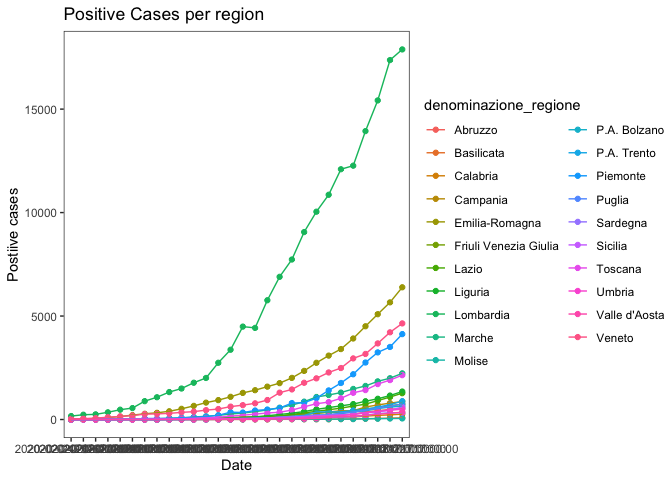
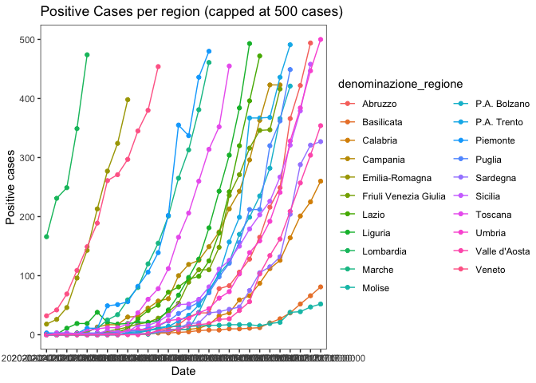
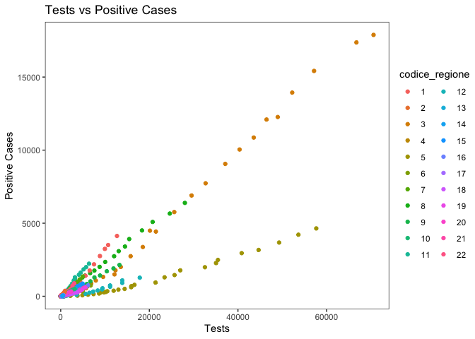
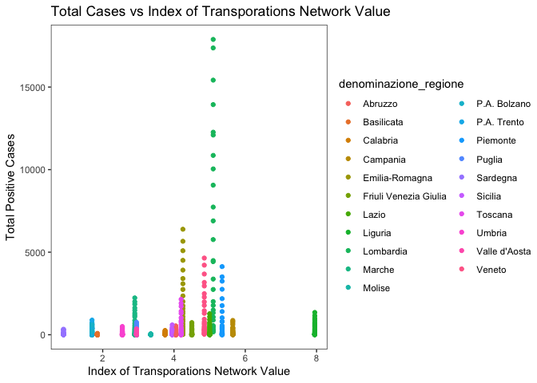
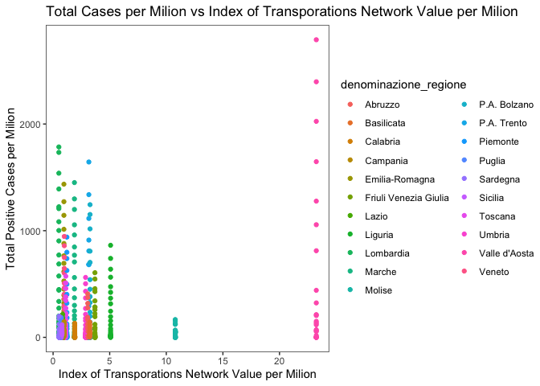
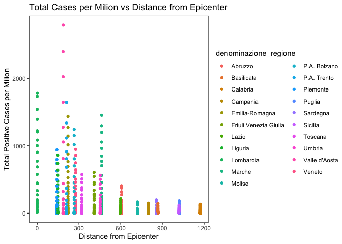
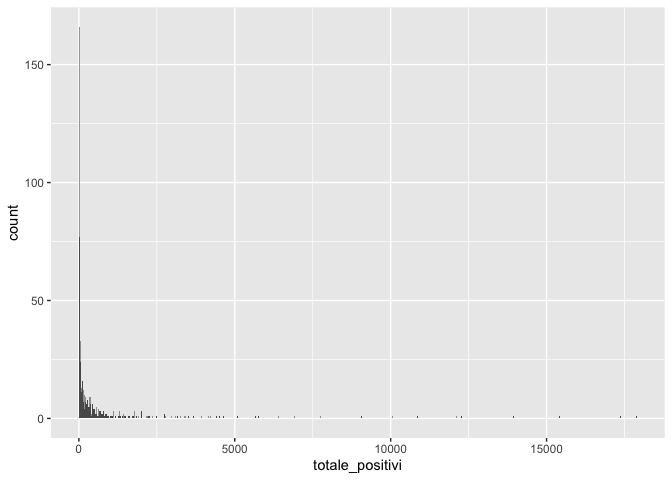
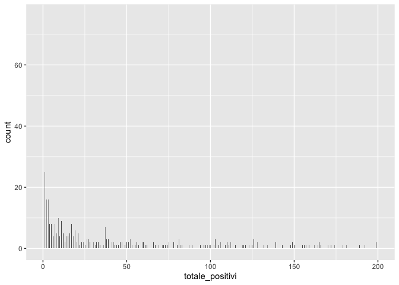

\#\#1.  Introduction\#\# For this project, I am seeking to understand whether regional density of
main transportation networks in Italy has had an impact on the spread of
Covid 19 since the Department for Civil Protection has started gathering
data until 2 weeks after the enforcement of the lockdown (in order to
account for incubation period). As this is a fairly new topic, there is
really not much litteraature out there (yet), but I'm sure there will be
in the future.

\#\#1.  Outline research question and main hypotheses (≤3) My research question is whether transporation network's density has an
impact in the spreading of COVID when accounting for population,
distance from epicenter and Island regions. My original hypothesis was
that this would have been the case.

\#\#1.  Data

The data for Covid numbers were found at
<https://github.com/pcm-dpc/COVID-19/tree/master/dati-regioni> from
<http://www.protezionecivile.gov.it/>). The data for transportation
networks are from the Italian National Institute of Statistics, ISTAT
(<https://www.istat.it/en/>).

My dependent variable is totale\_positivi, which is the total number of
positive cases per region at any given time. I have use total number of
positive cases per milion of people as DV to see whether the
relationship holds.

My IV are: an Index for Transporation network's density, called
TransIndex. I've obtained the latter by combining data from ISTAT
regarding both KM of highways and KM of railways per 100KM(square) in
each region. I have also created a ratio of this index per milion of
inhabitants (thus how many km of transportation line there are per 100
Km square for each milion of people in each region).

Population of regions in millions

Distance from epicentre (calculated as distance between the capital of
each region and Milan via faster route) and a Island dummy for Sicilia
and Sardegna.

an Island dummy for Sicilia and Sardegna

As can be seen from the dataset, I have data for each Italian region for
each day between the 24th of February and the 22nd of March

Visualise data in ≥2 helpful ways

    CovidTransportDat<- readRDS("CovidTransportDat.rds")

    library(tidyverse)

    ## ── Attaching packages ───────────────────────────────────────────────── tidyverse 1.3.0 ──

    ## ✓ ggplot2 3.3.0     ✓ purrr   0.3.4
    ## ✓ tibble  3.0.1     ✓ dplyr   0.8.5
    ## ✓ tidyr   1.1.0     ✓ stringr 1.4.0
    ## ✓ readr   1.3.1     ✓ forcats 0.5.0

    ## ── Conflicts ──────────────────────────────────────────────────── tidyverse_conflicts() ──
    ## x dplyr::filter() masks stats::filter()
    ## x dplyr::lag()    masks stats::lag()

    library(stats)
    library(MASS)

    ## 
    ## Attaching package: 'MASS'

    ## The following object is masked from 'package:dplyr':
    ## 
    ##     select

    library(sjPlot)

    ## Install package "strengejacke" from GitHub (`devtools::install_github("strengejacke/strengejacke")`) to load all sj-packages at once!

    Covid<-CovidTransportDat

    Covid %>%
      group_by(denominazione_regione) %>%
    ggplot(aes(x=data, y=totale_positivi, col=denominazione_regione)) + geom_point() + 
      geom_line(aes(group=denominazione_regione)) + theme_test() + labs(title = "Positive Cases per region", y="Postiive cases", x="Date")

    Covid %>%
      group_by(denominazione_regione) %>%
    ggplot(aes(x=data, y=totale_positivi, col=denominazione_regione)) + geom_point() + 
      geom_line(aes(group=denominazione_regione)) + theme_test() + ylim(0,500) + labs(title = "Positive Cases per region (capped at 500 cases)", y="Positive cases", x="Date")

    ggplot(Covid, aes(totale_positivi, x=tamponi, col=codice_regione)) + geom_point() + theme_test() +
      labs(title = "Tests vs Positive Cases", x="Tests", y="Positive Cases") #I have also data for numbers of tests, which I meant to include as control - but it turend out to be useless as, from what can be seen, there is near perfetc prediction between that and the DV

    ggplot(Covid, aes(totale_positivi, x=TransIndex, col=denominazione_regione)) + geom_point() + theme_test() + 
      labs(title = "Total Cases vs Index of Transporations Network Value", x="Index of Transporations Network Value", y="Total Positive Cases") 

    ggplot(Covid, aes(CasiCapita, x=TransIndexCapita, col=denominazione_regione)) + geom_point() + theme_test() + 
      labs(title = "Total Cases per Milion vs Index of Transporations Network Value per Milion", x="Index of Transporations Network Value per Milion", y="Total Positive Cases per Milion") 

    ggplot(Covid, aes(CasiCapita, x=DistEpicenter, col=denominazione_regione)) + geom_point() + theme_test() + 
      labs(title = "Total Cases per Milion vs Distance from Epicenter", x="Distance from Epicenter", y="Total Positive Cases per Milion") 

\#\#1.  Method

Given that I have both count data per region and per unit of time (day),
I have decided to use both Poisson and Negative Binomial methods and
Fixed Effects for time in my modelling. I am not sure whether this is
sensible at all - althought I have been reading about Fixed Effects
Poisson models - but since I'm only auditing the class I have allowed
myself some fun experimentation. I have only run the Poisson to compare
its results with the negative binomial and to run odTest on whether the
NB model was needed (it was, I refute the HO, I will include it in the
modeling code below).

    Covid$data<-as.factor(Covid$data)
    Covid$codice_regione<-as.factor(Covid$codice_regione)

    Covid$CasiCapita<-round(Covid$totale_positivi/Covid$Pop)

    poisson1 <- glm(totale_positivi ~ 0 + data + Pop + TransIndex +
                      DistEpicenter + IslandDummy, Covid, family = poisson)

    library(pscl)

    ## Classes and Methods for R developed in the
    ## Political Science Computational Laboratory
    ## Department of Political Science
    ## Stanford University
    ## Simon Jackman
    ## hurdle and zeroinfl functions by Achim Zeileis

    library(lmtest)

    ## Loading required package: zoo

    ## 
    ## Attaching package: 'zoo'

    ## The following objects are masked from 'package:base':
    ## 
    ##     as.Date, as.Date.numeric

    nb1 <- glm.nb(totale_positivi ~ 0 + data + Pop + TransIndex +
                    DistEpicenter + IslandDummy, Covid)
    odTest(nb1)

    ## Likelihood ratio test of H0: Poisson, as restricted NB model:
    ## n.b., the distribution of the test-statistic under H0 is non-standard
    ## e.g., see help(odTest) for details/references
    ## 
    ## Critical value of test statistic at the alpha= 0.05 level: 2.7055 
    ## Chi-Square Test Statistic =  78284.4257 p-value = < 2.2e-16

    nb2 <- glm.nb(totale_positivi ~ 0 + data + Pop + TransIndexCapita +
                    DistEpicenter + IslandDummy, Covid)

    nb3 <- glm.nb(CasiCapita ~ 0 + data + Pop + TransIndex +
                    DistEpicenter + IslandDummy, Covid)

    nb4 <- glm.nb(CasiCapita ~ 0 + data + Pop + TransIndexCapita +
                    DistEpicenter + IslandDummy, Covid)

    ggplot(Covid, aes(totale_positivi)) + geom_histogram(bins=1000) #while there seems to be an inflation of 0s, this appears misleading if we cap the x axis so that we get

    ggplot(Covid, aes(totale_positivi)) + geom_histogram(bins=1000) + xlim(0,200) #zero inflated model was not necessary 

1. Introduce main model and estimation used (briefly) and motivate its
choice

By introducing Fixed Effects for time, I should be able to account for
the exponential growth of the virus and isolate the effect of regional
IV over the DV

Poisson was clearly overdispersed (odTest), and thus I have opted for
negative binomial models after the first.

As I have gathered online. besides accounting for the mean=variance
assumption, NB models share the same assumptions as Poisson models, and
thus.

Independence: Events must be independent - I am not sure that this is
the case here, as a high number of cases in a region is almost surely
correlated with more cases in closer regions - as it is an epidemic -
but I was not sure how to account for this

We observe from the start of the period (or account for how many events
occurred before start of study period) - I am also not sure that this is
the case here - as the data start when there were already several cases
in Northern regions but 0s in some of the more distant ones

My selected models are as follows:

    tab_model(poisson1, nb1, nb2, nb3, nb4, vcov.fun = "HC", vcov.type = "HC3", digits = 4,
              show.aic = T, show.loglik = T, show.r2 = F)

<table style="border-collapse:collapse; border:none;">
<tr>
<th style="border-top: double; text-align:center; font-style:normal; font-weight:bold; padding:0.2cm;  text-align:left; ">
 
</th>
<th colspan="3" style="border-top: double; text-align:center; font-style:normal; font-weight:bold; padding:0.2cm; ">
totale\_positivi
</th>
<th colspan="3" style="border-top: double; text-align:center; font-style:normal; font-weight:bold; padding:0.2cm; ">
totale\_positivi
</th>
<th colspan="3" style="border-top: double; text-align:center; font-style:normal; font-weight:bold; padding:0.2cm; ">
totale\_positivi
</th>
<th colspan="3" style="border-top: double; text-align:center; font-style:normal; font-weight:bold; padding:0.2cm; ">
CasiCapita
</th>
<th colspan="3" style="border-top: double; text-align:center; font-style:normal; font-weight:bold; padding:0.2cm; ">
CasiCapita
</th>
</tr>
<tr>
<td style=" text-align:center; border-bottom:1px solid; font-style:italic; font-weight:normal;  text-align:left; ">
Predictors
</td>
<td style=" text-align:center; border-bottom:1px solid; font-style:italic; font-weight:normal;  ">
Incidence Rate Ratios
</td>
<td style=" text-align:center; border-bottom:1px solid; font-style:italic; font-weight:normal;  ">
CI
</td>
<td style=" text-align:center; border-bottom:1px solid; font-style:italic; font-weight:normal;  ">
p
</td>
<td style=" text-align:center; border-bottom:1px solid; font-style:italic; font-weight:normal;  ">
Incidence Rate Ratios
</td>
<td style=" text-align:center; border-bottom:1px solid; font-style:italic; font-weight:normal;  ">
CI
</td>
<td style=" text-align:center; border-bottom:1px solid; font-style:italic; font-weight:normal;  col7">
p
</td>
<td style=" text-align:center; border-bottom:1px solid; font-style:italic; font-weight:normal;  col8">
Incidence Rate Ratios
</td>
<td style=" text-align:center; border-bottom:1px solid; font-style:italic; font-weight:normal;  col9">
CI
</td>
<td style=" text-align:center; border-bottom:1px solid; font-style:italic; font-weight:normal;  0">
p
</td>
<td style=" text-align:center; border-bottom:1px solid; font-style:italic; font-weight:normal;  1">
Incidence Rate Ratios
</td>
<td style=" text-align:center; border-bottom:1px solid; font-style:italic; font-weight:normal;  2">
CI
</td>
<td style=" text-align:center; border-bottom:1px solid; font-style:italic; font-weight:normal;  3">
p
</td>
<td style=" text-align:center; border-bottom:1px solid; font-style:italic; font-weight:normal;  4">
Incidence Rate Ratios
</td>
<td style=" text-align:center; border-bottom:1px solid; font-style:italic; font-weight:normal;  5">
CI
</td>
<td style=" text-align:center; border-bottom:1px solid; font-style:italic; font-weight:normal;  6">
p
</td>
</tr>
<tr>
<td style=" padding:0.2cm; text-align:left; vertical-align:top; text-align:left; ">
data2020-02-24T18 : 00 : 00
</td>
<td style=" padding:0.2cm; text-align:left; vertical-align:top; text-align:center;  ">
8.4012
</td>
<td style=" padding:0.2cm; text-align:left; vertical-align:top; text-align:center;  ">
2.8686 – 24.6043
</td>
<td style=" padding:0.2cm; text-align:left; vertical-align:top; text-align:center;  ">
<strong>&lt;0.001
</td>
<td style=" padding:0.2cm; text-align:left; vertical-align:top; text-align:center;  ">
1.2899
</td>
<td style=" padding:0.2cm; text-align:left; vertical-align:top; text-align:center;  ">
0.4443 – 3.7452
</td>
<td style=" padding:0.2cm; text-align:left; vertical-align:top; text-align:center;  col7">
0.639
</td>
<td style=" padding:0.2cm; text-align:left; vertical-align:top; text-align:center;  col8">
2.7413
</td>
<td style=" padding:0.2cm; text-align:left; vertical-align:top; text-align:center;  col9">
1.0113 – 7.4308
</td>
<td style=" padding:0.2cm; text-align:left; vertical-align:top; text-align:center;  0">
<strong>0.047</strong>
</td>
<td style=" padding:0.2cm; text-align:left; vertical-align:top; text-align:center;  1">
2.9771
</td>
<td style=" padding:0.2cm; text-align:left; vertical-align:top; text-align:center;  2">
1.1113 – 7.9755
</td>
<td style=" padding:0.2cm; text-align:left; vertical-align:top; text-align:center;  3">
<strong>0.030</strong>
</td>
<td style=" padding:0.2cm; text-align:left; vertical-align:top; text-align:center;  4">
2.3976
</td>
<td style=" padding:0.2cm; text-align:left; vertical-align:top; text-align:center;  5">
0.8918 – 6.4454
</td>
<td style=" padding:0.2cm; text-align:left; vertical-align:top; text-align:center;  6">
0.083
</td>
</tr>
<tr>
<td style=" padding:0.2cm; text-align:left; vertical-align:top; text-align:left; ">
data2020-02-25T18 : 00 : 00
</td>
<td style=" padding:0.2cm; text-align:left; vertical-align:top; text-align:center;  ">
11.8224
</td>
<td style=" padding:0.2cm; text-align:left; vertical-align:top; text-align:center;  ">
4.1740 – 33.4859
</td>
<td style=" padding:0.2cm; text-align:left; vertical-align:top; text-align:center;  ">
<strong>&lt;0.001
</td>
<td style=" padding:0.2cm; text-align:left; vertical-align:top; text-align:center;  ">
1.9979
</td>
<td style=" padding:0.2cm; text-align:left; vertical-align:top; text-align:center;  ">
0.8497 – 4.6979
</td>
<td style=" padding:0.2cm; text-align:left; vertical-align:top; text-align:center;  col7">
0.112
</td>
<td style=" padding:0.2cm; text-align:left; vertical-align:top; text-align:center;  col8">
4.1917
</td>
<td style=" padding:0.2cm; text-align:left; vertical-align:top; text-align:center;  col9">
1.8632 – 9.4302
</td>
<td style=" padding:0.2cm; text-align:left; vertical-align:top; text-align:center;  0">
<strong>0.001</strong>
</td>
<td style=" padding:0.2cm; text-align:left; vertical-align:top; text-align:center;  1">
4.6788
</td>
<td style=" padding:0.2cm; text-align:left; vertical-align:top; text-align:center;  2">
2.1951 – 9.9726
</td>
<td style=" padding:0.2cm; text-align:left; vertical-align:top; text-align:center;  3">
<strong>&lt;0.001
</td>
<td style=" padding:0.2cm; text-align:left; vertical-align:top; text-align:center;  4">
3.7505
</td>
<td style=" padding:0.2cm; text-align:left; vertical-align:top; text-align:center;  5">
1.7529 – 8.0247
</td>
<td style=" padding:0.2cm; text-align:left; vertical-align:top; text-align:center;  6">
<strong>0.001</strong>
</td>
</tr>
<tr>
<td style=" padding:0.2cm; text-align:left; vertical-align:top; text-align:left; ">
data2020-02-26T18 : 00 : 00
</td>
<td style=" padding:0.2cm; text-align:left; vertical-align:top; text-align:center;  ">
14.6355
</td>
<td style=" padding:0.2cm; text-align:left; vertical-align:top; text-align:center;  ">
6.9864 – 30.6594
</td>
<td style=" padding:0.2cm; text-align:left; vertical-align:top; text-align:center;  ">
<strong>&lt;0.001
</td>
<td style=" padding:0.2cm; text-align:left; vertical-align:top; text-align:center;  ">
3.1711
</td>
<td style=" padding:0.2cm; text-align:left; vertical-align:top; text-align:center;  ">
1.3556 – 7.4181
</td>
<td style=" padding:0.2cm; text-align:left; vertical-align:top; text-align:center;  col7">
<strong>0.008</strong>
</td>
<td style=" padding:0.2cm; text-align:left; vertical-align:top; text-align:center;  col8">
6.5292
</td>
<td style=" padding:0.2cm; text-align:left; vertical-align:top; text-align:center;  col9">
2.8594 – 14.9087
</td>
<td style=" padding:0.2cm; text-align:left; vertical-align:top; text-align:center;  0">
<strong>&lt;0.001
</td>
<td style=" padding:0.2cm; text-align:left; vertical-align:top; text-align:center;  1">
7.1165
</td>
<td style=" padding:0.2cm; text-align:left; vertical-align:top; text-align:center;  2">
3.5144 – 14.4105
</td>
<td style=" padding:0.2cm; text-align:left; vertical-align:top; text-align:center;  3">
<strong>&lt;0.001
</td>
<td style=" padding:0.2cm; text-align:left; vertical-align:top; text-align:center;  4">
5.5131
</td>
<td style=" padding:0.2cm; text-align:left; vertical-align:top; text-align:center;  5">
2.7252 – 11.1533
</td>
<td style=" padding:0.2cm; text-align:left; vertical-align:top; text-align:center;  6">
<strong>&lt;0.001
</td>
</tr>
<tr>
<td style=" padding:0.2cm; text-align:left; vertical-align:top; text-align:left; ">
data2020-02-27T18 : 00 : 00
</td>
<td style=" padding:0.2cm; text-align:left; vertical-align:top; text-align:center;  ">
22.3524
</td>
<td style=" padding:0.2cm; text-align:left; vertical-align:top; text-align:center;  ">
12.0872 – 41.3355
</td>
<td style=" padding:0.2cm; text-align:left; vertical-align:top; text-align:center;  ">
<strong>&lt;0.001
</td>
<td style=" padding:0.2cm; text-align:left; vertical-align:top; text-align:center;  ">
5.2024
</td>
<td style=" padding:0.2cm; text-align:left; vertical-align:top; text-align:center;  ">
2.2536 – 12.0095
</td>
<td style=" padding:0.2cm; text-align:left; vertical-align:top; text-align:center;  col7">
<strong>&lt;0.001
</td>
<td style=" padding:0.2cm; text-align:left; vertical-align:top; text-align:center;  col8">
10.6097
</td>
<td style=" padding:0.2cm; text-align:left; vertical-align:top; text-align:center;  col9">
4.7091 – 23.9038
</td>
<td style=" padding:0.2cm; text-align:left; vertical-align:top; text-align:center;  0">
<strong>&lt;0.001
</td>
<td style=" padding:0.2cm; text-align:left; vertical-align:top; text-align:center;  1">
11.1204
</td>
<td style=" padding:0.2cm; text-align:left; vertical-align:top; text-align:center;  2">
5.2470 – 23.5685
</td>
<td style=" padding:0.2cm; text-align:left; vertical-align:top; text-align:center;  3">
<strong>&lt;0.001
</td>
<td style=" padding:0.2cm; text-align:left; vertical-align:top; text-align:center;  4">
8.5251
</td>
<td style=" padding:0.2cm; text-align:left; vertical-align:top; text-align:center;  5">
3.9981 – 18.1780
</td>
<td style=" padding:0.2cm; text-align:left; vertical-align:top; text-align:center;  6">
<strong>&lt;0.001
</td>
</tr>
<tr>
<td style=" padding:0.2cm; text-align:left; vertical-align:top; text-align:left; ">
data2020-02-28T18 : 00 : 00
</td>
<td style=" padding:0.2cm; text-align:left; vertical-align:top; text-align:center;  ">
31.2097
</td>
<td style=" padding:0.2cm; text-align:left; vertical-align:top; text-align:center;  ">
17.5693 – 55.4402
</td>
<td style=" padding:0.2cm; text-align:left; vertical-align:top; text-align:center;  ">
<strong>&lt;0.001
</td>
<td style=" padding:0.2cm; text-align:left; vertical-align:top; text-align:center;  ">
7.3833
</td>
<td style=" padding:0.2cm; text-align:left; vertical-align:top; text-align:center;  ">
3.3658 – 16.1962
</td>
<td style=" padding:0.2cm; text-align:left; vertical-align:top; text-align:center;  col7">
<strong>&lt;0.001
</td>
<td style=" padding:0.2cm; text-align:left; vertical-align:top; text-align:center;  col8">
14.8789
</td>
<td style=" padding:0.2cm; text-align:left; vertical-align:top; text-align:center;  col9">
6.9904 – 31.6692
</td>
<td style=" padding:0.2cm; text-align:left; vertical-align:top; text-align:center;  0">
<strong>&lt;0.001
</td>
<td style=" padding:0.2cm; text-align:left; vertical-align:top; text-align:center;  1">
15.5208
</td>
<td style=" padding:0.2cm; text-align:left; vertical-align:top; text-align:center;  2">
7.6870 – 31.3380
</td>
<td style=" padding:0.2cm; text-align:left; vertical-align:top; text-align:center;  3">
<strong>&lt;0.001
</td>
<td style=" padding:0.2cm; text-align:left; vertical-align:top; text-align:center;  4">
12.0052
</td>
<td style=" padding:0.2cm; text-align:left; vertical-align:top; text-align:center;  5">
5.9137 – 24.3716
</td>
<td style=" padding:0.2cm; text-align:left; vertical-align:top; text-align:center;  6">
<strong>&lt;0.001
</td>
</tr>
<tr>
<td style=" padding:0.2cm; text-align:left; vertical-align:top; text-align:left; ">
data2020-02-29T17 : 00 : 00
</td>
<td style=" padding:0.2cm; text-align:left; vertical-align:top; text-align:center;  ">
39.8770
</td>
<td style=" padding:0.2cm; text-align:left; vertical-align:top; text-align:center;  ">
23.8551 – 66.6597
</td>
<td style=" padding:0.2cm; text-align:left; vertical-align:top; text-align:center;  ">
<strong>&lt;0.001
</td>
<td style=" padding:0.2cm; text-align:left; vertical-align:top; text-align:center;  ">
10.6022
</td>
<td style=" padding:0.2cm; text-align:left; vertical-align:top; text-align:center;  ">
5.0074 – 22.4485
</td>
<td style=" padding:0.2cm; text-align:left; vertical-align:top; text-align:center;  col7">
<strong>&lt;0.001
</td>
<td style=" padding:0.2cm; text-align:left; vertical-align:top; text-align:center;  col8">
21.2810
</td>
<td style=" padding:0.2cm; text-align:left; vertical-align:top; text-align:center;  col9">
10.3074 – 43.9373
</td>
<td style=" padding:0.2cm; text-align:left; vertical-align:top; text-align:center;  0">
<strong>&lt;0.001
</td>
<td style=" padding:0.2cm; text-align:left; vertical-align:top; text-align:center;  1">
22.3180
</td>
<td style=" padding:0.2cm; text-align:left; vertical-align:top; text-align:center;  2">
11.3124 – 44.0306
</td>
<td style=" padding:0.2cm; text-align:left; vertical-align:top; text-align:center;  3">
<strong>&lt;0.001
</td>
<td style=" padding:0.2cm; text-align:left; vertical-align:top; text-align:center;  4">
16.9786
</td>
<td style=" padding:0.2cm; text-align:left; vertical-align:top; text-align:center;  5">
8.5305 – 33.7933
</td>
<td style=" padding:0.2cm; text-align:left; vertical-align:top; text-align:center;  6">
<strong>&lt;0.001
</td>
</tr>
<tr>
<td style=" padding:0.2cm; text-align:left; vertical-align:top; text-align:left; ">
data2020-03-01T17 : 00 : 00
</td>
<td style=" padding:0.2cm; text-align:left; vertical-align:top; text-align:center;  ">
59.9485
</td>
<td style=" padding:0.2cm; text-align:left; vertical-align:top; text-align:center;  ">
35.6047 – 100.9366
</td>
<td style=" padding:0.2cm; text-align:left; vertical-align:top; text-align:center;  ">
<strong>&lt;0.001
</td>
<td style=" padding:0.2cm; text-align:left; vertical-align:top; text-align:center;  ">
15.2738
</td>
<td style=" padding:0.2cm; text-align:left; vertical-align:top; text-align:center;  ">
7.7410 – 30.1370
</td>
<td style=" padding:0.2cm; text-align:left; vertical-align:top; text-align:center;  col7">
<strong>&lt;0.001
</td>
<td style=" padding:0.2cm; text-align:left; vertical-align:top; text-align:center;  col8">
30.1764
</td>
<td style=" padding:0.2cm; text-align:left; vertical-align:top; text-align:center;  col9">
16.0278 – 56.8148
</td>
<td style=" padding:0.2cm; text-align:left; vertical-align:top; text-align:center;  0">
<strong>&lt;0.001
</td>
<td style=" padding:0.2cm; text-align:left; vertical-align:top; text-align:center;  1">
31.1805
</td>
<td style=" padding:0.2cm; text-align:left; vertical-align:top; text-align:center;  2">
16.9717 – 57.2849
</td>
<td style=" padding:0.2cm; text-align:left; vertical-align:top; text-align:center;  3">
<strong>&lt;0.001
</td>
<td style=" padding:0.2cm; text-align:left; vertical-align:top; text-align:center;  4">
24.3361
</td>
<td style=" padding:0.2cm; text-align:left; vertical-align:top; text-align:center;  5">
13.2040 – 44.8536
</td>
<td style=" padding:0.2cm; text-align:left; vertical-align:top; text-align:center;  6">
<strong>&lt;0.001
</td>
</tr>
<tr>
<td style=" padding:0.2cm; text-align:left; vertical-align:top; text-align:left; ">
data2020-03-02T18 : 00 : 00
</td>
<td style=" padding:0.2cm; text-align:left; vertical-align:top; text-align:center;  ">
69.7562
</td>
<td style=" padding:0.2cm; text-align:left; vertical-align:top; text-align:center;  ">
39.5138 – 123.1451
</td>
<td style=" padding:0.2cm; text-align:left; vertical-align:top; text-align:center;  ">
<strong>&lt;0.001
</td>
<td style=" padding:0.2cm; text-align:left; vertical-align:top; text-align:center;  ">
16.9714
</td>
<td style=" padding:0.2cm; text-align:left; vertical-align:top; text-align:center;  ">
8.3658 – 34.4292
</td>
<td style=" padding:0.2cm; text-align:left; vertical-align:top; text-align:center;  col7">
<strong>&lt;0.001
</td>
<td style=" padding:0.2cm; text-align:left; vertical-align:top; text-align:center;  col8">
33.2021
</td>
<td style=" padding:0.2cm; text-align:left; vertical-align:top; text-align:center;  col9">
17.2607 – 63.8665
</td>
<td style=" padding:0.2cm; text-align:left; vertical-align:top; text-align:center;  0">
<strong>&lt;0.001
</td>
<td style=" padding:0.2cm; text-align:left; vertical-align:top; text-align:center;  1">
34.8005
</td>
<td style=" padding:0.2cm; text-align:left; vertical-align:top; text-align:center;  2">
18.6178 – 65.0492
</td>
<td style=" padding:0.2cm; text-align:left; vertical-align:top; text-align:center;  3">
<strong>&lt;0.001
</td>
<td style=" padding:0.2cm; text-align:left; vertical-align:top; text-align:center;  4">
27.3185
</td>
<td style=" padding:0.2cm; text-align:left; vertical-align:top; text-align:center;  5">
14.5501 – 51.2920
</td>
<td style=" padding:0.2cm; text-align:left; vertical-align:top; text-align:center;  6">
<strong>&lt;0.001
</td>
</tr>
<tr>
<td style=" padding:0.2cm; text-align:left; vertical-align:top; text-align:left; ">
data2020-03-03T18 : 00 : 00
</td>
<td style=" padding:0.2cm; text-align:left; vertical-align:top; text-align:center;  ">
86.0263
</td>
<td style=" padding:0.2cm; text-align:left; vertical-align:top; text-align:center;  ">
49.3555 – 149.9431
</td>
<td style=" padding:0.2cm; text-align:left; vertical-align:top; text-align:center;  ">
<strong>&lt;0.001
</td>
<td style=" padding:0.2cm; text-align:left; vertical-align:top; text-align:center;  ">
24.4132
</td>
<td style=" padding:0.2cm; text-align:left; vertical-align:top; text-align:center;  ">
12.8127 – 46.5167
</td>
<td style=" padding:0.2cm; text-align:left; vertical-align:top; text-align:center;  col7">
<strong>&lt;0.001
</td>
<td style=" padding:0.2cm; text-align:left; vertical-align:top; text-align:center;  col8">
47.5203
</td>
<td style=" padding:0.2cm; text-align:left; vertical-align:top; text-align:center;  col9">
26.7088 – 84.5483
</td>
<td style=" padding:0.2cm; text-align:left; vertical-align:top; text-align:center;  0">
<strong>&lt;0.001
</td>
<td style=" padding:0.2cm; text-align:left; vertical-align:top; text-align:center;  1">
54.0137
</td>
<td style=" padding:0.2cm; text-align:left; vertical-align:top; text-align:center;  2">
32.2475 – 90.4715
</td>
<td style=" padding:0.2cm; text-align:left; vertical-align:top; text-align:center;  3">
<strong>&lt;0.001
</td>
<td style=" padding:0.2cm; text-align:left; vertical-align:top; text-align:center;  4">
42.9097
</td>
<td style=" padding:0.2cm; text-align:left; vertical-align:top; text-align:center;  5">
25.6006 – 71.9218
</td>
<td style=" padding:0.2cm; text-align:left; vertical-align:top; text-align:center;  6">
<strong>&lt;0.001
</td>
</tr>
<tr>
<td style=" padding:0.2cm; text-align:left; vertical-align:top; text-align:left; ">
data2020-03-04T17 : 00 : 00
</td>
<td style=" padding:0.2cm; text-align:left; vertical-align:top; text-align:center;  ">
102.8666
</td>
<td style=" padding:0.2cm; text-align:left; vertical-align:top; text-align:center;  ">
63.0670 – 167.7824
</td>
<td style=" padding:0.2cm; text-align:left; vertical-align:top; text-align:center;  ">
<strong>&lt;0.001
</td>
<td style=" padding:0.2cm; text-align:left; vertical-align:top; text-align:center;  ">
31.9244
</td>
<td style=" padding:0.2cm; text-align:left; vertical-align:top; text-align:center;  ">
16.8699 – 60.4135
</td>
<td style=" padding:0.2cm; text-align:left; vertical-align:top; text-align:center;  col7">
<strong>&lt;0.001
</td>
<td style=" padding:0.2cm; text-align:left; vertical-align:top; text-align:center;  col8">
61.9028
</td>
<td style=" padding:0.2cm; text-align:left; vertical-align:top; text-align:center;  col9">
35.2126 – 108.8236
</td>
<td style=" padding:0.2cm; text-align:left; vertical-align:top; text-align:center;  0">
<strong>&lt;0.001
</td>
<td style=" padding:0.2cm; text-align:left; vertical-align:top; text-align:center;  1">
67.7759
</td>
<td style=" padding:0.2cm; text-align:left; vertical-align:top; text-align:center;  2">
40.3578 – 113.8210
</td>
<td style=" padding:0.2cm; text-align:left; vertical-align:top; text-align:center;  3">
<strong>&lt;0.001
</td>
<td style=" padding:0.2cm; text-align:left; vertical-align:top; text-align:center;  4">
53.8521
</td>
<td style=" padding:0.2cm; text-align:left; vertical-align:top; text-align:center;  5">
31.9734 – 90.7017
</td>
<td style=" padding:0.2cm; text-align:left; vertical-align:top; text-align:center;  6">
<strong>&lt;0.001
</td>
</tr>
<tr>
<td style=" padding:0.2cm; text-align:left; vertical-align:top; text-align:left; ">
data2020-03-05T17 : 00 : 00
</td>
<td style=" padding:0.2cm; text-align:left; vertical-align:top; text-align:center;  ">
125.2950
</td>
<td style=" padding:0.2cm; text-align:left; vertical-align:top; text-align:center;  ">
78.4594 – 200.0888
</td>
<td style=" padding:0.2cm; text-align:left; vertical-align:top; text-align:center;  ">
<strong>&lt;0.001
</td>
<td style=" padding:0.2cm; text-align:left; vertical-align:top; text-align:center;  ">
42.2396
</td>
<td style=" padding:0.2cm; text-align:left; vertical-align:top; text-align:center;  ">
21.7770 – 81.9295
</td>
<td style=" padding:0.2cm; text-align:left; vertical-align:top; text-align:center;  col7">
<strong>&lt;0.001
</td>
<td style=" padding:0.2cm; text-align:left; vertical-align:top; text-align:center;  col8">
83.4913
</td>
<td style=" padding:0.2cm; text-align:left; vertical-align:top; text-align:center;  col9">
47.2782 – 147.4421
</td>
<td style=" padding:0.2cm; text-align:left; vertical-align:top; text-align:center;  0">
<strong>&lt;0.001
</td>
<td style=" padding:0.2cm; text-align:left; vertical-align:top; text-align:center;  1">
93.0343
</td>
<td style=" padding:0.2cm; text-align:left; vertical-align:top; text-align:center;  2">
54.3952 – 159.1203
</td>
<td style=" padding:0.2cm; text-align:left; vertical-align:top; text-align:center;  3">
<strong>&lt;0.001
</td>
<td style=" padding:0.2cm; text-align:left; vertical-align:top; text-align:center;  4">
74.4838
</td>
<td style=" padding:0.2cm; text-align:left; vertical-align:top; text-align:center;  5">
43.4044 – 127.8173
</td>
<td style=" padding:0.2cm; text-align:left; vertical-align:top; text-align:center;  6">
<strong>&lt;0.001
</td>
</tr>
<tr>
<td style=" padding:0.2cm; text-align:left; vertical-align:top; text-align:left; ">
data2020-03-06T17 : 00 : 00
</td>
<td style=" padding:0.2cm; text-align:left; vertical-align:top; text-align:center;  ">
148.8639
</td>
<td style=" padding:0.2cm; text-align:left; vertical-align:top; text-align:center;  ">
95.1865 – 232.8109
</td>
<td style=" padding:0.2cm; text-align:left; vertical-align:top; text-align:center;  ">
<strong>&lt;0.001
</td>
<td style=" padding:0.2cm; text-align:left; vertical-align:top; text-align:center;  ">
57.3251
</td>
<td style=" padding:0.2cm; text-align:left; vertical-align:top; text-align:center;  ">
31.0298 – 105.9036
</td>
<td style=" padding:0.2cm; text-align:left; vertical-align:top; text-align:center;  col7">
<strong>&lt;0.001
</td>
<td style=" padding:0.2cm; text-align:left; vertical-align:top; text-align:center;  col8">
116.6758
</td>
<td style=" padding:0.2cm; text-align:left; vertical-align:top; text-align:center;  col9">
69.4763 – 195.9408
</td>
<td style=" padding:0.2cm; text-align:left; vertical-align:top; text-align:center;  0">
<strong>&lt;0.001
</td>
<td style=" padding:0.2cm; text-align:left; vertical-align:top; text-align:center;  1">
133.1163
</td>
<td style=" padding:0.2cm; text-align:left; vertical-align:top; text-align:center;  2">
80.6635 – 219.6772
</td>
<td style=" padding:0.2cm; text-align:left; vertical-align:top; text-align:center;  3">
<strong>&lt;0.001
</td>
<td style=" padding:0.2cm; text-align:left; vertical-align:top; text-align:center;  4">
107.5391
</td>
<td style=" padding:0.2cm; text-align:left; vertical-align:top; text-align:center;  5">
65.2196 – 177.3185
</td>
<td style=" padding:0.2cm; text-align:left; vertical-align:top; text-align:center;  6">
<strong>&lt;0.001
</td>
</tr>
<tr>
<td style=" padding:0.2cm; text-align:left; vertical-align:top; text-align:left; ">
data2020-03-07T18 : 00 : 00
</td>
<td style=" padding:0.2cm; text-align:left; vertical-align:top; text-align:center;  ">
192.3902
</td>
<td style=" padding:0.2cm; text-align:left; vertical-align:top; text-align:center;  ">
123.3103 – 300.1695
</td>
<td style=" padding:0.2cm; text-align:left; vertical-align:top; text-align:center;  ">
<strong>&lt;0.001
</td>
<td style=" padding:0.2cm; text-align:left; vertical-align:top; text-align:center;  ">
72.4072
</td>
<td style=" padding:0.2cm; text-align:left; vertical-align:top; text-align:center;  ">
39.6349 – 132.2777
</td>
<td style=" padding:0.2cm; text-align:left; vertical-align:top; text-align:center;  col7">
<strong>&lt;0.001
</td>
<td style=" padding:0.2cm; text-align:left; vertical-align:top; text-align:center;  col8">
146.7925
</td>
<td style=" padding:0.2cm; text-align:left; vertical-align:top; text-align:center;  col9">
88.8045 – 242.6459
</td>
<td style=" padding:0.2cm; text-align:left; vertical-align:top; text-align:center;  0">
<strong>&lt;0.001
</td>
<td style=" padding:0.2cm; text-align:left; vertical-align:top; text-align:center;  1">
167.2091
</td>
<td style=" padding:0.2cm; text-align:left; vertical-align:top; text-align:center;  2">
103.2980 – 270.6622
</td>
<td style=" padding:0.2cm; text-align:left; vertical-align:top; text-align:center;  3">
<strong>&lt;0.001
</td>
<td style=" padding:0.2cm; text-align:left; vertical-align:top; text-align:center;  4">
134.7881
</td>
<td style=" padding:0.2cm; text-align:left; vertical-align:top; text-align:center;  5">
83.1926 – 218.3827
</td>
<td style=" padding:0.2cm; text-align:left; vertical-align:top; text-align:center;  6">
<strong>&lt;0.001
</td>
</tr>
<tr>
<td style=" padding:0.2cm; text-align:left; vertical-align:top; text-align:left; ">
data2020-03-08T18 : 00 : 00
</td>
<td style=" padding:0.2cm; text-align:left; vertical-align:top; text-align:center;  ">
242.7971
</td>
<td style=" padding:0.2cm; text-align:left; vertical-align:top; text-align:center;  ">
162.6486 – 362.4405
</td>
<td style=" padding:0.2cm; text-align:left; vertical-align:top; text-align:center;  ">
<strong>&lt;0.001
</td>
<td style=" padding:0.2cm; text-align:left; vertical-align:top; text-align:center;  ">
98.5410
</td>
<td style=" padding:0.2cm; text-align:left; vertical-align:top; text-align:center;  ">
55.8919 – 173.7339
</td>
<td style=" padding:0.2cm; text-align:left; vertical-align:top; text-align:center;  col7">
<strong>&lt;0.001
</td>
<td style=" padding:0.2cm; text-align:left; vertical-align:top; text-align:center;  col8">
197.1596
</td>
<td style=" padding:0.2cm; text-align:left; vertical-align:top; text-align:center;  col9">
123.5695 – 314.5753
</td>
<td style=" padding:0.2cm; text-align:left; vertical-align:top; text-align:center;  0">
<strong>&lt;0.001
</td>
<td style=" padding:0.2cm; text-align:left; vertical-align:top; text-align:center;  1">
219.7426
</td>
<td style=" padding:0.2cm; text-align:left; vertical-align:top; text-align:center;  2">
141.9759 – 340.1056
</td>
<td style=" padding:0.2cm; text-align:left; vertical-align:top; text-align:center;  3">
<strong>&lt;0.001
</td>
<td style=" padding:0.2cm; text-align:left; vertical-align:top; text-align:center;  4">
176.3986
</td>
<td style=" padding:0.2cm; text-align:left; vertical-align:top; text-align:center;  5">
113.5114 – 274.1263
</td>
<td style=" padding:0.2cm; text-align:left; vertical-align:top; text-align:center;  6">
<strong>&lt;0.001
</td>
</tr>
<tr>
<td style=" padding:0.2cm; text-align:left; vertical-align:top; text-align:left; ">
data2020-03-09T18 : 00 : 00
</td>
<td style=" padding:0.2cm; text-align:left; vertical-align:top; text-align:center;  ">
303.5439
</td>
<td style=" padding:0.2cm; text-align:left; vertical-align:top; text-align:center;  ">
192.0520 – 479.7603
</td>
<td style=" padding:0.2cm; text-align:left; vertical-align:top; text-align:center;  ">
<strong>&lt;0.001
</td>
<td style=" padding:0.2cm; text-align:left; vertical-align:top; text-align:center;  ">
120.2405
</td>
<td style=" padding:0.2cm; text-align:left; vertical-align:top; text-align:center;  ">
69.5183 – 207.9709
</td>
<td style=" padding:0.2cm; text-align:left; vertical-align:top; text-align:center;  col7">
<strong>&lt;0.001
</td>
<td style=" padding:0.2cm; text-align:left; vertical-align:top; text-align:center;  col8">
241.1604
</td>
<td style=" padding:0.2cm; text-align:left; vertical-align:top; text-align:center;  col9">
154.5610 – 376.2809
</td>
<td style=" padding:0.2cm; text-align:left; vertical-align:top; text-align:center;  0">
<strong>&lt;0.001
</td>
<td style=" padding:0.2cm; text-align:left; vertical-align:top; text-align:center;  1">
266.8979
</td>
<td style=" padding:0.2cm; text-align:left; vertical-align:top; text-align:center;  2">
176.8639 – 402.7645
</td>
<td style=" padding:0.2cm; text-align:left; vertical-align:top; text-align:center;  3">
<strong>&lt;0.001
</td>
<td style=" padding:0.2cm; text-align:left; vertical-align:top; text-align:center;  4">
214.3380
</td>
<td style=" padding:0.2cm; text-align:left; vertical-align:top; text-align:center;  5">
141.2646 – 325.2110
</td>
<td style=" padding:0.2cm; text-align:left; vertical-align:top; text-align:center;  6">
<strong>&lt;0.001
</td>
</tr>
<tr>
<td style=" padding:0.2cm; text-align:left; vertical-align:top; text-align:left; ">
data2020-03-10T18 : 00 : 00
</td>
<td style=" padding:0.2cm; text-align:left; vertical-align:top; text-align:center;  ">
323.6535
</td>
<td style=" padding:0.2cm; text-align:left; vertical-align:top; text-align:center;  ">
220.8571 – 474.2957
</td>
<td style=" padding:0.2cm; text-align:left; vertical-align:top; text-align:center;  ">
<strong>&lt;0.001
</td>
<td style=" padding:0.2cm; text-align:left; vertical-align:top; text-align:center;  ">
144.8838
</td>
<td style=" padding:0.2cm; text-align:left; vertical-align:top; text-align:center;  ">
84.6861 – 247.8719
</td>
<td style=" padding:0.2cm; text-align:left; vertical-align:top; text-align:center;  col7">
<strong>&lt;0.001
</td>
<td style=" padding:0.2cm; text-align:left; vertical-align:top; text-align:center;  col8">
287.1440
</td>
<td style=" padding:0.2cm; text-align:left; vertical-align:top; text-align:center;  col9">
185.8346 – 443.6831
</td>
<td style=" padding:0.2cm; text-align:left; vertical-align:top; text-align:center;  0">
<strong>&lt;0.001
</td>
<td style=" padding:0.2cm; text-align:left; vertical-align:top; text-align:center;  1">
322.1177
</td>
<td style=" padding:0.2cm; text-align:left; vertical-align:top; text-align:center;  2">
218.0587 – 475.8345
</td>
<td style=" padding:0.2cm; text-align:left; vertical-align:top; text-align:center;  3">
<strong>&lt;0.001
</td>
<td style=" padding:0.2cm; text-align:left; vertical-align:top; text-align:center;  4">
258.9992
</td>
<td style=" padding:0.2cm; text-align:left; vertical-align:top; text-align:center;  5">
174.3080 – 384.8395
</td>
<td style=" padding:0.2cm; text-align:left; vertical-align:top; text-align:center;  6">
<strong>&lt;0.001
</td>
</tr>
<tr>
<td style=" padding:0.2cm; text-align:left; vertical-align:top; text-align:left; ">
data2020-03-11T17 : 00 : 00
</td>
<td style=" padding:0.2cm; text-align:left; vertical-align:top; text-align:center;  ">
402.5711
</td>
<td style=" padding:0.2cm; text-align:left; vertical-align:top; text-align:center;  ">
268.5761 – 603.4174
</td>
<td style=" padding:0.2cm; text-align:left; vertical-align:top; text-align:center;  ">
<strong>&lt;0.001
</td>
<td style=" padding:0.2cm; text-align:left; vertical-align:top; text-align:center;  ">
181.1126
</td>
<td style=" padding:0.2cm; text-align:left; vertical-align:top; text-align:center;  ">
108.0837 – 303.4850
</td>
<td style=" padding:0.2cm; text-align:left; vertical-align:top; text-align:center;  col7">
<strong>&lt;0.001
</td>
<td style=" padding:0.2cm; text-align:left; vertical-align:top; text-align:center;  col8">
355.4771
</td>
<td style=" padding:0.2cm; text-align:left; vertical-align:top; text-align:center;  col9">
234.3722 – 539.1592
</td>
<td style=" padding:0.2cm; text-align:left; vertical-align:top; text-align:center;  0">
<strong>&lt;0.001
</td>
<td style=" padding:0.2cm; text-align:left; vertical-align:top; text-align:center;  1">
398.7820
</td>
<td style=" padding:0.2cm; text-align:left; vertical-align:top; text-align:center;  2">
275.1501 – 577.9649
</td>
<td style=" padding:0.2cm; text-align:left; vertical-align:top; text-align:center;  3">
<strong>&lt;0.001
</td>
<td style=" padding:0.2cm; text-align:left; vertical-align:top; text-align:center;  4">
321.6753
</td>
<td style=" padding:0.2cm; text-align:left; vertical-align:top; text-align:center;  5">
220.2776 – 469.7481
</td>
<td style=" padding:0.2cm; text-align:left; vertical-align:top; text-align:center;  6">
<strong>&lt;0.001
</td>
</tr>
<tr>
<td style=" padding:0.2cm; text-align:left; vertical-align:top; text-align:left; ">
data2020-03-12T17 : 00 : 00
</td>
<td style=" padding:0.2cm; text-align:left; vertical-align:top; text-align:center;  ">
488.0652
</td>
<td style=" padding:0.2cm; text-align:left; vertical-align:top; text-align:center;  ">
332.6991 – 715.9852
</td>
<td style=" padding:0.2cm; text-align:left; vertical-align:top; text-align:center;  ">
<strong>&lt;0.001
</td>
<td style=" padding:0.2cm; text-align:left; vertical-align:top; text-align:center;  ">
235.3229
</td>
<td style=" padding:0.2cm; text-align:left; vertical-align:top; text-align:center;  ">
143.8532 – 384.9540
</td>
<td style=" padding:0.2cm; text-align:left; vertical-align:top; text-align:center;  col7">
<strong>&lt;0.001
</td>
<td style=" padding:0.2cm; text-align:left; vertical-align:top; text-align:center;  col8">
462.0283
</td>
<td style=" padding:0.2cm; text-align:left; vertical-align:top; text-align:center;  col9">
310.4281 – 687.6636
</td>
<td style=" padding:0.2cm; text-align:left; vertical-align:top; text-align:center;  0">
<strong>&lt;0.001
</td>
<td style=" padding:0.2cm; text-align:left; vertical-align:top; text-align:center;  1">
514.1066
</td>
<td style=" padding:0.2cm; text-align:left; vertical-align:top; text-align:center;  2">
361.4133 – 731.3110
</td>
<td style=" padding:0.2cm; text-align:left; vertical-align:top; text-align:center;  3">
<strong>&lt;0.001
</td>
<td style=" padding:0.2cm; text-align:left; vertical-align:top; text-align:center;  4">
413.6256
</td>
<td style=" padding:0.2cm; text-align:left; vertical-align:top; text-align:center;  5">
288.7210 – 592.5658
</td>
<td style=" padding:0.2cm; text-align:left; vertical-align:top; text-align:center;  6">
<strong>&lt;0.001
</td>
</tr>
<tr>
<td style=" padding:0.2cm; text-align:left; vertical-align:top; text-align:left; ">
data2020-03-13T17 : 00 : 00
</td>
<td style=" padding:0.2cm; text-align:left; vertical-align:top; text-align:center;  ">
568.5034
</td>
<td style=" padding:0.2cm; text-align:left; vertical-align:top; text-align:center;  ">
402.9659 – 802.0433
</td>
<td style=" padding:0.2cm; text-align:left; vertical-align:top; text-align:center;  ">
<strong>&lt;0.001
</td>
<td style=" padding:0.2cm; text-align:left; vertical-align:top; text-align:center;  ">
286.8530
</td>
<td style=" padding:0.2cm; text-align:left; vertical-align:top; text-align:center;  ">
175.4363 – 469.0285
</td>
<td style=" padding:0.2cm; text-align:left; vertical-align:top; text-align:center;  col7">
<strong>&lt;0.001
</td>
<td style=" padding:0.2cm; text-align:left; vertical-align:top; text-align:center;  col8">
557.1499
</td>
<td style=" padding:0.2cm; text-align:left; vertical-align:top; text-align:center;  col9">
374.1804 – 829.5892
</td>
<td style=" padding:0.2cm; text-align:left; vertical-align:top; text-align:center;  0">
<strong>&lt;0.001
</td>
<td style=" padding:0.2cm; text-align:left; vertical-align:top; text-align:center;  1">
622.5413
</td>
<td style=" padding:0.2cm; text-align:left; vertical-align:top; text-align:center;  2">
437.1271 – 886.6019
</td>
<td style=" padding:0.2cm; text-align:left; vertical-align:top; text-align:center;  3">
<strong>&lt;0.001
</td>
<td style=" padding:0.2cm; text-align:left; vertical-align:top; text-align:center;  4">
499.7315
</td>
<td style=" padding:0.2cm; text-align:left; vertical-align:top; text-align:center;  5">
348.5790 – 716.4275
</td>
<td style=" padding:0.2cm; text-align:left; vertical-align:top; text-align:center;  6">
<strong>&lt;0.001
</td>
</tr>
<tr>
<td style=" padding:0.2cm; text-align:left; vertical-align:top; text-align:left; ">
data2020-03-14T17 : 00 : 00
</td>
<td style=" padding:0.2cm; text-align:left; vertical-align:top; text-align:center;  ">
674.7533
</td>
<td style=" padding:0.2cm; text-align:left; vertical-align:top; text-align:center;  ">
480.7237 – 947.0970
</td>
<td style=" padding:0.2cm; text-align:left; vertical-align:top; text-align:center;  ">
<strong>&lt;0.001
</td>
<td style=" padding:0.2cm; text-align:left; vertical-align:top; text-align:center;  ">
357.7773
</td>
<td style=" padding:0.2cm; text-align:left; vertical-align:top; text-align:center;  ">
219.1181 – 584.1810
</td>
<td style=" padding:0.2cm; text-align:left; vertical-align:top; text-align:center;  col7">
<strong>&lt;0.001
</td>
<td style=" padding:0.2cm; text-align:left; vertical-align:top; text-align:center;  col8">
697.9941
</td>
<td style=" padding:0.2cm; text-align:left; vertical-align:top; text-align:center;  col9">
468.6042 – 1039.6744
</td>
<td style=" padding:0.2cm; text-align:left; vertical-align:top; text-align:center;  0">
<strong>&lt;0.001
</td>
<td style=" padding:0.2cm; text-align:left; vertical-align:top; text-align:center;  1">
773.9613
</td>
<td style=" padding:0.2cm; text-align:left; vertical-align:top; text-align:center;  2">
543.3012 – 1102.5488
</td>
<td style=" padding:0.2cm; text-align:left; vertical-align:top; text-align:center;  3">
<strong>&lt;0.001
</td>
<td style=" padding:0.2cm; text-align:left; vertical-align:top; text-align:center;  4">
622.1745
</td>
<td style=" padding:0.2cm; text-align:left; vertical-align:top; text-align:center;  5">
433.4837 – 893.0004
</td>
<td style=" padding:0.2cm; text-align:left; vertical-align:top; text-align:center;  6">
<strong>&lt;0.001
</td>
</tr>
<tr>
<td style=" padding:0.2cm; text-align:left; vertical-align:top; text-align:left; ">
data2020-03-15T17 : 00 : 00
</td>
<td style=" padding:0.2cm; text-align:left; vertical-align:top; text-align:center;  ">
783.2080
</td>
<td style=" padding:0.2cm; text-align:left; vertical-align:top; text-align:center;  ">
564.5270 – 1086.5994
</td>
<td style=" padding:0.2cm; text-align:left; vertical-align:top; text-align:center;  ">
<strong>&lt;0.001
</td>
<td style=" padding:0.2cm; text-align:left; vertical-align:top; text-align:center;  ">
449.2080
</td>
<td style=" padding:0.2cm; text-align:left; vertical-align:top; text-align:center;  ">
275.3124 – 732.9411
</td>
<td style=" padding:0.2cm; text-align:left; vertical-align:top; text-align:center;  col7">
<strong>&lt;0.001
</td>
<td style=" padding:0.2cm; text-align:left; vertical-align:top; text-align:center;  col8">
871.9840
</td>
<td style=" padding:0.2cm; text-align:left; vertical-align:top; text-align:center;  col9">
587.1047 – 1295.0946
</td>
<td style=" padding:0.2cm; text-align:left; vertical-align:top; text-align:center;  0">
<strong>&lt;0.001
</td>
<td style=" padding:0.2cm; text-align:left; vertical-align:top; text-align:center;  1">
970.5711
</td>
<td style=" padding:0.2cm; text-align:left; vertical-align:top; text-align:center;  2">
677.5945 – 1390.2243
</td>
<td style=" padding:0.2cm; text-align:left; vertical-align:top; text-align:center;  3">
<strong>&lt;0.001
</td>
<td style=" padding:0.2cm; text-align:left; vertical-align:top; text-align:center;  4">
783.7763
</td>
<td style=" padding:0.2cm; text-align:left; vertical-align:top; text-align:center;  5">
541.9590 – 1133.4904
</td>
<td style=" padding:0.2cm; text-align:left; vertical-align:top; text-align:center;  6">
<strong>&lt;0.001
</td>
</tr>
<tr>
<td style=" padding:0.2cm; text-align:left; vertical-align:top; text-align:left; ">
data2020-03-16T17 : 00 : 00
</td>
<td style=" padding:0.2cm; text-align:left; vertical-align:top; text-align:center;  ">
877.1032
</td>
<td style=" padding:0.2cm; text-align:left; vertical-align:top; text-align:center;  ">
628.4185 – 1224.2003
</td>
<td style=" padding:0.2cm; text-align:left; vertical-align:top; text-align:center;  ">
<strong>&lt;0.001
</td>
<td style=" padding:0.2cm; text-align:left; vertical-align:top; text-align:center;  ">
519.0289
</td>
<td style=" padding:0.2cm; text-align:left; vertical-align:top; text-align:center;  ">
324.6067 – 829.8996
</td>
<td style=" padding:0.2cm; text-align:left; vertical-align:top; text-align:center;  col7">
<strong>&lt;0.001
</td>
<td style=" padding:0.2cm; text-align:left; vertical-align:top; text-align:center;  col8">
1034.1964
</td>
<td style=" padding:0.2cm; text-align:left; vertical-align:top; text-align:center;  col9">
706.3528 – 1514.2040
</td>
<td style=" padding:0.2cm; text-align:left; vertical-align:top; text-align:center;  0">
<strong>&lt;0.001
</td>
<td style=" padding:0.2cm; text-align:left; vertical-align:top; text-align:center;  1">
1140.5582
</td>
<td style=" padding:0.2cm; text-align:left; vertical-align:top; text-align:center;  2">
805.5160 – 1614.9562
</td>
<td style=" padding:0.2cm; text-align:left; vertical-align:top; text-align:center;  3">
<strong>&lt;0.001
</td>
<td style=" padding:0.2cm; text-align:left; vertical-align:top; text-align:center;  4">
923.2145
</td>
<td style=" padding:0.2cm; text-align:left; vertical-align:top; text-align:center;  5">
647.9579 – 1315.4019
</td>
<td style=" padding:0.2cm; text-align:left; vertical-align:top; text-align:center;  6">
<strong>&lt;0.001
</td>
</tr>
<tr>
<td style=" padding:0.2cm; text-align:left; vertical-align:top; text-align:left; ">
data2020-03-17T17 : 00 : 00
</td>
<td style=" padding:0.2cm; text-align:left; vertical-align:top; text-align:center;  ">
990.7279
</td>
<td style=" padding:0.2cm; text-align:left; vertical-align:top; text-align:center;  ">
708.9015 – 1384.5954
</td>
<td style=" padding:0.2cm; text-align:left; vertical-align:top; text-align:center;  ">
<strong>&lt;0.001
</td>
<td style=" padding:0.2cm; text-align:left; vertical-align:top; text-align:center;  ">
607.8255
</td>
<td style=" padding:0.2cm; text-align:left; vertical-align:top; text-align:center;  ">
388.0312 – 952.1191
</td>
<td style=" padding:0.2cm; text-align:left; vertical-align:top; text-align:center;  col7">
<strong>&lt;0.001
</td>
<td style=" padding:0.2cm; text-align:left; vertical-align:top; text-align:center;  col8">
1227.8091
</td>
<td style=" padding:0.2cm; text-align:left; vertical-align:top; text-align:center;  col9">
848.2622 – 1777.1806
</td>
<td style=" padding:0.2cm; text-align:left; vertical-align:top; text-align:center;  0">
<strong>&lt;0.001
</td>
<td style=" padding:0.2cm; text-align:left; vertical-align:top; text-align:center;  1">
1347.4468
</td>
<td style=" padding:0.2cm; text-align:left; vertical-align:top; text-align:center;  2">
964.5994 – 1882.2454
</td>
<td style=" padding:0.2cm; text-align:left; vertical-align:top; text-align:center;  3">
<strong>&lt;0.001
</td>
<td style=" padding:0.2cm; text-align:left; vertical-align:top; text-align:center;  4">
1093.2555
</td>
<td style=" padding:0.2cm; text-align:left; vertical-align:top; text-align:center;  5">
779.3010 – 1533.6919
</td>
<td style=" padding:0.2cm; text-align:left; vertical-align:top; text-align:center;  6">
<strong>&lt;0.001
</td>
</tr>
<tr>
<td style=" padding:0.2cm; text-align:left; vertical-align:top; text-align:left; ">
data2020-03-18T17 : 00 : 00
</td>
<td style=" padding:0.2cm; text-align:left; vertical-align:top; text-align:center;  ">
1091.3897
</td>
<td style=" padding:0.2cm; text-align:left; vertical-align:top; text-align:center;  ">
725.5608 – 1641.6700
</td>
<td style=" padding:0.2cm; text-align:left; vertical-align:top; text-align:center;  ">
<strong>&lt;0.001
</td>
<td style=" padding:0.2cm; text-align:left; vertical-align:top; text-align:center;  ">
707.7439
</td>
<td style=" padding:0.2cm; text-align:left; vertical-align:top; text-align:center;  ">
456.9807 – 1096.1105
</td>
<td style=" padding:0.2cm; text-align:left; vertical-align:top; text-align:center;  col7">
<strong>&lt;0.001
</td>
<td style=" padding:0.2cm; text-align:left; vertical-align:top; text-align:center;  col8">
1430.4300
</td>
<td style=" padding:0.2cm; text-align:left; vertical-align:top; text-align:center;  col9">
996.2853 – 2053.7589
</td>
<td style=" padding:0.2cm; text-align:left; vertical-align:top; text-align:center;  0">
<strong>&lt;0.001
</td>
<td style=" padding:0.2cm; text-align:left; vertical-align:top; text-align:center;  1">
1573.4272
</td>
<td style=" padding:0.2cm; text-align:left; vertical-align:top; text-align:center;  2">
1131.9402 – 2187.1058
</td>
<td style=" padding:0.2cm; text-align:left; vertical-align:top; text-align:center;  3">
<strong>&lt;0.001
</td>
<td style=" padding:0.2cm; text-align:left; vertical-align:top; text-align:center;  4">
1278.4668
</td>
<td style=" padding:0.2cm; text-align:left; vertical-align:top; text-align:center;  5">
916.3084 – 1783.7634
</td>
<td style=" padding:0.2cm; text-align:left; vertical-align:top; text-align:center;  6">
<strong>&lt;0.001
</td>
</tr>
<tr>
<td style=" padding:0.2cm; text-align:left; vertical-align:top; text-align:left; ">
data2020-03-19T17 : 00 : 00
</td>
<td style=" padding:0.2cm; text-align:left; vertical-align:top; text-align:center;  ">
1261.6936
</td>
<td style=" padding:0.2cm; text-align:left; vertical-align:top; text-align:center;  ">
825.6134 – 1928.1067
</td>
<td style=" padding:0.2cm; text-align:left; vertical-align:top; text-align:center;  ">
<strong>&lt;0.001
</td>
<td style=" padding:0.2cm; text-align:left; vertical-align:top; text-align:center;  ">
875.3637
</td>
<td style=" padding:0.2cm; text-align:left; vertical-align:top; text-align:center;  ">
579.7201 – 1321.7785
</td>
<td style=" padding:0.2cm; text-align:left; vertical-align:top; text-align:center;  col7">
<strong>&lt;0.001
</td>
<td style=" padding:0.2cm; text-align:left; vertical-align:top; text-align:center;  col8">
1785.7902
</td>
<td style=" padding:0.2cm; text-align:left; vertical-align:top; text-align:center;  col9">
1265.6166 – 2519.7573
</td>
<td style=" padding:0.2cm; text-align:left; vertical-align:top; text-align:center;  0">
<strong>&lt;0.001
</td>
<td style=" padding:0.2cm; text-align:left; vertical-align:top; text-align:center;  1">
1968.4710
</td>
<td style=" padding:0.2cm; text-align:left; vertical-align:top; text-align:center;  2">
1440.6428 – 2689.6870
</td>
<td style=" padding:0.2cm; text-align:left; vertical-align:top; text-align:center;  3">
<strong>&lt;0.001
</td>
<td style=" padding:0.2cm; text-align:left; vertical-align:top; text-align:center;  4">
1600.1839
</td>
<td style=" padding:0.2cm; text-align:left; vertical-align:top; text-align:center;  5">
1168.1229 – 2192.0540
</td>
<td style=" padding:0.2cm; text-align:left; vertical-align:top; text-align:center;  6">
<strong>&lt;0.001
</td>
</tr>
<tr>
<td style=" padding:0.2cm; text-align:left; vertical-align:top; text-align:left; ">
data2020-03-20T17 : 00 : 00
</td>
<td style=" padding:0.2cm; text-align:left; vertical-align:top; text-align:center;  ">
1439.2202
</td>
<td style=" padding:0.2cm; text-align:left; vertical-align:top; text-align:center;  ">
910.2976 – 2275.4699
</td>
<td style=" padding:0.2cm; text-align:left; vertical-align:top; text-align:center;  ">
<strong>&lt;0.001
</td>
<td style=" padding:0.2cm; text-align:left; vertical-align:top; text-align:center;  ">
1045.2754
</td>
<td style=" padding:0.2cm; text-align:left; vertical-align:top; text-align:center;  ">
694.3905 – 1573.4670
</td>
<td style=" padding:0.2cm; text-align:left; vertical-align:top; text-align:center;  col7">
<strong>&lt;0.001
</td>
<td style=" padding:0.2cm; text-align:left; vertical-align:top; text-align:center;  col8">
2131.9900
</td>
<td style=" padding:0.2cm; text-align:left; vertical-align:top; text-align:center;  col9">
1511.3517 – 3007.4943
</td>
<td style=" padding:0.2cm; text-align:left; vertical-align:top; text-align:center;  0">
<strong>&lt;0.001
</td>
<td style=" padding:0.2cm; text-align:left; vertical-align:top; text-align:center;  1">
2353.5287
</td>
<td style=" padding:0.2cm; text-align:left; vertical-align:top; text-align:center;  2">
1719.3721 – 3221.5814
</td>
<td style=" padding:0.2cm; text-align:left; vertical-align:top; text-align:center;  3">
<strong>&lt;0.001
</td>
<td style=" padding:0.2cm; text-align:left; vertical-align:top; text-align:center;  4">
1919.9475
</td>
<td style=" padding:0.2cm; text-align:left; vertical-align:top; text-align:center;  5">
1397.9237 – 2636.9094
</td>
<td style=" padding:0.2cm; text-align:left; vertical-align:top; text-align:center;  6">
<strong>&lt;0.001
</td>
</tr>
<tr>
<td style=" padding:0.2cm; text-align:left; vertical-align:top; text-align:left; ">
data2020-03-21T17 : 00 : 00
</td>
<td style=" padding:0.2cm; text-align:left; vertical-align:top; text-align:center;  ">
1622.4870
</td>
<td style=" padding:0.2cm; text-align:left; vertical-align:top; text-align:center;  ">
1025.7466 – 2566.3882
</td>
<td style=" padding:0.2cm; text-align:left; vertical-align:top; text-align:center;  ">
<strong>&lt;0.001
</td>
<td style=" padding:0.2cm; text-align:left; vertical-align:top; text-align:center;  ">
1192.1096
</td>
<td style=" padding:0.2cm; text-align:left; vertical-align:top; text-align:center;  ">
802.6510 – 1770.5394
</td>
<td style=" padding:0.2cm; text-align:left; vertical-align:top; text-align:center;  col7">
<strong>&lt;0.001
</td>
<td style=" padding:0.2cm; text-align:left; vertical-align:top; text-align:center;  col8">
2445.7651
</td>
<td style=" padding:0.2cm; text-align:left; vertical-align:top; text-align:center;  col9">
1747.9815 – 3422.0996
</td>
<td style=" padding:0.2cm; text-align:left; vertical-align:top; text-align:center;  0">
<strong>&lt;0.001
</td>
<td style=" padding:0.2cm; text-align:left; vertical-align:top; text-align:center;  1">
2708.0153
</td>
<td style=" padding:0.2cm; text-align:left; vertical-align:top; text-align:center;  2">
1990.9933 – 3683.2605
</td>
<td style=" padding:0.2cm; text-align:left; vertical-align:top; text-align:center;  3">
<strong>&lt;0.001
</td>
<td style=" padding:0.2cm; text-align:left; vertical-align:top; text-align:center;  4">
2209.8778
</td>
<td style=" padding:0.2cm; text-align:left; vertical-align:top; text-align:center;  5">
1620.8098 – 3013.0370
</td>
<td style=" padding:0.2cm; text-align:left; vertical-align:top; text-align:center;  6">
<strong>&lt;0.001
</td>
</tr>
<tr>
<td style=" padding:0.2cm; text-align:left; vertical-align:top; text-align:left; ">
data2020-03-22T17 : 00 : 00
</td>
<td style=" padding:0.2cm; text-align:left; vertical-align:top; text-align:center;  ">
1772.9095
</td>
<td style=" padding:0.2cm; text-align:left; vertical-align:top; text-align:center;  ">
1039.5729 – 3023.5571
</td>
<td style=" padding:0.2cm; text-align:left; vertical-align:top; text-align:center;  ">
<strong>&lt;0.001
</td>
<td style=" padding:0.2cm; text-align:left; vertical-align:top; text-align:center;  ">
1349.4986
</td>
<td style=" padding:0.2cm; text-align:left; vertical-align:top; text-align:center;  ">
915.0515 – 1990.2120
</td>
<td style=" padding:0.2cm; text-align:left; vertical-align:top; text-align:center;  col7">
<strong>&lt;0.001
</td>
<td style=" padding:0.2cm; text-align:left; vertical-align:top; text-align:center;  col8">
2783.7901
</td>
<td style=" padding:0.2cm; text-align:left; vertical-align:top; text-align:center;  col9">
1992.8056 – 3888.7320
</td>
<td style=" padding:0.2cm; text-align:left; vertical-align:top; text-align:center;  0">
<strong>&lt;0.001
</td>
<td style=" padding:0.2cm; text-align:left; vertical-align:top; text-align:center;  1">
3080.9567
</td>
<td style=" padding:0.2cm; text-align:left; vertical-align:top; text-align:center;  2">
2266.3213 – 4188.4149
</td>
<td style=" padding:0.2cm; text-align:left; vertical-align:top; text-align:center;  3">
<strong>&lt;0.001
</td>
<td style=" padding:0.2cm; text-align:left; vertical-align:top; text-align:center;  4">
2513.0507
</td>
<td style=" padding:0.2cm; text-align:left; vertical-align:top; text-align:center;  5">
1846.2715 – 3420.6365
</td>
<td style=" padding:0.2cm; text-align:left; vertical-align:top; text-align:center;  6">
<strong>&lt;0.001
</td>
</tr>
<tr>
<td style=" padding:0.2cm; text-align:left; vertical-align:top; text-align:left; ">
Pop
</td>
<td style=" padding:0.2cm; text-align:left; vertical-align:top; text-align:center;  ">
1.3101
</td>
<td style=" padding:0.2cm; text-align:left; vertical-align:top; text-align:center;  ">
1.2769 – 1.3442
</td>
<td style=" padding:0.2cm; text-align:left; vertical-align:top; text-align:center;  ">
<strong>&lt;0.001
</td>
<td style=" padding:0.2cm; text-align:left; vertical-align:top; text-align:center;  ">
1.5944
</td>
<td style=" padding:0.2cm; text-align:left; vertical-align:top; text-align:center;  ">
1.5477 – 1.6425
</td>
<td style=" padding:0.2cm; text-align:left; vertical-align:top; text-align:center;  col7">
<strong>&lt;0.001
</td>
<td style=" padding:0.2cm; text-align:left; vertical-align:top; text-align:center;  col8">
1.4393
</td>
<td style=" padding:0.2cm; text-align:left; vertical-align:top; text-align:center;  col9">
1.3963 – 1.4836
</td>
<td style=" padding:0.2cm; text-align:left; vertical-align:top; text-align:center;  0">
<strong>&lt;0.001
</td>
<td style=" padding:0.2cm; text-align:left; vertical-align:top; text-align:center;  1">
1.1180
</td>
<td style=" padding:0.2cm; text-align:left; vertical-align:top; text-align:center;  2">
1.0884 – 1.1484
</td>
<td style=" padding:0.2cm; text-align:left; vertical-align:top; text-align:center;  3">
<strong>&lt;0.001
</td>
<td style=" padding:0.2cm; text-align:left; vertical-align:top; text-align:center;  4">
1.0819
</td>
<td style=" padding:0.2cm; text-align:left; vertical-align:top; text-align:center;  5">
1.0501 – 1.1146
</td>
<td style=" padding:0.2cm; text-align:left; vertical-align:top; text-align:center;  6">
<strong>&lt;0.001
</td>
</tr>
<tr>
<td style=" padding:0.2cm; text-align:left; vertical-align:top; text-align:left; ">
TransIndex
</td>
<td style=" padding:0.2cm; text-align:left; vertical-align:top; text-align:center;  ">
0.9702
</td>
<td style=" padding:0.2cm; text-align:left; vertical-align:top; text-align:center;  ">
0.9334 – 1.0086
</td>
<td style=" padding:0.2cm; text-align:left; vertical-align:top; text-align:center;  ">
0.126
</td>
<td style=" padding:0.2cm; text-align:left; vertical-align:top; text-align:center;  ">
0.9956
</td>
<td style=" padding:0.2cm; text-align:left; vertical-align:top; text-align:center;  ">
0.9489 – 1.0445
</td>
<td style=" padding:0.2cm; text-align:left; vertical-align:top; text-align:center;  col7">
0.856
</td>
<td style=" padding:0.2cm; text-align:left; vertical-align:top; text-align:center;  col8">
</td>
<td style=" padding:0.2cm; text-align:left; vertical-align:top; text-align:center;  col9">
</td>
<td style=" padding:0.2cm; text-align:left; vertical-align:top; text-align:center;  0">
</td>
<td style=" padding:0.2cm; text-align:left; vertical-align:top; text-align:center;  1">
0.9142
</td>
<td style=" padding:0.2cm; text-align:left; vertical-align:top; text-align:center;  2">
0.8762 – 0.9540
</td>
<td style=" padding:0.2cm; text-align:left; vertical-align:top; text-align:center;  3">
<strong>&lt;0.001
</td>
<td style=" padding:0.2cm; text-align:left; vertical-align:top; text-align:center;  4">
</td>
<td style=" padding:0.2cm; text-align:left; vertical-align:top; text-align:center;  5">
</td>
<td style=" padding:0.2cm; text-align:left; vertical-align:top; text-align:center;  6">
</td>
</tr>
<tr>
<td style=" padding:0.2cm; text-align:left; vertical-align:top; text-align:left; ">
DistEpicenter
</td>
<td style=" padding:0.2cm; text-align:left; vertical-align:top; text-align:center;  ">
0.9976
</td>
<td style=" padding:0.2cm; text-align:left; vertical-align:top; text-align:center;  ">
0.9974 – 0.9978
</td>
<td style=" padding:0.2cm; text-align:left; vertical-align:top; text-align:center;  ">
<strong>&lt;0.001
</td>
<td style=" padding:0.2cm; text-align:left; vertical-align:top; text-align:center;  ">
0.9971
</td>
<td style=" padding:0.2cm; text-align:left; vertical-align:top; text-align:center;  ">
0.9969 – 0.9973
</td>
<td style=" padding:0.2cm; text-align:left; vertical-align:top; text-align:center;  col7">
<strong>&lt;0.001
</td>
<td style=" padding:0.2cm; text-align:left; vertical-align:top; text-align:center;  col8">
0.9969
</td>
<td style=" padding:0.2cm; text-align:left; vertical-align:top; text-align:center;  col9">
0.9966 – 0.9971
</td>
<td style=" padding:0.2cm; text-align:left; vertical-align:top; text-align:center;  0">
<strong>&lt;0.001
</td>
<td style=" padding:0.2cm; text-align:left; vertical-align:top; text-align:center;  1">
0.9969
</td>
<td style=" padding:0.2cm; text-align:left; vertical-align:top; text-align:center;  2">
0.9967 – 0.9970
</td>
<td style=" padding:0.2cm; text-align:left; vertical-align:top; text-align:center;  3">
<strong>&lt;0.001
</td>
<td style=" padding:0.2cm; text-align:left; vertical-align:top; text-align:center;  4">
0.9968
</td>
<td style=" padding:0.2cm; text-align:left; vertical-align:top; text-align:center;  5">
0.9967 – 0.9970
</td>
<td style=" padding:0.2cm; text-align:left; vertical-align:top; text-align:center;  6">
<strong>&lt;0.001
</td>
</tr>
<tr>
<td style=" padding:0.2cm; text-align:left; vertical-align:top; text-align:left; ">
IslandDummy \[1\]
</td>
<td style=" padding:0.2cm; text-align:left; vertical-align:top; text-align:center;  ">
0.7502
</td>
<td style=" padding:0.2cm; text-align:left; vertical-align:top; text-align:center;  ">
0.6128 – 0.9184
</td>
<td style=" padding:0.2cm; text-align:left; vertical-align:top; text-align:center;  ">
<strong>0.005</strong>
</td>
<td style=" padding:0.2cm; text-align:left; vertical-align:top; text-align:center;  ">
0.7628
</td>
<td style=" padding:0.2cm; text-align:left; vertical-align:top; text-align:center;  ">
0.6251 – 0.9308
</td>
<td style=" padding:0.2cm; text-align:left; vertical-align:top; text-align:center;  col7">
<strong>0.008</strong>
</td>
<td style=" padding:0.2cm; text-align:left; vertical-align:top; text-align:center;  col8">
0.7421
</td>
<td style=" padding:0.2cm; text-align:left; vertical-align:top; text-align:center;  col9">
0.6251 – 0.8810
</td>
<td style=" padding:0.2cm; text-align:left; vertical-align:top; text-align:center;  0">
<strong>0.001</strong>
</td>
<td style=" padding:0.2cm; text-align:left; vertical-align:top; text-align:center;  1">
0.6308
</td>
<td style=" padding:0.2cm; text-align:left; vertical-align:top; text-align:center;  2">
0.5332 – 0.7462
</td>
<td style=" padding:0.2cm; text-align:left; vertical-align:top; text-align:center;  3">
<strong>&lt;0.001
</td>
<td style=" padding:0.2cm; text-align:left; vertical-align:top; text-align:center;  4">
0.7074
</td>
<td style=" padding:0.2cm; text-align:left; vertical-align:top; text-align:center;  5">
0.6048 – 0.8274
</td>
<td style=" padding:0.2cm; text-align:left; vertical-align:top; text-align:center;  6">
<strong>&lt;0.001
</td>
</tr>
<tr>
<td style=" padding:0.2cm; text-align:left; vertical-align:top; text-align:left; ">
TransIndexCapita
</td>
<td style=" padding:0.2cm; text-align:left; vertical-align:top; text-align:center;  ">
</td>
<td style=" padding:0.2cm; text-align:left; vertical-align:top; text-align:center;  ">
</td>
<td style=" padding:0.2cm; text-align:left; vertical-align:top; text-align:center;  ">
</td>
<td style=" padding:0.2cm; text-align:left; vertical-align:top; text-align:center;  ">
</td>
<td style=" padding:0.2cm; text-align:left; vertical-align:top; text-align:center;  ">
</td>
<td style=" padding:0.2cm; text-align:left; vertical-align:top; text-align:center;  col7">
</td>
<td style=" padding:0.2cm; text-align:left; vertical-align:top; text-align:center;  col8">
0.9015
</td>
<td style=" padding:0.2cm; text-align:left; vertical-align:top; text-align:center;  col9">
0.8839 – 0.9194
</td>
<td style=" padding:0.2cm; text-align:left; vertical-align:top; text-align:center;  0">
<strong>&lt;0.001
</td>
<td style=" padding:0.2cm; text-align:left; vertical-align:top; text-align:center;  1">
</td>
<td style=" padding:0.2cm; text-align:left; vertical-align:top; text-align:center;  2">
</td>
<td style=" padding:0.2cm; text-align:left; vertical-align:top; text-align:center;  3">
</td>
<td style=" padding:0.2cm; text-align:left; vertical-align:top; text-align:center;  4">
0.9921
</td>
<td style=" padding:0.2cm; text-align:left; vertical-align:top; text-align:center;  5">
0.9736 – 1.0109
</td>
<td style=" padding:0.2cm; text-align:left; vertical-align:top; text-align:center;  6">
0.405
</td>
</tr>
<tr>
<td style=" padding:0.2cm; text-align:left; vertical-align:top; text-align:left; padding-top:0.1cm; padding-bottom:0.1cm; border-top:1px solid;">
Observations
</td>
<td style=" padding:0.2cm; text-align:left; vertical-align:top; padding-top:0.1cm; padding-bottom:0.1cm; text-align:left; border-top:1px solid;" colspan="3">
588
</td>
<td style=" padding:0.2cm; text-align:left; vertical-align:top; padding-top:0.1cm; padding-bottom:0.1cm; text-align:left; border-top:1px solid;" colspan="3">
588
</td>
<td style=" padding:0.2cm; text-align:left; vertical-align:top; padding-top:0.1cm; padding-bottom:0.1cm; text-align:left; border-top:1px solid;" colspan="3">
588
</td>
<td style=" padding:0.2cm; text-align:left; vertical-align:top; padding-top:0.1cm; padding-bottom:0.1cm; text-align:left; border-top:1px solid;" colspan="3">
588
</td>
<td style=" padding:0.2cm; text-align:left; vertical-align:top; padding-top:0.1cm; padding-bottom:0.1cm; text-align:left; border-top:1px solid;" colspan="3">
588
</td>
</tr>
<tr>
<td style=" padding:0.2cm; text-align:left; vertical-align:top; text-align:left; padding-top:0.1cm; padding-bottom:0.1cm;">
AIC
</td>
<td style=" padding:0.2cm; text-align:left; vertical-align:top; padding-top:0.1cm; padding-bottom:0.1cm; text-align:left;" colspan="3">
84499.070
</td>
<td style=" padding:0.2cm; text-align:left; vertical-align:top; padding-top:0.1cm; padding-bottom:0.1cm; text-align:left;" colspan="3">
6216.645
</td>
<td style=" padding:0.2cm; text-align:left; vertical-align:top; padding-top:0.1cm; padding-bottom:0.1cm; text-align:left;" colspan="3">
6110.119
</td>
<td style=" padding:0.2cm; text-align:left; vertical-align:top; padding-top:0.1cm; padding-bottom:0.1cm; text-align:left;" colspan="3">
5350.212
</td>
<td style=" padding:0.2cm; text-align:left; vertical-align:top; padding-top:0.1cm; padding-bottom:0.1cm; text-align:left;" colspan="3">
5359.559
</td>
</tr>
<tr>
<td style=" padding:0.2cm; text-align:left; vertical-align:top; text-align:left; padding-top:0.1cm; padding-bottom:0.1cm;">
log-Likelihood
</td>
<td style=" padding:0.2cm; text-align:left; vertical-align:top; padding-top:0.1cm; padding-bottom:0.1cm; text-align:left;" colspan="3">
-42217.535
</td>
<td style=" padding:0.2cm; text-align:left; vertical-align:top; padding-top:0.1cm; padding-bottom:0.1cm; text-align:left;" colspan="3">
-3075.322
</td>
<td style=" padding:0.2cm; text-align:left; vertical-align:top; padding-top:0.1cm; padding-bottom:0.1cm; text-align:left;" colspan="3">
-3022.060
</td>
<td style=" padding:0.2cm; text-align:left; vertical-align:top; padding-top:0.1cm; padding-bottom:0.1cm; text-align:left;" colspan="3">
-2642.106
</td>
<td style=" padding:0.2cm; text-align:left; vertical-align:top; padding-top:0.1cm; padding-bottom:0.1cm; text-align:left;" colspan="3">
-2646.780
</td>
</tr>
</table>
I think that the last model in this case is the most sensible option
because:

it has lower AIC - it accounts for Population controls both in the DV
and in the Transportation density Index

the relationship betweed the IVs stay more or less constant between all
the models - transporation density (both per capita and non) - is always
negative (the opposite of what was expected) and often non-significant

region population is always correlated with higher IRR in total cases
(both nominal or per capita) - while island regions are expected to have
less cases than their counterparts when all other things are held equal
- distance from the epicentre seem also to be correlated with less cases

in short, while accounting for the exponential spreading of the epidemic
through Fixed Effects on time, we can see that the virus does not spread
as quickly in regions that are distant from the epicentre, and on island
regions - main transporationt networks seem not to have an effect

Of course this is a very basic model - additional variables and
consideration would be required to improve on it

ideally, for example, average volume of movement through the
transporation network per region (that is some region might be less
travelled) - I also was not sure of how to account for the Lag onset on
the epidemic trend

\`\`\`
